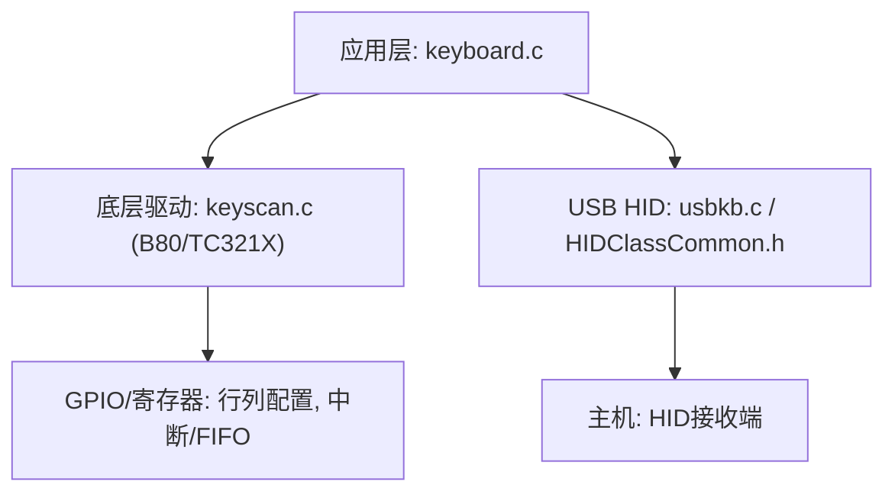
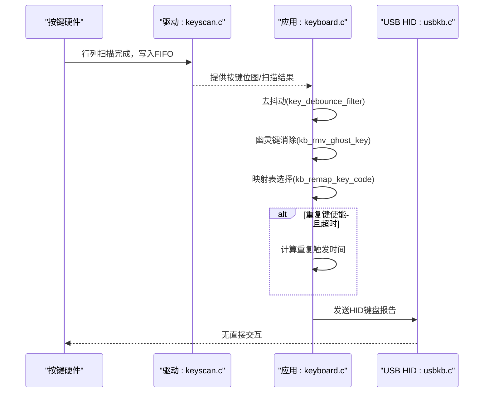
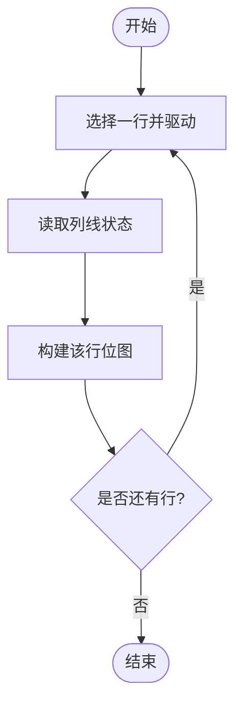
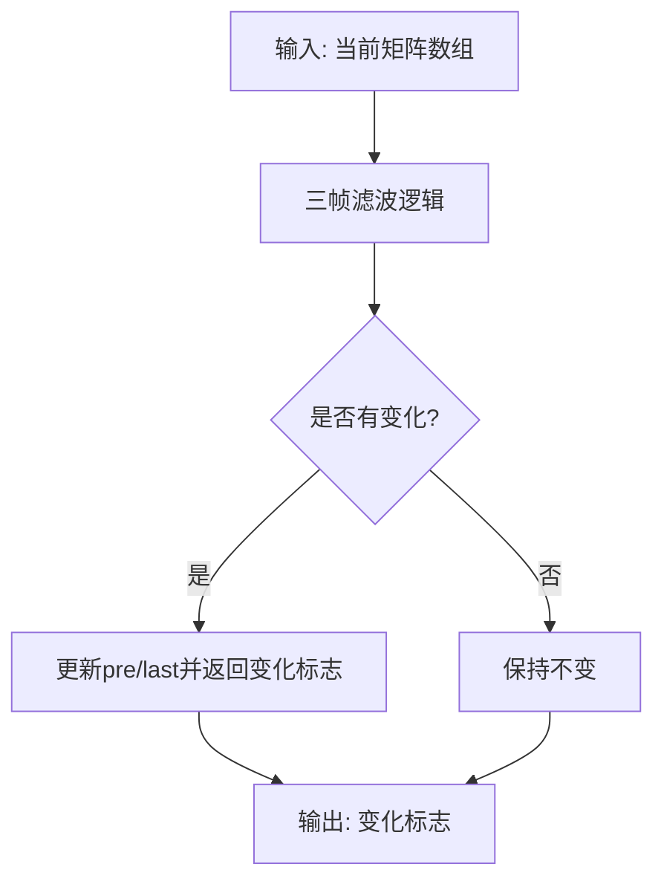
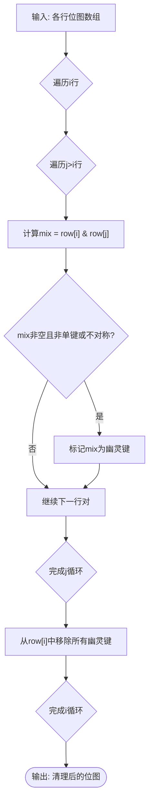
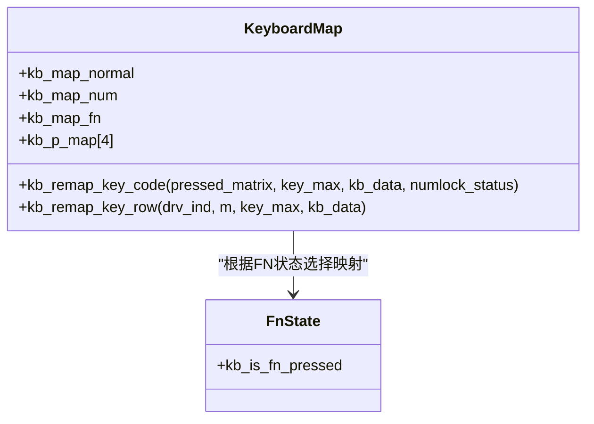
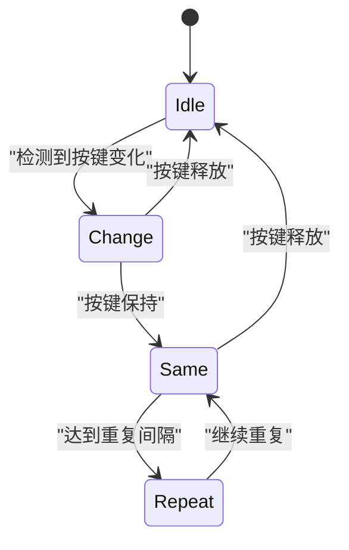
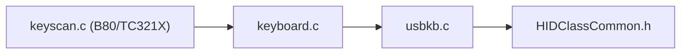

# 按键事件处理

<cite>
**本文引用的文件**
- [keyboard.c](file://tc_ble_single_sdk/application/keyboard/keyboard.c)
- [keyboard.h](file://tc_ble_single_sdk/application/keyboard/keyboard.h)
- [keyscan.c (B80)](file://8373_dongle_for_km/chip/B80/drivers/keyscan.c)
- [keyscan.h (B80)](file://8373_dongle_for_km/chip/B80/drivers/keyscan.h)
- [keyscan.c (TC321X)](file://tc_ble_single_sdk/drivers/TC321X/keyscan.c)
- [usbkb.c](file://tc_ble_single_sdk/application/app/usbkb.c)
- [HIDClassCommon.h](file://tc_ble_single_sdk/application/usbstd/HIDClassCommon.h)
</cite>

## 目录
1. [简介](#简介)
2. [项目结构](#项目结构)
3. [核心组件](#核心组件)
4. [架构总览](#架构总览)
5. [详细组件分析](#详细组件分析)
6. [依赖关系分析](#依赖关系分析)
7. [性能与功耗优化](#性能与功耗优化)
8. [故障排查指南](#故障排查指南)
9. [结论](#结论)
10. [附录：配置项与映射表](#附录配置项与映射表)

## 简介
本技术文档围绕矩阵键盘扫描、按键去抖动、长按检测、多键同时按下处理与冲突解决、幽灵键消除、FN键切换、自定义按键映射、按键重复触发机制与可配置参数，以及响应时间与功耗优化的调试方法进行全面说明。内容基于SDK中应用层键盘模块与底层驱动（B80/TC321X）的按键扫描实现进行梳理，帮助开发者理解从硬件扫描到HID上报的完整链路。

## 项目结构
- 应用层键盘模块位于 application/keyboard，负责矩阵扫描、去抖、映射、重复键、FN状态等。
- 底层驱动提供按键扫描硬件初始化、行列配置、去抖周期与空闲进入策略，以及读取FIFO中的按键值。
- USB HID层将键盘事件封装为HID报告上报给主机。

图表来源
- [keyboard.c:396-472](file://tc_ble_single_sdk/application/keyboard/keyboard.c#L396-L472)
- [keyscan.c (B80):185-223](file://8373_dongle_for_km/chip/B80/drivers/keyscan.c#L185-L223)
- [keyscan.c (TC321X):171-209](file://tc_ble_single_sdk/drivers/TC321X/keyscan.c#L171-L209)
- [usbkb.c:306-313](file://tc_ble_single_sdk/application/app/usbkb.c#L306-L313)

章节来源
- [keyboard.c:1-200](file://tc_ble_single_sdk/application/keyboard/keyboard.c#L1-L200)
- [keyscan.h (B80):24-85](file://8373_dongle_for_km/chip/B80/drivers/keyscan.h#L24-L85)

## 核心组件
- 矩阵扫描与行扫描：按行驱动并读取列线，构建每行的按键位图。
- 去抖动滤波：比较当前、上次、上上次矩阵，稳定按键状态。
- 幽灵键消除：对多行位图进行交集分析，剔除可能由电路耦合产生的误报键。
- FN键切换与映射表：根据NumLock与FN状态选择不同映射表，输出标准键码。
- 重复键机制：在按键保持期间按间隔周期性触发，支持可配置参数。
- 低功耗优化：在无按键变化时进入空闲或降低扫描频率，减少功耗。
- USB HID上报：将键码与控制键组合成HID报告发送给主机。

章节来源
- [keyboard.c:202-262](file://tc_ble_single_sdk/application/keyboard/keyboard.c#L202-L262)
- [keyboard.c:268-310](file://tc_ble_single_sdk/application/keyboard/keyboard.c#L268-L310)
- [keyboard.c:396-472](file://tc_ble_single_sdk/application/keyboard/keyboard.c#L396-L472)
- [keyscan.h (B80):64-85](file://8373_dongle_for_km/chip/B80/drivers/keyscan.h#L64-L85)

## 架构总览
下图展示按键事件从硬件扫描到HID上报的关键流程，包括矩阵扫描、去抖、幽灵键消除、映射、重复键与上报。

图表来源
- [keyboard.c:396-472](file://tc_ble_single_sdk/application/keyboard/keyboard.c#L396-L472)
- [keyscan.c (B80):185-223](file://8373_dongle_for_km/chip/B80/drivers/keyscan.c#L185-L223)
- [usbkb.c:306-313](file://tc_ble_single_sdk/application/app/usbkb.c#L306-L313)

## 详细组件分析

### 矩阵键盘扫描算法
- 行驱动与列读取：逐行置高/低电平，读取列线状态，得到每行的按键位图。
- 扫描时序：驱动引脚置有效电平后延时，读取所有列后再释放驱动引脚，避免串扰。
- 快速检测：先通过全局按键存在性判断决定是否执行完整扫描，减少不必要开销。

图表来源
- [keyboard.c:313-358](file://tc_ble_single_sdk/application/keyboard/keyboard.c#L313-L358)
- [keyboard.c:364-394](file://tc_ble_single_sdk/application/keyboard/keyboard.c#L364-L394)

章节来源
- [keyboard.c:313-358](file://tc_ble_single_sdk/application/keyboard/keyboard.c#L313-L358)
- [keyboard.c:364-394](file://tc_ble_single_sdk/application/keyboard/keyboard.c#L364-L394)

### 按键去抖动处理
- 三帧滤波：使用当前、上次、上上次矩阵进行逻辑运算，仅在连续稳定时判定按键有效。
- 状态更新：维护pre/last矩阵，记录变化标志以触发后续处理。
- 可选优化：长按场景下统计矩阵不变次数，用于功耗优化。

图表来源
- [keyboard.c:224-262](file://tc_ble_single_sdk/application/keyboard/keyboard.c#L224-L262)

章节来源
- [keyboard.c:224-262](file://tc_ble_single_sdk/application/keyboard/keyboard.c#L224-L262)

### 长按检测机制
- 长按功耗优化：当矩阵长时间无变化时，计数增加；有变化则清零。结合系统时钟可在上层实现长按触发或降频扫描。
- 重复键配合：重复键在按键保持期间按固定间隔触发，可用于模拟长按效果。

章节来源
- [keyboard.c:220-262](file://tc_ble_single_sdk/application/keyboard/keyboard.c#L220-L262)
- [keyboard.c:420-435](file://tc_ble_single_sdk/application/keyboard/keyboard.c#L420-L435)

### 多键同时按下与冲突解决
- 多键支持：每行位图可表示多个按键，整体支持跨行多键同时按下。
- 冲突策略：通过幽灵键消除算法识别并剔除可能的误报键，保证真实按键不被误删。
- 控制键处理：特殊键（如缩放键）会组合控制键与主键码输出。

章节来源
- [keyboard.c:268-310](file://tc_ble_single_sdk/application/keyboard/keyboard.c#L268-L310)
- [keyboard.c:202-218](file://tc_ble_single_sdk/application/keyboard/keyboard.c#L202-L218)

### 幽灵键消除算法与防误触
- 原理：对任意两行的位图求交集，若交集包含多个键或存在不对称情况，则视为潜在幽灵键，汇总后从各行位图中剔除。
- 适用场景：矩阵布局导致的“对角”或“十字”组合易产生幽灵键，该算法可有效抑制。

图表来源
- [keyboard.c:202-218](file://tc_ble_single_sdk/application/keyboard/keyboard.c#L202-L218)

章节来源
- [keyboard.c:202-218](file://tc_ble_single_sdk/application/keyboard/keyboard.c#L202-L218)

### 按键映射表管理与FN键切换
- 映射表：定义normal、num、fn三种映射表，分别对应不同功能模式。
- 选择逻辑：根据NumLock状态与FN键按下状态选择映射表索引，动态切换键码。
- 特殊处理：FN键本身在映射阶段被过滤以避免误报；缩放键等特殊键组合控制键与主键。

图表来源
- [keyboard.c:105-186](file://tc_ble_single_sdk/application/keyboard/keyboard.c#L105-L186)
- [keyboard.c:268-310](file://tc_ble_single_sdk/application/keyboard/keyboard.c#L268-L310)

章节来源
- [keyboard.c:105-186](file://tc_ble_single_sdk/application/keyboard/keyboard.c#L105-L186)
- [keyboard.c:268-310](file://tc_ble_single_sdk/application/keyboard/keyboard.c#L268-L310)

### 自定义按键配置
- 宏开关：可通过宏启用/禁用幽灵键消除、重复键、FN键、控制键处理等特性。
- 映射表覆盖：允许通过外部宏替换默认映射表，便于定制产品键位。
- 行列配置：底层驱动支持行列GPIO配置与拉阻设置，适配不同硬件布局。

章节来源
- [keyboard.c:44-89](file://tc_ble_single_sdk/application/keyboard/keyboard.c#L44-L89)
- [keyscan.h (B80):87-95](file://8373_dongle_for_km/chip/B80/drivers/keyscan.h#L87-L95)

### 按键重复触发机制与可配置参数
- 重复键状态机：KEY_CHANGE/KEY_SAME/KEY_NONE，记录首次变化时间与重复标志。
- 可配置参数：重复间隔毫秒数、重复键数量与列表。
- 触发时机：在按键持续按下且达到间隔时周期性触发，直到按键释放或发生变化。

图表来源
- [keyboard.h:38-53](file://tc_ble_single_sdk/application/keyboard/keyboard.h#L38-L53)
- [keyboard.c:81-99](file://tc_ble_single_sdk/application/keyboard/keyboard.c#L81-L99)
- [keyboard.c:420-435](file://tc_ble_single_sdk/application/keyboard/keyboard.c#L420-L435)

章节来源
- [keyboard.h:38-53](file://tc_ble_single_sdk/application/keyboard/keyboard.h#L38-L53)
- [keyboard.c:81-99](file://tc_ble_single_sdk/application/keyboard/keyboard.c#L81-L99)
- [keyboard.c:420-435](file://tc_ble_single_sdk/application/keyboard/keyboard.c#L420-L435)

### 底层按键扫描驱动（B80/TC321X）
- 去抖周期与空闲进入：可配置去抖周期与无按键进入空闲的周期数，空闲时关闭扫描时钟以降低功耗。
- 扫描次数：支持双扫/三扫，提升稳定性。
- FIFO读取：硬件在每个去抖周期结束后写入结束标志，软件读取FIFO获取按键位置并转换为行列号。

章节来源
- [keyscan.c (B80):185-223](file://8373_dongle_for_km/chip/B80/drivers/keyscan.c#L185-L223)
- [keyscan.c (TC321X):171-209](file://tc_ble_single_sdk/drivers/TC321X/keyscan.c#L171-L209)
- [keyscan.h (B80):64-85](file://8373_dongle_for_km/chip/B80/drivers/keyscan.h#L64-L85)

### USB HID上报
- 数据比较与保存：比较当前与上次上报数据，仅在不同时更新缓存，减少冗余上报。
- 报告封装：将键码与控制键组合为HID报告，媒体键单独处理。
- 常量定义：HID修饰键与LED状态常量来自公共头文件。

章节来源
- [usbkb.c:279-313](file://tc_ble_single_sdk/application/app/usbkb.c#L279-L313)
- [HIDClassCommon.h:35-46](file://tc_ble_single_sdk/application/usbstd/HIDClassCommon.h#L35-L46)

## 依赖关系分析
- 应用层keyboard.c依赖底层keyscan驱动提供的行列配置与扫描能力。
- keyboard.c内部模块间耦合度较高：扫描、去抖、幽灵键消除、映射、重复键紧密协作。
- USB HID层依赖keyboard.c输出的键码与控制键信息。

图表来源
- [keyboard.c:396-472](file://tc_ble_single_sdk/application/keyboard/keyboard.c#L396-L472)
- [keyscan.c (B80):185-223](file://8373_dongle_for_km/chip/B80/drivers/keyscan.c#L185-L223)
- [keyscan.c (TC321X):171-209](file://tc_ble_single_sdk/drivers/TC321X/keyscan.c#L171-L209)
- [usbkb.c:306-313](file://tc_ble_single_sdk/application/app/usbkb.c#L306-L313)
- [HIDClassCommon.h:35-46](file://tc_ble_single_sdk/application/usbstd/HIDClassCommon.h#L35-L46)

章节来源
- [keyboard.c:396-472](file://tc_ble_single_sdk/application/keyboard/keyboard.c#L396-L472)
- [keyscan.c (B80):185-223](file://8373_dongle_for_km/chip/B80/drivers/keyscan.c#L185-L223)
- [keyscan.c (TC321X):171-209](file://tc_ble_single_sdk/drivers/TC321X/keyscan.c#L171-L209)
- [usbkb.c:306-313](file://tc_ble_single_sdk/application/app/usbkb.c#L306-L313)
- [HIDClassCommon.h:35-46](file://tc_ble_single_sdk/application/usbstd/HIDClassCommon.h#L35-L46)

## 性能与功耗优化
- 响应时间优化
  - 缩短驱动延时：调整驱动引脚有效电平后的延时，平衡稳定性与延迟。
  - 提高扫描频率：在关键场景提高扫描周期或启用三扫模式。
  - 快速路径：优先执行按键存在性检查，避免全量扫描。
- 功耗降低
  - 空闲进入：配置无按键进入空闲的周期数，停止扫描时钟。
  - 长按优化：统计矩阵不变次数，在长按场景降低扫描频率或进入低功耗。
  - 去抖周期：合理设置去抖周期，避免过长的去抖导致响应迟钝。
- 调试建议
  - 使用示波器观察行列信号边沿，确认驱动与读取时序。
  - 打印矩阵位图与映射结果，验证幽灵键消除与映射正确性。
  - 调整重复键间隔与去抖周期，找到最佳用户体验与功耗平衡点。

章节来源
- [keyscan.h (B80):64-85](file://8373_dongle_for_km/chip/B80/drivers/keyscan.h#L64-L85)
- [keyscan.c (B80):185-223](file://8373_dongle_for_km/chip/B80/drivers/keyscan.c#L185-L223)
- [keyboard.c:220-262](file://tc_ble_single_sdk/application/keyboard/keyboard.c#L220-L262)

## 故障排查指南
- 幽灵键误报
  - 现象：某些组合键被错误识别或遗漏。
  - 排查：检查矩阵布局与幽灵键消除算法参数，必要时调整行列配置或启用/禁用幽灵键消除。
- 按键粘连
  - 现象：按键释放后仍被识别。
  - 排查：检查去抖滤波与释放计数逻辑，确保释放路径正确复位状态。
- 重复键不触发
  - 现象：长按无重复触发。
  - 排查：确认重复键使能与间隔配置，检查时间戳与状态机转换。
- FN键无效
  - 现象：FN切换后键码未变化。
  - 排查：检查FN状态标志与映射表选择逻辑，确认映射表中对应位置键码正确。

章节来源
- [keyboard.c:202-218](file://tc_ble_single_sdk/application/keyboard/keyboard.c#L202-L218)
- [keyboard.c:224-262](file://tc_ble_single_sdk/application/keyboard/keyboard.c#L224-L262)
- [keyboard.c:420-435](file://tc_ble_single_sdk/application/keyboard/keyboard.c#L420-L435)
- [keyboard.c:268-310](file://tc_ble_single_sdk/application/keyboard/keyboard.c#L268-L310)

## 结论
该按键事件处理系统在矩阵扫描、去抖、幽灵键消除、FN切换、重复键与低功耗方面提供了完整实现。通过合理的配置与调优，可在响应速度与功耗之间取得良好平衡。建议在产品化过程中结合实际硬件布局与用户需求，针对性调整去抖周期、重复键间隔与幽灵键消除策略，并通过日志与仪器验证最终效果。

## 附录：配置项与映射表
- 关键宏配置
  - 重复键：KB_REPEAT_KEY_ENABLE、KB_REPEAT_KEY_INTERVAL_MS、KB_REPEAT_KEY_NUM
  - 幽灵键消除：KB_RM_GHOST_KEY_EN
  - FN键：KB_HAS_FN_KEY
  - 控制键：KB_HAS_CTRL_KEYS
  - 行列模式：KB_LINE_MODE、KB_LINE_HIGH_VALID
  - 驱动延时：KB_DRV_DELAY_TIME
- 映射表
  - normal/num/fn三种映射表，根据NumLock与FN状态动态选择。
  - 支持外部宏覆盖默认映射表，便于定制。
- 底层驱动配置
  - 去抖周期：DEBOUNCE_PERIOD_8MS至DEBOUNCE_PERIOD_28MS
  - 扫描次数：DOUBLE_SCAN_TIMES/TRIPLE_SCAN_TIMES
  - 空闲进入：enter_idle_period_num（1-32）
  - 行列GPIO与拉阻：keyscan_set_martix与ks_col_pull_type_e

章节来源
- [keyboard.c:44-89](file://tc_ble_single_sdk/application/keyboard/keyboard.c#L44-L89)
- [keyboard.c:105-186](file://tc_ble_single_sdk/application/keyboard/keyboard.c#L105-L186)
- [keyscan.h (B80):64-95](file://8373_dongle_for_km/chip/B80/drivers/keyscan.h#L64-L95)
- [keyscan.c (B80):145-157](file://8373_dongle_for_km/chip/B80/drivers/keyscan.c#L145-L157)