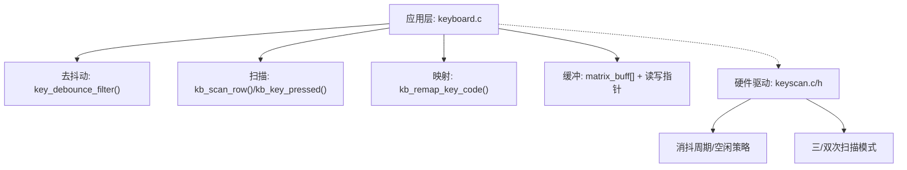
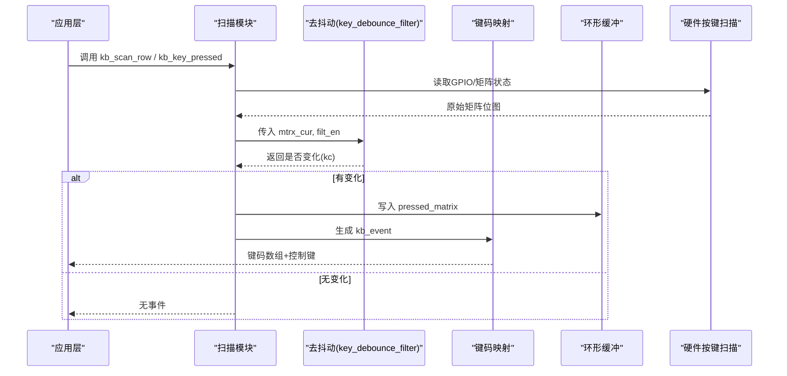
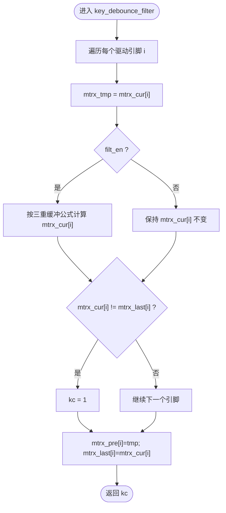
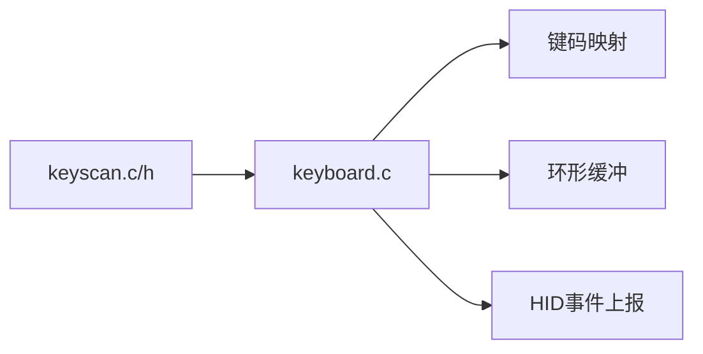

# 按键去抖动处理

<cite>
**本文引用的文件**
- [keyboard.c](file://tc_ble_single_sdk/application/keyboard/keyboard.c)
- [keyboard.h](file://tc_ble_single_sdk/application/keyboard/keyboard.h)
- [keyscan.c](file://tc_ble_single_sdk/drivers/TC321X/keyscan.c)
- [keyscan.h](file://tc_ble_single_sdk/drivers/TC321X/keyscan.h)
</cite>

## 目录
1. [简介](#简介)
2. [项目结构](#项目结构)
3. [核心组件](#核心组件)
4. [架构总览](#架构总览)
5. [详细组件分析](#详细组件分析)
6. [依赖关系分析](#依赖关系分析)
7. [性能与功耗调优](#性能与功耗调优)
8. [故障排查指南](#故障排查指南)
9. [结论](#结论)
10. [附录：配置建议与调试方法](#附录配置建议与调试方法)

## 简介
本技术文档围绕按键去抖动处理系统，重点解释三重缓冲去抖动算法的实现原理（mtrx_pre、mtrx_last 与当前状态的比较逻辑），以及 key_debounce_filter 的工作机制（滤波使能控制、状态转换检测）。同时覆盖长按检测优化、电源管理集成、性能调优参数、不同应用场景的配置建议与调试方法，并包含按键粘连检测与异常处理策略。

## 项目结构
- 应用层键盘驱动位于 application/keyboard，提供矩阵扫描、去抖动、键码映射、重复键与缓冲区管理。
- 底层硬件按键扫描驱动位于 drivers/TC321X，提供可配置的消抖周期、空闲进入策略、三/双次扫描模式等能力。
- 头文件定义关键数据结构、宏开关与对外接口。

图表来源
- [keyboard.c:224-262](file://tc_ble_single_sdk/application/keyboard/keyboard.c#L224-L262)
- [keyboard.c:313-358](file://tc_ble_single_sdk/application/keyboard/keyboard.c#L313-L358)
- [keyboard.c:396-486](file://tc_ble_single_sdk/application/keyboard/keyboard.c#L396-L486)
- [keyscan.c:42-45](file://tc_ble_single_sdk/drivers/TC321X/keyscan.c#L42-L45)
- [keyscan.c:194-209](file://tc_ble_single_sdk/drivers/TC321X/keyscan.c#L194-L209)
- [keyscan.h:68-84](file://tc_ble_single_sdk/drivers/TC321X/keyscan.h#L68-L84)

章节来源
- [keyboard.c:224-262](file://tc_ble_single_sdk/application/keyboard/keyboard.c#L224-L262)
- [keyboard.c:313-358](file://tc_ble_single_sdk/application/keyboard/keyboard.c#L313-L358)
- [keyboard.c:396-486](file://tc_ble_single_sdk/application/keyboard/keyboard.c#L396-L486)
- [keyscan.c:42-45](file://tc_ble_single_sdk/drivers/TC321X/keyscan.c#L42-L45)
- [keyscan.c:194-209](file://tc_ble_single_sdk/drivers/TC321X/keyscan.c#L194-L209)
- [keyscan.h:68-84](file://tc_ble_single_sdk/drivers/TC321X/keyscan.h#L68-L84)

## 核心组件
- 三重缓冲去抖动函数 key_debounce_filter：维护 mtrx_pre、mtrx_last 与当前帧 mtrx_cur，实现跨周期的稳定判定。
- 矩阵扫描与读取：kb_scan_row/kb_key_pressed 负责逐行扫描与读取 GPIO 缓存。
- 键码映射与事件封装：kb_remap_key_code/kb_data_t 将矩阵位图转换为 HID 键码。
- 软件缓冲：matrix_buff 环形缓冲，解耦扫描与消费速率。
- 硬件按键扫描：keyscan_init/set_time/set_scan_times 提供硬件级消抖周期与三/双次扫描。

章节来源
- [keyboard.c:224-262](file://tc_ble_single_sdk/application/keyboard/keyboard.c#L224-L262)
- [keyboard.c:313-358](file://tc_ble_single_sdk/application/keyboard/keyboard.c#L313-L358)
- [keyboard.c:396-486](file://tc_ble_single_sdk/application/keyboard/keyboard.c#L396-L486)
- [keyscan.c:194-209](file://tc_ble_single_sdk/drivers/TC321X/keyscan.c#L194-L209)
- [keyscan.h:68-84](file://tc_ble_single_sdk/drivers/TC321X/keyscan.h#L68-L84)

## 架构总览
应用层以“扫描→去抖动→映射→缓冲”的流水线组织按键事件；底层硬件驱动提供可配置的消抖周期与扫描次数，减少误触发并降低功耗。

图表来源
- [keyboard.c:313-358](file://tc_ble_single_sdk/application/keyboard/keyboard.c#L313-L358)
- [keyboard.c:396-486](file://tc_ble_single_sdk/application/keyboard/keyboard.c#L396-L486)
- [keyboard.c:224-262](file://tc_ble_single_sdk/application/keyboard/keyboard.c#L224-L262)

## 详细组件分析

### 三重缓冲去抖动算法（mtrx_pre、mtrx_last、当前状态）
- 状态变量
  - mtrx_pre：上一周期原始输入（用于判断趋势一致性）
  - mtrx_last：上一周期已去抖后的输出（用于边沿检测）
  - mtrx_cur：当前周期输入（可能被滤波改写）
- 滤波逻辑（当 filt_en=1）
  - 对每个驱动引脚 i：
    - 若上次为低电平（未按下），则要求本次与上上次均为高电平才判为按下
    - 若上次为高电平（已按下），则只要本次或上上次任一为高即保持按下
  - 该逻辑有效抑制单次毛刺与短促抖动，确保至少连续两周期一致才翻转
- 状态转换检测
  - 比较 mtrx_cur[i] 与 mtrx_last[i]，若存在差异则标记 kc=1，表示有键状态变化
- 幂等更新
  - 每周期末将 tmp 赋给 mtrx_pre，将滤波后结果赋给 mtrx_last，形成稳定的三段历史

图表来源
- [keyboard.c:224-262](file://tc_ble_single_sdk/application/keyboard/keyboard.c#L224-L262)

章节来源
- [keyboard.c:224-262](file://tc_ble_single_sdk/application/keyboard/keyboard.c#L224-L262)

### key_debounce_filter 工作机制
- 滤波使能控制
  - 在扫描流程中根据 numlock_status 决定是否启用滤波（例如开机阶段可能关闭滤波以快速响应）
- 状态转换检测
  - 通过比较前后周期输出，产生 kc 标志，驱动后续缓冲写入与事件上报
- 长按检测优化（可选）
  - 当开启 LONG_PRESS_KEY_POWER_OPTIMIZE 时，记录矩阵与上一周期相同的计数，用于识别长时间无变化场景，便于低功耗策略

章节来源
- [keyboard.c:224-262](file://tc_ble_single_sdk/application/keyboard/keyboard.c#L224-L262)
- [keyboard.c:396-486](file://tc_ble_single_sdk/application/keyboard/keyboard.c#L396-L486)

### 矩阵扫描与读取
- 逐行扫描：设置驱动引脚为高/低（取决于线有效性），读取扫描引脚缓存，组合成每行的位图
- 批量读取：kb_key_pressed 一次性置位所有驱动引脚并延时后读取，提高吞吐
- 释放防抖：内部使用 release_cnt 延迟恢复，避免释放瞬间抖动

章节来源
- [keyboard.c:313-358](file://tc_ble_single_sdk/application/keyboard/keyboard.c#L313-L358)
- [keyboard.c:364-394](file://tc_ble_single_sdk/application/keyboard/keyboard.c#L364-L394)

### 键码映射与事件封装
- 根据 NumLock/Fn 状态选择映射表，将矩阵位图转为 HID 键码
- 支持控制键（Ctrl/Alt 等）与媒体键的特殊处理
- 最大返回键数受 KB_RETURN_KEY_MAX 限制

章节来源
- [keyboard.c:268-310](file://tc_ble_single_sdk/application/keyboard/keyboard.c#L268-L310)
- [keyboard.h:28-61](file://tc_ble_single_sdk/application/keyboard/keyboard.h#L28-L61)

### 软件缓冲与消费
- 环形缓冲 matrix_buff[4][...] 配合读写指针，保证高频扫描与低频消费的解耦
- 写满时覆盖旧数据，避免阻塞扫描路径

章节来源
- [keyboard.c:360-361](file://tc_ble_single_sdk/application/keyboard/keyboard.c#L360-L361)
- [keyboard.c:442-465](file://tc_ble_single_sdk/application/keyboard/keyboard.c#L442-L465)

### 硬件按键扫描（TC321X）
- 消抖周期与空闲策略：通过 keyscan_set_time 设置消抖周期与无按键进入空闲的周期数，空闲停止扫描以降低功耗
- 三/双次扫描：keyscan_set_scan_times 可选择在一个消抖周期内进行三次或两次采样，提升抗扰度
- 初始化：keyscan_init 统一配置时钟、中断掩码与扫描模式

章节来源
- [keyscan.c:42-45](file://tc_ble_single_sdk/drivers/TC321X/keyscan.c#L42-L45)
- [keyscan.c:194-209](file://tc_ble_single_sdk/drivers/TC321X/keyscan.c#L194-L209)
- [keyscan.h:68-84](file://tc_ble_single_sdk/drivers/TC321X/keyscan.h#L68-L84)

## 依赖关系分析
- 应用层 keyboard.c 依赖底层 keyscan 驱动提供的消抖周期与扫描模式能力
- 去抖动算法与硬件扫描相互补充：软件三重缓冲过滤毛刺，硬件多采样进一步稳定
- 键码映射依赖映射表与 NumLock/Fn 状态机

图表来源
- [keyboard.c:224-262](file://tc_ble_single_sdk/application/keyboard/keyboard.c#L224-L262)
- [keyscan.c:194-209](file://tc_ble_single_sdk/drivers/TC321X/keyscan.c#L194-L209)

章节来源
- [keyboard.c:224-262](file://tc_ble_single_sdk/application/keyboard/keyboard.c#L224-L262)
- [keyscan.c:194-209](file://tc_ble_single_sdk/drivers/TC321X/keyscan.c#L194-L209)

## 性能与功耗调优
- 消抖周期
  - 硬件：DEBOUNCE_PERIOD_8MS~28MS，推荐从 16ms 起步，根据机械特性调整
  - 软件：三重缓冲等效于至少两周期一致才翻转，结合硬件周期可实现更稳健的响应
- 扫描次数
  - 三扫描模式抗干扰更强，但略增功耗；双扫描模式适合低功耗场景
- 空闲策略
  - 合理设置 enter_idle_period_num，在无按键时尽早进入空闲，显著降低功耗
- 滤波使能
  - 开机或特殊阶段可临时关闭滤波以提升响应速度，正常态建议开启
- 重复键与长按
  - 开启 KB_REPEAT_KEY_ENABLE 与 LONG_PRESS_KEY_POWER_OPTIMIZE，可减少频繁上报与CPU唤醒

章节来源
- [keyscan.h:68-84](file://tc_ble_single_sdk/drivers/TC321X/keyscan.h#L68-L84)
- [keyscan.c:42-45](file://tc_ble_single_sdk/drivers/TC321X/keyscan.c#L42-L45)
- [keyboard.c:224-262](file://tc_ble_single_sdk/application/keyboard/keyboard.c#L224-L262)
- [keyboard.c:396-486](file://tc_ble_single_sdk/application/keyboard/keyboard.c#L396-L486)

## 故障排查指南
- 按键粘连检测
  - 启用 KB_RM_GHOST_KEY_EN，在扫描后执行 kb_rmv_ghost_key，消除幽灵键导致的误报
- 卡键处理
  - 启用 STUCK_KEY_PROCESS_ENABLE，记录 stuckKeyPress 辅助诊断长期按住或卡死
- 重复键行为
  - 检查 repeat_key 状态机与时间阈值，确认 KEY_CHANGE/KEY_SAME 切换是否符合预期
- 缓冲溢出
  - 观察 matrix_wptr/matrix_rptr 差值，必要时增大缓冲或加快消费
- 功耗异常
  - 检查 keyscan 空闲周期设置与扫描次数，确认进入空闲策略生效

章节来源
- [keyboard.c:202-218](file://tc_ble_single_sdk/application/keyboard/keyboard.c#L202-L218)
- [keyboard.c:34-37](file://tc_ble_single_sdk/application/keyboard/keyboard.c#L34-L37)
- [keyboard.c:420-436](file://tc_ble_single_sdk/application/keyboard/keyboard.c#L420-L436)
- [keyboard.c:442-465](file://tc_ble_single_sdk/application/keyboard/keyboard.c#L442-L465)
- [keyscan.c:42-45](file://tc_ble_single_sdk/drivers/TC321X/keyscan.c#L42-L45)

## 结论
本方案通过“硬件多采样 + 软件三重缓冲”的组合，实现了高鲁棒性的按键去抖动。配合空闲策略与长按优化，可在保证响应性的同时显著降低功耗。针对不同场景可通过消抖周期、扫描次数、滤波使能与重复键策略进行灵活调优，并通过粘连检测与卡键监控提升可靠性。

## 附录：配置建议与调试方法
- 办公键盘（高可靠）
  - 硬件：DEBOUNCE_PERIOD_16MS，TRIPLE_SCAN_TIMES
  - 软件：开启滤波、KB_RM_GHOST_KEY_EN、STUCK_KEY_PROCESS_ENABLE
  - 重复键：KB_REPEAT_KEY_ENABLE 开启，间隔约 200ms
- 便携设备（低功耗）
  - 硬件：DEBOUNCE_PERIOD_12MS，DOUBLE_SCAN_TIMES，缩短空闲周期
  - 软件：滤波使能，适当放宽重复键间隔
- 工业环境（强干扰）
  - 硬件：DEBOUNCE_PERIOD_20MS~28MS，TRIPLE_SCAN_TIMES
  - 软件：开启粘连检测与卡键监控，必要时增加软件滤波强度
- 调试方法
  - 打印 mtrx_pre/mtrx_last/mtrx_cur 的变化序列，定位抖动点
  - 观察 kc 标志与缓冲读写指针，验证事件流
  - 使用硬件空闲策略与扫描次数对比测试功耗与稳定性