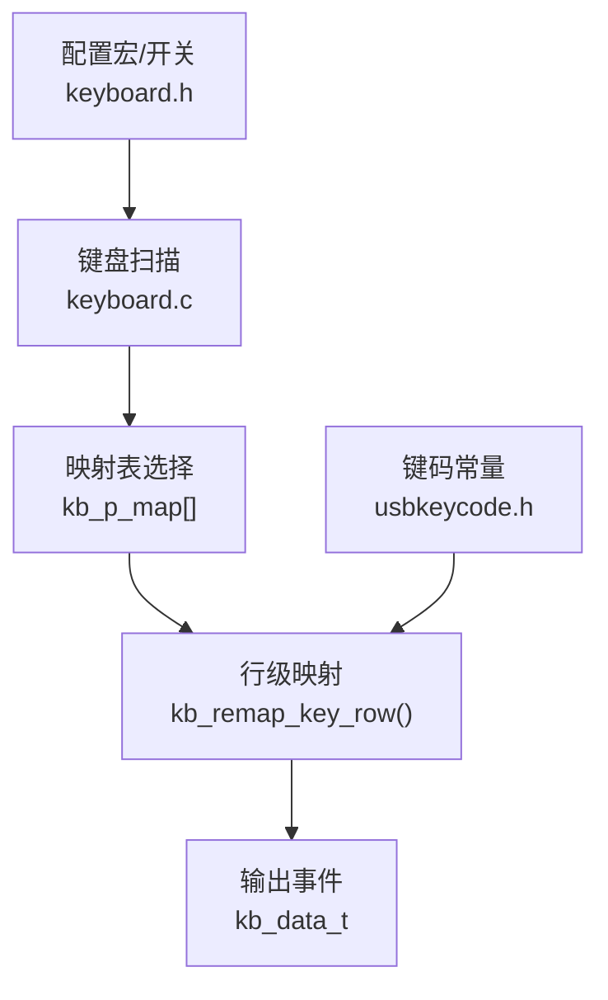
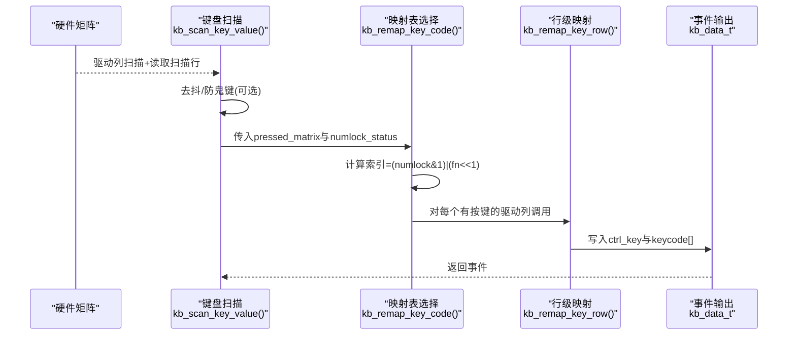
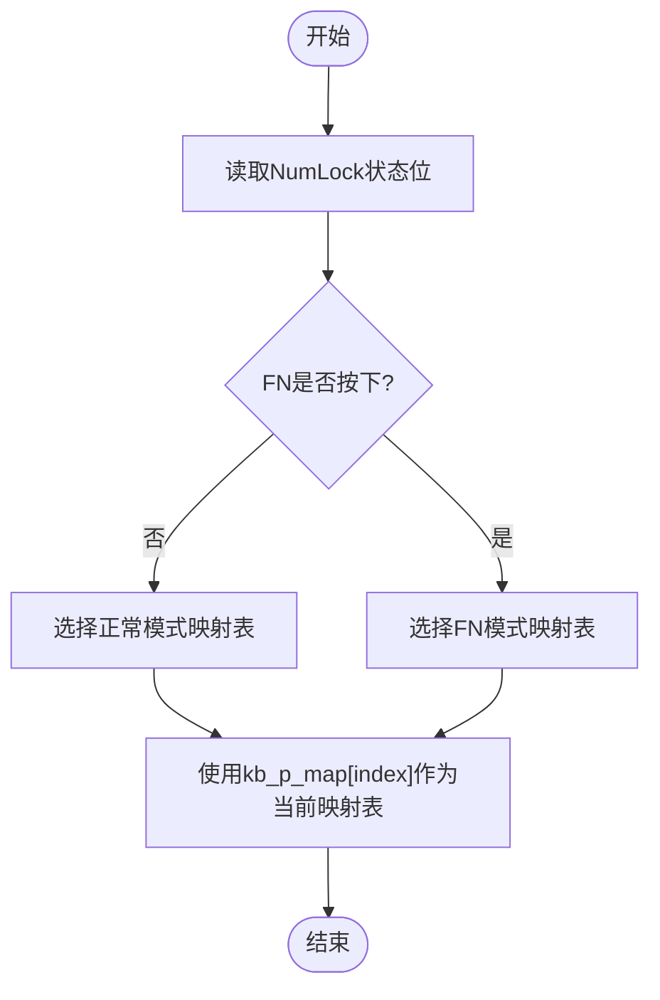
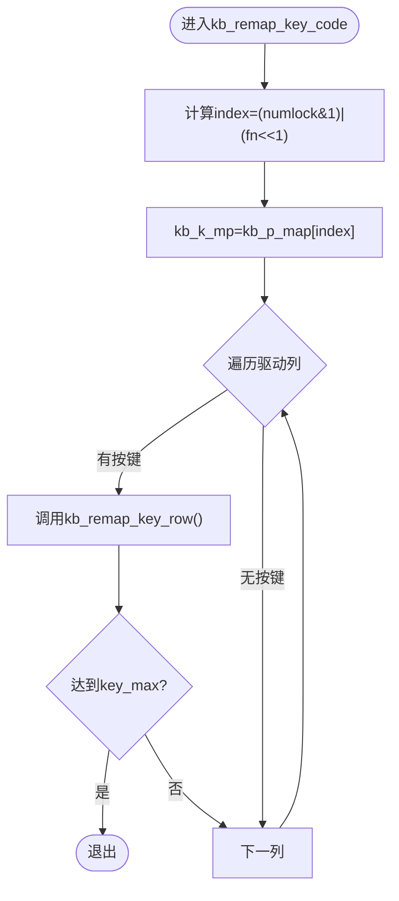
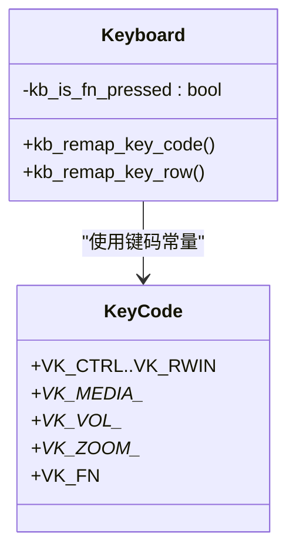
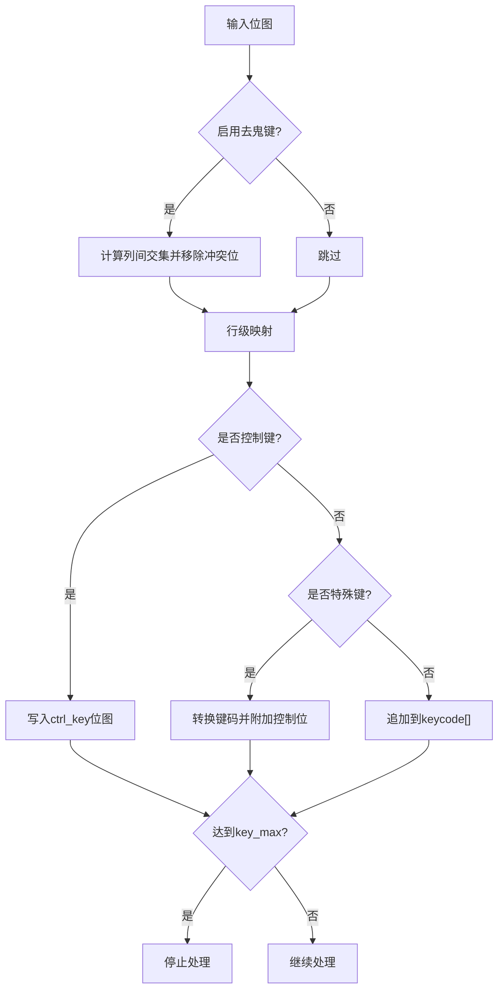
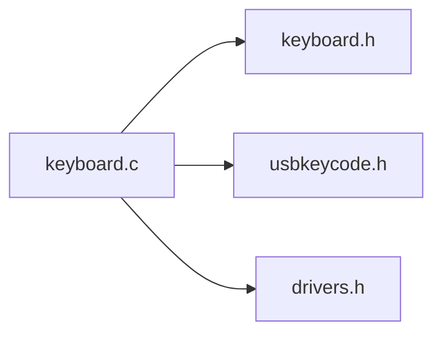

# 按键映射管理

<cite>
**本文引用的文件**
- [keyboard.c](file://tc_ble_single_sdk/application/keyboard/keyboard.c)
- [keyboard.h](file://tc_ble_single_sdk/application/keyboard/keyboard.h)
- [usbkeycode.h](file://tc_ble_single_sdk/application/usbstd/usbkeycode.h)
</cite>

## 目录
1. [简介](#简介)
2. [项目结构](#项目结构)
3. [核心组件](#核心组件)
4. [架构总览](#架构总览)
5. [详细组件分析](#详细组件分析)
6. [依赖关系分析](#依赖关系分析)
7. [性能考虑](#性能考虑)
8. [故障排查指南](#故障排查指南)
9. [结论](#结论)
10. [附录](#附录)

## 简介
本技术文档围绕按键映射管理系统，系统性阐述多映射表设计、模式切换机制（正常模式、数字锁定模式、FN模式）、kb_p_map数组结构与作用、kb_remap_key_code函数的映射逻辑、自定义映射表的定义与动态切换方法，以及特殊按键（Ctrl键、媒体键、音量键）的处理策略。同时给出映射冲突解决与按键优先级管理策略，帮助开发者在有限硬件资源下实现稳定、可扩展的键盘映射系统。

## 项目结构
该SDK将按键扫描与映射逻辑集中在应用层的键盘模块中，并通过USB键码常量进行统一抽象：
- 键盘驱动与应用层位于 application/keyboard
- USB键码常量定义位于 application/usbstd
- 头文件提供对外接口与数据结构定义

图表来源
- [keyboard.c:105-186](file://tc_ble_single_sdk/application/keyboard/keyboard.c#L105-L186)
- [keyboard.c:268-310](file://tc_ble_single_sdk/application/keyboard/keyboard.c#L268-L310)
- [usbkeycode.h:26-247](file://tc_ble_single_sdk/application/usbstd/usbkeycode.h#L26-L247)
- [keyboard.h:28-61](file://tc_ble_single_sdk/application/keyboard/keyboard.h#L28-L61)

章节来源
- [keyboard.c:105-186](file://tc_ble_single_sdk/application/keyboard/keyboard.c#L105-L186)
- [keyboard.h:28-61](file://tc_ble_single_sdk/application/keyboard/keyboard.h#L28-L61)
- [usbkeycode.h:26-247](file://tc_ble_single_sdk/application/usbstd/usbkeycode.h#L26-L247)

## 核心组件
- 多映射表：正常模式、数字锁定模式、FN模式三张二维映射表，按“扫描行×驱动列”组织，支持通过编译期宏替换为外部定义。
- 映射表指针数组 kb_p_map[4]：根据当前状态（NumLock位 + FN按下标志）选择当前生效的映射表。
- 行级映射函数 kb_remap_key_row：遍历被按下的扫描位，查表得到虚拟键码，处理控制键与特殊键，填充输出事件。
- 映射入口函数 kb_remap_key_code：根据状态选择映射表，逐行调用行级映射，生成最终按键事件。
- 键码常量：usbkeycode.h定义了标准键、系统键、媒体键、扩展键等，供映射表使用。
- 事件结构 kb_data_t：包含计数、控制键位图、最多KB_RETURN_KEY_MAX个键码。

章节来源
- [keyboard.c:105-186](file://tc_ble_single_sdk/application/keyboard/keyboard.c#L105-L186)
- [keyboard.c:268-310](file://tc_ble_single_sdk/application/keyboard/keyboard.c#L268-L310)
- [keyboard.h:28-61](file://tc_ble_single_sdk/application/keyboard/keyboard.h#L28-L61)
- [usbkeycode.h:26-247](file://tc_ble_single_sdk/application/usbstd/usbkeycode.h#L26-L247)

## 架构总览
按键从物理矩阵扫描到最终上报的完整流程如下：

图表来源
- [keyboard.c:396-486](file://tc_ble_single_sdk/application/keyboard/keyboard.c#L396-L486)
- [keyboard.c:299-310](file://tc_ble_single_sdk/application/keyboard/keyboard.c#L299-L310)
- [keyboard.c:268-297](file://tc_ble_single_sdk/application/keyboard/keyboard.c#L268-L297)

## 详细组件分析

### 多映射表设计与模式切换
- 三张映射表：
  - 正常模式映射表：主字母区与功能键映射。
  - 数字锁定模式映射表：小键盘区映射为数字与运算符号。
  - FN模式映射表：用于组合FN时的第二功能映射。
- 映射表指针数组 kb_p_map[4]：
  - 索引由 (numlock_status & 1) | (kb_is_fn_pressed << 1) 计算得出，分别对应：
    - 0: 正常模式
    - 1: 数字锁定模式
    - 2: FN模式
    - 3: FN+数字锁定模式（代码中将FN与NumLock组合指向FN表）
- 动态切换：
  - 每次扫描周期内，kb_remap_key_code根据当前NumLock状态与FN是否按下，选择对应映射表。
  - 扫描过程中检测到VK_FN时设置kb_is_fn_pressed标志，影响后续映射表选择。

图表来源
- [keyboard.c:181-186](file://tc_ble_single_sdk/application/keyboard/keyboard.c#L181-L186)
- [keyboard.c:299-301](file://tc_ble_single_sdk/application/keyboard/keyboard.c#L299-L301)
- [keyboard.c:333-335](file://tc_ble_single_sdk/application/keyboard/keyboard.c#L333-L335)

章节来源
- [keyboard.c:105-186](file://tc_ble_single_sdk/application/keyboard/keyboard.c#L105-L186)
- [keyboard.c:299-301](file://tc_ble_single_sdk/application/keyboard/keyboard.c#L299-L301)
- [keyboard.c:333-335](file://tc_ble_single_sdk/application/keyboard/keyboard.c#L333-L335)

### kb_p_map数组的结构与作用
- 类型：kb_k_mp_t *kb_p_map[4]，每个元素指向一张二维映射表的首地址。
- 维度：映射表大小为 [ARRAY_SIZE(scan_pins)][ARRAY_SIZE(drive_pins)]，即“扫描行×驱动列”。
- 作用：集中管理不同模式下的键位映射，运行时通过索引快速切换，避免分支判断带来的开销。

章节来源
- [keyboard.c:101-102](file://tc_ble_single_sdk/application/keyboard/keyboard.c#L101-L102)
- [keyboard.c:181-186](file://tc_ble_single_sdk/application/keyboard/keyboard.c#L181-L186)

### kb_remap_key_code映射逻辑
- 输入：pressed_matrix（每列的按键位图）、key_max（最大输出键数）、kb_data_t（输出事件）、numlock_status（NumLock状态）。
- 步骤：
  1) 计算当前映射表索引并赋值给全局指针kb_k_mp。
  2) 遍历所有驱动列，若某列存在按键位，则调用行级映射。
  3) 行级映射将扫描位对应的虚拟键码写入kb_data_t，并处理控制键与特殊键。
  4) 达到key_max时提前终止，保证实时性。

图表来源
- [keyboard.c:299-310](file://tc_ble_single_sdk/application/keyboard/keyboard.c#L299-L310)
- [keyboard.c:268-297](file://tc_ble_single_sdk/application/keyboard/keyboard.c#L268-L297)

章节来源
- [keyboard.c:299-310](file://tc_ble_single_sdk/application/keyboard/keyboard.c#L299-L310)
- [keyboard.c:268-297](file://tc_ble_single_sdk/application/keyboard/keyboard.c#L268-L297)

### 自定义按键映射表的定义方法
- 默认情况下，源码内置三张映射表（正常、数字锁定、FN），可通过编译期宏覆盖：
  - KB_MAP_NORMAL：覆盖正常模式映射表
  - KB_MAP_NUM：覆盖数字锁定模式映射表
  - KB_MAP_FN：覆盖FN模式映射表
- 覆盖方式：在编译选项中定义上述宏并指向自定义二维数组，或直接在源码中修改映射表内容。
- 注意事项：
  - 自定义映射表需保持与scan_pins和drive_pins维度一致。
  - 确保映射表中使用的键码在usbkeycode.h中有定义。

章节来源
- [keyboard.c:105-128](file://tc_ble_single_sdk/application/keyboard/keyboard.c#L105-L128)
- [keyboard.c:130-153](file://tc_ble_single_sdk/application/keyboard/keyboard.c#L130-L153)
- [keyboard.c:155-179](file://tc_ble_single_sdk/application/keyboard/keyboard.c#L155-L179)

### 特殊按键处理逻辑
- Ctrl键：
  - 当映射到的键码属于控制键范围（如VK_CTRL至VK_RWIN），不直接放入keycode数组，而是置位ctrl_key位图，以便上层按HID规范发送修饰键。
- 缩放键（VK_ZOOM_IN/VK_ZOOM_OUT）：
  - 特殊处理：置左Ctrl位，并将实际键码转换为等号或减号，以兼容某些平台对缩放的识别。
- FN键：
  - 扫描阶段检测VK_FN时设置kb_is_fn_pressed标志，影响下一次映射表选择；在行级映射中过滤掉VK_FN本身，避免重复上报。
- 媒体键与音量键：
  - 映射表中可直接映射为媒体键与音量键（如VK_PLAY_PAUSE、VK_VOL_UP、VK_VOL_DN等），这些键码在usbkeycode.h中定义，上层按媒体键报告格式发送。

图表来源
- [keyboard.c:268-297](file://tc_ble_single_sdk/application/keyboard/keyboard.c#L268-L297)
- [usbkeycode.h:159-247](file://tc_ble_single_sdk/application/usbstd/usbkeycode.h#L159-L247)

章节来源
- [keyboard.c:268-297](file://tc_ble_single_sdk/application/keyboard/keyboard.c#L268-L297)
- [usbkeycode.h:159-247](file://tc_ble_single_sdk/application/usbstd/usbkeycode.h#L159-L247)

### 映射冲突解决与按键优先级管理
- 冲突来源：
  - 多个扫描位在同一驱动列上同时按下，可能产生“鬼键”现象。
- 解决方案：
  - 可选的去鬼键算法：比较各驱动列之间的位图交集，若发现非单一位的公共位，则判定为冲突并从结果中剔除。
- 优先级策略：
  - 控制键优先：控制键（Ctrl/Shift/Alt/Win）不入keycode数组，而写入ctrl_key位图，确保修饰行为正确。
  - 特殊键次之：缩放键等特殊键会转换为更通用的键码并附带控制位。
  - 普通键最后：常规字符与功能键填入keycode数组，受key_max限制。
  - FN键过滤：FN键仅用于模式切换，不会作为普通键上报。

图表来源
- [keyboard.c:202-218](file://tc_ble_single_sdk/application/keyboard/keyboard.c#L202-L218)
- [keyboard.c:268-297](file://tc_ble_single_sdk/application/keyboard/keyboard.c#L268-L297)

章节来源
- [keyboard.c:202-218](file://tc_ble_single_sdk/application/keyboard/keyboard.c#L202-L218)
- [keyboard.c:268-297](file://tc_ble_single_sdk/application/keyboard/keyboard.c#L268-L297)

## 依赖关系分析
- keyboard.c依赖：
  - drivers.h：GPIO、定时器、中断等底层驱动
  - keyboard.h：对外接口与数据结构
  - usbkeycode.h：键码常量定义
- 关键依赖链：
  - 扫描→去抖/去鬼键→映射表选择→行级映射→事件输出
  - 控制键与特殊键处理依赖usbkeycode.h中的常量范围与语义

图表来源
- [keyboard.c:24-27](file://tc_ble_single_sdk/application/keyboard/keyboard.c#L24-L27)
- [keyboard.h:26-61](file://tc_ble_single_sdk/application/keyboard/keyboard.h#L26-L61)
- [usbkeycode.h:26-247](file://tc_ble_single_sdk/application/usbstd/usbkeycode.h#L26-L247)

章节来源
- [keyboard.c:24-27](file://tc_ble_single_sdk/application/keyboard/keyboard.c#L24-L27)
- [keyboard.h:26-61](file://tc_ble_single_sdk/application/keyboard/keyboard.h#L26-L61)
- [usbkeycode.h:26-247](file://tc_ble_single_sdk/application/usbstd/usbkeycode.h#L26-L247)

## 性能考虑
- 时间复杂度：
  - 行级映射为O(扫描位数)，映射表选择为O(1)。
  - 去鬼键为O(驱动列数^2)，可配置关闭以降低CPU占用。
- 空间复杂度：
  - 映射表大小与扫描/驱动引脚数量成正比，建议合理规划矩阵尺寸。
- 实时性：
  - 通过key_max限制输出键数，避免长链表处理。
  - 去抖与防鬼键可在电源优化模式下选择性启用。

[本节为通用性能讨论，不直接分析具体文件]

## 故障排查指南
- 问题：按键重复或误触发
  - 检查去抖参数与扫描频率，必要时调整去抖阈值。
  - 启用去鬼键功能，避免矩阵交叉导致的误报。
- 问题：FN键未生效
  - 确认映射表中存在VK_FN且扫描路径能检测到该键。
  - 检查kb_is_fn_pressed是否在扫描阶段被正确置位。
- 问题：控制键未按预期工作
  - 确认映射键码落在控制键范围内，确保ctrl_key位图被设置。
  - 检查上层HID发送逻辑是否正确解析ctrl_key。
- 问题：媒体/音量键无效
  - 确认映射表中使用了正确的媒体/音量键码。
  - 检查上层媒体键报告格式与设备描述符匹配。

章节来源
- [keyboard.c:202-218](file://tc_ble_single_sdk/application/keyboard/keyboard.c#L202-L218)
- [keyboard.c:268-297](file://tc_ble_single_sdk/application/keyboard/keyboard.c#L268-L297)
- [keyboard.c:333-335](file://tc_ble_single_sdk/application/keyboard/keyboard.c#L333-L335)

## 结论
该按键映射管理系统通过多映射表与状态机结合的方式，实现了正常、数字锁定与FN模式的灵活切换；借助kb_p_map数组与kb_remap_key_code函数，完成高效、可扩展的键码映射。控制键与特殊键的分离处理提升了兼容性，去鬼键与去抖机制保障了稳定性。开发者可通过编译期宏自定义映射表，满足多样化产品需求。

[本节为总结性内容，不直接分析具体文件]

## 附录
- 键码常量参考：
  - 标准键、系统键、媒体键、音量键、缩放键等定义见usbkeycode.h。
- 事件结构说明：
  - kb_data_t包含cnt、ctrl_key与keycode数组，用于表示一次按键事件的完整信息。

章节来源
- [usbkeycode.h:26-247](file://tc_ble_single_sdk/application/usbstd/usbkeycode.h#L26-L247)
- [keyboard.h:56-61](file://tc_ble_single_sdk/application/keyboard/keyboard.h#L56-L61)