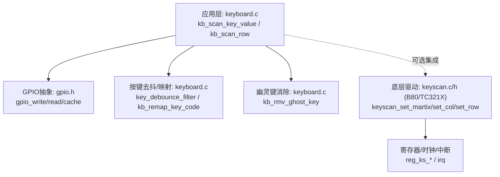
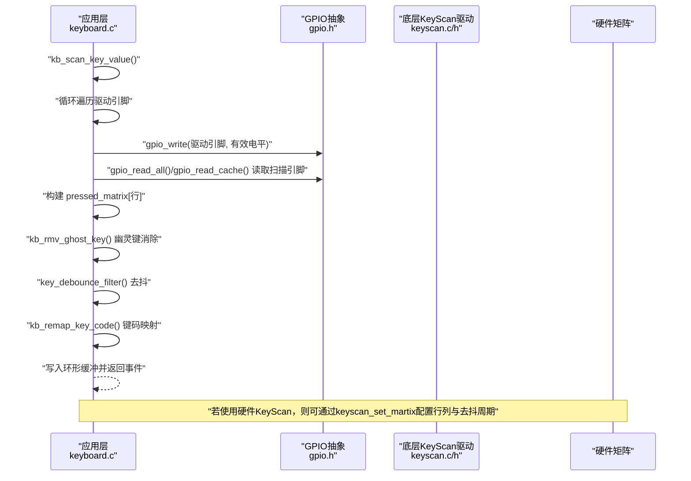
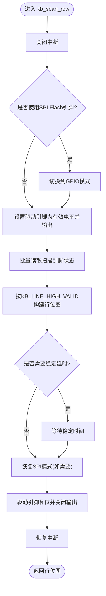
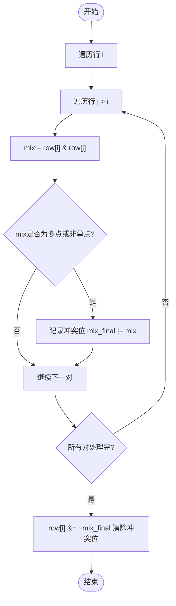
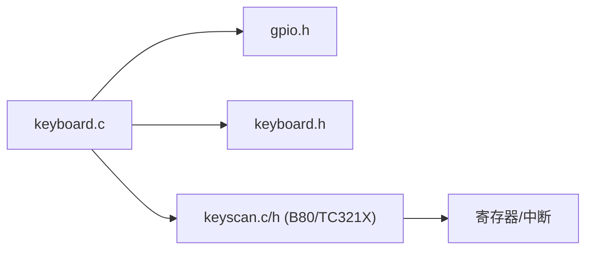

# 矩阵扫描算法

<cite>
**本文引用的文件**
- [keyboard.c](file://tc_ble_single_sdk/application/keyboard/keyboard.c)
- [keyboard.h](file://tc_ble_single_sdk/application/keyboard/keyboard.h)
- [keyscan.c (B80)](file://8373_dongle_for_km/chip/B80/drivers/keyscan.c)
- [keyscan.h (B80)](file://8373_dongle_for_km/chip/B80/drivers/keyscan.h)
- [keyscan.c (TC321X)](file://tc_ble_single_sdk/drivers/TC321X/keyscan.c)
- [keyscan.h (TC321X)](file://tc_ble_single_sdk/drivers/TC321X/keyscan.h)
- [gpio.h (TC321X)](file://tc_ble_single_sdk/drivers/TC321X/gpio.h)
</cite>

## 目录
1. [简介](#简介)
2. [项目结构](#项目结构)
3. [核心组件](#核心组件)
4. [架构总览](#架构总览)
5. [详细组件分析](#详细组件分析)
6. [依赖关系分析](#依赖关系分析)
7. [性能与功耗考虑](#性能与功耗考虑)
8. [故障诊断指南](#故障诊断指南)
9. [结论](#结论)
10. [附录](#附录)

## 简介
本技术文档围绕矩阵键盘扫描算法，系统阐述行扫描与列扫描的工作原理、驱动引脚与扫描引脚的配置方法；深入解析 kb_scan_row 的实现逻辑（GPIO模式切换、延时控制、中断保护）；说明多行轮询策略、扫描时序优化与功耗考量；提供不同硬件配置的适配方法与故障诊断技巧；并给出幽灵键检测算法的实现细节与消除策略。

## 项目结构
本项目在应用层实现了通用的矩阵键盘扫描接口，并在底层为不同芯片平台提供了 keyscan 驱动（B80 与 TC321X）。应用层通过配置驱动引脚与扫描引脚数组，完成逐行扫描与按键去抖、映射与上报。

图表来源
- [keyboard.c:313-358](file://tc_ble_single_sdk/application/keyboard/keyboard.c#L313-L358)
- [keyboard.c:396-486](file://tc_ble_single_sdk/application/keyboard/keyboard.c#L396-L486)
- [keyscan.c (B80):53-157](file://8373_dongle_for_km/chip/B80/drivers/keyscan.c#L53-L157)
- [keyscan.c (TC321X):53-143](file://tc_ble_single_sdk/drivers/TC321X/keyscan.c#L53-L143)
- [gpio.h (TC321X):323-364](file://tc_ble_single_sdk/drivers/TC321X/gpio.h#L323-L364)

章节来源
- [keyboard.c:313-358](file://tc_ble_single_sdk/application/keyboard/keyboard.c#L313-L358)
- [keyboard.c:396-486](file://tc_ble_single_sdk/application/keyboard/keyboard.c#L396-L486)
- [keyscan.c (B80):53-157](file://8373_dongle_for_km/chip/B80/drivers/keyscan.c#L53-L157)
- [keyscan.c (TC321X):53-143](file://tc_ble_single_sdk/drivers/TC321X/keyscan.c#L53-L143)
- [gpio.h (TC321X):323-364](file://tc_ble_single_sdk/drivers/TC321X/gpio.h#L323-L364)

## 核心组件
- 应用层键盘扫描：实现逐行驱动输出、扫描列输入读取、去抖、幽灵键消除、键码映射与事件缓冲。
- GPIO抽象：提供写电平、读电平、批量读缓存等能力，屏蔽具体端口差异。
- 底层 KeyScan 驱动（可选）：提供行列配置、去抖周期、空闲进入低功耗等能力，适用于带硬件矩阵扫描的SoC。

章节来源
- [keyboard.h:28-112](file://tc_ble_single_sdk/application/keyboard/keyboard.h#L28-L112)
- [keyboard.c:313-358](file://tc_ble_single_sdk/application/keyboard/keyboard.c#L313-L358)
- [keyscan.h (B80):43-169](file://8373_dongle_for_km/chip/B80/drivers/keyscan.h#L43-L169)
- [keyscan.h (TC321X):43-169](file://tc_ble_single_sdk/drivers/TC321X/keyscan.h#L43-L169)

## 架构总览
下图展示了从应用层到GPIO再到可选底层驱动的调用关系，以及数据流如何从物理按键状态转换为上报的键值。

图表来源
- [keyboard.c:396-486](file://tc_ble_single_sdk/application/keyboard/keyboard.c#L396-L486)
- [keyscan.c (B80):145-157](file://8373_dongle_for_km/chip/B80/drivers/keyscan.c#L145-L157)
- [keyscan.c (TC321X):131-143](file://tc_ble_single_sdk/drivers/TC321X/keyscan.c#L131-L143)

## 详细组件分析

### 行扫描与列扫描工作原理
- 行扫描（软件实现）：每次选择一个驱动引脚置为有效电平（高或低取决于配置），其余驱动引脚保持无效；随后读取所有扫描引脚的状态，得到当前行的按键矩阵位图。
- 列扫描（软件实现）：对每个扫描引脚进行读取，结合行驱动的有效电平，判断该交叉点是否按下。
- 硬件KeyScan（可选）：通过 keyscan_set_martix 配置行列引脚与上/下拉类型，由硬件周期性扫描并将结果入队，支持去抖周期与空闲低功耗。

章节来源
- [keyboard.c:313-358](file://tc_ble_single_sdk/application/keyboard/keyboard.c#L313-L358)
- [keyscan.c (B80):53-157](file://8373_dongle_for_km/chip/B80/drivers/keyscan.c#L53-L157)
- [keyscan.c (TC321X):53-143](file://tc_ble_single_sdk/drivers/TC321X/keyscan.c#L53-L143)
- [keyscan.h (B80):86-95](file://8373_dongle_for_km/chip/B80/drivers/keyscan.h#L86-L95)
- [keyscan.h (TC321X):86-95](file://tc_ble_single_sdk/drivers/TC321X/keyscan.h#L86-L95)

### 驱动引脚与扫描引脚配置
- 驱动引脚：作为行线，扫描时依次拉高/拉低以激活某一行。
- 扫描引脚：作为列线，读取其电平变化判断按键是否闭合。
- 上/下拉配置：根据硬件电路选择外部或内部上拉/下拉，确保未按键时列线不悬空。
- 特殊引脚：某些引脚需复用为SPI Flash时需临时切换为GPIO模式，扫描后恢复。

章节来源
- [keyboard.c:313-358](file://tc_ble_single_sdk/application/keyboard/keyboard.c#L313-L358)
- [keyscan.c (B80):103-157](file://8373_dongle_for_km/chip/B80/drivers/keyscan.c#L103-L157)
- [keyscan.c (TC321X):98-143](file://tc_ble_single_sdk/drivers/TC321X/keyscan.c#L98-L143)

### kb_scan_row 实现逻辑详解
- 中断保护：在进入扫描前关闭中断，避免并发修改GPIO或读取不一致；扫描完成后恢复中断。
- GPIO模式切换：若使用了SPI Flash复用的引脚，需在扫描前切为GPIO模式，扫描后恢复为SPI模式。
- 驱动输出：将当前驱动引脚置为有效电平，并设为输出使能。
- 读取扫描引脚：批量读取扫描引脚状态，依据 KB_LINE_HIGH_VALID 判定按键是否按下，生成该行位图。
- 延时控制：可插入微小延时以确保信号稳定（代码中注释了延时位置，可按需启用）。
- 清理：将驱动引脚复位为无效并关闭输出使能，避免串扰。

图表来源
- [keyboard.c:313-358](file://tc_ble_single_sdk/application/keyboard/keyboard.c#L313-L358)

章节来源
- [keyboard.c:313-358](file://tc_ble_single_sdk/application/keyboard/keyboard.c#L313-L358)

### 多行扫描的轮询策略
- 逐行轮询：外层循环遍历所有驱动引脚，每次只激活一行，读取对应列状态，形成 pressed_matrix[行]。
- 快速路径：先进行一次“是否存在任何按键”的快速检测，若无按键则跳过完整扫描以降低功耗。
- 缓冲机制：将每行扫描结果写入环形缓冲，供上层按需读取，解耦扫描频率与处理频率。

章节来源
- [keyboard.c:396-486](file://tc_ble_single_sdk/application/keyboard/keyboard.c#L396-L486)

### 扫描时序优化
- 最小化GPIO操作：批量读取扫描引脚以减少多次访问开销。
- 合理延时：仅在必要时加入微小延时以保证信号稳定，避免过长延迟影响响应速度。
- 去抖策略：通过连续多次采样与比较，过滤抖动，提高稳定性。

章节来源
- [keyboard.c:396-486](file://tc_ble_single_sdk/application/keyboard/keyboard.c#L396-L486)

### 功耗考虑
- 空闲低功耗：硬件KeyScan支持在无按键时进入空闲停止扫描，降低功耗。
- 快速退出：无按键时跳过完整扫描流程，减少CPU占用与IO翻转。
- 驱动引脚管理：扫描后立即释放驱动引脚，避免静态功耗。

章节来源
- [keyscan.h (B80):160-169](file://8373_dongle_for_km/chip/B80/drivers/keyscan.h#L160-L169)
- [keyscan.h (TC321X):160-169](file://tc_ble_single_sdk/drivers/TC321X/keyscan.h#L160-L169)
- [keyboard.c:396-486](file://tc_ble_single_sdk/application/keyboard/keyboard.c#L396-L486)

### 幽灵键检测与消除
- 原理：当多个按键同时按下时，矩阵交叉可能产生“幽灵键”。通过检查任意两行位图的交集，若存在多位同时被置位且非单点，则判定为幽灵键并从相关行中剔除。
- 实现：遍历所有行对，计算交集，标记冲突位，最后从各行位图中清除冲突位。

图表来源
- [keyboard.c:202-218](file://tc_ble_single_sdk/application/keyboard/keyboard.c#L202-L218)

章节来源
- [keyboard.c:202-218](file://tc_ble_single_sdk/application/keyboard/keyboard.c#L202-L218)

### 按键去抖与重复键
- 去抖：维护上一帧与上上帧的矩阵状态，通过逻辑组合判断真实按键变化，抑制抖动。
- 重复键：对特定键支持长按重复发送，通过时间戳与间隔控制实现。

章节来源
- [keyboard.c:224-262](file://tc_ble_single_sdk/application/keyboard/keyboard.c#L224-L262)
- [keyboard.c:420-436](file://tc_ble_single_sdk/application/keyboard/keyboard.c#L420-L436)

### 键码映射与功能键
- 映射表：根据NumLock状态与FN键状态选择不同映射表，将矩阵坐标映射为USB键码。
- 控制键：识别控制类键并填充控制位，便于上层处理。

章节来源
- [keyboard.c:268-310](file://tc_ble_single_sdk/application/keyboard/keyboard.c#L268-L310)

## 依赖关系分析
- 应用层依赖GPIO抽象进行引脚读写，依赖去抖与映射逻辑完成按键事件生成。
- 可选依赖底层KeyScan驱动进行行列配置与硬件扫描，提升效率与降低功耗。
- 头文件定义了枚举与常量，统一不同平台的引脚编号与去抖周期等参数。

图表来源
- [keyboard.c:313-358](file://tc_ble_single_sdk/application/keyboard/keyboard.c#L313-L358)
- [keyscan.c (B80):53-157](file://8373_dongle_for_km/chip/B80/drivers/keyscan.c#L53-L157)
- [keyscan.c (TC321X):53-143](file://tc_ble_single_sdk/drivers/TC321X/keyscan.c#L53-L143)

章节来源
- [keyboard.c:313-358](file://tc_ble_single_sdk/application/keyboard/keyboard.c#L313-L358)
- [keyscan.c (B80):53-157](file://8373_dongle_for_km/chip/B80/drivers/keyscan.c#L53-L157)
- [keyscan.c (TC321X):53-143](file://tc_ble_single_sdk/drivers/TC321X/keyscan.c#L53-L143)

## 性能与功耗考虑
- 性能
  - 逐行扫描复杂度 O(R*C)，R为行数，C为列数；实际通过快速路径与缓冲降低平均负载。
  - 去抖与幽灵键消除为常数级额外开销，通常可忽略。
- 功耗
  - 无按键时快速退出扫描。
  - 使用硬件KeyScan的空闲低功耗模式。
  - 及时释放驱动引脚，避免静态电流。

[本节为通用指导，无需特定文件引用]

## 故障诊断指南
- 现象：按键误触发或漏检
  - 检查 KB_LINE_HIGH_VALID 配置是否与硬件一致（高有效或低有效）。
  - 确认扫描引脚的上/下拉配置正确，避免悬空。
  - 适当增加稳定延时或调整去抖周期。
- 现象：幽灵键出现
  - 启用幽灵键消除逻辑，检查映射表与矩阵布局是否合理。
- 现象：SPI Flash引脚冲突
  - 确保在扫描前后正确切换GPIO/SPI模式，避免总线竞争。
- 现象：功耗偏高
  - 启用硬件KeyScan空闲低功耗；或在应用层缩短扫描频率。

章节来源
- [keyboard.c:313-358](file://tc_ble_single_sdk/application/keyboard/keyboard.c#L313-L358)
- [keyboard.c:396-486](file://tc_ble_single_sdk/application/keyboard/keyboard.c#L396-L486)
- [keyscan.h (B80):160-169](file://8373_dongle_for_km/chip/B80/drivers/keyscan.h#L160-L169)
- [keyscan.h (TC321X):160-169](file://tc_ble_single_sdk/drivers/TC321X/keyscan.h#L160-L169)

## 结论
本方案通过应用层逐行扫描与去抖、幽灵键消除、键码映射，实现了稳定可靠的矩阵键盘扫描；结合可选的硬件KeyScan驱动，可在不同平台上灵活平衡性能与功耗。通过合理的GPIO配置、中断保护与时序优化，能够在多种硬件条件下获得一致的按键体验。

[本节为总结性内容，无需特定文件引用]

## 附录
- 关键API参考
  - kb_scan_row：单行扫描入口，包含中断保护、GPIO模式切换与驱动复位。
  - kb_scan_key_value：多行轮询、去抖、幽灵键消除、映射与缓冲。
  - keyscan_set_martix/set_col/set_row：底层行列配置与上/下拉设置。
  - gpio_read_cache：批量读取扫描引脚状态，提升效率。

章节来源
- [keyboard.c:313-358](file://tc_ble_single_sdk/application/keyboard/keyboard.c#L313-L358)
- [keyboard.c:396-486](file://tc_ble_single_sdk/application/keyboard/keyboard.c#L396-L486)
- [keyscan.c (B80):103-157](file://8373_dongle_for_km/chip/B80/drivers/keyscan.c#L103-L157)
- [keyscan.c (TC321X):98-143](file://tc_ble_single_sdk/drivers/TC321X/keyscan.c#L98-L143)
- [gpio.h (TC321X):361-364](file://tc_ble_single_sdk/drivers/TC321X/gpio.h#L361-L364)