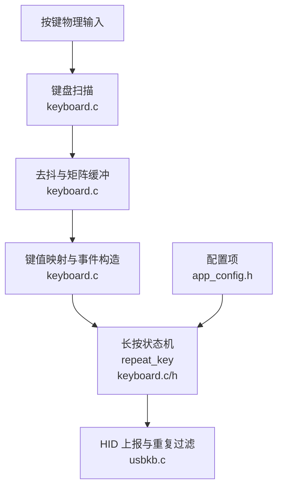
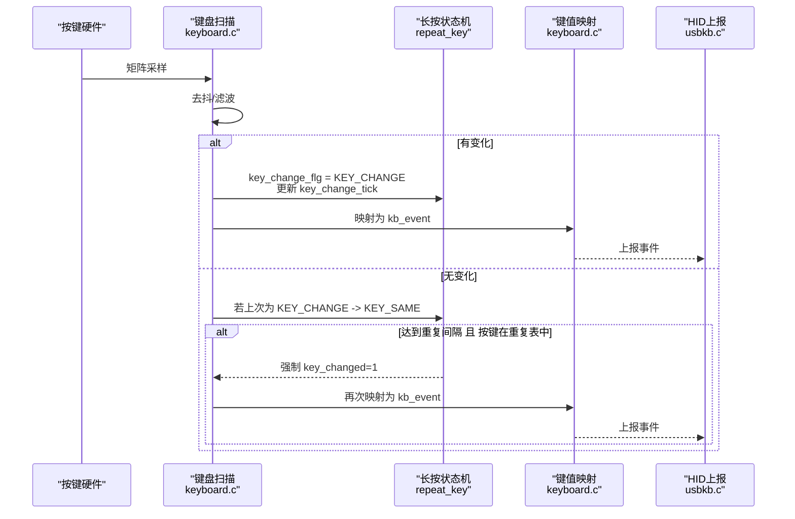
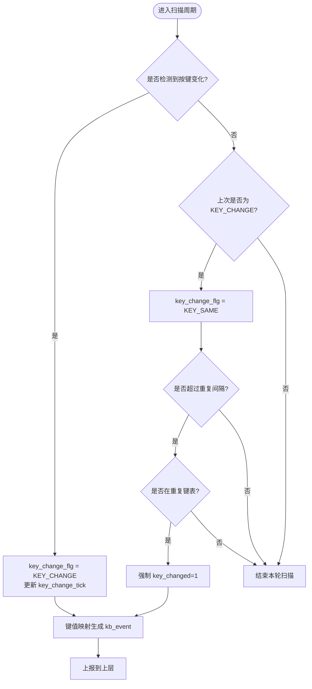
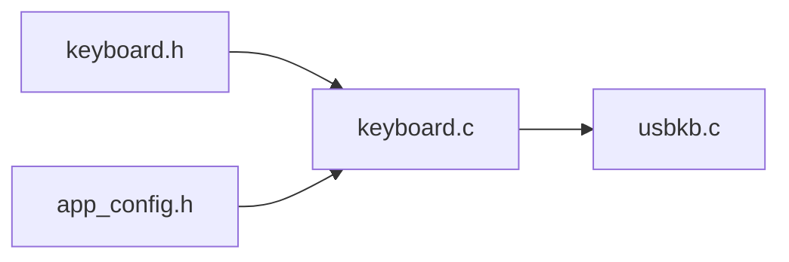

# 长按检测机制

<cite>
**本文引用的文件**
- [keyboard.c](file://tc_ble_single_sdk/application/keyboard/keyboard.c)
- [keyboard.h](file://tc_ble_single_sdk/application/keyboard/keyboard.h)
- [usbkb.c](file://tc_ble_single_sdk/application/app/usbkb.c)
- [app_config.h](file://tc_ble_single_sdk/vendor/ble_remote/app_config.h)
</cite>

## 目录
1. [简介](#简介)
2. [项目结构](#项目结构)
3. [核心组件](#核心组件)
4. [架构总览](#架构总览)
5. [详细组件分析](#详细组件分析)
6. [依赖关系分析](#依赖关系分析)
7. [性能与功耗优化](#性能与功耗优化)
8. [故障排查指南](#故障排查指南)
9. [结论](#结论)
10. [附录](#附录)

## 简介
本技术文档聚焦于长按检测机制的实现，围绕状态机（KEY_CHANGE、KEY_SAME）的转换逻辑、repeat_key 结构体的作用与重复触发间隔控制、按键识别流程、可配置参数含义（KB_REPEAT_KEY_INTERVAL_MS、KB_REPEAT_KEY_NUM）、以及该机制与系统其他模块的集成方式展开。同时提供功耗优化策略与响应时间调优方法，帮助读者在工程实践中正确配置与调优长按行为。

## 项目结构
长按检测相关代码主要位于键盘扫描与应用层之间：
- 键盘扫描与去抖、矩阵缓冲、键值映射与事件生成：keyboard.c
- 长按状态机与 repeat_key 结构体定义：keyboard.h
- 应用层 HID 上报与重复数据过滤：usbkb.c
- 产品级配置（是否启用长按重复、重复间隔、重复键列表等）：app_config.h

图表来源
- [keyboard.c:396-486](file://tc_ble_single_sdk/application/keyboard/keyboard.c#L396-L486)
- [keyboard.h:38-53](file://tc_ble_single_sdk/application/keyboard/keyboard.h#L38-L53)
- [usbkb.c:279-303](file://tc_ble_single_sdk/application/app/usbkb.c#L279-L303)
- [app_config.h:130-141](file://tc_ble_single_sdk/vendor/ble_remote/app_config.h#L130-L141)

章节来源
- [keyboard.c:396-486](file://tc_ble_single_sdk/application/keyboard/keyboard.c#L396-L486)
- [keyboard.h:38-53](file://tc_ble_single_sdk/application/keyboard/keyboard.h#L38-L53)
- [usbkb.c:279-303](file://tc_ble_single_sdk/application/app/usbkb.c#L279-L303)
- [app_config.h:130-141](file://tc_ble_single_sdk/vendor/ble_remote/app_config.h#L130-L141)

## 核心组件
- 长按状态机标志与计时器
  - key_change_flg：记录按键变化状态（KEY_NONE/KEY_CHANGE/KEY_SAME）
  - key_repeat_flg：标记当前按键是否允许重复触发
  - key_change_tick：记录进入 KEY_SAME 的时间戳，用于间隔判断
  - keycode0/keycode1：暂存最近一次变化的键码（便于后续扩展）
- 重复触发配置
  - KB_REPEAT_KEY_ENABLE：是否启用长按重复
  - KB_REPEAT_KEY_INTERVAL_MS：重复触发间隔（毫秒）
  - KB_REPEAT_KEY_NUM：重复键表长度
  - KB_MAP_REPEAT：重复键码列表（例如方向键、数字键等）
- 键盘事件数据结构
  - kb_data_t：包含按键数量、修饰键位图、键码数组
- 应用层重复数据过滤
  - usbkb.c 中保存上一次上报数据，避免重复上报相同内容

章节来源
- [keyboard.h:38-53](file://tc_ble_single_sdk/application/keyboard/keyboard.h#L38-L53)
- [keyboard.c:81-99](file://tc_ble_single_sdk/application/keyboard/keyboard.c#L81-L99)
- [app_config.h:130-141](file://tc_ble_single_sdk/vendor/ble_remote/app_config.h#L130-L141)
- [usbkb.c:279-303](file://tc_ble_single_sdk/application/app/usbkb.c#L279-L303)

## 架构总览
长按检测的整体流程如下：
1. 扫描矩阵并去抖，得到 pressed_matrix
2. 若检测到按键变化，设置状态为 KEY_CHANGE，并更新时间戳
3. 若无变化且上次为 KEY_CHANGE，则转入 KEY_SAME
4. 在 KEY_SAME 状态下，若满足重复间隔条件且当前按键属于重复键表，则强制产生一次“虚拟”变化，驱动上层继续上报
5. 将矩阵写入环形缓冲，读取后做键值映射，生成 kb_event
6. 应用层对上报数据进行重复过滤，减少冗余传输

图表来源
- [keyboard.c:417-435](file://tc_ble_single_sdk/application/keyboard/keyboard.c#L417-L435)
- [keyboard.c:468-483](file://tc_ble_single_sdk/application/keyboard/keyboard.c#L468-L483)
- [usbkb.c:279-303](file://tc_ble_single_sdk/application/app/usbkb.c#L279-L303)

## 详细组件分析

### 长按状态机（KEY_CHANGE / KEY_SAME）
- 状态定义
  - KEY_NONE：无按键或按键释放后的空闲态
  - KEY_CHANGE：检测到按键按下或抬起的变化瞬间
  - KEY_SAME：按键保持按下但未发生新变化
- 转换逻辑
  - 当检测到按键变化时，key_change_flg 置为 KEY_CHANGE，并记录 key_change_tick
  - 当未检测到变化且上次为 KEY_CHANGE 时，转为 KEY_SAME
  - 在 KEY_SAME 下，若时间超过 KB_REPEAT_KEY_INTERVAL_MS，且当前按键属于重复键表，则重新触发一次上报
- 关键实现位置
  - 变化检测与状态切换：[keyboard.c:417-435](file://tc_ble_single_sdk/application/keyboard/keyboard.c#L417-L435)
  - 重复触发判定与时间戳更新：[keyboard.c:430-434](file://tc_ble_single_sdk/application/keyboard/keyboard.c#L430-L434)
  - 重复键匹配与标志置位：[keyboard.c:470-483](file://tc_ble_single_sdk/application/keyboard/keyboard.c#L470-L483)

图表来源
- [keyboard.c:417-435](file://tc_ble_single_sdk/application/keyboard/keyboard.c#L417-L435)
- [keyboard.c:470-483](file://tc_ble_single_sdk/application/keyboard/keyboard.c#L470-L483)

章节来源
- [keyboard.c:417-435](file://tc_ble_single_sdk/application/keyboard/keyboard.c#L417-L435)
- [keyboard.c:470-483](file://tc_ble_single_sdk/application/keyboard/keyboard.c#L470-L483)

### repeat_key 结构体与重复触发间隔控制
- 字段说明
  - key_change_flg：状态机标志（KEY_NONE/KEY_CHANGE/KEY_SAME）
  - key_repeat_flg：当前按键是否允许重复触发（仅当按键在重复键表内才置位）
  - key_change_tick：进入 KEY_SAME 时的时间戳，用于间隔判断
  - keycode0/keycode1：最近一次变化的键码（便于扩展多键场景）
- 重复触发间隔
  - 使用 clock_time_exceed 比较当前时间与 key_change_tick，差值大于等于 (KB_REPEAT_KEY_INTERVAL_MS-5)*1000 时触发一次重复上报
  - 每次触发后更新 key_change_tick，形成周期性重复
- 重复键识别
  - 当状态为 KEY_CHANGE 且 kb_event 仅有一个键时，遍历 kb_map_repeat（由 KB_MAP_REPEAT 定义），若匹配则置位 key_repeat_flg
- 关键实现位置
  - 结构体定义：[keyboard.h:42-53](file://tc_ble_single_sdk/application/keyboard/keyboard.h#L42-L53)
  - 默认初始化与配置宏：[keyboard.c:81-99](file://tc_ble_single_sdk/application/keyboard/keyboard.c#L81-L99)
  - 重复触发判定与时间戳更新：[keyboard.c:430-434](file://tc_ble_single_sdk/application/keyboard/keyboard.c#L430-L434)
  - 重复键匹配与标志置位：[keyboard.c:470-483](file://tc_ble_single_sdk/application/keyboard/keyboard.c#L470-L483)

章节来源
- [keyboard.h:42-53](file://tc_ble_single_sdk/application/keyboard/keyboard.h#L42-L53)
- [keyboard.c:81-99](file://tc_ble_single_sdk/application/keyboard/keyboard.c#L81-L99)
- [keyboard.c:430-434](file://tc_ble_single_sdk/application/keyboard/keyboard.c#L430-L434)
- [keyboard.c:470-483](file://tc_ble_single_sdk/application/keyboard/keyboard.c#L470-L483)

### 可配置参数的含义
- KB_REPEAT_KEY_ENABLE：是否启用长按重复功能；关闭后不执行状态机与重复触发逻辑
- KB_REPEAT_KEY_INTERVAL_MS：重复触发间隔（毫秒）。值越小，重复越快；值越大，重复越慢
- KB_REPEAT_KEY_NUM：重复键表长度，决定 KB_MAP_REPEAT 的元素个数
- KB_MAP_REPEAT：重复键码列表，指定哪些键支持长按重复（如方向键、数字键等）
- LONG_PRESS_KEY_POWER_OPTIMIZE：长按期间降低功耗的开关（见下文“功耗优化”）

章节来源
- [app_config.h:130-141](file://tc_ble_single_sdk/vendor/ble_remote/app_config.h#L130-L141)
- [keyboard.h:68-71](file://tc_ble_single_sdk/application/keyboard/keyboard.h#L68-L71)

### 长按事件处理流程与系统集成
- 键盘扫描与去抖
  - 扫描矩阵行，收集按下的列信息，进行去抖滤波，返回是否有变化
- 状态机与重复触发
  - 根据变化与否切换 KEY_CHANGE/KEY_SAME，并在满足条件时强制产生一次变化以触发上报
- 键值映射与事件构造
  - 将矩阵转换为 kb_event（包含键码与修饰键）
- 应用层重复过滤
  - 保存上一次上报数据，若本次与上次完全相同则跳过上报，减少冗余
- 关键实现位置
  - 扫描与去抖：[keyboard.c:396-418](file://tc_ble_single_sdk/application/keyboard/keyboard.c#L396-L418)
  - 状态机与重复触发：[keyboard.c:417-435](file://tc_ble_single_sdk/application/keyboard/keyboard.c#L417-L435)
  - 键值映射：[keyboard.c:468-483](file://tc_ble_single_sdk/application/keyboard/keyboard.c#L468-L483)
  - 应用层重复过滤：[usbkb.c:279-303](file://tc_ble_single_sdk/application/app/usbkb.c#L279-L303)

章节来源
- [keyboard.c:396-418](file://tc_ble_single_sdk/application/keyboard/keyboard.c#L396-L418)
- [keyboard.c:417-435](file://tc_ble_single_sdk/application/keyboard/keyboard.c#L417-L435)
- [keyboard.c:468-483](file://tc_ble_single_sdk/application/keyboard/keyboard.c#L468-L483)
- [usbkb.c:279-303](file://tc_ble_single_sdk/application/app/usbkb.c#L279-L303)

## 依赖关系分析
- keyboard.c 依赖 keyboard.h 中的类型与常量
- keyboard.c 使用 app_config.h 中的配置宏（如 KB_REPEAT_KEY_*）
- usbkb.c 依赖 keyboard.c 生成的 kb_event，并进行重复过滤
- 时钟函数（clock_time/clock_time_exceed）用于时间戳与间隔判断

图表来源
- [keyboard.h:38-53](file://tc_ble_single_sdk/application/keyboard/keyboard.h#L38-L53)
- [keyboard.c:81-99](file://tc_ble_single_sdk/application/keyboard/keyboard.c#L81-L99)
- [usbkb.c:279-303](file://tc_ble_single_sdk/application/app/usbkb.c#L279-L303)
- [app_config.h:130-141](file://tc_ble_single_sdk/vendor/ble_remote/app_config.h#L130-L141)

章节来源
- [keyboard.h:38-53](file://tc_ble_single_sdk/application/keyboard/keyboard.h#L38-L53)
- [keyboard.c:81-99](file://tc_ble_single_sdk/application/keyboard/keyboard.c#L81-L99)
- [usbkb.c:279-303](file://tc_ble_single_sdk/application/app/usbkb.c#L279-L303)
- [app_config.h:130-141](file://tc_ble_single_sdk/vendor/ble_remote/app_config.h#L130-L141)

## 性能与功耗优化
- 去抖与滤波
  - 使用三帧滤波（pre/last/current）降低抖动误判，提高稳定性
  - 参考实现：[keyboard.c:224-262](file://tc_ble_single_sdk/application/keyboard/keyboard.c#L224-L262)
- 长按期间功耗优化
  - 启用 LONG_PRESS_KEY_POWER_OPTIMIZE，可在长按未释放时降低扫描频率或进入低功耗模式（具体策略由上层调度）
  - 参考实现与开关：[keyboard.c:220-262](file://tc_ble_single_sdk/application/keyboard/keyboard.c#L220-L262), [keyboard.h:68-71](file://tc_ble_single_sdk/application/keyboard/keyboard.h#L68-L71), [app_config.h:130-131](file://tc_ble_single_sdk/vendor/ble_remote/app_config.h#L130-L131)
- 响应时间调优
  - 调整 KB_REPEAT_KEY_INTERVAL_MS：减小可获得更快的重复响应，增大可降低功耗与负载
  - 调整去抖阈值与扫描频率：平衡响应速度与抗干扰能力
  - 注意：重复触发间隔计算中包含固定偏移（-5ms），实际间隔略小于配置值，需结合系统时钟精度评估
- 重复上报抑制
  - 应用层通过保存上次上报数据，避免重复发送相同内容，减少总线负载
  - 参考实现：[usbkb.c:279-303](file://tc_ble_single_sdk/application/app/usbkb.c#L279-L303)

章节来源
- [keyboard.c:220-262](file://tc_ble_single_sdk/application/keyboard/keyboard.c#L220-L262)
- [keyboard.h:68-71](file://tc_ble_single_sdk/application/keyboard/keyboard.h#L68-L71)
- [app_config.h:130-141](file://tc_ble_single_sdk/vendor/ble_remote/app_config.h#L130-L141)
- [usbkb.c:279-303](file://tc_ble_single_sdk/application/app/usbkb.c#L279-L303)

## 故障排查指南
- 现象：长按无重复触发
  - 检查 KB_REPEAT_KEY_ENABLE 是否开启
  - 确认 KB_MAP_REPEAT 包含目标键码
  - 检查 KB_REPEAT_KEY_INTERVAL_MS 是否过大
  - 验证 key_repeat_flg 是否正确置位（仅在单键且处于 KEY_CHANGE 时匹配）
  - 参考位置：[keyboard.c:470-483](file://tc_ble_single_sdk/application/keyboard/keyboard.c#L470-L483), [app_config.h:137-141](file://tc_ble_single_sdk/vendor/ble_remote/app_config.h#L137-L141)
- 现象：重复过快或过慢
  - 调整 KB_REPEAT_KEY_INTERVAL_MS
  - 注意实际间隔受系统时钟与-5ms偏移影响
  - 参考位置：[keyboard.c:430-434](file://tc_ble_single_sdk/application/keyboard/keyboard.c#L430-L434)
- 现象：误触发或抖动导致多次上报
  - 检查去抖滤波是否启用与参数合理
  - 参考位置：[keyboard.c:224-262](file://tc_ble_single_sdk/application/keyboard/keyboard.c#L224-L262)
- 现象：重复上报过多占用带宽
  - 确认应用层重复过滤是否生效（usbkb.c 中 last_data 比较）
  - 参考位置：[usbkb.c:279-303](file://tc_ble_single_sdk/application/app/usbkb.c#L279-L303)

章节来源
- [keyboard.c:430-434](file://tc_ble_single_sdk/application/keyboard/keyboard.c#L430-L434)
- [keyboard.c:470-483](file://tc_ble_single_sdk/application/keyboard/keyboard.c#L470-L483)
- [keyboard.c:224-262](file://tc_ble_single_sdk/application/keyboard/keyboard.c#L224-L262)
- [usbkb.c:279-303](file://tc_ble_single_sdk/application/app/usbkb.c#L279-L303)
- [app_config.h:137-141](file://tc_ble_single_sdk/vendor/ble_remote/app_config.h#L137-L141)

## 结论
本长按检测机制通过简洁的状态机（KEY_CHANGE/KEY_SAME）与 repeat_key 结构体实现了可控的重复触发行为。配合可配置的重复间隔与重复键表，既能满足常用交互需求，又能在长按期间进行功耗优化。应用层的重复数据过滤进一步降低了系统负载。通过合理调参与滤波策略，可在响应速度与功耗之间取得良好平衡。

## 附录
- 关键数据结构
  - repeatKey_t：包含状态标志、重复标志、时间戳与键码缓存
  - kb_data_t：包含按键数量、修饰键位图与键码数组
- 关键配置宏
  - KB_REPEAT_KEY_ENABLE、KB_REPEAT_KEY_INTERVAL_MS、KB_REPEAT_KEY_NUM、KB_MAP_REPEAT
  - LONG_PRESS_KEY_POWER_OPTIMIZE（长按功耗优化开关）

章节来源
- [keyboard.h:42-61](file://tc_ble_single_sdk/application/keyboard/keyboard.h#L42-L61)
- [app_config.h:130-141](file://tc_ble_single_sdk/vendor/ble_remote/app_config.h#L130-L141)