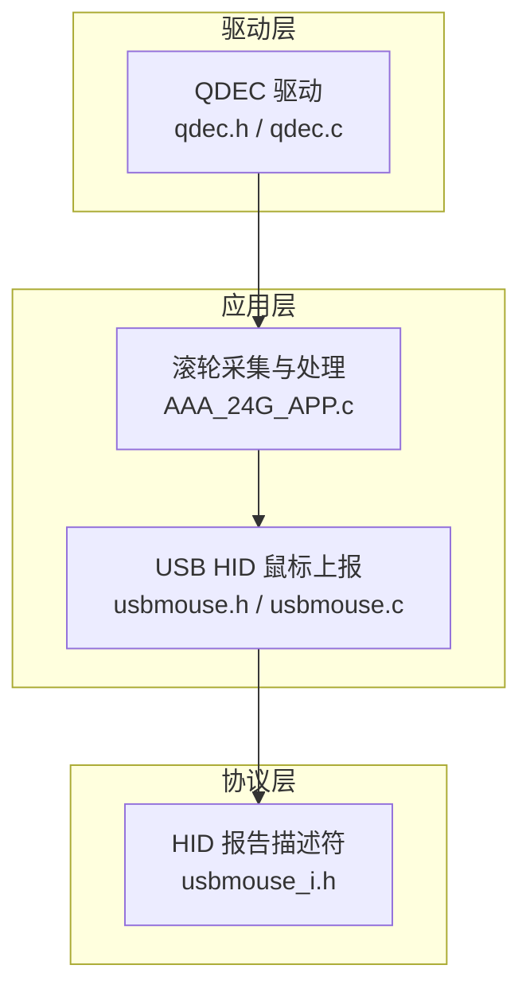
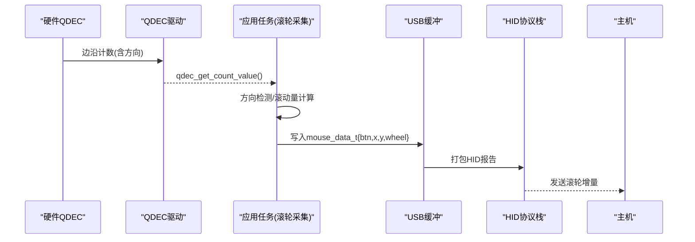
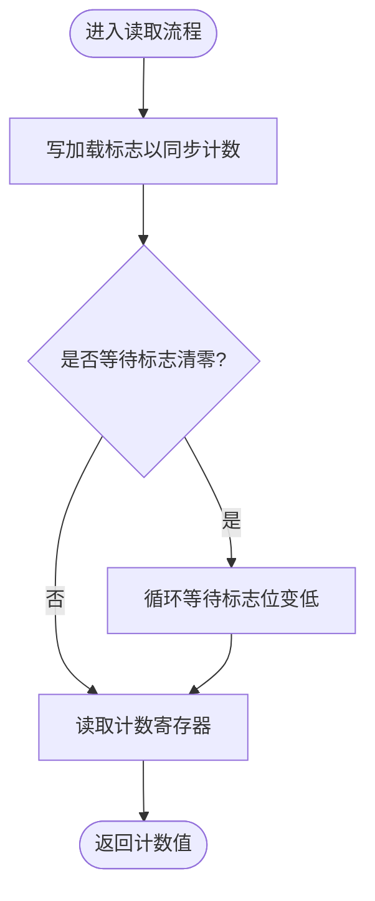
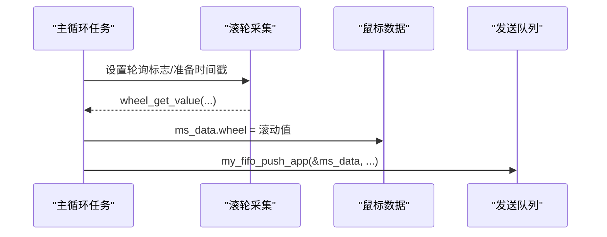
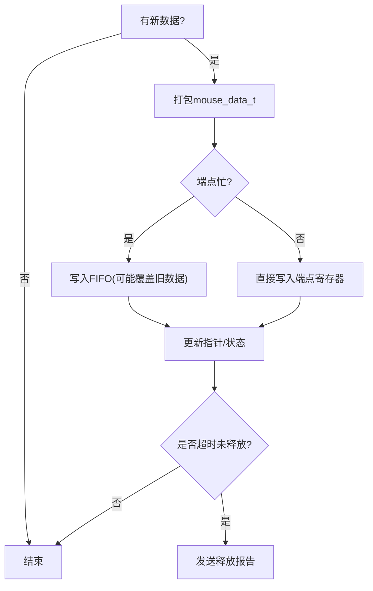
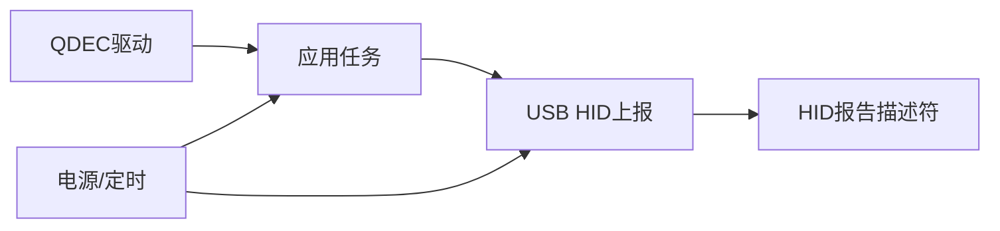

# 滚轮操作

<cite>
**本文引用的文件**
- [qdec.h](file://tc_ble_single_sdk/drivers/B85/qdec.h)
- [qdec.c](file://tc_ble_single_sdk/drivers/B85/qdec.c)
- [usbmouse.h](file://tc_ble_single_sdk/application/app/usbmouse.h)
- [usbmouse.c](file://tc_ble_single_sdk/application/app/usbmouse.c)
- [usbmouse_i.h](file://tc_ble_single_sdk/application/app/usbmouse_i.h)
- [AAA_24G_APP.c](file://tc_ble_single_sdk/vendor/8258_dual_mouse/AAA_24G_APP.c)
</cite>

## 目录
1. [简介](#简介)
2. [项目结构](#项目结构)
3. [核心组件](#核心组件)
4. [架构总览](#架构总览)
5. [详细组件分析](#详细组件分析)
6. [依赖关系分析](#依赖关系分析)
7. [性能与功耗优化](#性能与功耗优化)
8. [故障排查指南](#故障排查指南)
9. [结论](#结论)
10. [附录](#附录)

## 简介
本技术文档聚焦于滚轮操作功能，围绕增量编码器（QDEC）的硬件实现、数据解析算法、方向检测与滚动量计算、灵敏度调节、平滑滚动与快速滚动模式、事件优先级管理与跨输入协调、以及在不同应用场景下的行为差异进行系统化说明。同时给出性能优化与电池寿命延长的策略建议，帮助开发者在嵌入式鼠标设备中稳定高效地实现滚轮体验。

## 项目结构
本项目将滚轮相关能力分为三层：
- 驱动层：提供增量编码器（QDEC）的时钟、模式、去抖、计数读取等底层接口。
- 应用层：负责采集滚轮值、合并到鼠标报告、缓冲与上报。
- 协议层：定义HID报告描述符，规定滚轮字段的数据范围与类型。

图表来源
- [qdec.h:95-134](file://tc_ble_single_sdk/drivers/B85/qdec.h#L95-L134)
- [qdec.c:38-98](file://tc_ble_single_sdk/drivers/B85/qdec.c#L38-L98)
- [usbmouse.h:40-50](file://tc_ble_single_sdk/application/app/usbmouse.h#L40-L50)
- [usbmouse.c:44-97](file://tc_ble_single_sdk/application/app/usbmouse.c#L44-L97)
- [usbmouse_i.h:335-378](file://tc_ble_single_sdk/application/app/usbmouse_i.h#L335-L378)

章节来源
- [qdec.h:95-134](file://tc_ble_single_sdk/drivers/B85/qdec.h#L95-L134)
- [qdec.c:38-98](file://tc_ble_single_sdk/drivers/B85/qdec.c#L38-L98)
- [usbmouse.h:40-50](file://tc_ble_single_sdk/application/app/usbmouse.h#L40-L50)
- [usbmouse.c:44-97](file://tc_ble_single_sdk/application/app/usbmouse.c#L44-L97)
- [usbmouse_i.h:335-378](file://tc_ble_single_sdk/application/app/usbmouse_i.h#L335-L378)

## 核心组件
- 增量编码器（QDEC）驱动
  - 提供时钟使能、模式选择（普通/四倍频）、硬件去抖阈值设置、计数器复位与计数值读取。
  - 关键接口：qdec_clk_en、qdec_set_mode、qdec_set_debouncing、qdec_reset、qdec_get_count_value。
- 滚轮采集与应用处理
  - 周期性任务中调用滚轮获取函数，将滚动值写入鼠标数据结构并加入发送队列。
  - 支持休眠唤醒配置，以便低功耗场景下由滚轮中断唤醒。
- USB HID 鼠标上报
  - 维护环形缓冲，聚合鼠标按钮、X/Y位移与滚轮滚动量，按HID协议上报。
  - 支持平滑上报开关与释放检查，避免粘滞。
- HID 报告描述符
  - 定义滚轮字段为相对型、有符号整数，指定逻辑最小/最大值与位宽。

章节来源
- [qdec.h:95-134](file://tc_ble_single_sdk/drivers/B85/qdec.h#L95-L134)
- [qdec.c:38-98](file://tc_ble_single_sdk/drivers/B85/qdec.c#L38-L98)
- [AAA_24G_APP.c:390-426](file://tc_ble_single_sdk/vendor/8258_dual_mouse/AAA_24G_APP.c#L390-L426)
- [usbmouse.h:40-50](file://tc_ble_single_sdk/application/app/usbmouse.h#L40-L50)
- [usbmouse.c:44-97](file://tc_ble_single_sdk/application/app/usbmouse.c#L44-L97)
- [usbmouse_i.h:335-378](file://tc_ble_single_sdk/application/app/usbmouse_i.h#L335-L378)

## 架构总览
下图展示了从硬件编码器到主机应用的完整数据流，包括方向判断、滚动量累积、缓冲与上报。

图表来源
- [qdec.c:69-75](file://tc_ble_single_sdk/drivers/B85/qdec.c#L69-L75)
- [usbmouse.c:44-97](file://tc_ble_single_sdk/application/app/usbmouse.c#L44-L97)
- [usbmouse_i.h:335-378](file://tc_ble_single_sdk/application/app/usbmouse_i.h#L335-L378)

## 详细组件分析

### 增量编码器（QDEC）驱动
- 工作原理
  - 通过A/B两相正交信号的上升/下降沿计数，结合相位关系判断滚轮方向。
  - 支持两种模式：
    - 普通模式：仅在两相信号相同边沿时计数变化。
    - 四倍频模式：在每个边沿均计数，单圈滚动计数增量为2（相对于普通模式的步进）。
  - 硬件去抖：可配置阈值，过滤短于阈值的抖动脉冲，提升稳定性。
  - 计数读取：读取前需触发加载标志，确保读到最新计数；部分平台在读取后等待标志清零以避免读到旧值。
- 关键接口与职责
  - qdec_clk_en：使能QDEC时钟源。
  - qdec_set_mode：设置普通或四倍频模式。
  - qdec_set_debouncing：设置硬件去抖阈值。
  - qdec_reset：复位QDEC模块与计数器。
  - qdec_get_count_value：读取硬件计数值（带方向信息）。

图表来源
- [qdec.c:69-75](file://tc_ble_single_sdk/drivers/B85/qdec.c#L69-L75)
- [qdec.h:112-119](file://tc_ble_single_sdk/drivers/B85/qdec.h#L112-L119)

章节来源
- [qdec.c:38-98](file://tc_ble_single_sdk/drivers/B85/qdec.c#L38-L98)
- [qdec.h:95-134](file://tc_ble_single_sdk/drivers/B85/qdec.h#L95-L134)

### 滚轮采集与应用处理
- 采集周期与任务调度
  - 在主循环中以固定周期（例如约7ms）执行任务，期间启用滚轮采集标志并准备时间戳。
  - 调用滚轮获取函数，将滚动值写入全局鼠标数据结构，随后推入发送队列。
- 方向检测与滚动量计算
  - 方向由QDEC计数值的正负决定：正值表示向上滚动，负值表示向下滚动。
  - 滚动量即计数差值，可直接作为HID报告的wheel字段。
- 低功耗与唤醒
  - 在空闲或深睡阶段，可关闭滚轮GPIO唤醒，或在需要时重新启用，以平衡功耗与响应性。

图表来源
- [AAA_24G_APP.c:390-426](file://tc_ble_single_sdk/vendor/8258_dual_mouse/AAA_24G_APP.c#L390-L426)

章节来源
- [AAA_24G_APP.c:390-426](file://tc_ble_single_sdk/vendor/8258_dual_mouse/AAA_24G_APP.c#L390-L426)

### USB HID 鼠标上报与平滑滚动
- 数据结构与字段
  - mouse_data_t包含按钮、X/Y位移与滚轮滚动量，长度固定，便于打包HID报告。
- 缓冲与上报
  - 使用环形缓冲暂存多帧数据，避免丢包；当端点忙时转入FIFO缓存，必要时丢弃最旧数据。
  - 上报成功后更新读指针；若未收到释放且超时，主动发送释放报告，防止按键/滚轮粘滞。
- 平滑滚动模式
  - 可通过编译宏启用平滑上报：在高频小步长滚动时延迟上报，降低带宽占用，提升流畅度。
  - 当缓冲区积压较少且最近有传输时，暂缓上报，达到“平滑”效果。

图表来源
- [usbmouse.c:44-97](file://tc_ble_single_sdk/application/app/usbmouse.c#L44-L97)
- [usbmouse.c:107-151](file://tc_ble_single_sdk/application/app/usbmouse.c#L107-L151)

章节来源
- [usbmouse.h:40-50](file://tc_ble_single_sdk/application/app/usbmouse.h#L40-L50)
- [usbmouse.c:44-97](file://tc_ble_single_sdk/application/app/usbmouse.c#L44-L97)
- [usbmouse.c:107-151](file://tc_ble_single_sdk/application/app/usbmouse.c#L107-L151)

### HID 报告描述符与协议约束
- 滚轮字段定义
  - 类型为相对型变量，有符号整数，逻辑最小/最大值与位宽由描述符确定。
  - 该定义决定了主机对滚轮数据的解读方式（相对滚动、范围限制）。
- 与其他字段的协同
  - 按钮、X/Y与滚轮在同一报告中组合，保证原子性与时序一致性。

章节来源
- [usbmouse_i.h:335-378](file://tc_ble_single_sdk/application/app/usbmouse_i.h#L335-L378)

## 依赖关系分析
- 组件耦合
  - 应用层依赖QDEC驱动提供的计数接口；应用层将滚轮值封装进mouse_data_t并提交给USB HID层。
  - USB HID层依赖报告描述符定义，确保与主机兼容。
- 外部依赖
  - 时钟与电源管理：QDEC时钟使能与休眠唤醒控制影响功耗与实时性。
  - 定时器：用于平滑上报与释放检查的时间基准。

图表来源
- [qdec.c:56-60](file://tc_ble_single_sdk/drivers/B85/qdec.c#L56-L60)
- [usbmouse.c:59-97](file://tc_ble_single_sdk/application/app/usbmouse.c#L59-L97)
- [usbmouse_i.h:335-378](file://tc_ble_single_sdk/application/app/usbmouse_i.h#L335-L378)

章节来源
- [qdec.c:56-60](file://tc_ble_single_sdk/drivers/B85/qdec.c#L56-L60)
- [usbmouse.c:59-97](file://tc_ble_single_sdk/application/app/usbmouse.c#L59-L97)
- [usbmouse_i.h:335-378](file://tc_ble_single_sdk/application/app/usbmouse_i.h#L335-L378)

## 性能与功耗优化
- 滚轮灵敏度调节
  - 通过QDEC模式切换（普通/四倍频）调整每转计数密度，从而改变灵敏度。
  - 调整硬件去抖阈值，抑制抖动带来的误计数，提高低速滚动的稳定性。
- 平滑滚动处理
  - 启用平滑上报，减少高频小步长时的上报频率，降低总线负载与主机处理压力。
  - 利用缓冲积压与时序判断，动态调整上报时机，兼顾流畅与实时。
- 快速滚动模式
  - 在高堆积情况下允许立即上报，避免用户感知延迟；在低堆积时延迟上报以提升平滑度。
- 电池寿命延长策略
  - 空闲时关闭滚轮GPIO唤醒，连接后根据需求开启，降低待机功耗。
  - 合理设置上报间隔与休眠唤醒策略，平衡响应速度与能耗。
  - 使用四倍频模式时注意功耗与噪声的权衡，必要时回退至普通模式。

章节来源
- [qdec.c:38-98](file://tc_ble_single_sdk/drivers/B85/qdec.c#L38-L98)
- [usbmouse.c:70-97](file://tc_ble_single_sdk/application/app/usbmouse.c#L70-L97)
- [AAA_24G_APP.c:494-527](file://tc_ble_single_sdk/vendor/8258_dual_mouse/AAA_24G_APP.c#L494-L527)

## 故障排查指南
- 现象：滚轮无响应或计数异常
  - 检查QDEC时钟是否使能，模式与引脚配置是否正确。
  - 确认去抖阈值是否过大导致有效边沿被过滤。
  - 验证计数读取流程是否包含加载标志与必要的等待。
- 现象：滚轮粘滞或重复滚动
  - 检查释放检查逻辑是否生效，确保超时后发送释放报告。
  - 核对HID报告描述符中滚轮字段范围是否与固件一致。
- 现象：滚动卡顿或不流畅
  - 评估平滑上报参数，适当放宽延迟条件或增大缓冲容量。
  - 检查端点忙时的FIFO溢出策略，避免频繁覆盖导致数据丢失。
- 现象：功耗偏高
  - 在空闲或深睡阶段关闭滚轮GPIO唤醒，按需恢复。
  - 调整上报间隔与休眠策略，减少不必要的唤醒。

章节来源
- [qdec.c:56-75](file://tc_ble_single_sdk/drivers/B85/qdec.c#L56-L75)
- [usbmouse.c:59-97](file://tc_ble_single_sdk/application/app/usbmouse.c#L59-L97)
- [usbmouse_i.h:335-378](file://tc_ble_single_sdk/application/app/usbmouse_i.h#L335-L378)
- [AAA_24G_APP.c:494-527](file://tc_ble_single_sdk/vendor/8258_dual_mouse/AAA_24G_APP.c#L494-L527)

## 结论
本项目通过QDEC驱动与应用层的紧密协作，实现了稳定的滚轮方向检测与滚动量计算，并在USB HID层提供了平滑与快速滚动模式，满足不同场景的用户体验需求。通过合理的灵敏度调节、去抖配置与低功耗策略，可在保证响应性的同时延长电池寿命。建议在具体产品化过程中结合目标平台的时序与功耗特性，进一步调优平滑参数与唤醒策略。

## 附录
- 术语说明
  - 增量编码器（QDEC）：通过正交信号边沿计数实现位置与方向检测的硬件模块。
  - 四倍频模式：在每个边沿计数，提高分辨率与灵敏度。
  - 平滑滚动：通过延迟与批处理降低上报频率，提升滚动流畅度。
  - 释放检查：在长时间未释放时主动发送释放报告，防止粘滞。
- 参考路径
  - 驱动层：[qdec.h](file://tc_ble_single_sdk/drivers/B85/qdec.h)、[qdec.c](file://tc_ble_single_sdk/drivers/B85/qdec.c)
  - 应用层：[AAA_24G_APP.c](file://tc_ble_single_sdk/vendor/8258_dual_mouse/AAA_24G_APP.c)
  - 协议层：[usbmouse.h](file://tc_ble_single_sdk/application/app/usbmouse.h)、[usbmouse.c](file://tc_ble_single_sdk/application/app/usbmouse.c)、[usbmouse_i.h](file://tc_ble_single_sdk/application/app/usbmouse_i.h)