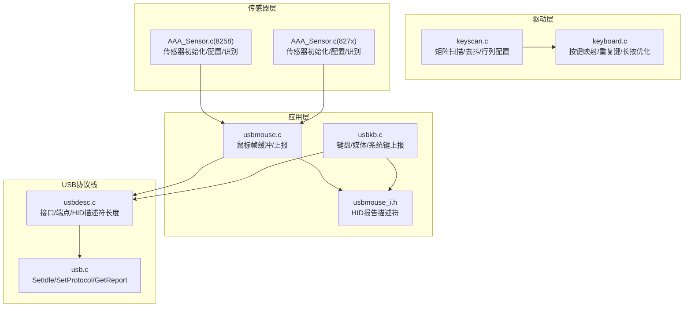
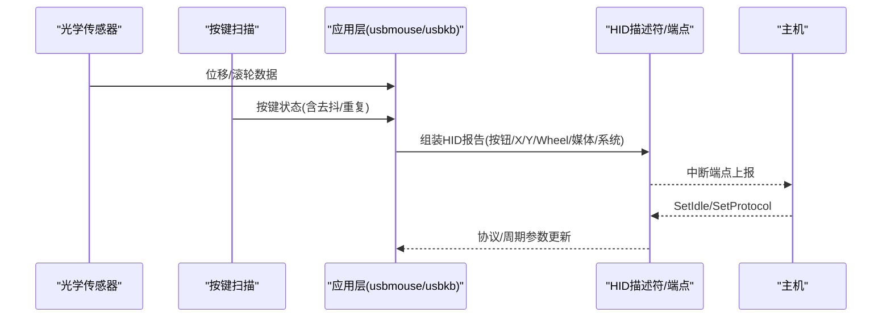
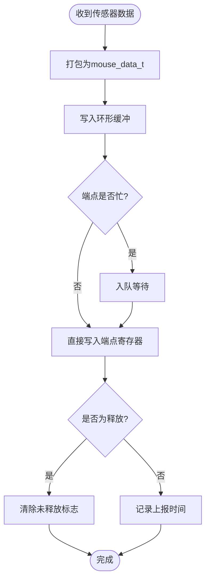
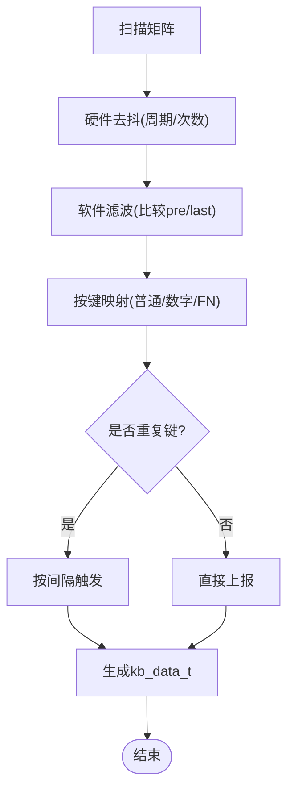
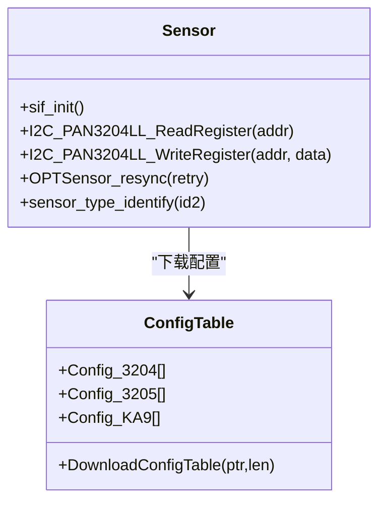
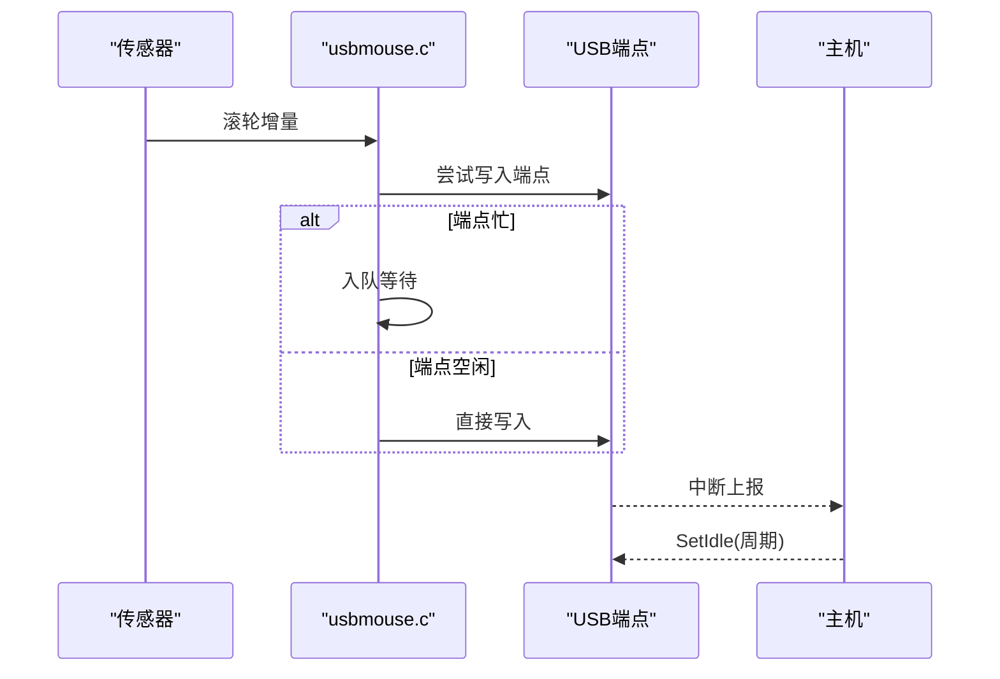
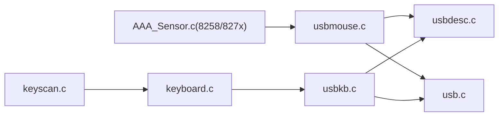

# 输入设备管理

<cite>
**本文引用的文件**
- [usbmouse.c](file://tc_ble_single_sdk/application/app/usbmouse.c)
- [usbmouse_i.h](file://tc_ble_single_sdk/application/app/usbmouse_i.h)
- [keyboard.c](file://tc_ble_single_sdk/application/keyboard/keyboard.c)
- [keyscan.c](file://tc_ble_single_sdk/drivers/TC321X/keyscan.c)
- [AAA_Sensor.c（8258双模）](file://tc_ble_single_sdk/vendor/8258_dual_mouse/AAA_Sensor.c)
- [AAA_Sensor.c（827x三模）](file://tc_ble_single_sdk/vendor/827x_three_mode_mouse/AAA_Sensor.c)
- [usbkb.c](file://tc_ble_single_sdk/application/app/usbkb.c)
- [usbdesc.c](file://tc_ble_single_sdk/application/usbstd/usbdesc.c)
- [usb.c](file://tc_ble_single_sdk/application/usbstd/usb.c)
</cite>

## 目录
1. [简介](#简介)
2. [项目结构](#项目结构)
3. [核心组件](#核心组件)
4. [架构总览](#架构总览)
5. [详细组件分析](#详细组件分析)
6. [依赖关系分析](#依赖关系分析)
7. [性能与延迟优化](#性能与延迟优化)
8. [故障排查指南](#故障排查指南)
9. [结论](#结论)
10. [附录](#附录)

## 简介
本技术文档面向输入设备管理系统，聚焦鼠标移动检测、按键事件处理与滚轮操作的实现原理；说明传感器数据处理算法与运动轨迹追踪机制；给出按键扫描、去抖动与长按检测的具体实现；解释CPI调节与自定义按键映射方法；阐述多键同时按下与事件优先级管理；并提供输入延迟优化与响应性调优的最佳实践。

## 项目结构
该SDK将输入设备相关代码按层次组织：
- 应用层：USB HID报告封装与上报（鼠标、键盘、媒体键、系统键）
- 驱动层：矩阵按键扫描、硬件去抖、行/列配置
- 传感器层：光学传感器初始化、寄存器配置、产品识别、复位与重同步
- USB协议栈：HID描述符、端点控制、协议切换、空闲周期设置

图表来源
- [usbmouse.c:44-98](file://tc_ble_single_sdk/application/app/usbmouse.c#L44-L98)
- [usbmouse_i.h:136-431](file://tc_ble_single_sdk/application/app/usbmouse_i.h#L136-L431)
- [keyscan.c:42-209](file://tc_ble_single_sdk/drivers/TC321X/keyscan.c#L42-L209)
- [keyboard.c:220-486](file://tc_ble_single_sdk/application/keyboard/keyboard.c#L220-L486)
- [AAA_Sensor.c（8258）:284-779](file://tc_ble_single_sdk/vendor/8258_dual_mouse/AAA_Sensor.c#L284-L779)
- [AAA_Sensor.c（827x）:339-779](file://tc_ble_single_sdk/vendor/827x_three_mode_mouse/AAA_Sensor.c#L339-L779)
- [usbdesc.c:691-712](file://tc_ble_single_sdk/application/usbstd/usbdesc.c#L691-L712)
- [usb.c:483-600](file://tc_ble_single_sdk/application/usbstd/usb.c#L483-L600)

章节来源
- [usbmouse.c:44-98](file://tc_ble_single_sdk/application/app/usbmouse.c#L44-L98)
- [usbmouse_i.h:136-431](file://tc_ble_single_sdk/application/app/usbmouse_i.h#L136-L431)
- [keyscan.c:42-209](file://tc_ble_single_sdk/drivers/TC321X/keyscan.c#L42-L209)
- [keyboard.c:220-486](file://tc_ble_single_sdk/application/keyboard/keyboard.c#L220-L486)
- [AAA_Sensor.c（8258）:284-779](file://tc_ble_single_sdk/vendor/8258_dual_mouse/AAA_Sensor.c#L284-L779)
- [AAA_Sensor.c（827x）:339-779](file://tc_ble_single_sdk/vendor/827x_three_mode_mouse/AAA_Sensor.c#L339-L779)
- [usbdesc.c:691-712](file://tc_ble_single_sdk/application/usbstd/usbdesc.c#L691-L712)
- [usb.c:483-600](file://tc_ble_single_sdk/application/usbstd/usb.c#L483-L600)

## 核心组件
- 鼠标上报与缓冲：环形缓冲+超时释放，支持平滑上报开关
- 键盘/媒体/系统键：分离上报、重复检测、超时释放
- 按键扫描：硬件去抖、行列配置、三击确认
- 传感器：多种型号识别、配置表下载、SPI/SIF通信、唤醒引脚
- USB HID：报告描述符、端点大小、轮询间隔、协议切换

章节来源
- [usbmouse.c:44-151](file://tc_ble_single_sdk/application/app/usbmouse.c#L44-L151)
- [usbkb.c:101-337](file://tc_ble_single_sdk/application/app/usbkb.c#L101-L337)
- [keyscan.c:42-209](file://tc_ble_single_sdk/drivers/TC321X/keyscan.c#L42-L209)
- [AAA_Sensor.c（8258）:284-779](file://tc_ble_single_sdk/vendor/8258_dual_mouse/AAA_Sensor.c#L284-L779)
- [AAA_Sensor.c（827x）:339-779](file://tc_ble_single_sdk/vendor/827x_three_mode_mouse/AAA_Sensor.c#L339-L779)
- [usbdesc.c:691-712](file://tc_ble_single_sdk/application/usbstd/usbdesc.c#L691-L712)
- [usb.c:483-600](file://tc_ble_single_sdk/application/usbstd/usb.c#L483-L600)

## 架构总览
输入数据流从传感器与按键矩阵开始，经驱动层处理后进入应用层进行HID打包与上报。USB协议栈负责描述符协商、端点传输与协议切换。

图表来源
- [usbmouse.c:70-98](file://tc_ble_single_sdk/application/app/usbmouse.c#L70-L98)
- [usbkb.c:306-337](file://tc_ble_single_sdk/application/app/usbkb.c#L306-L337)
- [usbdesc.c:691-712](file://tc_ble_single_sdk/application/usbstd/usbdesc.c#L691-L712)
- [usb.c:483-600](file://tc_ble_single_sdk/application/usbstd/usb.c#L483-L600)

## 详细组件分析

### 鼠标移动检测与滚轮操作
- 移动检测：传感器通过SIF/SPI读取位移增量，应用层将其转换为相对坐标（X/Y），并写入HID报告。
- 滚轮操作：滚轮增量以相对值上报，范围由报告描述符定义。
- 平滑上报：可选的平滑上报逻辑在端点忙或队列不足时延迟发送，避免频繁中断。

图表来源
- [usbmouse.c:44-98](file://tc_ble_single_sdk/application/app/usbmouse.c#L44-L98)
- [usbmouse_i.h:335-378](file://tc_ble_single_sdk/application/app/usbmouse_i.h#L335-L378)

章节来源
- [usbmouse.c:44-98](file://tc_ble_single_sdk/application/app/usbmouse.c#L44-L98)
- [usbmouse_i.h:335-378](file://tc_ble_single_sdk/application/app/usbmouse_i.h#L335-L378)

### 按键扫描、去抖动与长按检测
- 行列配置：通过keyscan_set_row/keyscan_set_col配置矩阵行列与上拉/下拉类型。
- 去抖：硬件去抖周期可配置，支持三击确认；软件侧维护前次/上次矩阵状态，过滤抖动。
- 长按与重复：支持长按键功率优化与重复键间隔控制，减少无效上报。

图表来源
- [keyscan.c:42-209](file://tc_ble_single_sdk/drivers/TC321X/keyscan.c#L42-L209)
- [keyboard.c:220-486](file://tc_ble_single_sdk/application/keyboard/keyboard.c#L220-L486)

章节来源
- [keyscan.c:42-209](file://tc_ble_single_sdk/drivers/TC321X/keyscan.c#L42-L209)
- [keyboard.c:220-486](file://tc_ble_single_sdk/application/keyboard/keyboard.c#L220-L486)

### 传感器数据处理与运动轨迹追踪
- 传感器识别：读取产品ID，区分PAN3204/3205/3212/KA9等型号。
- 配置表下载：根据型号选择配置表，批量写入寄存器，优化功耗与跟踪性能。
- 通信与恢复：SIF/SPI读写寄存器，支持复位与重同步，失败计数用于诊断。

图表来源
- [AAA_Sensor.c（8258）:284-779](file://tc_ble_single_sdk/vendor/8258_dual_mouse/AAA_Sensor.c#L284-L779)
- [AAA_Sensor.c（827x）:339-779](file://tc_ble_single_sdk/vendor/827x_three_mode_mouse/AAA_Sensor.c#L339-L779)

章节来源
- [AAA_Sensor.c（8258）:284-779](file://tc_ble_single_sdk/vendor/8258_dual_mouse/AAA_Sensor.c#L284-L779)
- [AAA_Sensor.c（827x）:339-779](file://tc_ble_single_sdk/vendor/827x_three_mode_mouse/AAA_Sensor.c#L339-L779)

### CPI（每英寸点数）调节与自定义按键映射
- CPI调节：通过传感器配置表中的寄存器项调整灵敏度与跟踪参数；不同型号使用不同配置数组，可在初始化时按需加载。
- 自定义按键映射：键盘层提供多套映射表（普通/数字/FN），可通过宏或外部配置替换，支持NUMLOCK状态影响映射。

章节来源
- [AAA_Sensor.c（8258）:304-672](file://tc_ble_single_sdk/vendor/8258_dual_mouse/AAA_Sensor.c#L304-L672)
- [AAA_Sensor.c（827x）:367-723](file://tc_ble_single_sdk/vendor/827x_three_mode_mouse/AAA_Sensor.c#L367-L723)
- [keyboard.c:103-186](file://tc_ble_single_sdk/application/keyboard/keyboard.c#L103-L186)

### 多键同时按下与事件优先级管理
- 多键并发：键盘层支持最多KB_RETURN_KEY_MAX个键同时上报，媒体键与系统键单独通道上报，避免冲突。
- 优先级：系统键优先于普通键，媒体键独立处理；释放顺序保证系统键先释放，再释放普通键与媒体键。
- 重复与防抖：对重复键启用间隔触发，避免高频重复上报；软件滤波降低误触。

章节来源
- [usbkb.c:101-337](file://tc_ble_single_sdk/application/app/usbkb.c#L101-L337)
- [keyboard.c:430-486](file://tc_ble_single_sdk/application/keyboard/keyboard.c#L430-L486)

### 滚轮事件处理流程
- 滚轮增量作为相对量上报，范围由报告描述符限定。
- 当端点忙时，数据进入FIFO队列等待；空闲时立即发送。
- 释放检查：若长时间无新数据，强制发送空包释放按键状态。

图表来源
- [usbmouse.c:107-151](file://tc_ble_single_sdk/application/app/usbmouse.c#L107-L151)
- [usbdesc.c:691-712](file://tc_ble_single_sdk/application/usbstd/usbdesc.c#L691-L712)
- [usb.c:483-600](file://tc_ble_single_sdk/application/usbstd/usb.c#L483-L600)

章节来源
- [usbmouse.c:107-151](file://tc_ble_single_sdk/application/app/usbmouse.c#L107-L151)
- [usbdesc.c:691-712](file://tc_ble_single_sdk/application/usbstd/usbdesc.c#L691-L712)
- [usb.c:483-600](file://tc_ble_single_sdk/application/usbstd/usb.c#L483-L600)

## 依赖关系分析
- 应用层依赖USB描述符与端点能力，确保报告格式与端点大小匹配。
- 驱动层提供稳定的按键扫描与去抖，应用层仅消费标准化事件。
- 传感器层抽象了不同型号的初始化与配置，应用层无需关心具体型号细节。

图表来源
- [keyscan.c:42-209](file://tc_ble_single_sdk/drivers/TC321X/keyscan.c#L42-L209)
- [keyboard.c:220-486](file://tc_ble_single_sdk/application/keyboard/keyboard.c#L220-L486)
- [AAA_Sensor.c（8258）:284-779](file://tc_ble_single_sdk/vendor/8258_dual_mouse/AAA_Sensor.c#L284-L779)
- [AAA_Sensor.c（827x）:339-779](file://tc_ble_single_sdk/vendor/827x_three_mode_mouse/AAA_Sensor.c#L339-L779)
- [usbmouse.c:44-151](file://tc_ble_single_sdk/application/app/usbmouse.c#L44-L151)
- [usbkb.c:101-337](file://tc_ble_single_sdk/application/app/usbkb.c#L101-L337)
- [usbdesc.c:691-712](file://tc_ble_single_sdk/application/usbstd/usbdesc.c#L691-L712)
- [usb.c:483-600](file://tc_ble_single_sdk/application/usbstd/usb.c#L483-L600)

章节来源
- [keyscan.c:42-209](file://tc_ble_single_sdk/drivers/TC321X/keyscan.c#L42-L209)
- [keyboard.c:220-486](file://tc_ble_single_sdk/application/keyboard/keyboard.c#L220-L486)
- [AAA_Sensor.c（8258）:284-779](file://tc_ble_single_sdk/vendor/8258_dual_mouse/AAA_Sensor.c#L284-L779)
- [AAA_Sensor.c（827x）:339-779](file://tc_ble_single_sdk/vendor/827x_three_mode_mouse/AAA_Sensor.c#L339-L779)
- [usbmouse.c:44-151](file://tc_ble_single_sdk/application/app/usbmouse.c#L44-L151)
- [usbkb.c:101-337](file://tc_ble_single_sdk/application/app/usbkb.c#L101-L337)
- [usbdesc.c:691-712](file://tc_ble_single_sdk/application/usbstd/usbdesc.c#L691-L712)
- [usb.c:483-600](file://tc_ble_single_sdk/application/usbstd/usb.c#L483-L600)

## 性能与延迟优化
- 端点忙时入队：避免阻塞，提升吞吐。
- 平滑上报：在高频场景下限制上报频率，降低CPU与总线负载。
- 超时释放：防止卡键导致的状态滞留。
- SetIdle/SetProtocol：主机可动态调整轮询周期与协议，平衡延迟与功耗。
- 传感器配置：针对不同表面与功耗需求选择合适的配置表，提高跟踪稳定性。

[本节为通用指导，不直接分析具体文件]

## 故障排查指南
- 传感器无法识别：检查产品ID读取与重同步流程，确认SPI/SIF时序与时序延时。
- 按键误触或漏报：调整去抖周期与三击确认次数；检查行列配置与上拉/下拉电阻。
- 上报卡顿：检查端点忙与FIFO溢出；适当增大缓冲或降低上报频率。
- 协议异常：核对SetProtocol与报告描述符一致性；确认端点大小与轮询间隔。

章节来源
- [AAA_Sensor.c（8258）:684-779](file://tc_ble_single_sdk/vendor/8258_dual_mouse/AAA_Sensor.c#L684-L779)
- [AAA_Sensor.c（827x）:742-779](file://tc_ble_single_sdk/vendor/827x_three_mode_mouse/AAA_Sensor.c#L742-L779)
- [keyscan.c:42-209](file://tc_ble_single_sdk/drivers/TC321X/keyscan.c#L42-L209)
- [usbmouse.c:107-151](file://tc_ble_single_sdk/application/app/usbmouse.c#L107-L151)
- [usb.c:483-600](file://tc_ble_single_sdk/application/usbstd/usb.c#L483-L600)

## 结论
该输入设备管理系统通过分层设计实现了高可靠性的鼠标移动检测、按键事件处理与滚轮操作。传感器层适配多种型号并提供优化配置；驱动层提供稳定去抖与矩阵扫描；应用层高效打包与上报HID报告；USB协议栈支持灵活协议与周期调整。结合平滑上报、超时释放与合理配置，可在低延迟与低功耗之间取得良好平衡。

[本节为总结，不直接分析具体文件]

## 附录
- 关键函数路径参考：
  - 鼠标上报：[usbmouse.c:44-151](file://tc_ble_single_sdk/application/app/usbmouse.c#L44-L151)
  - 键盘上报：[usbkb.c:101-337](file://tc_ble_single_sdk/application/app/usbkb.c#L101-L337)
  - 按键扫描：[keyscan.c:42-209](file://tc_ble_single_sdk/drivers/TC321X/keyscan.c#L42-L209)
  - 传感器配置：[AAA_Sensor.c（8258）:304-672](file://tc_ble_single_sdk/vendor/8258_dual_mouse/AAA_Sensor.c#L304-L672), [AAA_Sensor.c（827x）:367-723](file://tc_ble_single_sdk/vendor/827x_three_mode_mouse/AAA_Sensor.c#L367-L723)
  - USB描述符：[usbdesc.c:691-712](file://tc_ble_single_sdk/application/usbstd/usbdesc.c#L691-L712)
  - 协议控制：[usb.c:483-600](file://tc_ble_single_sdk/application/usbstd/usb.c#L483-L600)

[本节为索引，不直接分析具体文件]