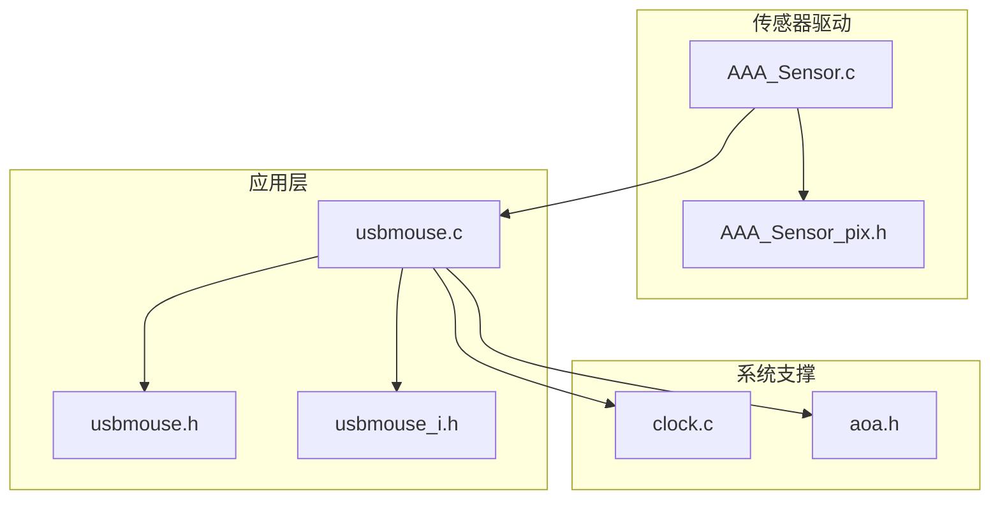
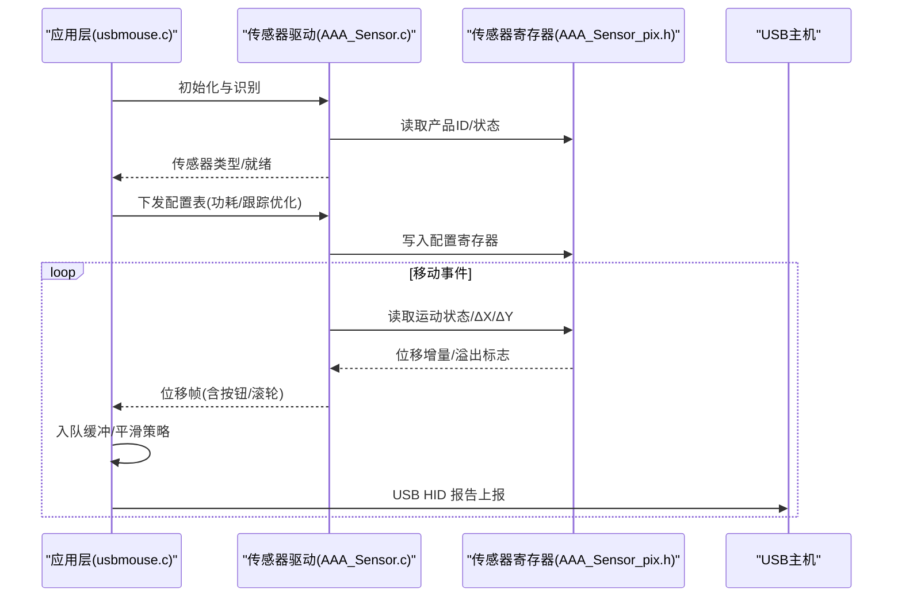
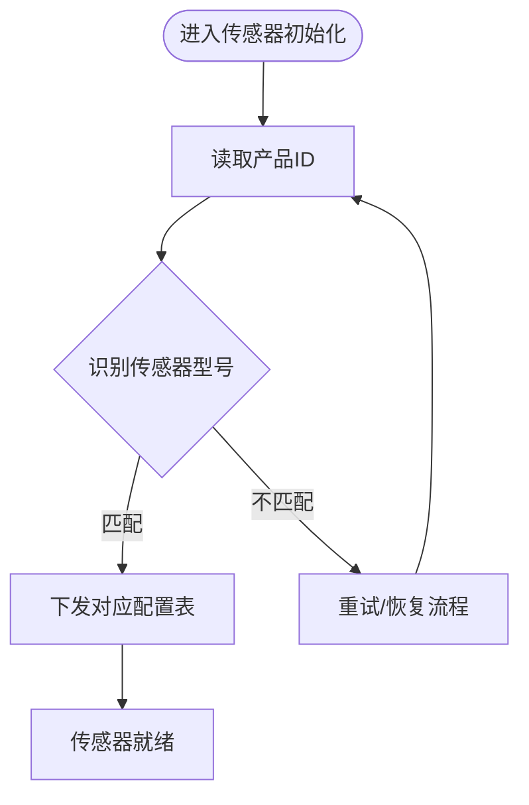
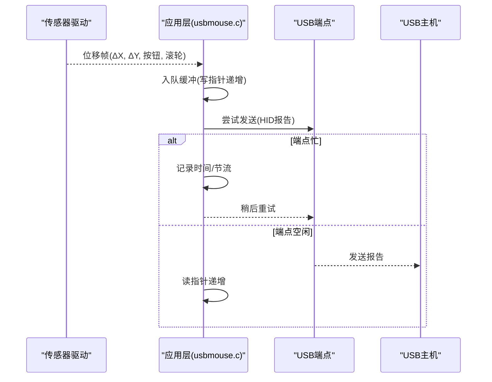
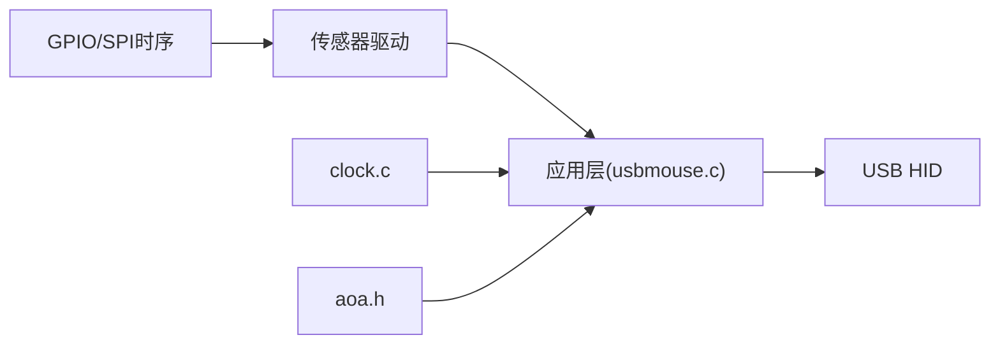

# 鼠标移动检测

<cite>
**本文引用的文件**
- [AAA_Sensor.c](file://tc_ble_single_sdk/vendor/8258_dual_mouse/AAA_Sensor.c)
- [AAA_Sensor_pix.h](file://tc_ble_single_sdk/vendor/8258_dual_mouse/AAA_Sensor_pix.h)
- [usbmouse.c](file://tc_ble_single_sdk/application/app/usbmouse.c)
- [usbmouse.h](file://tc_ble_single_sdk/application/app/usbmouse.h)
- [usbmouse_i.h](file://tc_ble_single_sdk/application/app/usbmouse_i.h)
- [clock.c](file://tc_ble_single_sdk/drivers/B85/clock.c)
- [aoa.h](file://tc_ble_single_sdk/drivers/B87/lib/include/aoa.h)
</cite>

## 目录
1. [简介](#简介)
2. [项目结构](#项目结构)
3. [核心组件](#核心组件)
4. [架构总览](#架构总览)
5. [详细组件分析](#详细组件分析)
6. [依赖关系分析](#依赖关系分析)
7. [性能考量](#性能考量)
8. [故障排查指南](#故障排查指南)
9. [结论](#结论)
10. [附录](#附录)

## 简介
本技术文档聚焦于鼠标移动检测功能，围绕光学传感器数据读取与处理、位移计算、方向判断、速度检测机制、CPI（每英寸点数）调节、运动轨迹追踪、加速度补偿与抖动过滤、传感器校准与精度优化、不同表面适配与环境光干扰处理，以及移动延迟优化与响应性调优进行系统化说明。文档基于仓库中的传感器驱动与应用层实现，提供可追溯的代码级分析与可视化图示，帮助开发者理解并优化鼠标移动检测链路。

## 项目结构
本项目在“鼠标移动检测”相关路径上主要包含：
- 传感器驱动与配置：位于 vendor 下的 AAA_Sensor.c 与头文件定义，负责传感器识别、寄存器读写、配置表下发、休眠唤醒等。
- 应用层 USB HID 报告：application/app 下的 usbmouse.c/h/i，负责将位移数据打包并通过 USB 上报。
- 时钟与时间管理：drivers/B85/clock.c，用于超时与节流控制。
- AOA 算法接口：drivers/B87/lib/include/aoa.h，提供原始数据处理与角度转换接口（用于高级定位或辅助算法）。

图表来源
- [AAA_Sensor.c:284-672](file://tc_ble_single_sdk/vendor/8258_dual_mouse/AAA_Sensor.c#L284-L672)
- [AAA_Sensor_pix.h:116-173](file://tc_ble_single_sdk/vendor/8258_dual_mouse/AAA_Sensor_pix.h#L116-L173)
- [usbmouse.c:44-98](file://tc_ble_single_sdk/application/app/usbmouse.c#L44-L98)
- [usbmouse.h:40-48](file://tc_ble_single_sdk/application/app/usbmouse.h#L40-L48)
- [usbmouse_i.h:335-378](file://tc_ble_single_sdk/application/app/usbmouse_i.h#L335-L378)
- [clock.c:142-183](file://tc_ble_single_sdk/drivers/B85/clock.c#L142-L183)
- [aoa.h:87-125](file://tc_ble_single_sdk/drivers/B87/lib/include/aoa.h#L87-L125)

章节来源
- [AAA_Sensor.c:284-672](file://tc_ble_single_sdk/vendor/8258_dual_mouse/AAA_Sensor.c#L284-L672)
- [AAA_Sensor_pix.h:116-173](file://tc_ble_single_sdk/vendor/8258_dual_mouse/AAA_Sensor_pix.h#L116-L173)
- [usbmouse.c:44-98](file://tc_ble_single_sdk/application/app/usbmouse.c#L44-L98)
- [usbmouse.h:40-48](file://tc_ble_single_sdk/application/app/usbmouse.h#L40-L48)
- [usbmouse_i.h:335-378](file://tc_ble_single_sdk/application/app/usbmouse_i.h#L335-L378)
- [clock.c:142-183](file://tc_ble_single_sdk/drivers/B85/clock.c#L142-L183)
- [aoa.h:87-125](file://tc_ble_single_sdk/drivers/B87/lib/include/aoa.h#L87-L125)

## 核心组件
- 传感器驱动与配置
  - 通过 SPI/I2C 时序函数对传感器寄存器进行读写，支持多种传感器型号识别与配置表下发，以实现低功耗与跟踪性能优化。
  - 提供运动状态位、Delta X/Y 寄存器访问，用于获取位移增量。
- 应用层 USB HID 报告
  - 维护环形缓冲区，将传感器产生的位移帧缓冲并按策略上报到主机。
  - 支持平滑上报与释放检查，避免频繁中断与丢包。
- 时钟与时间管理
  - 提供超时判断与节流逻辑，用于平滑上报与释放检测。
- AOA 算法接口
  - 提供原始数据到角度转换、查表初始化等接口，可用于高级定位或辅助算法。

章节来源
- [AAA_Sensor.c:284-672](file://tc_ble_single_sdk/vendor/8258_dual_mouse/AAA_Sensor.c#L284-L672)
- [AAA_Sensor_pix.h:116-173](file://tc_ble_single_sdk/vendor/8258_dual_mouse/AAA_Sensor_pix.h#L116-L173)
- [usbmouse.c:44-98](file://tc_ble_single_sdk/application/app/usbmouse.c#L44-L98)
- [usbmouse.h:40-48](file://tc_ble_single_sdk/application/app/usbmouse.h#L40-L48)
- [clock.c:142-183](file://tc_ble_single_sdk/drivers/B85/clock.c#L142-L183)
- [aoa.h:87-125](file://tc_ble_single_sdk/drivers/B87/lib/include/aoa.h#L87-L125)

## 架构总览
下图展示了从传感器读取到 USB 上报的完整链路，包括传感器识别、配置下发、位移读取、缓冲与上报流程。

图表来源
- [AAA_Sensor.c:284-672](file://tc_ble_single_sdk/vendor/8258_dual_mouse/AAA_Sensor.c#L284-L672)
- [AAA_Sensor_pix.h:116-173](file://tc_ble_single_sdk/vendor/8258_dual_mouse/AAA_Sensor_pix.h#L116-L173)
- [usbmouse.c:44-98](file://tc_ble_single_sdk/application/app/usbmouse.c#L44-L98)

## 详细组件分析

### 传感器驱动与配置（AAA_Sensor.c / AAA_Sensor_pix.h）
- 传感器识别与恢复
  - 通过读取产品 ID 寄存器识别具体型号，并在通信异常时执行重同步流程，确保稳定连接。
- 配置表下发
  - 针对不同传感器型号预置多套配置表，按地址-值对批量写入，以优化功耗与跟踪性能。
- 寄存器访问
  - 提供运动状态、ΔX/ΔY、操作模式、配置等关键寄存器的读写接口，供上层获取位移与状态。
- CPI 调节
  - 通过设置 CPI 相关寄存器或配置项调整灵敏度，支持不同 DPI 档位切换。

图表来源
- [AAA_Sensor.c:684-720](file://tc_ble_single_sdk/vendor/8258_dual_mouse/AAA_Sensor.c#L684-L720)
- [AAA_Sensor.c:292-378](file://tc_ble_single_sdk/vendor/8258_dual_mouse/AAA_Sensor.c#L292-L378)
- [AAA_Sensor_pix.h:116-173](file://tc_ble_single_sdk/vendor/8258_dual_mouse/AAA_Sensor_pix.h#L116-L173)

章节来源
- [AAA_Sensor.c:284-672](file://tc_ble_single_sdk/vendor/8258_dual_mouse/AAA_Sensor.c#L284-L672)
- [AAA_Sensor_pix.h:116-173](file://tc_ble_single_sdk/vendor/8258_dual_mouse/AAA_Sensor_pix.h#L116-L173)

### 应用层 USB 上报（usbmouse.c / usbmouse.h / usbmouse_i.h）
- 数据缓冲与上报
  - 使用固定大小环形缓冲区缓存位移帧，读指针与写指针分离，避免竞争。
  - 支持平滑上报策略：当端点忙且缓冲较少时，延时上报以降低 CPU 占用与抖动。
- 释放检查
  - 若按键未释放且超过超时阈值，主动发送释放帧，保证状态一致性。
- HID 报告描述符
  - 定义 X/Y/Wheel 的逻辑范围与报告格式，确保与主机协议一致。

图表来源
- [usbmouse.c:44-98](file://tc_ble_single_sdk/application/app/usbmouse.c#L44-L98)
- [usbmouse.c:107-151](file://tc_ble_single_sdk/application/app/usbmouse.c#L107-L151)
- [usbmouse_i.h:335-378](file://tc_ble_single_sdk/application/app/usbmouse_i.h#L335-L378)

章节来源
- [usbmouse.c:44-98](file://tc_ble_single_sdk/application/app/usbmouse.c#L44-L98)
- [usbmouse.c:107-151](file://tc_ble_single_sdk/application/app/usbmouse.c#L107-L151)
- [usbmouse.h:40-48](file://tc_ble_single_sdk/application/app/usbmouse.h#L40-L48)
- [usbmouse_i.h:335-378](file://tc_ble_single_sdk/application/app/usbmouse_i.h#L335-L378)

### 时钟与时间管理（clock.c）
- 提供超时判断与节流逻辑，用于平滑上报与释放检测，避免频繁上报导致总线拥塞。
- 通过模拟/数字寄存器配合实现高精度定时与校准，保障时间基准稳定。

章节来源
- [clock.c:142-183](file://tc_ble_single_sdk/drivers/B85/clock.c#L142-L183)

### AOA 算法接口（aoa.h）
- 提供原始数据到角度转换、查表初始化等接口，可用于高级定位或辅助算法，提升复杂场景下的跟踪稳定性。

章节来源
- [aoa.h:87-125](file://tc_ble_single_sdk/drivers/B87/lib/include/aoa.h#L87-L125)

## 依赖关系分析
- 传感器驱动依赖底层 GPIO/SPI 时序与寄存器定义，向上提供统一的传感器抽象。
- 应用层依赖传感器驱动提供的位移帧，并通过 USB HID 协议上报至主机。
- 时钟模块为应用层提供时间基准，影响上报策略与释放检测。
- AOA 接口为上层算法提供扩展能力，可与传感器数据融合以提升精度。

图表来源
- [AAA_Sensor.c:284-672](file://tc_ble_single_sdk/vendor/8258_dual_mouse/AAA_Sensor.c#L284-L672)
- [usbmouse.c:44-98](file://tc_ble_single_sdk/application/app/usbmouse.c#L44-L98)
- [clock.c:142-183](file://tc_ble_single_sdk/drivers/B85/clock.c#L142-L183)
- [aoa.h:87-125](file://tc_ble_single_sdk/drivers/B87/lib/include/aoa.h#L87-L125)

章节来源
- [AAA_Sensor.c:284-672](file://tc_ble_single_sdk/vendor/8258_dual_mouse/AAA_Sensor.c#L284-L672)
- [usbmouse.c:44-98](file://tc_ble_single_sdk/application/app/usbmouse.c#L44-L98)
- [clock.c:142-183](file://tc_ble_single_sdk/drivers/B85/clock.c#L142-L183)
- [aoa.h:87-125](file://tc_ble_single_sdk/drivers/B87/lib/include/aoa.h#L87-L125)

## 性能考量
- 上报策略
  - 平滑上报：在端点忙且缓冲较少时延时上报，降低 CPU 占用与抖动，提高整体吞吐。
  - 释放检查：超时后主动发送释放帧，避免状态不一致导致的卡顿。
- 传感器配置
  - 针对不同型号下发优化配置表，平衡功耗与跟踪性能，提升复杂表面适应性。
- 时间基准
  - 稳定的时钟校准减少上报抖动与误判，提升响应一致性。

[本节为通用性能讨论，无需特定文件引用]

## 故障排查指南
- 传感器通信失败
  - 现象：无法识别产品 ID 或频繁重同步。
  - 排查：检查 SPI/I2C 时序、CS/MOTION 引脚配置；确认重同步流程是否触发。
  - 参考：重同步与产品 ID 读取逻辑。
- 上报卡顿或丢帧
  - 现象：光标移动不流畅或丢帧。
  - 排查：检查 USB 端点忙状态与缓冲差值；确认平滑上报策略是否合理；验证释放检查是否及时。
  - 参考：缓冲入队与上报逻辑、释放检查。
- 时间基准漂移
  - 现象：超时判断不准，释放延迟或过早。
  - 排查：检查时钟校准流程与寄存器配置。
  - 参考：时钟校准代码。

章节来源
- [AAA_Sensor.c:684-720](file://tc_ble_single_sdk/vendor/8258_dual_mouse/AAA_Sensor.c#L684-L720)
- [usbmouse.c:59-98](file://tc_ble_single_sdk/application/app/usbmouse.c#L59-L98)
- [clock.c:142-183](file://tc_ble_single_sdk/drivers/B85/clock.c#L142-L183)

## 结论
本仓库实现了完整的鼠标移动检测链路：从传感器识别与配置、位移读取、缓冲与上报，到时间管理与释放检查。通过合理的配置表下发与上报策略，系统在功耗与性能之间取得良好平衡。结合 AOA 算法接口，可进一步提升复杂场景下的跟踪稳定性。建议在实际产品中根据表面与环境光条件微调传感器配置与上报策略，以获得最佳用户体验。

[本节为总结性内容，无需特定文件引用]

## 附录
- CPI 调节与配置方法
  - 通过设置 CPI 相关寄存器或配置项调整灵敏度，支持不同 DPI 档位切换。
  - 参考：CPI 寄存器定义与配置宏。
- 运动轨迹追踪与加速度补偿
  - 利用 Delta X/Y 与运动状态位构建轨迹；可通过滤波与阈值抑制抖动与瞬时噪声。
  - 参考：运动状态与位移寄存器。
- 不同表面适配与环境光干扰处理
  - 通过传感器配置表优化图像质量与识别阈值，提升复杂表面适应性；必要时结合 AOA 算法增强鲁棒性。
  - 参考：配置表下发与 AOA 接口。
- 移动延迟优化与响应性调优
  - 采用平滑上报策略与释放检查，降低延迟与抖动；结合时钟校准提升时间基准稳定性。
  - 参考：上报逻辑与时钟校准。

章节来源
- [AAA_Sensor_pix.h:116-173](file://tc_ble_single_sdk/vendor/8258_dual_mouse/AAA_Sensor_pix.h#L116-L173)
- [AAA_Sensor.c:284-672](file://tc_ble_single_sdk/vendor/8258_dual_mouse/AAA_Sensor.c#L284-L672)
- [usbmouse.c:44-98](file://tc_ble_single_sdk/application/app/usbmouse.c#L44-L98)
- [clock.c:142-183](file://tc_ble_single_sdk/drivers/B85/clock.c#L142-L183)
- [aoa.h:87-125](file://tc_ble_single_sdk/drivers/B87/lib/include/aoa.h#L87-L125)