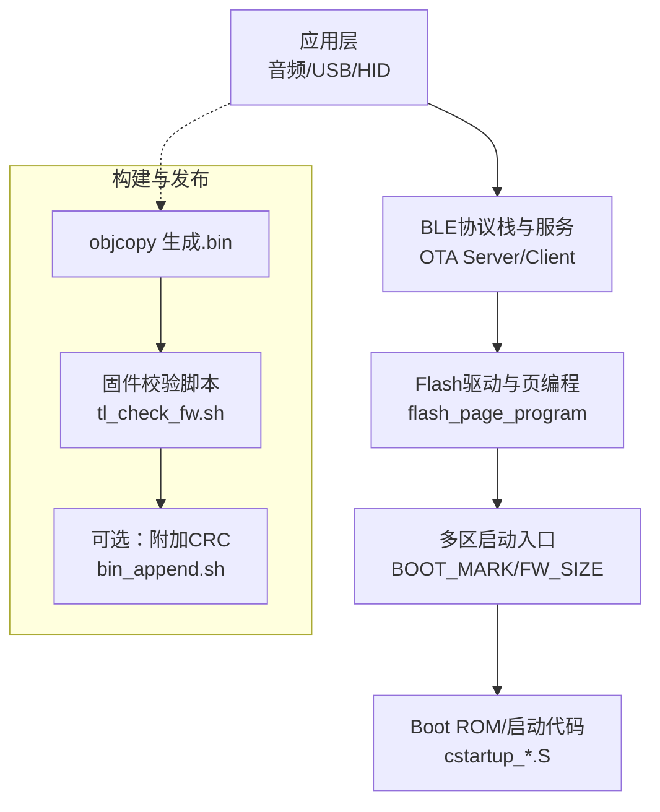
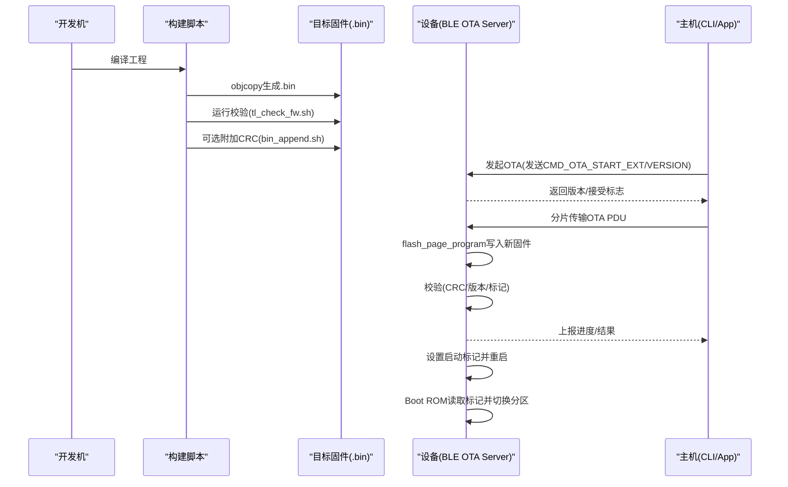
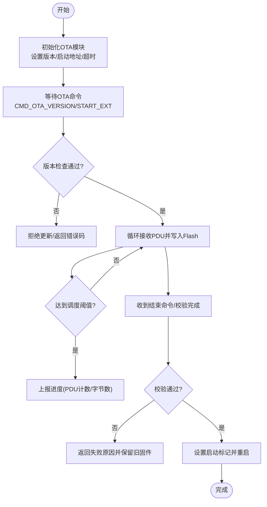
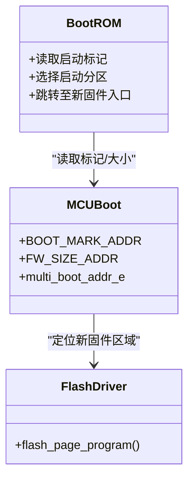
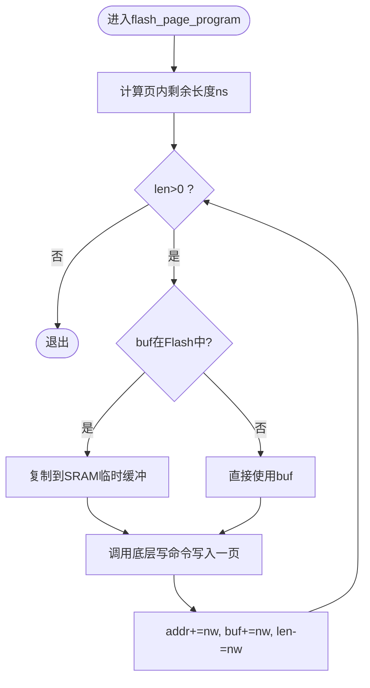
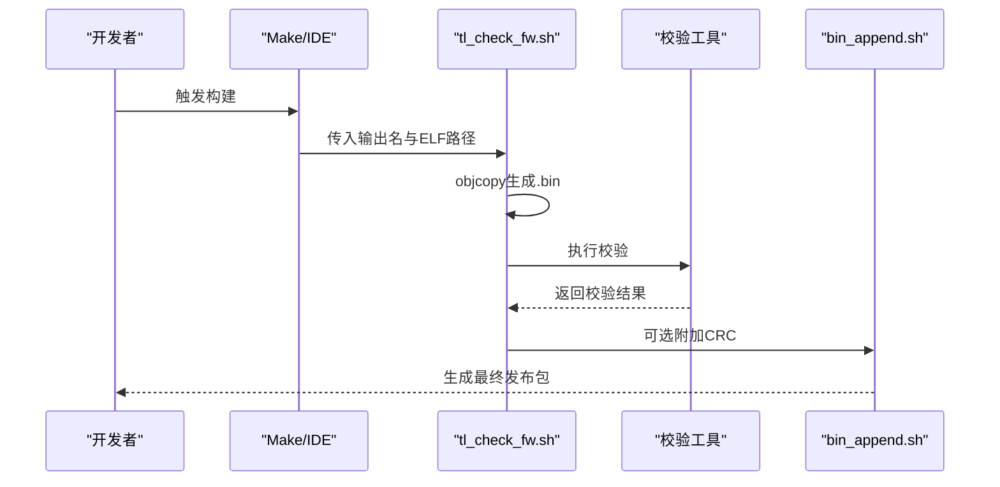
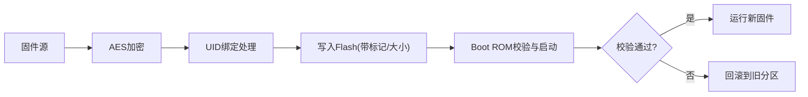
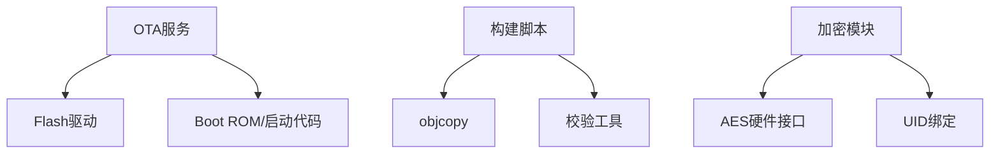

# 部署与维护

<cite>
**本文引用的文件**
- [README.md](file://README.md)
- [telink_b85m_triple_mode_audio_mouse_sdk_Release_Note .md](file://telink_b85m_triple_mode_audio_mouse_sdk_Release_Note .md)
- [ota.h](file://tc_ble_single_sdk/stack/ble/service/ota/ota.h)
- [ota_server.h](file://tc_ble_single_sdk/stack/ble/service/ota/ota_server.h)
- [firmware_encrypt.h](file://tc_ble_single_sdk/proj_lib/firmware_encrypt.h)
- [mcu_boot.h (B85)](file://tc_ble_single_sdk/drivers/B85/driver_ext/mcu_boot.h)
- [mcu_boot.h (B87)](file://tc_ble_single_sdk/drivers/B87/driver_ext/mcu_boot.h)
- [cstartup_825x.S](file://tc_ble_single_sdk/boot/B85/cstartup_825x.S)
- [cstartup_827x.S](file://tc_ble_single_sdk/boot/B87/cstartup_827x.S)
- [flash.c (B85)](file://tc_ble_single_sdk/drivers/B85/flash.c)
- [flash.c (B87)](file://tc_ble_single_sdk/drivers/B87/flash.c)
- [flash_common.c](file://tc_ble_single_sdk/drivers/B87/flash/flash_common.c)
- [aes.h (B80)](file://8373_dongle_for_km/chip/B80/drivers/aes.h)
- [aes.c (B80)](file://8373_dongle_for_km/chip/B80/drivers/aes.c)
- [aes.h (B85)](file://tc_ble_single_sdk/drivers/B85/aes.h)
- [aes.c (B85)](file://tc_ble_single_sdk/drivers/B85/aes.c)
- [boot.link (B85)](file://tc_ble_single_sdk/project/tlsr_tc32/B85/boot.link)
- [sdk_version.h](file://tc_ble_single_sdk/common/sdk_version.h)
- [tl_check_fw.sh (SDK)](file://tc_ble_single_sdk/script/tl_check_fw/tl_check_fw.sh)
- [bin_append.sh](file://tc_ble_single_sdk/script/bin_append_crc/bin_append.sh)
- [tl_check_fw.sh (Dongle)](file://8373_dongle_for_km/project/tlsr_tc32/B80/tl_check_fw.sh)
</cite>

## 目录
1. [简介](#简介)
2. [项目结构](#项目结构)
3. [核心组件](#核心组件)
4. [架构总览](#架构总览)
5. [详细组件分析](#详细组件分析)
6. [依赖关系分析](#依赖关系分析)
7. [性能与可靠性考虑](#性能与可靠性考虑)
8. [故障排查指南](#故障排查指南)
9. [结论](#结论)
10. [附录](#附录)

## 简介
本技术文档面向生产环境的固件打包、签名与发布，以及OTA升级的完整实现与使用。内容覆盖版本管理策略、回滚机制、兼容性考量、加密与安全启动、防篡改、监控方案、维护工具与故障恢复流程。基于仓库中的BLE OTA服务、多区启动、构建脚本与加密接口，提供可落地的部署与运维指导。

## 项目结构
本项目包含鼠标端（B85/B87）与接收端（Dongle B80）两套固件工程，采用Telink BLE SDK提供的OTA服务与多区启动能力；构建阶段通过脚本完成二进制生成、校验与附加CRC等步骤；链接脚本定义内存布局并固化SDK版本信息。

图表来源
- [ota_server.h:50-184](file://tc_ble_single_sdk/stack/ble/service/ota/ota_server.h#L50-L184)
- [flash.c (B85):220-254](file://tc_ble_single_sdk/drivers/B85/flash.c#L220-L254)
- [mcu_boot.h (B85):28-44](file://tc_ble_single_sdk/drivers/B85/driver_ext/mcu_boot.h#L28-L44)
- [cstartup_825x.S:204-269](file://tc_ble_single_sdk/boot/B85/cstartup_825x.S#L204-L269)
- [tl_check_fw.sh (SDK):1-32](file://tc_ble_single_sdk/script/tl_check_fw/tl_check_fw.sh#L1-L32)
- [bin_append.sh:1-9](file://tc_ble_single_sdk/script/bin_append_crc/bin_append.sh#L1-L9)

章节来源
- [README.md:1-231](file://README.md#L1-L231)
- [telink_b85m_triple_mode_audio_mouse_sdk_Release_Note .md:1-217](file://telink_b85m_triple_mode_audio_mouse_sdk_Release_Note .md#L1-L217)

## 核心组件
- OTA服务与客户端协议：定义命令集、数据结构、结果码与回调，支持版本比较、进度指示、超时控制与PDU调度。
- 多区启动与回滚：通过固定地址标记与固件大小字段，配合Boot ROM选择不同启动分区，实现安全回滚。
- Flash写入与页编程：按页对齐写入，避免XIP冲突，保证OTA数据可靠落盘。
- 构建与校验：objcopy生成.bin，执行固件校验脚本，可选附加CRC以增强完整性保护。
- 加密与安全：AES硬件加速接口与UID绑定加密，用于固件或密钥材料保护。

章节来源
- [ota.h:28-189](file://tc_ble_single_sdk/stack/ble/service/ota/ota.h#L28-L189)
- [ota_server.h:50-184](file://tc_ble_single_sdk/stack/ble/service/ota/ota_server.h#L50-L184)
- [flash.c (B85):220-254](file://tc_ble_single_sdk/drivers/B85/flash.c#L220-L254)
- [flash.c (B87):221-255](file://tc_ble_single_sdk/drivers/B87/flash.c#L221-L255)
- [firmware_encrypt.h:24-29](file://tc_ble_single_sdk/proj_lib/firmware_encrypt.h#L24-L29)
- [aes.h (B85):24-36](file://tc_ble_single_sdk/drivers/B85/aes.h#L24-L36)
- [aes.c (B85):24-42](file://tc_ble_single_sdk/drivers/B85/aes.c#L24-L42)

## 架构总览
下图展示从构建到设备侧OTA升级的关键路径，包括版本嵌入、校验、写入与启动切换。

图表来源
- [tl_check_fw.sh (SDK):1-32](file://tc_ble_single_sdk/script/tl_check_fw/tl_check_fw.sh#L1-L32)
- [bin_append.sh:1-9](file://tc_ble_single_sdk/script/bin_append_crc/bin_append.sh#L1-L9)
- [ota.h:28-189](file://tc_ble_single_sdk/stack/ble/service/ota/ota.h#L28-L189)
- [ota_server.h:50-184](file://tc_ble_single_sdk/stack/ble/service/ota/ota_server.h#L50-L184)
- [flash.c (B85):220-254](file://tc_ble_single_sdk/drivers/B85/flash.c#L220-L254)
- [mcu_boot.h (B85):28-44](file://tc_ble_single_sdk/drivers/B85/driver_ext/mcu_boot.h#L28-L44)
- [cstartup_825x.S:204-269](file://tc_ble_single_sdk/boot/B85/cstartup_825x.S#L204-L269)

## 详细组件分析

### OTA升级流程与API
- 版本管理与比较：通过设置固件版本号并在OTA开始阶段进行版本比较，仅允许更高版本覆盖低版本。
- 启动参数配置：在系统初始化前设置最大固件尺寸与新的启动地址，预留未来固件增长空间。
- 回调与指示：注册OTA开始、版本请求、结果指示回调；可按PDU数量或固件字节数上报进度。
- 超时与流控：设置整体流程与数据包间隔超时，防止异常挂起；支持PDU长度协商。

图表来源
- [ota.h:28-189](file://tc_ble_single_sdk/stack/ble/service/ota/ota.h#L28-L189)
- [ota_server.h:50-184](file://tc_ble_single_sdk/stack/ble/service/ota/ota_server.h#L50-L184)

章节来源
- [ota.h:28-189](file://tc_ble_single_sdk/stack/ble/service/ota/ota.h#L28-L189)
- [ota_server.h:50-184](file://tc_ble_single_sdk/stack/ble/service/ota/ota_server.h#L50-L184)

### 多区启动与回滚机制
- 启动标记与固件大小：在固定地址写入启动标记与固件大小，Boot ROM据此选择启动分区。
- 多区枚举：支持多个启动地址（如128K/256K/512K），便于双区或多区备份与回滚。
- 启动流程：启动代码读取标记位，若无效则回退到默认分区，确保设备可引导。

图表来源
- [mcu_boot.h (B85):28-44](file://tc_ble_single_sdk/drivers/B85/driver_ext/mcu_boot.h#L28-L44)
- [mcu_boot.h (B87):28-46](file://tc_ble_single_sdk/drivers/B87/driver_ext/mcu_boot.h#L28-L46)
- [cstartup_825x.S:204-269](file://tc_ble_single_sdk/boot/B85/cstartup_825x.S#L204-L269)
- [cstartup_827x.S:120-181](file://tc_ble_single_sdk/boot/B87/cstartup_827x.S#L120-L181)

章节来源
- [mcu_boot.h (B85):28-44](file://tc_ble_single_sdk/drivers/B85/driver_ext/mcu_boot.h#L28-L44)
- [mcu_boot.h (B87):28-46](file://tc_ble_single_sdk/drivers/B87/driver_ext/mcu_boot.h#L28-L46)
- [cstartup_825x.S:204-269](file://tc_ble_single_sdk/boot/B85/cstartup_825x.S#L204-L269)
- [cstartup_827x.S:120-181](file://tc_ble_single_sdk/boot/B87/cstartup_827x.S#L120-L181)

### Flash写入与页编程
- 页对齐写入：按页边界计算剩余长度，逐页写入，避免跨页错误。
- XIP保护：当缓冲区位于Flash时，先复制到SRAM再写入，防止XIP关闭期间访问异常。
- 安全限制：超过栈大小阈值时主动停止，防止堆栈溢出导致数据损坏。

图表来源
- [flash.c (B85):220-254](file://tc_ble_single_sdk/drivers/B85/flash.c#L220-L254)
- [flash.c (B87):221-255](file://tc_ble_single_sdk/drivers/B87/flash.c#L221-L255)

章节来源
- [flash.c (B85):220-254](file://tc_ble_single_sdk/drivers/B85/flash.c#L220-L254)
- [flash.c (B87):221-255](file://tc_ble_single_sdk/drivers/B87/flash.c#L221-L255)

### 构建、校验与发布
- 生成二进制：使用objcopy将ELF转换为.bin。
- 固件校验：根据平台调用Linux或Windows校验工具，验证固件格式与关键段。
- 版本注入：在固件尾部嵌入SDK版本字符串，便于追溯。
- 附加CRC：可选步骤为固件尾部追加CRC，增强传输与存储完整性。

图表来源
- [tl_check_fw.sh (SDK):1-32](file://tc_ble_single_sdk/script/tl_check_fw/tl_check_fw.sh#L1-L32)
- [bin_append.sh:1-9](file://tc_ble_single_sdk/script/bin_append_crc/bin_append.sh#L1-L9)
- [tl_check_fw.sh (Dongle):1-15](file://8373_dongle_for_km/project/tlsr_tc32/B80/tl_check_fw.sh#L1-L15)

章节来源
- [tl_check_fw.sh (SDK):1-32](file://tc_ble_single_sdk/script/tl_check_fw/tl_check_fw.sh#L1-L32)
- [bin_append.sh:1-9](file://tc_ble_single_sdk/script/bin_append_crc/bin_append.sh#L1-L9)
- [tl_check_fw.sh (Dongle):1-15](file://8373_dongle_for_km/project/tlsr_tc32/B80/tl_check_fw.sh#L1-L15)

### 加密、安全启动与防篡改
- AES加密：提供AES-128加解密接口，可用于固件或密钥材料加密。
- UID绑定加密：基于设备唯一标识生成密文，增强反克隆与反篡改能力。
- 安全启动：Boot ROM读取启动标记与固件大小，结合校验逻辑确保仅运行可信固件。
- 闪存锁：针对不同Flash型号提供锁定块管理，防止运行时被改写。

图表来源
- [aes.h (B85):24-36](file://tc_ble_single_sdk/drivers/B85/aes.h#L24-L36)
- [aes.c (B85):24-42](file://tc_ble_single_sdk/drivers/B85/aes.c#L24-L42)
- [aes.h (B80):24-36](file://8373_dongle_for_km/chip/B80/drivers/aes.h#L24-L36)
- [aes.c (B80):24-42](file://8373_dongle_for_km/chip/B80/drivers/aes.c#L24-L42)
- [firmware_encrypt.h:24-29](file://tc_ble_single_sdk/proj_lib/firmware_encrypt.h#L24-L29)
- [flash_common.c:46-63](file://tc_ble_single_sdk/drivers/B87/flash/flash_common.c#L46-L63)
- [cstartup_825x.S:204-269](file://tc_ble_single_sdk/boot/B85/cstartup_825x.S#L204-L269)

章节来源
- [aes.h (B85):24-36](file://tc_ble_single_sdk/drivers/B85/aes.h#L24-L36)
- [aes.c (B85):24-42](file://tc_ble_single_sdk/drivers/B85/aes.c#L24-L42)
- [aes.h (B80):24-36](file://8373_dongle_for_km/chip/B80/drivers/aes.h#L24-L36)
- [aes.c (B80):24-42](file://8373_dongle_for_km/chip/B80/drivers/aes.c#L24-L42)
- [firmware_encrypt.h:24-29](file://tc_ble_single_sdk/proj_lib/firmware_encrypt.h#L24-L29)
- [flash_common.c:46-63](file://tc_ble_single_sdk/drivers/B87/flash/flash_common.c#L46-L63)
- [cstartup_825x.S:204-269](file://tc_ble_single_sdk/boot/B85/cstartup_825x.S#L204-L269)

### 版本管理策略
- SDK版本嵌入：链接脚本将SDK版本段固化到固件末尾，构建脚本提取并打印，便于追溯。
- 固件版本号：OTA服务支持设置固件版本号，并与主机进行版本比较，控制是否允许更新。
- 发布说明：Release Note记录各版本特性、修复与已知问题，指导升级策略。

章节来源
- [boot.link (B85):115-129](file://tc_ble_single_sdk/project/tlsr_tc32/B85/boot.link#L115-L129)
- [sdk_version.h:24-56](file://tc_ble_single_sdk/common/sdk_version.h#L24-L56)
- [tl_check_fw.sh (SDK):23-30](file://tc_ble_single_sdk/script/tl_check_fw/tl_check_fw.sh#L23-L30)
- [telink_b85m_triple_mode_audio_mouse_sdk_Release_Note .md:1-217](file://telink_b85m_triple_mode_audio_mouse_sdk_Release_Note .md#L1-L217)

## 依赖关系分析
- OTA服务依赖Flash驱动进行数据写入，依赖Boot ROM进行启动切换。
- 构建脚本依赖编译器工具链与校验工具，产出可发布的固件包。
- 加密模块依赖AES硬件接口与UID信息，保障固件安全。

图表来源
- [ota_server.h:50-184](file://tc_ble_single_sdk/stack/ble/service/ota/ota_server.h#L50-L184)
- [flash.c (B85):220-254](file://tc_ble_single_sdk/drivers/B85/flash.c#L220-L254)
- [cstartup_825x.S:204-269](file://tc_ble_single_sdk/boot/B85/cstartup_825x.S#L204-L269)
- [tl_check_fw.sh (SDK):1-32](file://tc_ble_single_sdk/script/tl_check_fw/tl_check_fw.sh#L1-L32)
- [aes.h (B85):24-36](file://tc_ble_single_sdk/drivers/B85/aes.h#L24-L36)
- [firmware_encrypt.h:24-29](file://tc_ble_single_sdk/proj_lib/firmware_encrypt.h#L24-L29)

章节来源
- [ota_server.h:50-184](file://tc_ble_single_sdk/stack/ble/service/ota/ota_server.h#L50-L184)
- [flash.c (B85):220-254](file://tc_ble_single_sdk/drivers/B85/flash.c#L220-L254)
- [cstartup_825x.S:204-269](file://tc_ble_single_sdk/boot/B85/cstartup_825x.S#L204-L269)
- [tl_check_fw.sh (SDK):1-32](file://tc_ble_single_sdk/script/tl_check_fw/tl_check_fw.sh#L1-L32)
- [aes.h (B85):24-36](file://tc_ble_single_sdk/drivers/B85/aes.h#L24-L36)
- [firmware_encrypt.h:24-29](file://tc_ble_single_sdk/proj_lib/firmware_encrypt.h#L24-L29)

## 性能与可靠性考虑
- OTA超时与流控：合理设置整体与数据包超时，避免长时间阻塞；按PDU数量或字节数上报进度，提升用户体验。
- Flash写入优化：按页对齐写入，减少擦写次数；必要时调整PDU长度以提升吞吐。
- 启动回滚：利用多区启动与标记机制，确保失败时可自动回滚到稳定版本。
- 构建校验：在CI流水线中加入固件校验与CRC附加，降低发布风险。

[本节为通用指导，不直接分析具体文件]

## 故障排查指南
- OTA失败常见原因：
  - 版本比较失败：确认设备当前版本与待升级版本关系，必要时关闭严格版本比较。
  - 数据不完整或CRC错误：检查传输链路稳定性与PDU长度一致性。
  - Flash写入错误：确认写入缓冲区位于SRAM，避免XIP冲突；检查页边界与长度。
  - 启动标记无效：检查标记写入位置与值，确保Boot ROM能正确识别。
- 构建与发布问题：
  - 未找到SDK版本字符串：检查版本宏定义与链接脚本是否正确嵌入。
  - 校验失败：确认校验工具可用且固件格式符合预期。
- 日志与调试：
  - 启用OTA结果指示回调，记录失败原因码以便定位。
  - 在Boot ROM与启动代码处增加状态指示（LED/串口）辅助诊断。

章节来源
- [ota.h:47-77](file://tc_ble_single_sdk/stack/ble/service/ota/ota.h#L47-L77)
- [ota_server.h:117-184](file://tc_ble_single_sdk/stack/ble/service/ota/ota_server.h#L117-L184)
- [flash.c (B85):220-254](file://tc_ble_single_sdk/drivers/B85/flash.c#L220-L254)
- [tl_check_fw.sh (SDK):23-30](file://tc_ble_single_sdk/script/tl_check_fw/tl_check_fw.sh#L23-L30)

## 结论
本SDK提供了完整的OTA升级能力与多区启动机制，结合构建脚本与加密接口，可满足生产环境对固件打包、签名、发布与升级的安全性与可靠性要求。建议在生产环境中启用版本比较、CRC校验与回滚机制，并通过CI流水线自动化构建与校验，确保交付质量。

[本节为总结性内容，不直接分析具体文件]

## 附录
- 生产部署配置要点：
  - 在初始化阶段设置最大固件尺寸与启动地址，预留未来增长空间。
  - 启用OTA超时与进度指示，便于监控与排障。
  - 在构建阶段附加CRC并执行校验，确保固件完整性。
- 监控方案：
  - 通过OTA结果指示回调上报成功/失败与原因码。
  - 在Boot ROM与启动代码中添加状态指示，辅助现场排障。
- 维护工具：
  - 使用objcopy与校验脚本完成固件生成与验证。
  - 使用bin_append.sh附加CRC，增强传输与存储可靠性。

章节来源
- [ota_server.h:50-184](file://tc_ble_single_sdk/stack/ble/service/ota/ota_server.h#L50-L184)
- [tl_check_fw.sh (SDK):1-32](file://tc_ble_single_sdk/script/tl_check_fw/tl_check_fw.sh#L1-L32)
- [bin_append.sh:1-9](file://tc_ble_single_sdk/script/bin_append_crc/bin_append.sh#L1-L9)