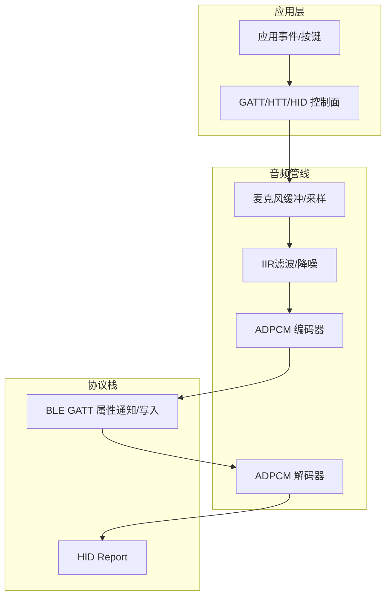
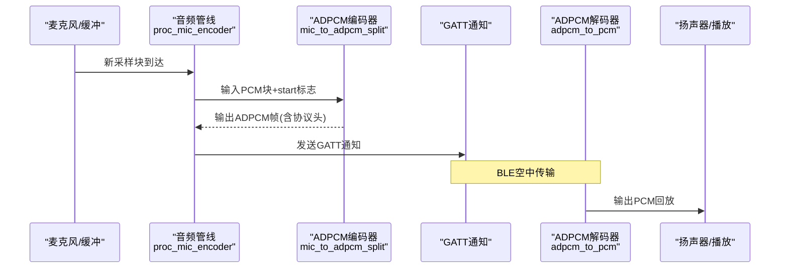
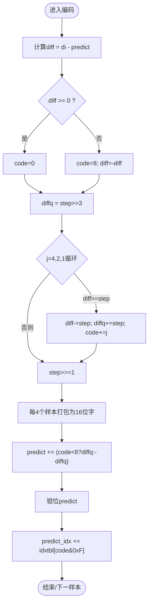
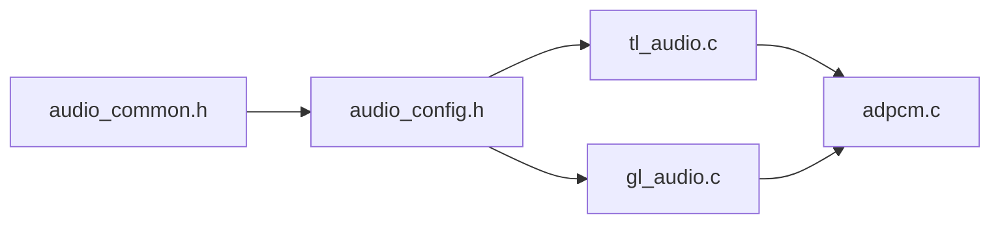

# ADPCM编解码器

<cite>
**本文引用的文件**
- [adpcm.c](file://tc_ble_single_sdk/application/audio/adpcm.c)
- [adpcm.h](file://tc_ble_single_sdk/application/audio/adpcm.h)
- [tl_audio.c](file://tc_ble_single_sdk/application/audio/tl_audio.c)
- [tl_audio.h](file://tc_ble_single_sdk/application/audio/tl_audio.h)
- [gl_audio.c](file://tc_ble_single_sdk/application/audio/gl_audio.c)
- [gl_audio.h](file://tc_ble_single_sdk/application/audio/gl_audio.h)
- [audio_config.h](file://tc_ble_single_sdk/application/audio/audio_config.h)
- [audio_common.h](file://tc_ble_single_sdk/application/audio/audio_common.h)
</cite>

## 目录
1. [简介](#简介)
2. [项目结构](#项目结构)
3. [核心组件](#核心组件)
4. [架构总览](#架构总览)
5. [详细组件分析](#详细组件分析)
6. [依赖关系分析](#依赖关系分析)
7. [性能与延迟特性](#性能与延迟特性)
8. [故障排查指南](#故障排查指南)
9. [结论](#结论)
10. [附录：参数配置与优化建议](#附录参数配置与优化建议)

## 简介
本技术文档围绕仓库中的ADPCM编解码实现，系统性阐述其数学原理（预测编码、差分量化、步长调整）、不同协议模式下的封装与传输（Telink GATT、Google、HID服务通道），以及压缩比、音质评估、延迟特性、参数配置与性能优化方法。同时给出与协议栈的适配要点和兼容性注意事项，帮助读者在嵌入式BLE音频链路中正确集成与调优。

## 项目结构
该SDK将音频处理分为三层：
- 算法层：ADPCM编解码核心（adpcm.c/h）
- 音频管线层：采集缓冲、IIR滤波/降噪、编码器调度（tl_audio.c/h）
- 协议适配层：GATT/HTT/HID控制面与数据面（gl_audio.c/h）
- 配置层：各模式包长、采样块大小、缓冲区尺寸等（audio_config.h、audio_common.h）

图表来源
- [tl_audio.c:323-418](file://tc_ble_single_sdk/application/audio/tl_audio.c#L323-L418)
- [adpcm.c:53-126](file://tc_ble_single_sdk/application/audio/adpcm.c#L53-L126)
- [gl_audio.c:60-181](file://tc_ble_single_sdk/application/audio/gl_audio.c#L60-L181)

章节来源
- [audio_common.h:27-79](file://tc_ble_single_sdk/application/audio/audio_common.h#L27-L79)
- [audio_config.h:32-107](file://tc_ble_single_sdk/application/audio/audio_config.h#L32-L107)

## 核心组件
- ADPCM编解码核心
  - 编码器：mic_to_adpcm_split 完成预测、差分量化、步长索引更新，输出按协议打包的ADPCM帧
  - 解码器：adpcm_to_pcm 从ADPCM码流恢复PCM样本，维护预测值与步长索引
- 音频管线
  - 采集与缓冲：周期性读取麦克风缓冲，按单位长度送入编码器
  - 预处理：可选IIR均衡/低通滤波、噪声抑制
  - 调度：proc_mic_encoder 根据模式调用对应编码器并管理包队列
- 协议适配
  - Google GATT：支持v0.4/v1.0两种帧格式，包含序列号、预测状态、版本协商与控制命令
  - Telink GATT：自定义头部（预测值、预测索引、负载长度）
  - HID服务通道：纯音频载荷或带简单头部的HID报告

章节来源
- [adpcm.h:27-44](file://tc_ble_single_sdk/application/audio/adpcm.h#L27-L44)
- [tl_audio.c:323-418](file://tc_ble_single_sdk/application/audio/tl_audio.c#L323-L418)
- [gl_audio.c:30-181](file://tc_ble_single_sdk/application/audio/gl_audio.c#L30-L181)

## 架构总览
下图展示RCU端ADPCM编码到GATT通知发送的关键流程，以及Dongle端接收后解码回放的流程。

图表来源
- [tl_audio.c:651-733](file://tc_ble_single_sdk/application/audio/tl_audio.c#L651-L733)
- [adpcm.c:53-126](file://tc_ble_single_sdk/application/audio/adpcm.c#L53-L126)
- [adpcm.c:289-361](file://tc_ble_single_sdk/application/audio/adpcm.c#L289-L361)

## 详细组件分析

### ADPCM算法与实现细节
- 预测编码
  - 使用上一时刻预测值predict作为基线，计算当前样本di与predict的差值diff
  - 解码侧通过相同规则重建predict
- 差分量化
  - 基于自适应步长表steptbl[predict_idx]进行量化
  - 将diff与step比较，逐位生成4bit量化码code[3..0]，符号位由diff正负决定
  - 量化后的diffq用于重建预测值
- 步长调整机制
  - 根据量化码查idxtbl更新predict_idx，限制在[0,88]范围
  - 步长表steptbl提供33级步进，覆盖小信号到大信号的动态范围
- 字节序与打包
  - 编码器每4个样本打包为1个16位字，低位在前或按协议要求交换
  - Google v1.0对每字进行半字节交换以兼容Android 8+
- 溢出保护
  - predict在[-32768, 32767]范围内钳位，避免溢出

图表来源
- [adpcm.c:74-126](file://tc_ble_single_sdk/application/audio/adpcm.c#L74-L126)
- [adpcm.c:304-361](file://tc_ble_single_sdk/application/audio/adpcm.c#L304-L361)

章节来源
- [adpcm.c:32-42](file://tc_ble_single_sdk/application/audio/adpcm.c#L32-L42)
- [adpcm.c:53-126](file://tc_ble_single_sdk/application/audio/adpcm.c#L53-L126)
- [adpcm.c:289-361](file://tc_ble_single_sdk/application/audio/adpcm.c#L289-L361)

### 不同模式下的编解码实现

#### Telink GATT模式（RCU/Dongle）
- 帧格式
  - RCU端：前2字节为predict，第3字节低8位为predict_idx，第4字节为负载长度，其后为ADPCM数据
  - Dongle端：解码时从相同位置解析predict/predict_idx，随后解出PCM
- 特点
  - 简洁高效，适合私有GATT服务
  - 无额外序列号，依赖连接可靠性

章节来源
- [adpcm.c:53-126](file://tc_ble_single_sdk/application/audio/adpcm.c#L53-L126)
- [adpcm.c:289-361](file://tc_ble_single_sdk/application/audio/adpcm.c#L289-L361)

#### Google模式（RCU/Dongle）
- 帧格式
  - v0.4：包含序列号、Android ID、预测值与索引等头部字段
  - v1.0：仅音频数据，无头部；解码侧根据版本选择解析路径
- 控制面
  - 能力协商、开启/关闭、扩展心跳、超时处理
  - 支持多种交互模型：On-Request、PTT、HTT
- 特点
  - 与Android语音助手生态兼容
  - 需要严格时序与超时管理

章节来源
- [adpcm.c:128-208](file://tc_ble_single_sdk/application/audio/adpcm.c#L128-L208)
- [adpcm.c:364-440](file://tc_ble_single_sdk/application/audio/adpcm.c#L364-L440)
- [gl_audio.c:60-181](file://tc_ble_single_sdk/application/audio/gl_audio.c#L60-L181)
- [gl_audio.c:213-355](file://tc_ble_single_sdk/application/audio/gl_audio.c#L213-L355)
- [gl_audio.h:31-149](file://tc_ble_single_sdk/application/audio/gl_audio.h#L31-L149)

#### HID服务通道模式（RCU/Dongle）
- 帧格式
  - 通常直接承载ADPCM数据于HID报告中，部分实现保留少量头部
- 特点
  - 通用性强，适用于非Google生态设备
  - 需关注HID报告大小与分片策略

章节来源
- [adpcm.c:210-280](file://tc_ble_single_sdk/application/audio/adpcm.c#L210-L280)
- [adpcm.c:442-513](file://tc_ble_single_sdk/application/audio/adpcm.c#L442-L513)

### 音频管线与缓冲管理
- 采集与预处理
  - 周期性检查麦克风写指针，当达到单位长度时触发编码
  - 可选IIR滤波（内带均衡、外带低通）与噪声抑制
- 编码器调度
  - 根据TL_AUDIO_MODE分支调用对应proc_mic_encoder
  - 将编码结果写入环形缓冲，供上层取用发送
- 缓冲与溢出保护
  - 使用写/读指针与掩码实现环形缓冲
  - 当编码积压超过阈值时丢弃旧包，保证实时性

章节来源
- [tl_audio.c:323-418](file://tc_ble_single_sdk/application/audio/tl_audio.c#L323-L418)
- [tl_audio.c:651-733](file://tc_ble_single_sdk/application/audio/tl_audio.c#L651-L733)
- [tl_audio.h:61-63](file://tc_ble_single_sdk/application/audio/tl_audio.h#L61-L63)

## 依赖关系分析
- 编译期模式选择
  - audio_common.h定义各类TL_AUDIO_MODE组合（RCU/DONGLE、ADPCM/SBC/MSBC、GATT/HID通道）
  - audio_config.h根据模式定义ADPCM_PACKET_LEN、TL_MIC_ADPCM_UNIT_SIZE、TL_MIC_BUFFER_SIZE等关键参数
- 运行时依赖
  - tl_audio.c依赖adpcm.c提供的编解码接口
  - gl_audio.c在Google模式下负责控制面消息处理与超时管理
  - 所有模块均依赖tl_common与drivers基础库

图表来源
- [audio_common.h:27-79](file://tc_ble_single_sdk/application/audio/audio_common.h#L27-L79)
- [audio_config.h:32-107](file://tc_ble_single_sdk/application/audio/audio_config.h#L32-L107)
- [tl_audio.c:24-29](file://tc_ble_single_sdk/application/audio/tl_audio.c#L24-L29)
- [gl_audio.c:24-28](file://tc_ble_single_sdk/application/audio/gl_audio.c#L24-L28)

章节来源
- [audio_common.h:27-79](file://tc_ble_single_sdk/application/audio/audio_common.h#L27-L79)
- [audio_config.h:32-107](file://tc_ble_single_sdk/application/audio/audio_config.h#L32-L107)

## 性能与延迟特性
- 压缩比
  - 典型配置：16kHz 16bit PCM → ADPCM 4bit/样本
  - 理论压缩比约4:1；实际因协议头略有差异
  - 示例：
    - Telink GATT：128B帧中约124B为ADPCM负载，压缩比接近4:1
    - Google v0.4：136B帧含头部，有效负载仍约为4:1
    - Google v1.0：120B纯音频帧，压缩比最优
- 音质评估
  - ADPCM在语音频段表现良好，可接受轻微量化噪声
  - IIR均衡与低通滤波可改善听感与抗噪
  - 噪声抑制可在安静场景降低底噪
- 延迟特性
  - 单帧处理延迟：取决于TL_MIC_ADPCM_UNIT_SIZE与采样率
    - 例如240样本@16kHz ≈ 15ms
  - 传输与缓冲：GATT通知频率与BLE连接间隔影响端到端延迟
  - 解码侧：adpcm_to_pcm为顺序处理，延迟近似一帧时间
- 功耗与CPU占用
  - 编码器/解码器均为轻量级整数运算，适合MCU
  - 合理设置缓冲与帧长可降低中断与上下文切换开销

[本节为通用性能讨论，不直接分析具体代码行]

## 故障排查指南
- 无声或杂音
  - 检查predict/predict_idx初始化是否正确（各模式静态变量初始值）
  - 确认IIR滤波系数与移位量是否匹配硬件
  - 验证ADC/DMIC通道与音量增益设置
- 卡顿或丢帧
  - 增大TL_MIC_PACKET_BUFFER_NUM或减小TL_MIC_ADPCM_UNIT_SIZE
  - 检查BLE连接间隔与MTU，确保能稳定发送
  - 在Google模式下确认超时与心跳（app_audio_timeout_proc）
- 兼容性问题
  - Google v0.4与v1.0帧头不同，需确保两端版本一致
  - Android 8+需启用半字节交换逻辑（已在v1.0路径中处理）

章节来源
- [tl_audio.c:323-418](file://tc_ble_single_sdk/application/audio/tl_audio.c#L323-L418)
- [gl_audio.c:185-211](file://tc_ble_single_sdk/application/audio/gl_audio.c#L185-L211)
- [adpcm.c:128-208](file://tc_ble_single_sdk/application/audio/adpcm.c#L128-L208)

## 结论
该实现提供了完整且可配置的ADPCM编解码方案，覆盖Telink GATT、Google与HID三种主流通道。通过预测编码、自适应步长与合理的缓冲管理，实现了高压缩比与低延迟的语音传输。结合IIR滤波与噪声抑制，可在资源受限的MCU平台上获得良好的音质与稳定性。针对不同协议栈的适配与版本兼容已内置，便于快速集成与部署。

[本节为总结性内容，不直接分析具体代码行]

## 附录：参数配置与优化建议
- 模式选择
  - 通过TL_AUDIO_MODE选择RCU/DONGLE与通道类型（GATT/HID）
  - 参考audio_common.h中的宏定义组合
- 关键参数
  - ADPCM_PACKET_LEN：每帧ADPCM负载长度（含协议头）
  - TL_MIC_ADPCM_UNIT_SIZE：每次编码的PCM样本数
  - TL_MIC_BUFFER_SIZE：麦克风缓冲大小
  - TL_MIC_PACKET_BUFFER_NUM：编码包缓冲数量
- 优化建议
  - 降低TL_MIC_ADPCM_UNIT_SIZE可减少单帧延迟，但会增加协议开销
  - 增大TL_MIC_PACKET_BUFFER_NUM可缓解突发丢包，但增加内存占用
  - 启用IIR滤波与噪声抑制提升音质，但增加CPU占用
  - Google模式注意v0.4/v1.0帧头差异，确保两端一致
- 调试技巧
  - 打印predict与predict_idx变化，观察收敛情况
  - 使用示波器或逻辑分析仪抓取GATT通知，验证帧结构与长度
  - 在Google模式下监控超时与心跳，避免会话异常断开

章节来源
- [audio_common.h:27-79](file://tc_ble_single_sdk/application/audio/audio_common.h#L27-L79)
- [audio_config.h:32-107](file://tc_ble_single_sdk/application/audio/audio_config.h#L32-L107)
- [tl_audio.h:41-59](file://tc_ble_single_sdk/application/audio/tl_audio.h#L41-L59)