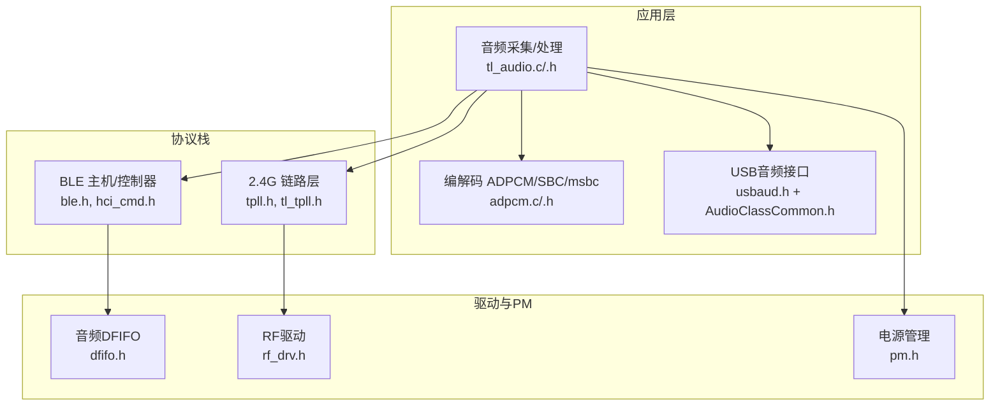
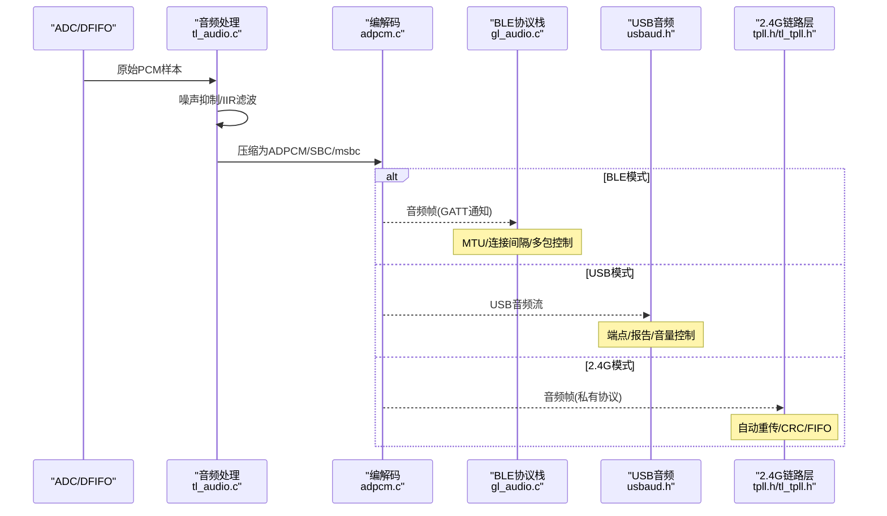
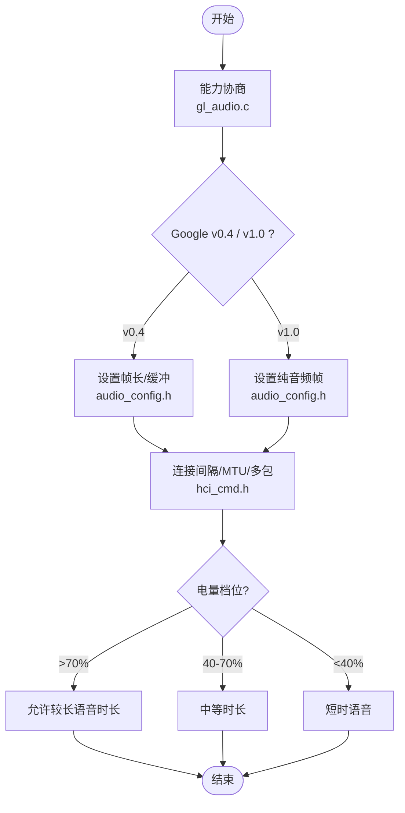
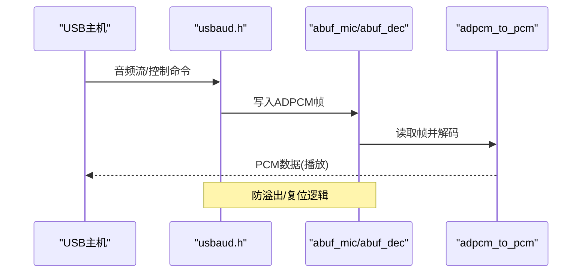
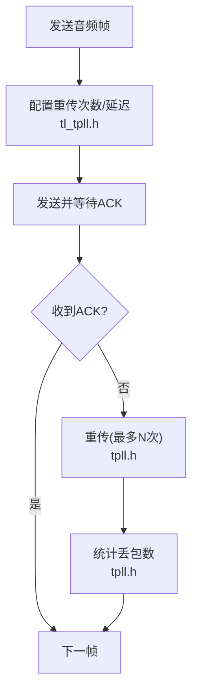
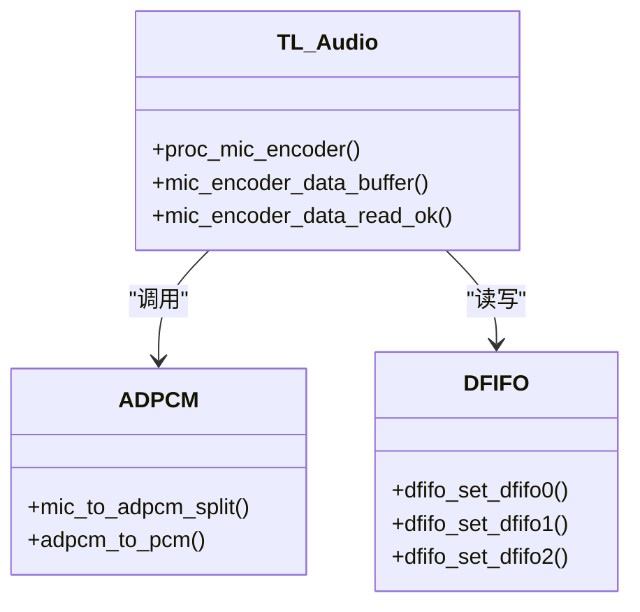
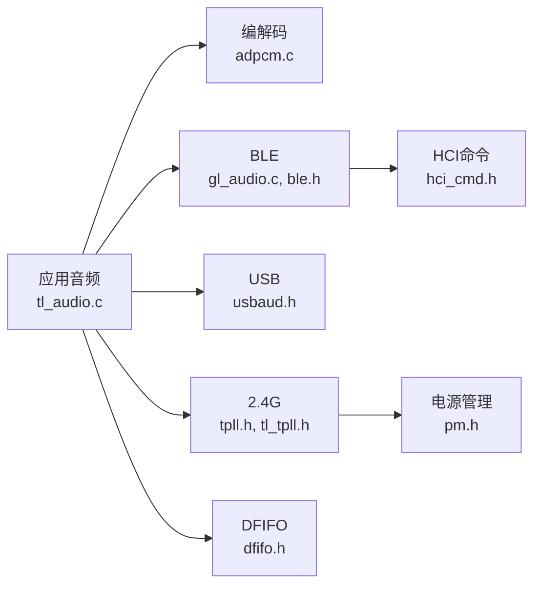

# 音频传输优化

<cite>
**本文引用的文件**
- [gl_audio.h](file://tc_ble_single_sdk/application/audio/gl_audio.h)
- [gl_audio.c](file://tc_ble_single_sdk/application/audio/gl_audio.c)
- [tl_audio.h](file://tc_ble_single_sdk/application/audio/tl_audio.h)
- [tl_audio.c](file://tc_ble_single_sdk/application/audio/tl_audio.c)
- [adpcm.h](file://tc_ble_single_sdk/application/audio/adpcm.h)
- [adpcm.c](file://tc_ble_single_sdk/application/audio/adpcm.c)
- [audio_config.h](file://tc_ble_single_sdk/application/audio/audio_config.h)
- [usbaud.h](file://tc_ble_single_sdk/application/app/usbaud.h)
- [AudioClassCommon.h](file://tc_ble_single_sdk/application/usbstd/AudioClassCommon.h)
- [ble.h](file://tc_ble_single_sdk/stack/ble/ble.h)
- [hci_cmd.h](file://tc_ble_single_sdk/stack/ble/hci/hci_cmd.h)
- [tl_tpll.h](file://tc_ble_single_sdk/stack/2p4g/tl_tpll/tl_tpll.h)
- [tpll.h](file://tc_ble_single_sdk/stack/2p4g/tpll/tpll.h)
- [rf_drv.h (B87)](file://tc_ble_single_sdk/drivers/B87/lib/include/rf_drv.h)
- [pm.h](file://tc_ble_single_sdk/drivers/B85/lib/include/pm.h)
- [dfifo.h (B85)](file://tc_ble_single_sdk/drivers/B85/dfifo.h)
- [SDK_Wiki.md](file://doc/SDK_Wiki.md)
- [README.md](file://README.md)
</cite>

## 目录
1. [简介](#简介)
2. [项目结构](#项目结构)
3. [核心组件](#核心组件)
4. [架构总览](#架构总览)
5. [详细组件分析](#详细组件分析)
6. [依赖关系分析](#依赖关系分析)
7. [性能与延迟优化](#性能与延迟优化)
8. [故障诊断与测试方法](#故障诊断与测试方法)
9. [结论](#结论)
10. [附录](#附录)

## 简介
本技术文档围绕三模（BLE、USB、2.4G）音频鼠标的音频传输优化展开，重点说明：
- 不同传输模式下的音频数据流与策略
- 自适应码率控制与QoS保障机制
- 丢包恢复、重传策略与错误纠正
- 传输延迟优化与电源管理
- 性能测试方法与故障诊断工具使用指南

该SDK在BLE模式下通过自定义服务或HID通道上报ADPCM/SBC/msbc编码的语音数据；在USB模式下以USB Audio Class设备工作，支持麦克风采集与播放；在2.4G模式下通过私有链路层进行低时延音频传输。系统提供噪声抑制、IIR滤波、缓冲管理与CRC校验等能力，并具备完善的低功耗睡眠唤醒机制。

## 项目结构
- 应用层音频模块：负责ADC采样、编解码（ADPCM/SBC/msbc）、缓冲、音量控制、噪声抑制与IIR滤波
- BLE协议栈：连接参数、MTU协商、通知/指示上报、超时处理
- USB音频类：枚举为AI Office Mic，支持音频流收发与控制命令
- 2.4G链路层：自动重传、丢包计数、FIFO状态查询、CRC校验
- 驱动与PM：DFIFO、RF、电源管理（suspend/deep sleep/长睡眠）、唤醒源配置

**图示来源**
- [tl_audio.c:732-778](file://tc_ble_single_sdk/application/audio/tl_audio.c#L732-L778)
- [adpcm.c:63-256](file://tc_ble_single_sdk/application/audio/adpcm.c#L63-L256)
- [usbaud.h:55-113](file://tc_ble_single_sdk/application/app/usbaud.h#L55-L113)
- [ble.h:28-44](file://tc_ble_single_sdk/stack/ble/ble.h#L28-L44)
- [tpll.h:202-235](file://tc_ble_single_sdk/stack/2p4g/tpll/tpll.h#L202-L235)
- [tl_tpll.h:315-355](file://tc_ble_single_sdk/stack/2p4g/tl_tpll/tl_tpll.h#L315-L355)
- [dfifo.h:40-84](file://tc_ble_single_sdk/drivers/B85/dfifo.h#L40-L84)
- [rf_drv.h (B87):1461-1500](file://tc_ble_single_sdk/drivers/B87/lib/include/rf_drv.h#L1461-L1500)
- [pm.h:376-410](file://tc_ble_single_sdk/drivers/B85/lib/include/pm.h#L376-L410)

**章节来源**
- [README.md:1-231](file://README.md#L1-L231)

## 核心组件
- 音频采集与处理：ADC采样进入DFIFO，经噪声抑制与可选IIR滤波后送入编码器
- 编解码器：ADPCM为主，支持SBC/msbc；按模式与协议版本选择帧长度与缓冲大小
- BLE音频：通过GATT特性上报，支持Google语音协议与TLINK自定义方案，含超时与多包控制
- USB音频：实现USB Audio Class，支持麦克风输入与扬声器输出，带音量与静音控制
- 2.4G音频：基于TPLL/TPLLC链路层，支持自动重传、丢包统计、CRC校验与FIFO状态检测
- 电源管理：支持多种睡眠模式与唤醒源，可在空闲或等待时降低功耗

**章节来源**
- [tl_audio.h:32-127](file://tc_ble_single_sdk/application/audio/tl_audio.h#L32-L127)
- [adpcm.h:27-44](file://tc_ble_single_sdk/application/audio/adpcm.h#L27-L44)
- [gl_audio.h:29-151](file://tc_ble_single_sdk/application/audio/gl_audio.h#L29-L151)
- [usbaud.h:55-113](file://tc_ble_single_sdk/application/app/usbaud.h#L55-L113)
- [tpll.h:202-235](file://tc_ble_single_sdk/stack/2p4g/tpll/tpll.h#L202-L235)
- [pm.h:376-410](file://tc_ble_single_sdk/drivers/B85/lib/include/pm.h#L376-L410)

## 架构总览
下图展示从麦克风采集到三种传输路径的数据流，以及关键优化点（缓冲、编码、重传、QoS）。

**图示来源**
- [tl_audio.c:732-778](file://tc_ble_single_sdk/application/audio/tl_audio.c#L732-L778)
- [adpcm.c:63-256](file://tc_ble_single_sdk/application/audio/adpcm.c#L63-L256)
- [gl_audio.c:307-361](file://tc_ble_single_sdk/application/audio/gl_audio.c#L307-L361)
- [usbaud.h:55-113](file://tc_ble_single_sdk/application/app/usbaud.h#L55-L113)
- [tpll.h:202-235](file://tc_ble_single_sdk/stack/2p4g/tpll/tpll.h#L202-L235)
- [tl_tpll.h:315-355](file://tc_ble_single_sdk/stack/2p4g/tl_tpll/tl_tpll.h#L315-L355)

## 详细组件分析

### BLE音频传输与自适应码率
- 能力协商与协议版本：支持Google语音协议v0.4/v1.0，根据版本设置帧长度与缓冲
- 多包与超时：启用多包传输标志，设置打开/关闭/扩展命令的超时时间
- 连接参数与QoS：通过连接间隔调整端到端延迟，结合MTU与多包控制提升吞吐
- 自适应策略：依据电量与网络状况动态调整语音时长限制与上报频率

**图示来源**
- [gl_audio.c:307-361](file://tc_ble_single_sdk/application/audio/gl_audio.c#L307-L361)
- [audio_config.h:32-74](file://tc_ble_single_sdk/application/audio/audio_config.h#L32-L74)
- [hci_cmd.h:471-498](file://tc_ble_single_sdk/stack/ble/hci/hci_cmd.h#L471-L498)
- [README.md:155-167](file://README.md#L155-L167)

**章节来源**
- [gl_audio.h:29-151](file://tc_ble_single_sdk/application/audio/gl_audio.h#L29-L151)
- [gl_audio.c:307-361](file://tc_ble_single_sdk/application/audio/gl_audio.c#L307-L361)
- [audio_config.h:32-74](file://tc_ble_single_sdk/application/audio/audio_config.h#L32-L74)
- [hci_cmd.h:471-498](file://tc_ble_single_sdk/stack/ble/hci/hci_cmd.h#L471-L498)
- [README.md:155-167](file://README.md#L155-L167)

### USB音频流与缓冲管理
- 设备枚举：实现USB Audio Class，支持麦克风输入与扬声器输出
- 缓冲与解码：接收到的ADPCM帧写入环形缓冲，定时解码为PCM供播放
- 控制命令：音量调节、静音控制、播放/暂停等

**图示来源**
- [usbaud.h:55-113](file://tc_ble_single_sdk/application/app/usbaud.h#L55-L113)
- [tl_audio.c:876-946](file://tc_ble_single_sdk/application/audio/tl_audio.c#L876-L946)
- [adpcm.c:63-256](file://tc_ble_single_sdk/application/audio/adpcm.c#L63-L256)

**章节来源**
- [usbaud.h:55-113](file://tc_ble_single_sdk/application/app/usbaud.h#L55-L113)
- [tl_audio.c:876-946](file://tc_ble_single_sdk/application/audio/tl_audio.c#L876-L946)
- [AudioClassCommon.h:59-88](file://tc_ble_single_sdk/application/usbstd/AudioClassCommon.h#L59-L88)

### 2.4G链路层与丢包恢复
- 自动重传：可配置重传次数与重试延迟，提高可靠性
- 丢包统计：获取丢包计数器，用于评估链路质量
- CRC校验：接收端校验CRC有效性，丢弃无效包
- FIFO状态：检查TX FIFO空/满，避免溢出与阻塞

**图示来源**
- [tl_tpll.h:315-355](file://tc_ble_single_sdk/stack/2p4g/tl_tpll/tl_tpll.h#L315-L355)
- [tpll.h:202-235](file://tc_ble_single_sdk/stack/2p4g/tpll/tpll.h#L202-L235)
- [tpll.h:444-479](file://tc_ble_single_sdk/stack/2p4g/tpll/tpll.h#L444-L479)

**章节来源**
- [tl_tpll.h:315-355](file://tc_ble_single_sdk/stack/2p4g/tl_tpll/tl_tpll.h#L315-L355)
- [tpll.h:202-235](file://tc_ble_single_sdk/stack/2p4g/tpll/tpll.h#L202-L235)
- [tpll.h:444-479](file://tc_ble_single_sdk/stack/2p4g/tpll/tpll.h#L444-L479)

### 音频处理流水线与缓冲
- DFIFO：将ADC数据直接送入硬件FIFO，减少CPU干预
- 噪声抑制：基于短/长期能量估计的动态增益控制
- IIR滤波：可选带外噪声抑制与降采样
- 缓冲管理：环形缓冲与读/写指针，防止溢出与欠载

**图示来源**
- [tl_audio.c:732-778](file://tc_ble_single_sdk/application/audio/tl_audio.c#L732-L778)
- [adpcm.c:63-256](file://tc_ble_single_sdk/application/audio/adpcm.c#L63-L256)
- [dfifo.h:40-84](file://tc_ble_single_sdk/drivers/B85/dfifo.h#L40-L84)

**章节来源**
- [tl_audio.h:32-127](file://tc_ble_single_sdk/application/audio/tl_audio.h#L32-L127)
- [tl_audio.c:732-778](file://tc_ble_single_sdk/application/audio/tl_audio.c#L732-L778)
- [adpcm.c:63-256](file://tc_ble_single_sdk/application/audio/adpcm.c#L63-L256)
- [dfifo.h:40-84](file://tc_ble_single_sdk/drivers/B85/dfifo.h#L40-L84)

## 依赖关系分析
- 应用层依赖编解码与缓冲管理，向上对接BLE/USB/2.4G传输
- BLE依赖协议栈与HCI命令，控制连接参数与MTU
- 2.4G依赖链路层API进行重传与状态查询
- 驱动层提供DFIFO、RF与PM能力，支撑实时性与低功耗

**图示来源**
- [tl_audio.c:732-778](file://tc_ble_single_sdk/application/audio/tl_audio.c#L732-L778)
- [adpcm.c:63-256](file://tc_ble_single_sdk/application/audio/adpcm.c#L63-L256)
- [gl_audio.c:307-361](file://tc_ble_single_sdk/application/audio/gl_audio.c#L307-L361)
- [usbaud.h:55-113](file://tc_ble_single_sdk/application/app/usbaud.h#L55-L113)
- [tpll.h:202-235](file://tc_ble_single_sdk/stack/2p4g/tpll/tpll.h#L202-L235)
- [tl_tpll.h:315-355](file://tc_ble_single_sdk/stack/2p4g/tl_tpll/tl_tpll.h#L315-L355)
- [hci_cmd.h:471-498](file://tc_ble_single_sdk/stack/ble/hci/hci_cmd.h#L471-L498)
- [pm.h:376-410](file://tc_ble_single_sdk/drivers/B85/lib/include/pm.h#L376-L410)
- [dfifo.h:40-84](file://tc_ble_single_sdk/drivers/B85/dfifo.h#L40-L84)

**章节来源**
- [ble.h:28-44](file://tc_ble_single_sdk/stack/ble/ble.h#L28-L44)
- [hci_cmd.h:471-498](file://tc_ble_single_sdk/stack/ble/hci/hci_cmd.h#L471-L498)

## 性能与延迟优化
- 连接间隔与MTU：缩短BLE连接间隔可降低端到端延迟；增大MTU与启用多包提升吞吐
- 缓冲深度：合理设置MIC缓冲与解码缓冲，避免溢出与欠载
- 自动重传与CRC：2.4G模式下配置重传次数与延迟，结合CRC校验保证可靠性
- 噪声抑制与IIR：降低底噪，提高信噪比，间接改善感知质量
- 电源管理：在空闲时段进入suspend/deep sleep，利用定时器/PAD唤醒，降低功耗

**章节来源**
- [hci_cmd.h:471-498](file://tc_ble_single_sdk/stack/ble/hci/hci_cmd.h#L471-L498)
- [tpll.h:202-235](file://tc_ble_single_sdk/stack/2p4g/tpll/tpll.h#L202-L235)
- [tl_tpll.h:315-355](file://tc_ble_single_sdk/stack/2p4g/tl_tpll/tl_tpll.h#L315-L355)
- [tl_audio.h:32-127](file://tc_ble_single_sdk/application/audio/tl_audio.h#L32-L127)
- [pm.h:376-410](file://tc_ble_single_sdk/drivers/B85/lib/include/pm.h#L376-L410)

## 故障诊断与测试方法
- 丢包统计：通过链路层丢包计数器评估2.4G链路质量，必要时调整重传策略
- CRC校验：检查接收包CRC有效性，定位物理层干扰或时序问题
- FIFO状态：监控TX/RX FIFO空/满状态，避免拥塞导致的丢包
- USB调试：通过USB音频类控制命令验证音量、静音与流控制
- 功耗测量：结合PM接口记录睡眠/唤醒事件，评估功耗曲线
- 参考文档：SDK Wiki中关于Flash保护与PM功耗管理的说明

**章节来源**
- [tpll.h:202-235](file://tc_ble_single_sdk/stack/2p4g/tpll/tpll.h#L202-L235)
- [tpll.h:444-479](file://tc_ble_single_sdk/stack/2p4g/tpll/tpll.h#L444-L479)
- [tl_tpll.h:315-355](file://tc_ble_single_sdk/stack/2p4g/tl_tpll/tl_tpll.h#L315-L355)
- [usbaud.h:55-113](file://tc_ble_single_sdk/application/app/usbaud.h#L55-L113)
- [pm.h:376-410](file://tc_ble_single_sdk/drivers/B85/lib/include/pm.h#L376-L410)
- [SDK_Wiki.md:666-693](file://doc/SDK_Wiki.md#L666-L693)

## 结论
该SDK在三模音频传输上提供了完整的处理链路与优化手段：
- BLE模式通过能力协商、连接参数与多包控制实现灵活的质量/延迟权衡
- USB模式以标准音频类设备实现稳定可靠的音频流与控制
- 2.4G模式借助自动重传、CRC与FIFO状态管理保障低时延高可靠传输
- 电源管理支持多种睡眠模式与唤醒源，满足低功耗场景需求
建议在实际产品中结合环境噪声、电池容量与用户体验目标，综合调优编码参数、缓冲深度、连接间隔与重传策略，以获得最佳的综合表现。

## 附录
- 配置要点：根据模式选择正确的音频帧长度与缓冲大小（audio_config.h）
- 调试技巧：利用USB打印与链路层计数器定位问题
- 安全与稳定性：确保RF引脚与天线选择正确，避免干扰（rf_drv.h）

**章节来源**
- [audio_config.h:32-123](file://tc_ble_single_sdk/application/audio/audio_config.h#L32-L123)
- [rf_drv.h (B87):97-132](file://tc_ble_single_sdk/drivers/B87/lib/include/rf_drv.h#L97-L132)