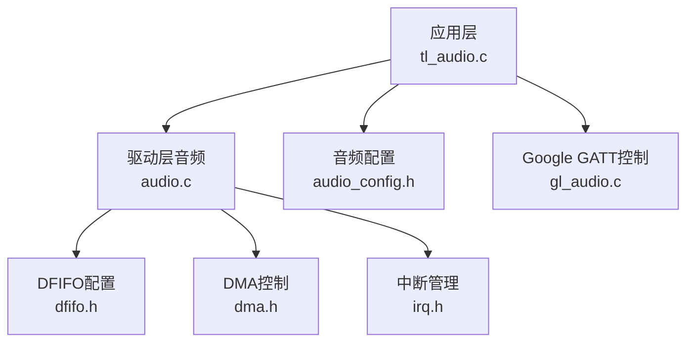
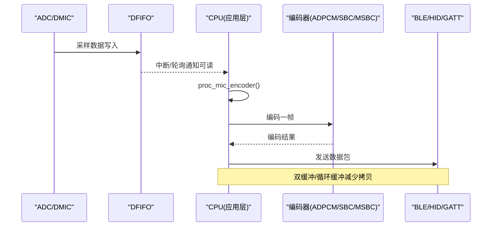
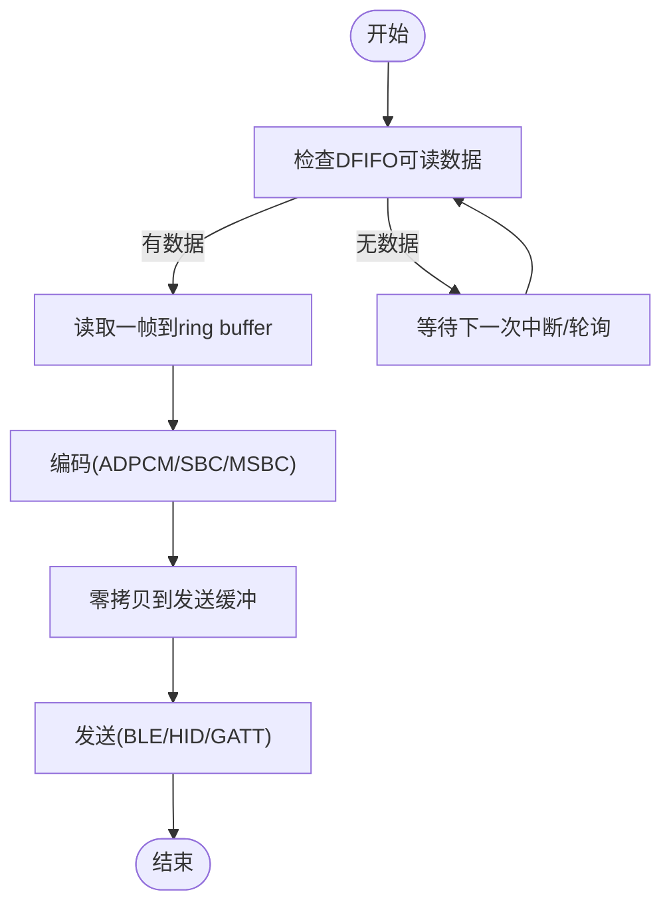
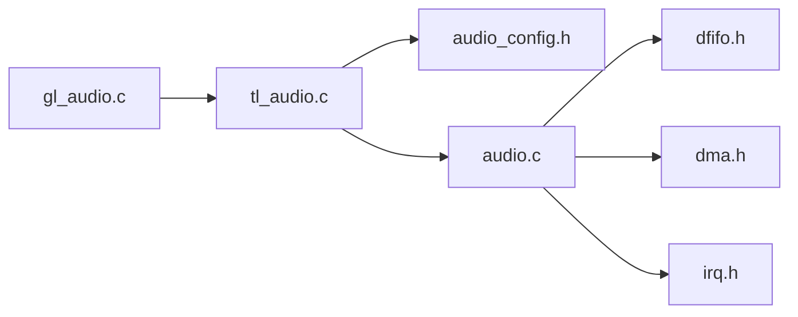

# 实时处理优化

<cite>
**本文引用的文件**
- [tl_audio.c](file://tc_ble_single_sdk/application/audio/tl_audio.c)
- [gl_audio.c](file://tc_ble_single_sdk/application/audio/gl_audio.c)
- [audio_config.h](file://tc_ble_single_sdk/application/audio/audio_config.h)
- [tl_audio.h](file://tc_ble_single_sdk/application/audio/tl_audio.h)
- [audio.c](file://tc_ble_single_sdk/drivers/B85/audio.c)
- [dfifo.h](file://tc_ble_single_sdk/drivers/B85/dfifo.h)
- [dma.h](file://tc_ble_single_sdk/drivers/B85/dma.h)
- [irq.h](file://tc_ble_single_sdk/drivers/B85/irq.h)
</cite>

## 目录
1. [简介](#简介)
2. [项目结构](#项目结构)
3. [核心组件](#核心组件)
4. [架构总览](#架构总览)
5. [详细组件分析](#详细组件分析)
6. [依赖关系分析](#依赖关系分析)
7. [性能考量](#性能考量)
8. [故障排查指南](#故障排查指南)
9. [结论](#结论)
10. [附录](#附录)

## 简介
本技术文档面向实时音频处理优化，围绕DMA传输、中断处理、实时调度与任务优先级、资源竞争、音频流水线并行与指令级优化、功耗与电池寿命、以及多硬件平台适配展开。基于SDK中的B85/B87音频驱动与应用层实现，系统采用DFIFO硬件FIFO、可选双缓冲模式、编码器（ADPCM/SBC/MSBC）与BLE/HID/GATT协议栈协同工作，满足低延迟、高稳定性的语音采集与传输需求。

## 项目结构
- 应用层音频：
  - tl_audio.c：按不同TL_AUDIO_MODE提供统一的proc_mic_encoder接口，完成采样读取、降噪/IIR滤波、编码、打包与缓冲区管理。
  - gl_audio.c：Google语音GATT模型控制流程（开/关/能力协商/超时）。
  - audio_config.h：各模式的帧长、缓冲大小等关键参数集中配置。
  - tl_audio.h：噪声抑制、IIR滤波、音量设置等公共接口声明。
- 驱动层音频：
  - audio.c：AMIC/DMIC/USB/I2S输入路径初始化、时钟与滤波器配置、输出SDM/I2S/USB等。
  - dfifo.h：DFIFO通道地址/大小配置、麦克风缓冲配置。
  - dma.h：DMA通道使能/中断/尺寸配置。
  - irq.h：全局中断开关、屏蔽源、RF中断等。

图表来源
- [tl_audio.c:337-800](file://tc_ble_single_sdk/application/audio/tl_audio.c#L337-L800)
- [audio.c:92-237](file://tc_ble_single_sdk/drivers/B85/audio.c#L92-L237)
- [dfifo.h:56-112](file://tc_ble_single_sdk/drivers/B85/dfifo.h#L56-L112)
- [dma.h:97-157](file://tc_ble_single_sdk/drivers/B85/dma.h#L97-L157)
- [irq.h:33-126](file://tc_ble_single_sdk/drivers/B85/irq.h#L33-L126)

章节来源
- [tl_audio.c:337-800](file://tc_ble_single_sdk/application/audio/tl_audio.c#L337-L800)
- [audio_config.h:32-74](file://tc_ble_single_sdk/application/audio/audio_config.h#L32-L74)

## 核心组件
- 音频采集与处理流水线
  - 从ADC/DMIC/USB/I2S经DFIFO进入SRAM，应用层定时或中断触发调用proc_mic_encoder进行降噪、滤波、重采样与编码。
  - 使用环形缓冲区管理编解码数据，避免拷贝开销，支持零拷贝到上层发送。
- DMA与DFIFO
  - DFIFO作为硬件FIFO，降低CPU参与；DMA用于外设间数据传输（如RF/UART/PWM），在音频路径中配合DFIFO减少CPU负担。
- 中断与实时调度
  - 通过DFIFO中断与定时器轮询结合，保证音频帧按时处理；中断最小化临界区，提升吞吐。
- 协议与上层控制
  - Google GATT模型控制音频会话生命周期；HID/GATT/USB等通道负责编码后数据发送。

章节来源
- [tl_audio.c:337-800](file://tc_ble_single_sdk/application/audio/tl_audio.c#L337-L800)
- [gl_audio.c:60-211](file://tc_ble_single_sdk/application/audio/gl_audio.c#L60-L211)
- [audio.c:92-237](file://tc_ble_single_sdk/drivers/B85/audio.c#L92-L237)

## 架构总览
下图展示从音频采集到编码输出的整体数据流与控制流，包括DFIFO、DMA、编码器与协议栈的交互。

图表来源
- [audio.c:92-237](file://tc_ble_single_sdk/drivers/B85/audio.c#L92-L237)
- [tl_audio.c:337-800](file://tc_ble_single_sdk/application/audio/tl_audio.c#L337-L800)
- [gl_audio.c:60-211](file://tc_ble_single_sdk/application/audio/gl_audio.c#L60-L211)

## 详细组件分析

### DMA传输优化策略
- 双缓冲机制
  - 驱动层启用双缓冲模式时，DFIFO可切换输入通道，避免读写冲突，降低丢帧概率。
  - 应用层维护写指针与读指针，形成环形缓冲，确保连续编码与发送。
- 循环缓冲区
  - 使用固定大小的buffer_mic_enc与buffer_mic，通过位掩码索引实现高效环回，避免内存移动。
- 零拷贝技术
  - 编码输出直接指向发送缓冲区，上层仅获取指针并发送，减少memcpy开销。
- DMA配置
  - 通过dma_chn_enable与dma_set_buff_size配置通道与缓冲大小；DMA中断用于非音频路径的数据搬运，释放CPU。

图表来源
- [tl_audio.c:337-800](file://tc_ble_single_sdk/application/audio/tl_audio.c#L337-L800)
- [dma.h:97-157](file://tc_ble_single_sdk/drivers/B85/dma.h#L97-L157)

章节来源
- [tl_audio.c:337-800](file://tc_ble_single_sdk/application/audio/tl_audio.c#L337-L800)
- [dma.h:97-157](file://tc_ble_single_sdk/drivers/B85/dma.h#L97-L157)

### 中断处理优化
- 中断优先级设置
  - 音频相关中断（如DFIFO左通道中断）应优先于一般任务，确保帧按时处理。
- 中断延迟最小化
  - 在中断中只做必要操作（如置标志、清状态），将耗时处理移至主循环或低优先级任务。
- CPU占用率优化
  - 使用定时器轮询+中断组合，仅在数据到达时唤醒处理；关闭不必要的中断源。
- 中断管理接口
  - irq_enable/irq_disable/irq_set_mask用于全局与局部中断控制；dma_chn_irq_enable用于DMA中断。

章节来源
- [irq.h:33-126](file://tc_ble_single_sdk/drivers/B85/irq.h#L33-L126)
- [dma.h:114-157](file://tc_ble_single_sdk/drivers/B85/dma.h#L114-L157)

### 实时调度算法、任务优先级管理与资源竞争解决方案
- 调度策略
  - 音频处理周期固定（例如每20ms），通过定时器触发proc_mic_encoder，保证实时性。
- 任务优先级
  - 音频任务高于普通UI/网络任务；BLE连接事件与音频发送需协调，避免拥塞。
- 资源竞争
  - 使用互斥锁或原子操作保护共享缓冲区指针；双缓冲避免读写冲突。
  - 当编码器溢出时，丢弃旧帧或重置缓冲，防止累积延迟。

章节来源
- [tl_audio.c:337-800](file://tc_ble_single_sdk/application/audio/tl_audio.c#L337-L800)
- [gl_audio.c:185-211](file://tc_ble_single_sdk/application/audio/gl_audio.c#L185-L211)

### 音频处理流水线优化
- 流水线并行
  - 采集、编码、发送三阶段并行：DFIFO持续填充，编码器处理上一帧，发送模块传输更早帧。
- 指令级优化
  - IIR滤波函数使用_attribute_ram_code_驻留RAM执行，减少Flash访问延迟；内联函数减少调用开销。
- 降噪与滤波
  - 可选噪声抑制与IIR带通滤波，提升语音质量；参数可从Flash加载，便于调优。

章节来源
- [tl_audio.c:86-178](file://tc_ble_single_sdk/application/audio/tl_audio.c#L86-L178)
- [tl_audio.c:337-800](file://tc_ble_single_sdk/application/audio/tl_audio.c#L337-L800)

### 功耗优化与电池寿命延长
- 动态电源管理
  - 在无音频活动时关闭ADC/DFIFO时钟，降低功耗。
- 低功耗模式
  - 利用BLE空闲期进入休眠，音频任务唤醒MCU；缩短唤醒时间以减少能耗。
- 编码参数调整
  - 根据场景选择较低码率编码（如SBC/MSBC），平衡音质与功耗。

章节来源
- [audio.c:80-84](file://tc_ble_single_sdk/drivers/B85/audio.c#L80-L84)
- [audio.c:92-237](file://tc_ble_single_sdk/drivers/B85/audio.c#L92-L237)

### 不同硬件平台的优化差异与适配方法
- B85/B87差异
  - 寄存器定义与DMA通道分配略有不同；需通过条件编译适配。
- 驱动适配
  - 使用统一接口（如dfifo_set_dfifoX、dma_chn_enable）屏蔽底层差异。
- 配置参数
  - 通过audio_config.h集中管理各模式参数，便于跨平台移植。

章节来源
- [dfifo.h:56-112](file://tc_ble_single_sdk/drivers/B85/dfifo.h#L56-L112)
- [dma.h:97-157](file://tc_ble_single_sdk/drivers/B85/dma.h#L97-L157)
- [audio_config.h:32-74](file://tc_ble_single_sdk/application/audio/audio_config.h#L32-L74)

## 依赖关系分析
- 应用层依赖驱动层提供的音频初始化与缓冲配置。
- 驱动层依赖寄存器定义与中断管理。
- 协议栈依赖应用层提供的编码数据。

图表来源
- [tl_audio.c:337-800](file://tc_ble_single_sdk/application/audio/tl_audio.c#L337-L800)
- [audio.c:92-237](file://tc_ble_single_sdk/drivers/B85/audio.c#L92-L237)
- [dfifo.h:56-112](file://tc_ble_single_sdk/drivers/B85/dfifo.h#L56-L112)
- [dma.h:97-157](file://tc_ble_single_sdk/drivers/B85/dma.h#L97-L157)
- [irq.h:33-126](file://tc_ble_single_sdk/drivers/B85/irq.h#L33-L126)
- [gl_audio.c:60-211](file://tc_ble_single_sdk/application/audio/gl_audio.c#L60-L211)

章节来源
- [tl_audio.c:337-800](file://tc_ble_single_sdk/application/audio/tl_audio.c#L337-L800)
- [audio.c:92-237](file://tc_ble_single_sdk/drivers/B85/audio.c#L92-L237)

## 性能考量
- 缓冲区大小
  - 根据TL_MIC_BUFFER_SIZE与TL_MIC_PACKET_BUFFER_NUM调整，避免溢出与延迟。
- 编码复杂度
  - ADPCM适合低功耗，SBC/MSBC提供更高质量但更高CPU占用。
- 中断频率
  - 合理设置DFIFO中断阈值，平衡实时性与CPU负载。
- 指令缓存
  - 将热点代码放入RAM，减少Flash访问延迟。

[本节为通用指导，不直接分析具体文件]

## 故障排查指南
- 音频卡顿
  - 检查DFIFO是否及时清空；确认编码器是否溢出；调整缓冲区大小。
- 噪音过大
  - 启用噪声抑制与IIR滤波；校准PGA增益。
- 连接断开
  - 检查BLE超时处理；确认Google GATT回调是否正确响应。
- 功耗异常
  - 确认ADC/DFIFO在非使用时段已关闭；检查中断是否频繁唤醒。

章节来源
- [gl_audio.c:185-211](file://tc_ble_single_sdk/application/audio/gl_audio.c#L185-L211)
- [tl_audio.c:86-178](file://tc_ble_single_sdk/application/audio/tl_audio.c#L86-L178)
- [audio.c:80-84](file://tc_ble_single_sdk/drivers/B85/audio.c#L80-L84)

## 结论
本SDK通过DFIFO硬件FIFO、DMA传输、双缓冲与循环缓冲区、以及高效的编码器与协议栈集成，实现了低延迟、高稳定的实时音频处理。通过合理的调度策略、中断优化与功耗管理，可在不同硬件平台上获得良好性能。建议根据实际场景调整缓冲区大小、编码参数与中断阈值，以达到最佳平衡。

[本节为总结，不直接分析具体文件]

## 附录
- 关键配置项
  - TL_MIC_BUFFER_SIZE：音频采样缓冲大小。
  - TL_MIC_PACKET_BUFFER_NUM：编码包缓冲数量。
  - ADPCM_PACKET_LEN/MIC_SHORT_DEC_SIZE：编码帧长度与解码块大小。
- 常用接口
  - proc_mic_encoder：音频处理入口。
  - mic_encoder_data_buffer：获取编码数据指针。
  - audio_amic_init/audio_dmic_init：音频输入初始化。
  - dfifo_set_dfifoX：DFIFO缓冲配置。
  - dma_chn_enable/dma_set_buff_size：DMA通道配置。

章节来源
- [audio_config.h:32-74](file://tc_ble_single_sdk/application/audio/audio_config.h#L32-L74)
- [tl_audio.h:112-118](file://tc_ble_single_sdk/application/audio/tl_audio.h#L112-L118)
- [audio.c:92-237](file://tc_ble_single_sdk/drivers/B85/audio.c#L92-L237)
- [dfifo.h:56-112](file://tc_ble_single_sdk/drivers/B85/dfifo.h#L56-L112)
- [dma.h:97-157](file://tc_ble_single_sdk/drivers/B85/dma.h#L97-L157)