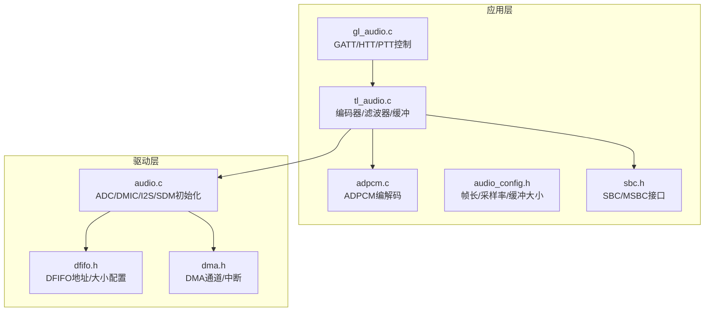
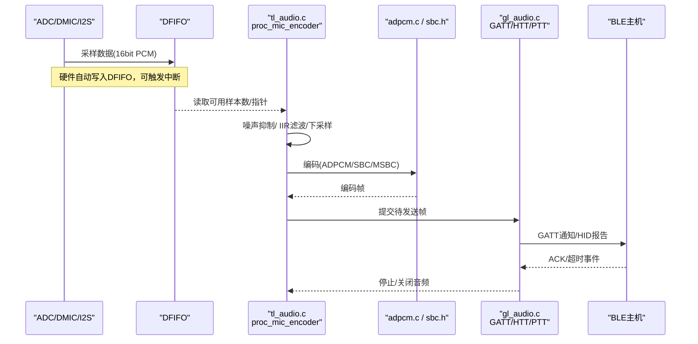
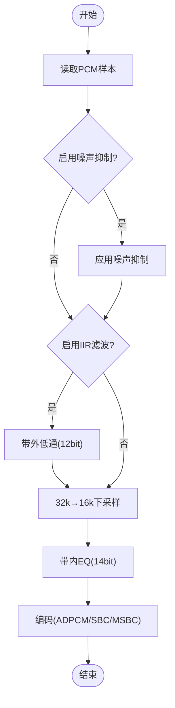
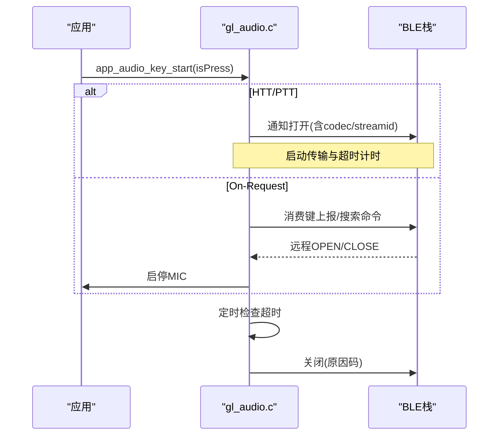
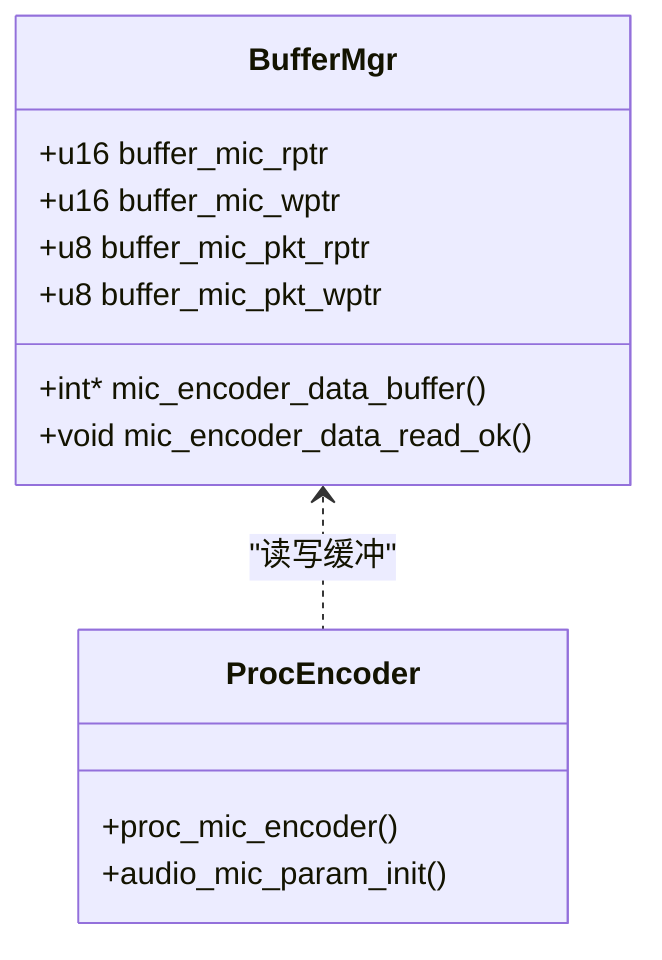
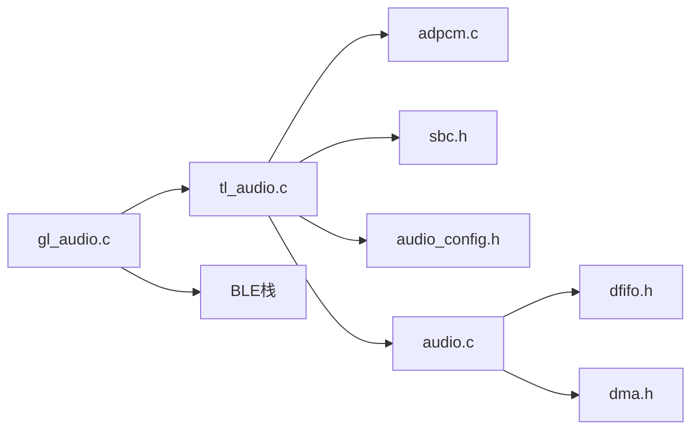

# 音频处理流水线

<cite>
**本文引用的文件**
- [tl_audio.c](file://tc_ble_single_sdk/application/audio/tl_audio.c)
- [tl_audio.h](file://tc_ble_single_sdk/application/audio/tl_audio.h)
- [gl_audio.c](file://tc_ble_single_sdk/application/audio/gl_audio.c)
- [gl_audio.h](file://tc_ble_single_sdk/application/audio/gl_audio.h)
- [adpcm.c](file://tc_ble_single_sdk/application/audio/adpcm.c)
- [audio_config.h](file://tc_ble_single_sdk/application/audio/audio_config.h)
- [sbc.h](file://tc_ble_single_sdk/application/audio/sbc.h)
- [audio.c](file://tc_ble_single_sdk/drivers/B85/audio.c)
- [dma.h](file://tc_ble_single_sdk/drivers/B85/dma.h)
- [dfifo.h](file://tc_ble_single_sdk/drivers/B85/dfifo.h)
</cite>

## 目录
1. [简介](#简介)
2. [项目结构](#项目结构)
3. [核心组件](#核心组件)
4. [架构总览](#架构总览)
5. [详细组件分析](#详细组件分析)
6. [依赖关系分析](#依赖关系分析)
7. [性能考虑](#性能考虑)
8. [故障排查指南](#故障排查指南)
9. [结论](#结论)
10. [附录](#附录)

## 简介
本文件面向“从采集到传输”的完整音频处理流水线，覆盖数据流与缓冲区调度、音频质量控制（噪声抑制、滤波、音量自适应）、实时优化（DMA/中断、双缓冲）、延迟分析与优化方法、多任务协调与资源管理，以及质量测试与性能监控实践。内容基于仓库中的驱动与应用层代码进行系统化梳理，帮助读者在不深入源码细节的前提下理解整体设计与关键实现点。

## 项目结构
该SDK将音频相关代码分为应用层与驱动层：
- 应用层（application/audio）：封装不同协议栈（HID/GATT/Google）下的音频流程控制、编码选择（ADPCM/SBC/MSBC）、噪声抑制与IIR滤波、缓冲区管理与发送策略。
- 驱动层（drivers/B85）：提供ADC/DMIC/I2S等输入路径、DFIFO硬件FIFO配置、SDM输出、DMA通道控制、中断使能等底层能力。

图表来源
- [tl_audio.c:323-823](file://tc_ble_single_sdk/application/audio/tl_audio.c#L323-L823)
- [adpcm.c:49-285](file://tc_ble_single_sdk/application/audio/adpcm.c#L49-L285)
- [gl_audio.c:30-356](file://tc_ble_single_sdk/application/audio/gl_audio.c#L30-L356)
- [audio_config.h:32-120](file://tc_ble_single_sdk/application/audio/audio_config.h#L32-L120)
- [sbc.h:44-55](file://tc_ble_single_sdk/application/audio/sbc.h#L44-L55)
- [audio.c:92-405](file://tc_ble_single_sdk/drivers/B85/audio.c#L92-L405)
- [dfifo.h:56-112](file://tc_ble_single_sdk/drivers/B85/dfifo.h#L56-L112)
- [dma.h:66-157](file://tc_ble_single_sdk/drivers/B85/dma.h#L66-L157)

章节来源
- [tl_audio.c:323-823](file://tc_ble_single_sdk/application/audio/tl_audio.c#L323-L823)
- [audio.c:92-405](file://tc_ble_single_sdk/drivers/B85/audio.c#L92-L405)

## 核心组件
- 音频采集与输入路径：AMIC/DMIC/I2S/USB输入，经CIC/ALC/HF/LF滤波后进入DFIFO。
- 实时处理：可选噪声抑制、IIR均衡/低通、下采样（32k→16k）。
- 编码：ADPCM（含Google/Telink变体）、SBC/MSBC。
- 传输控制：GATT通知（Google/HTT/PTT模式）、HID服务上报。
- 缓冲与调度：环形缓冲+写读指针，按帧打包；溢出保护与丢帧策略。
- DMA/中断：DFIFO与DMA通道配合，降低CPU占用，保证低延迟。

章节来源
- [audio.c:92-405](file://tc_ble_single_sdk/drivers/B85/audio.c#L92-L405)
- [tl_audio.c:323-823](file://tc_ble_single_sdk/application/audio/tl_audio.c#L323-L823)
- [adpcm.c:49-285](file://tc_ble_single_sdk/application/audio/adpcm.c#L49-L285)
- [gl_audio.c:30-356](file://tc_ble_single_sdk/application/audio/gl_audio.c#L30-L356)

## 架构总览
下图展示从麦克风采集到无线传输的端到端数据流，包括硬件路径、缓冲、处理与协议封装。

图表来源
- [audio.c:92-405](file://tc_ble_single_sdk/drivers/B85/audio.c#L92-L405)
- [tl_audio.c:323-823](file://tc_ble_single_sdk/application/audio/tl_audio.c#L323-L823)
- [adpcm.c:49-285](file://tc_ble_single_sdk/application/audio/adpcm.c#L49-L285)
- [gl_audio.c:30-356](file://tc_ble_single_sdk/application/audio/gl_audio.c#L30-L356)

## 详细组件分析

### 数据采集与输入路径（AMIC/DMIC/I2S/USB）
- AMIC初始化：配置ADC时钟、差分输入、PGA增益、ALC/HF/LP滤波、CIC抽取比、DFIFO模式与输入源。
- DMIC初始化：设置DMIC时钟、边沿、CIC抽取比、ALC/HF/LP滤波。
- USB/I2S输入：配置DFIFO为输入并跳过部分滤波，适配外部数字音频源。
- 输出路径（SDM/I2S）：用于回放或直通，非本流水线重点。

关键点
- 通过reg_dfifo_ain选择输入源与单/立体声模式。
- reg_aud_alc_hpf_lpf_ctrl统一控制高通/低通/ALC开关与抽取。
- 根据目标采样率（8k/16k/32k）选择对应CIC抽取表。

章节来源
- [audio.c:92-237](file://tc_ble_single_sdk/drivers/B85/audio.c#L92-L237)
- [audio.c:288-364](file://tc_ble_single_sdk/drivers/B85/audio.c#L288-L364)
- [audio.c:332-405](file://tc_ble_single_sdk/drivers/B85/audio.c#L332-L405)

### 实时处理：噪声抑制、IIR滤波、音量自适应
- 噪声抑制：在每帧PCM上调用轻量级降噪函数，依据短时/长时能量估计动态增益，抑制背景噪声。
- IIR滤波：支持带内三段EQ与带外低通，系数可从Flash加载，支持移位缩放以适配定点运算。
- 音量自适应：通过寄存器设置MIC增益/ALC最小音量，或从Flash读取PGA后置增益，避免削波与过小信号。

处理顺序（典型路径）
- 读取buffer_mic中可用样本
- 可选噪声抑制
- 可选带外低通（12bit）
- 下采样（32k→16k）
- 带内EQ（14bit）
- 编码

图表来源
- [tl_audio.c:323-823](file://tc_ble_single_sdk/application/audio/tl_audio.c#L323-L823)
- [tl_audio.h:66-110](file://tc_ble_single_sdk/application/audio/tl_audio.h#L66-L110)

章节来源
- [tl_audio.c:323-823](file://tc_ble_single_sdk/application/audio/tl_audio.c#L323-L823)
- [tl_audio.h:66-110](file://tc_ble_single_sdk/application/audio/tl_audio.h#L66-L110)

### 编码模块：ADPCM/SBC/MSBC
- ADPCM：实现Mic→ADPCM分帧，支持Google/Telink/HID多种帧格式与头信息；反向解码用于接收端。
- SBC/MSBC：通过sbc_enc/msbc_init_ctx等接口完成压缩，适用于更高质量场景。

要点
- 帧长度与单元大小由audio_config.h按模式定义，确保与协议一致。
- Google版本包含序列号/预测状态等头部字段，Telink/HID版本简化。

章节来源
- [adpcm.c:49-285](file://tc_ble_single_sdk/application/audio/adpcm.c#L49-L285)
- [sbc.h:44-55](file://tc_ble_single_sdk/application/audio/sbc.h#L44-L55)
- [audio_config.h:32-120](file://tc_ble_single_sdk/application/audio/audio_config.h#L32-L120)

### 传输控制：GATT/HTT/PTT与超时管理
- 支持三种交互模型：On-Request、PTT、HTT。
- 通过GATT特征值进行开/关、能力协商、扩展命令与超时刷新。
- 按键事件驱动开启/关闭，结合定时器检测远端超时，自动关闭MIC。

图表来源
- [gl_audio.c:60-211](file://tc_ble_single_sdk/application/audio/gl_audio.c#L60-L211)
- [gl_audio.c:213-356](file://tc_ble_single_sdk/application/audio/gl_audio.c#L213-L356)
- [gl_audio.h:31-149](file://tc_ble_single_sdk/application/audio/gl_audio.h#L31-L149)

章节来源
- [gl_audio.c:60-211](file://tc_ble_single_sdk/application/audio/gl_audio.c#L60-L211)
- [gl_audio.c:213-356](file://tc_ble_single_sdk/application/audio/gl_audio.c#L213-L356)
- [gl_audio.h:31-149](file://tc_ble_single_sdk/application/audio/gl_audio.h#L31-L149)

### 缓冲区管理与调度
- 双缓冲/环形缓冲：buffer_mic作为原始PCM缓冲，buffer_mic_enc作为编码输出缓冲。
- 写读指针：buffer_mic_rptr/wptr与buffer_mic_pkt_rptr/wptr分别管理PCM与编码包。
- 溢出保护：当编码包数量超过阈值时推进读指针丢弃旧包，防止内存溢出。
- 批量读取：按TL_MIC_ADPCM_UNIT_SIZE或MIC_SHORT_DEC_SIZE为单位处理，减少函数调用开销。

图表来源
- [tl_audio.c:323-823](file://tc_ble_single_sdk/application/audio/tl_audio.c#L323-L823)

章节来源
- [tl_audio.c:323-823](file://tc_ble_single_sdk/application/audio/tl_audio.c#L323-L823)

### 实时优化：DMA与中断
- DFIFO：通过dfifo_set_dfifoX配置音频缓冲地址与深度，硬件自动搬运数据，降低CPU负载。
- DMA：提供通道使能/中断使能/大小设置等接口，可用于RF/UART/AES等外设；音频路径主要依赖DFIFO中断与轮询组合。
- 中断策略：DFIFO低水位/满中断提示有数据可读；应用侧按需读取并处理，避免忙等。

章节来源
- [dfifo.h:56-112](file://tc_ble_single_sdk/drivers/B85/dfifo.h#L56-L112)
- [dma.h:66-157](file://tc_ble_single_sdk/drivers/B85/dma.h#L66-L157)
- [audio.c:218-237](file://tc_ble_single_sdk/drivers/B85/audio.c#L218-L237)

### 多任务协调与资源管理
- 状态机：gl_audio.c维护按键、模型标志、超时计时器，协调开/关流程。
- 资源：Flash存储滤波系数与音量/PGA设置，启动时加载；运行时仅读，避免频繁访问。
- 并发：音频处理在固定周期或中断上下文中执行，BLE/GATT回调在另一上下文，通过全局标志与队列解耦。

章节来源
- [gl_audio.c:30-356](file://tc_ble_single_sdk/application/audio/gl_audio.c#L30-L356)
- [tl_audio.c:197-318](file://tc_ble_single_sdk/application/audio/tl_audio.c#L197-L318)

## 依赖关系分析
- tl_audio.c依赖adpcm.c与sbc.h进行编码，依赖audio_config.h确定帧尺寸与缓冲大小。
- gl_audio.c依赖BLE栈进行GATT通知，依赖tl_audio.c提供的编码数据缓冲。
- audio.c提供底层输入路径，依赖dfifo.h与dma.h进行硬件配置。

图表来源
- [tl_audio.c:323-823](file://tc_ble_single_sdk/application/audio/tl_audio.c#L323-L823)
- [gl_audio.c:30-356](file://tc_ble_single_sdk/application/audio/gl_audio.c#L30-L356)
- [audio.c:92-405](file://tc_ble_single_sdk/drivers/B85/audio.c#L92-L405)

章节来源
- [tl_audio.c:323-823](file://tc_ble_single_sdk/application/audio/tl_audio.c#L323-L823)
- [gl_audio.c:30-356](file://tc_ble_single_sdk/application/audio/gl_audio.c#L30-L356)
- [audio.c:92-405](file://tc_ble_single_sdk/drivers/B85/audio.c#L92-L405)

## 性能考虑
- 编码选择：ADPCM适合低功耗与较低带宽；SBC/MSBC音质更好但计算量更大。
- 滤波复杂度：IIR三段EQ与带外低通会引入额外CPU占用，可按需启用。
- 缓冲大小：增大缓冲可降低卡顿风险但增加延迟；需权衡TL_MIC_BUFFER_SIZE与帧长。
- 下采样：32k→16k可减少带宽与计算量，同时保持语音清晰度。
- 传输策略：合理设置DLE/MTU与通知频率，避免拥塞导致丢包。

[本节为通用指导，不直接分析具体文件]

## 故障排查指南
- 无声音/无声：
  - 检查输入路径初始化（AMIC/DMIC/I2S）与DFIFO配置是否正确。
  - 确认ALC/HF/LP是否被误禁用。
- 爆音/削波：
  - 调整PGA前置/后置增益与ALC最小音量，避免过大输入。
- 卡顿/断断续续：
  - 增大缓冲或降低编码复杂度；检查BLE通知失败与重传。
- 高延迟：
  - 减少滤波链路与下采样阶段；优化编码帧大小与传输间隔。
- 超时断开：
  - 检查gl_audio.c中的超时计时与远端心跳刷新逻辑。

章节来源
- [audio.c:92-405](file://tc_ble_single_sdk/drivers/B85/audio.c#L92-L405)
- [gl_audio.c:185-211](file://tc_ble_single_sdk/application/audio/gl_audio.c#L185-L211)
- [tl_audio.c:197-318](file://tc_ble_single_sdk/application/audio/tl_audio.c#L197-L318)

## 结论
该音频流水线以DFIFO为核心，结合可选噪声抑制与IIR滤波，灵活支持ADPCM/SBC/MSBC编码，并通过GATT/HID完成可靠传输。通过合理的缓冲调度、DMA/中断协同与超时管理，可在低功耗设备上实现低延迟、稳定的语音采集与传输。实际部署中应依据产品需求平衡音质、功耗与延迟，并通过测试验证各项指标。

[本节为总结性内容，不直接分析具体文件]

## 附录

### 音频延迟分析与优化方法
- 延迟构成：ADC/DMIC采集→DFIFO→处理（降噪/滤波/下采样）→编码→传输（BLE通知）→对端解码。
- 测量建议：在编码前后插入时间戳，统计端到端延迟分布；关注最大抖动与丢帧率。
- 优化方向：
  - 缩短处理链路（关闭不必要的滤波）。
  - 减小帧长与缓冲深度以降低首包延迟。
  - 提高BLE连接参数优先级，减少传输等待。
  - 使用DMA与中断减少CPU占用，避免主循环阻塞。

[本节为通用指导，不直接分析具体文件]

### 音频质量测试方法与工具
- 主观听感：在不同环境（安静/嘈杂）下录制对比，评估噪声抑制与回声消除效果。
- 客观指标：SNR、THD、频响曲线、延迟分布、丢包率。
- 工具建议：
  - 示波器/频谱仪观察模拟前端信号。
  - PC端录音软件记录蓝牙音频流，进行频谱与时域分析。
  - 日志打点统计编码帧率、丢帧、超时次数。

[本节为通用指导，不直接分析具体文件]