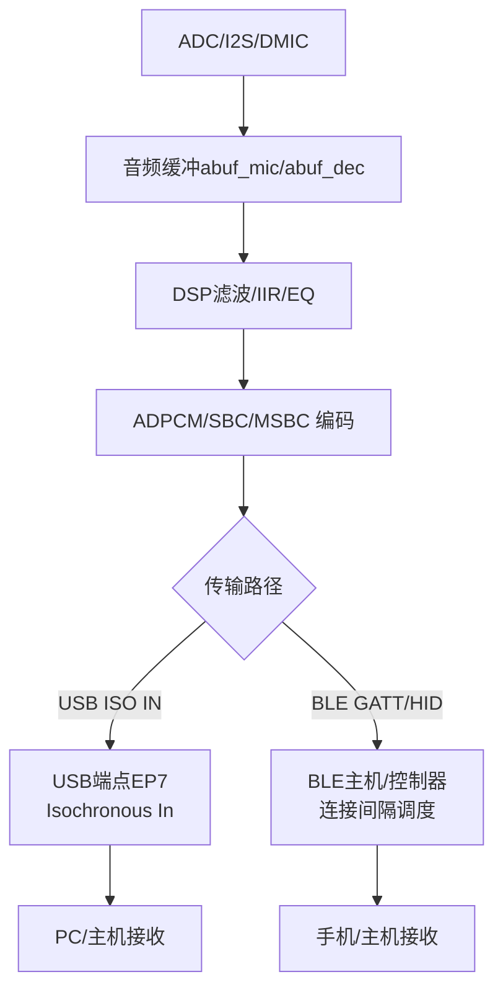
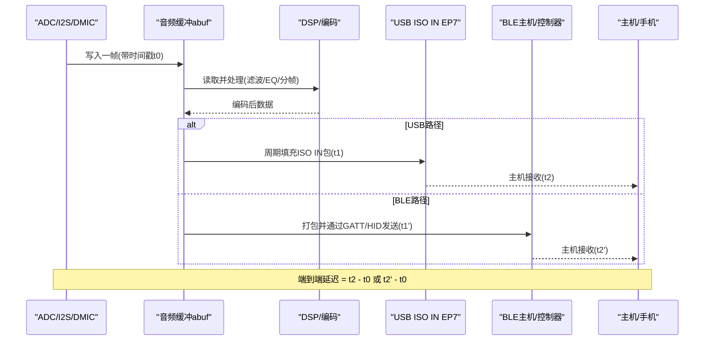
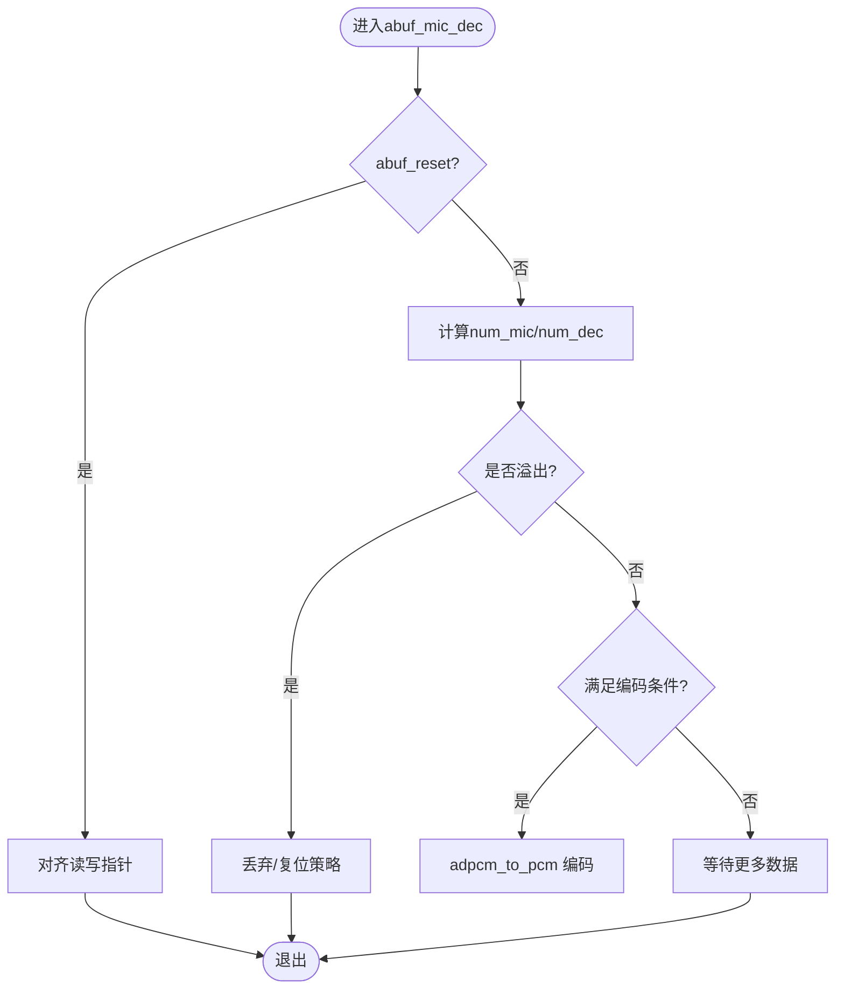
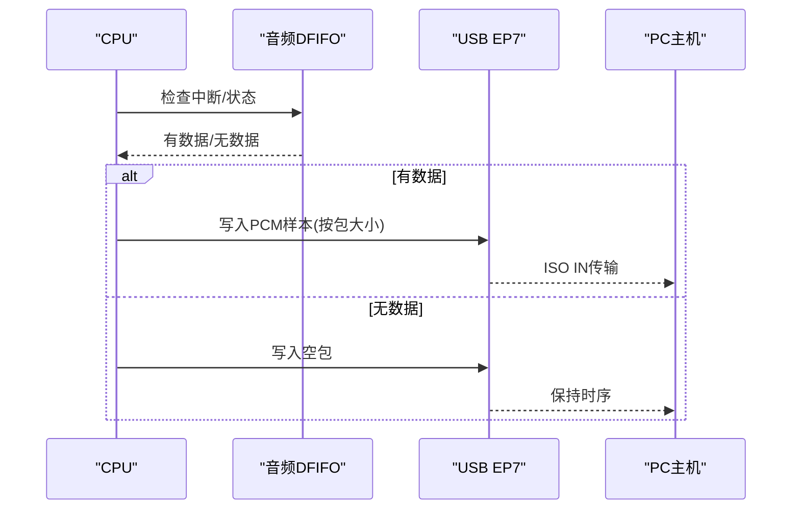
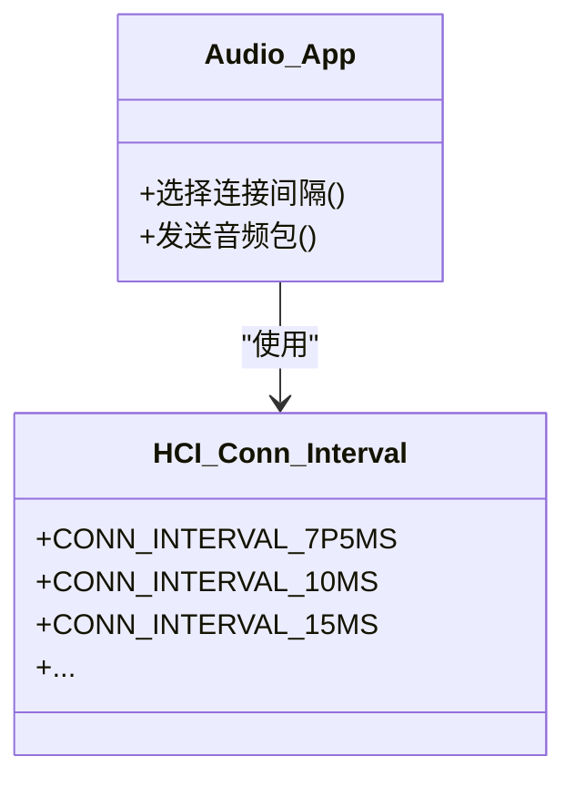
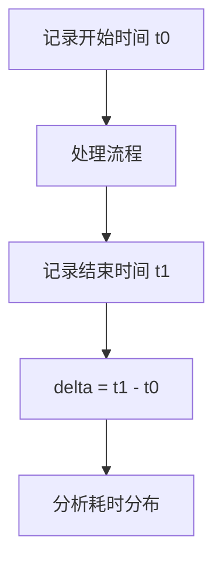
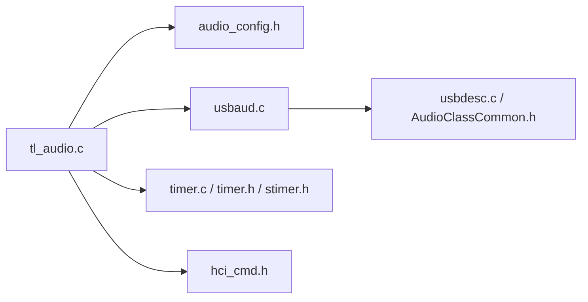

# 音频延迟分析与优化

<cite>
**本文引用的文件列表**
- [tl_audio.c](file://tc_ble_single_sdk/application/audio/tl_audio.c)
- [tl_audio.h](file://tc_ble_single_sdk/application/audio/tl_audio.h)
- [audio_config.h](file://tc_ble_single_sdk/application/audio/audio_config.h)
- [gl_audio.h](file://tc_ble_single_sdk/application/audio/gl_audio.h)
- [usbaud.c](file://tc_ble_single_sdk/application/app/usbaud.c)
- [usbdesc.c](file://tc_ble_single_sdk/application/usbstd/usbdesc.c)
- [usb.c](file://tc_ble_single_sdk/application/usbstd/usb.c)
- [AudioClassCommon.h](file://tc_ble_single_sdk/application/usbstd/AudioClassCommon.h)
- [timer.c (B85)](file://tc_ble_single_sdk/drivers/B85/timer.c)
- [timer.h (B87)](file://tc_ble_single_sdk/drivers/B87/timer.h)
- [stimer.h (TC321X)](file://tc_ble_single_sdk/drivers/TC321X/lib/include/stimer.h)
- [hci_cmd.h](file://tc_ble_single_sdk/stack/ble/hci/hci_cmd.h)
- [utility.h](file://tc_ble_single_sdk/common/utility.h)
</cite>

## 目录
1. [简介](#简介)
2. [项目结构](#项目结构)
3. [核心组件](#核心组件)
4. [架构总览](#架构总览)
5. [详细组件分析](#详细组件分析)
6. [依赖关系分析](#依赖关系分析)
7. [性能考量](#性能考量)
8. [故障排查指南](#故障排查指南)
9. [结论](#结论)
10. [附录](#附录)

## 简介
本技术文档面向在Telink B85/B87/TC321x平台上实现低延迟音频采集与传输的工程师，聚焦端到端延迟测量、来源识别与定位、优化策略（缓冲区大小、处理流水线、传输协议）、实时性保证机制、测试工具与基准方法，以及不同应用场景下的延迟要求与平衡策略。内容基于仓库中的音频应用层、驱动层与协议栈代码进行系统化梳理与可视化说明。

## 项目结构
本项目围绕“音频采集→DSP处理→编码→无线/USB传输”的链路组织：
- 应用层音频：封装ADC/DSP/编解码/缓冲管理（tl_audio.*）
- USB音频：描述符、端点、采样率控制（usbaud.c, usbdesc.c, usb.c, AudioClassCommon.h）
- 驱动层定时器/时钟：高精度计时与延时（timer.c, timer.h, stimer.h）
- BLE协议栈：连接间隔、事件调度影响传输时延（hci_cmd.h）
- 配置宏：按模式定义帧长、缓冲大小等关键参数（audio_config.h）

图表来源
- [tl_audio.c:876-1013](file://tc_ble_single_sdk/application/audio/tl_audio.c#L876-L1013)
- [usbaud.c:322-399](file://tc_ble_single_sdk/application/app/usbaud.c#L322-L399)
- [usbdesc.c:552-583](file://tc_ble_single_sdk/application/usbstd/usbdesc.c#L552-L583)
- [hci_cmd.h:471-498](file://tc_ble_single_sdk/stack/ble/hci/hci_cmd.h#L471-L498)

章节来源
- [tl_audio.c:876-1013](file://tc_ble_single_sdk/application/audio/tl_audio.c#L876-L1013)
- [audio_config.h:32-107](file://tc_ble_single_sdk/application/audio/audio_config.h#L32-L107)
- [usbdesc.c:552-583](file://tc_ble_single_sdk/application/usbstd/usbdesc.c#L552-L583)
- [hci_cmd.h:471-498](file://tc_ble_single_sdk/stack/ble/hci/hci_cmd.h#L471-L498)

## 核心组件
- 音频缓冲与流水线：环形缓冲abuf_mic/abuf_dec，按帧写入、按块读取，支持溢出保护与复位逻辑，确保稳定吞吐与可控延迟。
- DSP与编码：IIR滤波、EQ、分帧到ADPCM/SBC/MSBC，按配置宏决定帧大小与缓冲规模。
- USB音频输出：ISO IN端点周期性填充数据，支持自适应同步与包大小控制。
- BLE传输：通过GATT/HID或自定义服务发送音频数据，受连接间隔与事件调度影响。
- 计时与基准：系统时钟与定时器API用于时间戳标记与性能计数。

章节来源
- [tl_audio.c:876-1013](file://tc_ble_single_sdk/application/audio/tl_audio.c#L876-L1013)
- [tl_audio.h:32-129](file://tc_ble_single_sdk/application/audio/tl_audio.h#L32-L129)
- [audio_config.h:32-107](file://tc_ble_single_sdk/application/audio/audio_config.h#L32-L107)
- [usbaud.c:322-399](file://tc_ble_single_sdk/application/app/usbaud.c#L322-L399)
- [timer.h (B87):103-144](file://tc_ble_single_sdk/drivers/B87/timer.h#L103-L144)
- [stimer.h (TC321X):108-324](file://tc_ble_single_sdk/drivers/TC321X/lib/include/stimer.h#L108-L324)

## 架构总览
下图展示从ADC采样到最终输出的完整数据流与时序关键点，标注了可测量的延迟段：
- ADC采样延迟：硬件转换+DMA/中断入缓冲
- DSP处理延迟：滤波、EQ、分帧
- 编码延迟：ADPCM/SBC/MSBC压缩
- 协议栈延迟：USB/BLE调度、连接间隔
- 无线传输延迟：空中接口与主机侧处理

图表来源
- [tl_audio.c:876-1013](file://tc_ble_single_sdk/application/audio/tl_audio.c#L876-L1013)
- [usbaud.c:322-399](file://tc_ble_single_sdk/application/app/usbaud.c#L322-L399)
- [hci_cmd.h:471-498](file://tc_ble_single_sdk/stack/ble/hci/hci_cmd.h#L471-L498)

## 详细组件分析

### 音频缓冲与流水线（abuf_mic/abuf_dec）
- 设计要点
  - 双缓冲：abuf_mic用于ADC输入帧缓存，abuf_dec用于解码/编码后的PCM缓冲。
  - 写指针/读指针：通过wptr/rptr维护环形队列，避免拷贝开销。
  - 溢出保护：当num_mic或num_dec超过阈值时触发复位或丢弃策略，防止雪崩。
  - USB Isochronous适配：根据可用数据量动态决定是否发包，空包填充以保证时序。
- 复杂度
  - 插入/读取均为O(1)，整体吞吐由CPU与外设带宽决定。
- 优化机会
  - 调整MIC_ADPCM_FRAME_SIZE/MIC_SHORT_DEC_SIZE以匹配目标延迟与内存。
  - 合理设置TL_MIC_BUFFER_SIZE，平衡延迟与稳定性。

图表来源
- [tl_audio.c:897-932](file://tc_ble_single_sdk/application/audio/tl_audio.c#L897-L932)
- [tl_audio.c:1205-1238](file://tc_ble_single_sdk/application/audio/tl_audio.c#L1205-L1238)

章节来源
- [tl_audio.c:876-1013](file://tc_ble_single_sdk/application/audio/tl_audio.c#L876-L1013)
- [tl_audio.c:1176-1252](file://tc_ble_single_sdk/application/audio/tl_audio.c#L1176-L1252)
- [audio_config.h:76-107](file://tc_ble_single_sdk/application/audio/audio_config.h#L76-L107)

### USB音频端点与描述符
- 端点配置
  - ISO IN端点EP7用于麦克风数据上行，周期性ACK，支持自适应同步。
  - 描述符中声明格式类型、通道数、位深、采样率与最大包大小。
- 数据处理
  - usbaud.c中根据采样率选择长度，轮询DFIFO状态或直接读取寄存器数据，写入EP7。
  - 空包填充策略维持时序连续性。
- 延迟影响
  - 包大小与PollingInterval直接影响端到端延迟；更小包/更高频可降低延迟但增加CPU负载。

图表来源
- [usbaud.c:322-399](file://tc_ble_single_sdk/application/app/usbaud.c#L322-L399)
- [usbdesc.c:552-583](file://tc_ble_single_sdk/application/usbstd/usbdesc.c#L552-L583)
- [usb.c:627-680](file://tc_ble_single_sdk/application/usbstd/usb.c#L627-L680)
- [AudioClassCommon.h:293-353](file://tc_ble_single_sdk/application/usbstd/AudioClassCommon.h#L293-L353)

章节来源
- [usbaud.c:322-399](file://tc_ble_single_sdk/application/app/usbaud.c#L322-L399)
- [usbdesc.c:552-583](file://tc_ble_single_sdk/application/usbstd/usbdesc.c#L552-L583)
- [usb.c:627-680](file://tc_ble_single_sdk/application/usbstd/usb.c#L627-L680)
- [AudioClassCommon.h:293-353](file://tc_ble_single_sdk/application/usbstd/AudioClassCommon.h#L293-L353)

### BLE协议栈与连接间隔
- 连接间隔枚举定义了最小到最大间隔（如7.5ms至数百毫秒），直接影响数据包调度频率与端到端延迟。
- 对于语音场景，通常选择较小连接间隔以降低延迟，但会增加功耗与空中占用。
- 可通过HCI命令更新连接参数以动态平衡延迟与功耗。

图表来源
- [hci_cmd.h:471-498](file://tc_ble_single_sdk/stack/ble/hci/hci_cmd.h#L471-L498)

章节来源
- [hci_cmd.h:471-498](file://tc_ble_single_sdk/stack/ble/hci/hci_cmd.h#L471-L498)

### 计时与性能计数器
- 提供sleep_us、clock_time、clock_time_exceed等API用于微秒级延时与超时判断。
- 系统定时器（stimer）支持捕获与手动模式，便于精确时间戳标记。
- 建议在关键路径（ADC入缓冲、编码完成、USB/BLE发送）打点，计算各阶段耗时。

图表来源
- [timer.c (B85):32-37](file://tc_ble_single_sdk/drivers/B85/timer.c#L32-L37)
- [timer.h (B87):103-144](file://tc_ble_single_sdk/drivers/B87/timer.h#L103-L144)
- [stimer.h (TC321X):108-324](file://tc_ble_single_sdk/drivers/TC321X/lib/include/stimer.h#L108-L324)

章节来源
- [timer.c (B85):32-37](file://tc_ble_single_sdk/drivers/B85/timer.c#L32-L37)
- [timer.h (B87):103-144](file://tc_ble_single_sdk/drivers/B87/timer.h#L103-L144)
- [stimer.h (TC321X):108-324](file://tc_ble_single_sdk/drivers/TC321X/lib/include/stimer.h#L108-L324)

## 依赖关系分析
- 模块耦合
  - tl_audio.c依赖audio_config.h定义的帧/缓冲参数，依赖usbaud.c进行USB传输，依赖BLE协议栈进行无线传输。
  - 驱动层timer API被应用层用于时间戳与延时控制。
- 外部依赖
  - USB音频类标准（描述符、端点属性）。
  - BLE连接参数与事件调度。
- 潜在循环依赖
  - 当前结构清晰，未见直接循环依赖；注意在扩展功能时避免应用层与驱动层互相包含。

图表来源
- [tl_audio.c:876-1013](file://tc_ble_single_sdk/application/audio/tl_audio.c#L876-L1013)
- [audio_config.h:32-107](file://tc_ble_single_sdk/application/audio/audio_config.h#L32-L107)
- [usbaud.c:322-399](file://tc_ble_single_sdk/application/app/usbaud.c#L322-L399)
- [usbdesc.c:552-583](file://tc_ble_single_sdk/application/usbstd/usbdesc.c#L552-L583)
- [hci_cmd.h:471-498](file://tc_ble_single_sdk/stack/ble/hci/hci_cmd.h#L471-L498)

章节来源
- [tl_audio.c:876-1013](file://tc_ble_single_sdk/application/audio/tl_audio.c#L876-L1013)
- [audio_config.h:32-107](file://tc_ble_single_sdk/application/audio/audio_config.h#L32-L107)
- [usbaud.c:322-399](file://tc_ble_single_sdk/application/app/usbaud.c#L322-L399)
- [usbdesc.c:552-583](file://tc_ble_single_sdk/application/usbstd/usbdesc.c#L552-L583)
- [hci_cmd.h:471-498](file://tc_ble_single_sdk/stack/ble/hci/hci_cmd.h#L471-L498)

## 性能考量
- 端到端延迟组成
  - ADC采样延迟：硬件转换时间与DMA/中断入缓冲时间。
  - DSP处理延迟：滤波、EQ、分帧与编码算法耗时。
  - 协议栈延迟：USB/BLE调度、连接间隔、包大小。
  - 无线传输延迟：空中接口与主机侧处理。
- 缓冲区大小调整
  - 增大TL_MIC_BUFFER_SIZE/MIC_ADPCM_FRAME_SIZE可降低抖动但增加延迟；需结合CPU负载与内存限制权衡。
- 处理流水线优化
  - 减少不必要的拷贝，采用环形缓冲与零拷贝策略。
  - 将耗时操作（如复杂滤波）拆分到空闲时段或使用DMA。
- 传输协议优化
  - USB：减小包大小、提高PollingInterval频率可降低延迟但增加CPU占用。
  - BLE：选择更小连接间隔（如7.5ms~15ms）降低调度延迟，注意功耗与干扰。
- 实时性保证
  - 硬实时约束：ISO IN端点与定时器中断优先级需高于普通任务。
  - 软实时优化：使用clock_time_exceed进行超时保护，避免阻塞。

[本节为通用指导，不直接分析具体文件]

## 故障排查指南
- 常见问题
  - 音频卡顿/爆音：检查abuf_mic/abuf_dec是否频繁复位，确认num_mic/num_dec阈值设置是否合理。
  - 高延迟：检查USB包大小与PollingInterval，或BLE连接间隔是否过大。
  - 数据丢失：确认DFIFO中断是否及时处理，避免长时间关闭中断。
- 调试手段
  - 使用sleep_us/clock_time_exceed在关键路径打点，统计各阶段耗时。
  - 通过USB抓包或BLE日志分析实际传输间隔与丢包情况。
- 参考位置
  - 缓冲复位与溢出保护逻辑位于tl_audio.c相关函数。
  - USB端点处理位于usbaud.c与usbdesc.c。
  - 计时与超时判断位于timer.c/timer.h/stimer.h。

章节来源
- [tl_audio.c:897-932](file://tc_ble_single_sdk/application/audio/tl_audio.c#L897-L932)
- [tl_audio.c:1205-1238](file://tc_ble_single_sdk/application/audio/tl_audio.c#L1205-L1238)
- [usbaud.c:322-399](file://tc_ble_single_sdk/application/app/usbaud.c#L322-L399)
- [timer.c (B85):32-37](file://tc_ble_single_sdk/drivers/B85/timer.c#L32-L37)
- [timer.h (B87):103-144](file://tc_ble_single_sdk/drivers/B87/timer.h#L103-L144)
- [stimer.h (TC321X):108-324](file://tc_ble_single_sdk/drivers/TC321X/lib/include/stimer.h#L108-L324)

## 结论
通过对音频缓冲、DSP/编码、USB/BLE传输与计时系统的深入分析，可实现对端到端延迟的精确测量与优化。关键在于：
- 合理配置帧大小与缓冲规模，平衡延迟与稳定性。
- 优化处理流水线，减少拷贝与阻塞。
- 选择合适的传输协议参数（USB包大小/间隔、BLE连接间隔）。
- 利用系统定时器进行时间戳标记与性能计数，持续监控与调优。

[本节为总结，不直接分析具体文件]

## 附录
- 不同应用场景的延迟要求与建议
  - 语音通话：目标端到端延迟<150ms，建议BLE连接间隔≤15ms，USB包大小适中。
  - 游戏/交互：目标<100ms，优先USB ISO IN，小包高频。
  - 录音回放：容忍较高延迟，可适当增大缓冲提升稳定性。
- 平衡策略
  - 延迟 vs 功耗：更小连接间隔/更高频率提升延迟表现但增加功耗。
  - 延迟 vs 质量：编码比特率与算法复杂度影响延迟与音质，需折中。
- 测试工具与方法
  - 使用系统定时器在ADC入缓冲、编码完成、USB/BLE发送处打点。
  - 主机侧记录接收时间，计算端到端延迟分布（均值、方差、P95/P99）。
  - 通过改变参数（缓冲大小、连接间隔、包大小）进行A/B测试。

[本节为通用指导，不直接分析具体文件]