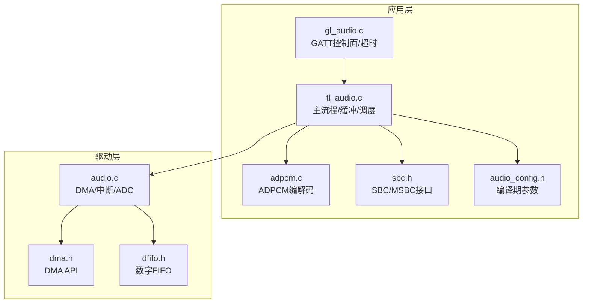
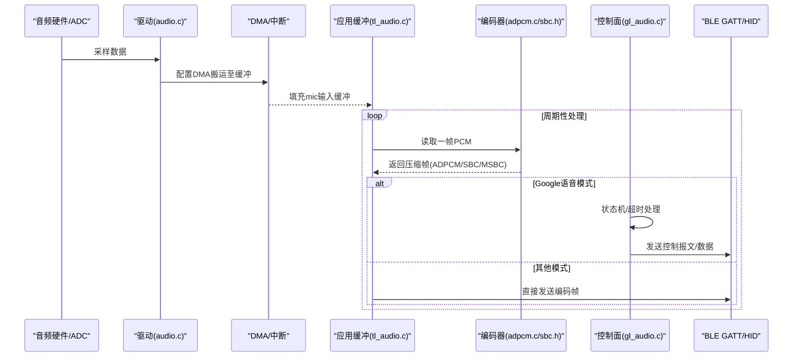
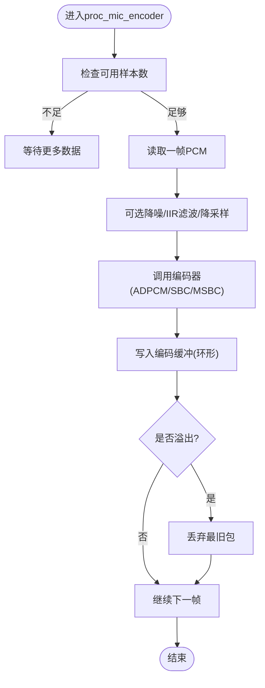
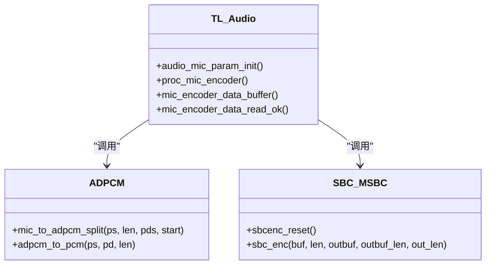
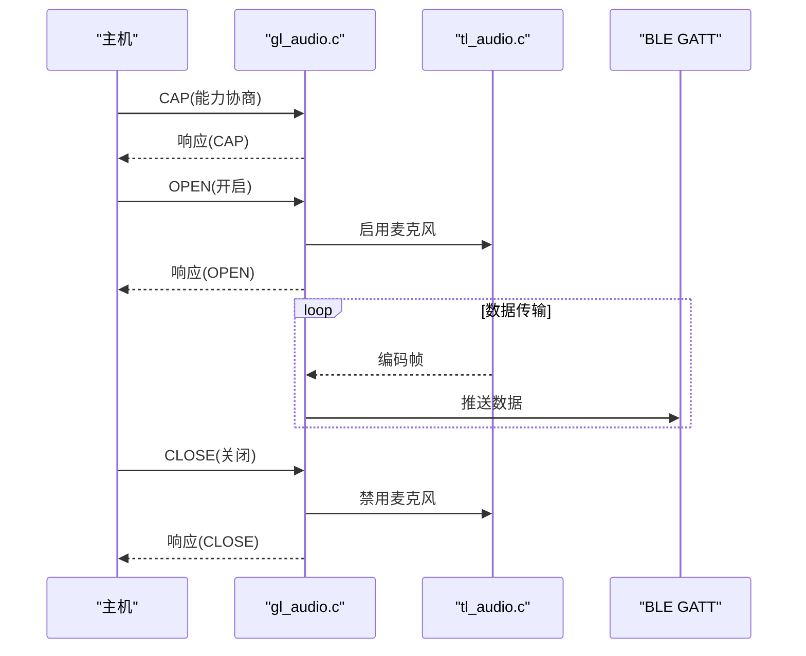
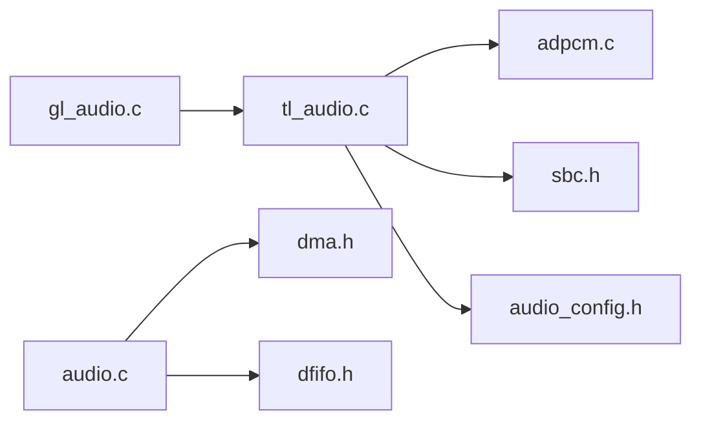

# 音频数据流管理

<cite>
**本文引用的文件**
- [tl_audio.c](file://tc_ble_single_sdk/application/audio/tl_audio.c)
- [tl_audio.h](file://tc_ble_single_sdk/application/audio/tl_audio.h)
- [adpcm.c](file://tc_ble_single_sdk/application/audio/adpcm.c)
- [sbc.h](file://tc_ble_single_sdk/application/audio/sbc.h)
- [audio_config.h](file://tc_ble_single_sdk/application/audio/audio_config.h)
- [gl_audio.c](file://tc_ble_single_sdk/application/audio/gl_audio.c)
- [gl_audio.h](file://tc_ble_single_sdk/application/audio/gl_audio.h)
- [audio.c (B85)](file://tc_ble_single_sdk/drivers/B85/audio.c)
- [dma.h (B85)](file://tc_ble_single_sdk/drivers/B85/dma.h)
- [dfifo.h (B85)](file://tc_ble_single_sdk/drivers/B85/dfifo.h)
</cite>

## 目录
1. [简介](#简介)
2. [项目结构](#项目结构)
3. [核心组件](#核心组件)
4. [架构总览](#架构总览)
5. [详细组件分析](#详细组件分析)
6. [依赖关系分析](#依赖关系分析)
7. [性能考虑](#性能考虑)
8. [故障排查指南](#故障排查指南)
9. [结论](#结论)
10. [附录](#附录)

## 简介
本技术文档围绕音频数据流管理子系统，系统阐述从采集、缓冲、处理到传输的完整流程。重点覆盖：
- DMA与中断驱动的音频数据采集与搬运
- 多通道（双声道）采样数据的分帧与编码（ADPCM/SBC/MSBC）
- 实时同步机制、缓冲区调度算法与内存优化
- 采样率适配与数据格式转换
- 基于BLE GATT/HID的数据传输控制面与超时恢复
- 监控指标与性能分析方法
- 错误处理与异常恢复策略，保障音频流的稳定性与可靠性

## 项目结构
应用层音频模块位于 application/audio，包含：
- tl_audio.c/.h：主控逻辑、编码器选择、IIR滤波、降噪、音量与PGA设置、缓冲与调度
- adpcm.c：ADPCM编解码实现
- sbc.h：SBC/MSBC编解码接口
- audio_config.h：各模式下的帧长、缓冲大小、单位样本数等编译期配置
- gl_audio.c/.h：Google语音GATT控制面（开启/关闭/能力协商/超时）

驱动层位于 drivers/<芯片>/，提供：
- audio.c：音频硬件初始化、DMA/中断、麦克风输入路径
- dma.h：DMA寄存器与API定义
- dfifo.h：数字FIFO接口，用于ADC/DMA与CPU之间的数据桥接

图表来源
- [tl_audio.c:323-800](file://tc_ble_single_sdk/application/audio/tl_audio.c#L323-L800)
- [adpcm.c:49-283](file://tc_ble_single_sdk/application/audio/adpcm.c#L49-L283)
- [sbc.h:44-55](file://tc_ble_single_sdk/application/audio/sbc.h#L44-L55)
- [audio_config.h:32-74](file://tc_ble_single_sdk/application/audio/audio_config.h#L32-L74)
- [gl_audio.c:213-354](file://tc_ble_single_sdk/application/audio/gl_audio.c#L213-L354)
- [audio.c (B85):1-200](file://tc_ble_single_sdk/drivers/B85/audio.c#L1-L200)
- [dma.h (B85):1-200](file://tc_ble_single_sdk/drivers/B85/dma.h#L1-L200)
- [dfifo.h (B85):1-200](file://tc_ble_single_sdk/drivers/B85/dfifo.h#L1-L200)

章节来源
- [tl_audio.c:323-800](file://tc_ble_single_sdk/application/audio/tl_audio.c#L323-L800)
- [audio_config.h:32-74](file://tc_ble_single_sdk/application/audio/audio_config.h#L32-L74)
- [gl_audio.c:213-354](file://tc_ble_single_sdk/application/audio/gl_audio.c#L213-L354)
- [audio.c (B85):1-200](file://tc_ble_single_sdk/drivers/B85/audio.c#L1-L200)
- [dma.h (B85):1-200](file://tc_ble_single_sdk/drivers/B85/dma.h#L1-L200)
- [dfifo.h (B85):1-200](file://tc_ble_single_sdk/drivers/B85/dfifo.h#L1-L200)

## 核心组件
- 音频采集与DMA搬运：由驱动层audio.c负责初始化音频外设、配置DMA与中断，将ADC采样数据写入环形缓冲；通过dfifo在硬件与CPU之间高效传递。
- 缓冲与调度：tl_audio.c维护mic输入缓冲与编码输出缓冲，使用写指针/读指针与包计数进行非阻塞调度，避免丢帧与溢出。
- 编码与格式转换：根据TL_AUDIO_MODE选择ADPCM或SBC/MSBC编码；支持32kHz到16kHz降采样、IIR滤波、噪声抑制、音量与PGA增益调节。
- 传输控制面：gl_audio.c实现Google语音GATT协议的状态机（能力协商、开启/关闭、扩展心跳），并处理超时与按键触发。
- 配置与常量：audio_config.h集中定义不同模式的帧长、缓冲大小、单位样本数等关键参数，确保各模块一致。

章节来源
- [tl_audio.c:323-800](file://tc_ble_single_sdk/application/audio/tl_audio.c#L323-L800)
- [tl_audio.h:32-129](file://tc_ble_single_sdk/application/audio/tl_audio.h#L32-L129)
- [adpcm.c:49-283](file://tc_ble_single_sdk/application/audio/adpcm.c#L49-L283)
- [sbc.h:44-55](file://tc_ble_single_sdk/application/audio/sbc.h#L44-L55)
- [audio_config.h:32-74](file://tc_ble_single_sdk/application/audio/audio_config.h#L32-L74)
- [gl_audio.c:213-354](file://tc_ble_single_sdk/application/audio/gl_audio.c#L213-L354)

## 架构总览
下图展示从硬件采集到上层传输的整体数据流与控制流。

图表来源
- [tl_audio.c:323-800](file://tc_ble_single_sdk/application/audio/tl_audio.c#L323-L800)
- [adpcm.c:49-283](file://tc_ble_single_sdk/application/audio/adpcm.c#L49-L283)
- [sbc.h:44-55](file://tc_ble_single_sdk/application/audio/sbc.h#L44-L55)
- [gl_audio.c:213-354](file://tc_ble_single_sdk/application/audio/gl_audio.c#L213-L354)
- [audio.c (B85):1-200](file://tc_ble_single_sdk/drivers/B85/audio.c#L1-L200)
- [dma.h (B85):1-200](file://tc_ble_single_sdk/drivers/B85/dma.h#L1-L200)
- [dfifo.h (B85):1-200](file://tc_ble_single_sdk/drivers/B85/dfifo.h#L1-L200)

## 详细组件分析

### 音频采集与DMA/中断
- 采集路径：音频外设产生采样数据，驱动层通过DMA将数据搬运到内存缓冲；中断触发后通知应用层消费数据。
- 数字FIFO：dfifo作为硬件与CPU间的缓冲队列，降低CPU负载，提高吞吐。
- 关键点：合理设置DMA长度与中断阈值，保证低延迟与稳定吞吐；避免缓冲溢出与欠载。

章节来源
- [audio.c (B85):1-200](file://tc_ble_single_sdk/drivers/B85/audio.c#L1-L200)
- [dma.h (B85):1-200](file://tc_ble_single_sdk/drivers/B85/dma.h#L1-L200)
- [dfifo.h (B85):1-200](file://tc_ble_single_sdk/drivers/B85/dfifo.h#L1-L200)

### 缓冲管理与调度算法
- 输入缓冲：维护mic输入缓冲与写指针，按固定单位（如TL_MIC_ADPCM_UNIT_SIZE）切分。
- 输出缓冲：编码后的包放入环形缓冲，使用写指针/读指针与包计数（TL_MIC_PACKET_BUFFER_NUM）进行调度。
- 防溢出策略：当编码包数量超过阈值时，丢弃最旧包，保证实时性。
- 多通道处理：对双声道数据进行交错处理，并在必要时进行半采样抽取（32k→16k）。

图表来源
- [tl_audio.c:323-800](file://tc_ble_single_sdk/application/audio/tl_audio.c#L323-L800)
- [audio_config.h:32-74](file://tc_ble_single_sdk/application/audio/audio_config.h#L32-L74)

章节来源
- [tl_audio.c:323-800](file://tc_ble_single_sdk/application/audio/tl_audio.c#L323-L800)
- [tl_audio.h:32-129](file://tc_ble_single_sdk/application/audio/tl_audio.h#L32-L129)
- [audio_config.h:32-74](file://tc_ble_single_sdk/application/audio/audio_config.h#L32-L74)

### 编码与数据格式转换
- ADPCM：实现mic_to_adpcm_split，按单位样本数编码，支持不同模式（Telink/Google/HID）的头部与字节序。
- SBC/MSBC：通过sbc_enc接口完成压缩，适用于HID或透传场景。
- 采样率适配：在IIR滤波路径中执行半采样抽取，将32kHz降至16kHz，满足Google语音等要求。
- 噪声抑制与EQ：可选降噪与IIR滤波器，提升语音质量。

图表来源
- [tl_audio.c:323-800](file://tc_ble_single_sdk/application/audio/tl_audio.c#L323-L800)
- [adpcm.c:49-283](file://tc_ble_single_sdk/application/audio/adpcm.c#L49-L283)
- [sbc.h:44-55](file://tc_ble_single_sdk/application/audio/sbc.h#L44-L55)

章节来源
- [adpcm.c:49-283](file://tc_ble_single_sdk/application/audio/adpcm.c#L49-L283)
- [tl_audio.c:323-800](file://tc_ble_single_sdk/application/audio/tl_audio.c#L323-L800)
- [sbc.h:44-55](file://tc_ble_single_sdk/application/audio/sbc.h#L44-L55)

### 传输控制面与实时同步
- Google语音GATT：gl_audio.c实现能力协商、开启/关闭、扩展心跳与超时处理；按键触发HTT/PTT模型。
- 状态机：维护app_audio_key_flags、enable标志、stream_id等，确保与主机同步。
- 超时恢复：app_audio_timeout_proc检测传输超时，自动关闭麦克风并上报原因。

图表来源
- [gl_audio.c:213-354](file://tc_ble_single_sdk/application/audio/gl_audio.c#L213-L354)
- [gl_audio.h:29-150](file://tc_ble_single_sdk/application/audio/gl_audio.h#L29-L150)

章节来源
- [gl_audio.c:213-354](file://tc_ble_single_sdk/application/audio/gl_audio.c#L213-L354)
- [gl_audio.h:29-150](file://tc_ble_single_sdk/application/audio/gl_audio.h#L29-L150)

### 多通道音频数据处理
- 双声道交错：输入缓冲为交错的双声道数据，编码前按单位样本数切分。
- 半采样抽取：在需要时将32kHz降为16kHz，减少带宽与处理量。
- 均衡与降噪：IIR滤波器与噪声抑制可组合使用，改善语音清晰度。

章节来源
- [tl_audio.c:323-800](file://tc_ble_single_sdk/application/audio/tl_audio.c#L323-L800)
- [tl_audio.h:32-129](file://tc_ble_single_sdk/application/audio/tl_audio.h#L32-L129)

### 内存管理与优化
- 环形缓冲：编码输出采用环形缓冲，避免频繁拷贝与碎片化。
- 包计数限流：使用TL_MIC_PACKET_BUFFER_NUM限制待发送包数，防止溢出。
- 编译期配置：audio_config.h集中定义缓冲大小与帧长，便于在不同模式下调优。

章节来源
- [tl_audio.c:323-800](file://tc_ble_single_sdk/application/audio/tl_audio.c#L323-L800)
- [audio_config.h:32-74](file://tc_ble_single_sdk/application/audio/audio_config.h#L32-L74)

## 依赖关系分析
- 应用层依赖：tl_audio.c依赖adpcm.c与sbc.h完成编码；依赖audio_config.h获取模式参数；gl_audio.c提供控制面。
- 驱动层依赖：audio.c依赖dma.h与dfifo.h完成DMA与FIFO操作。
- 耦合与内聚：模块化清晰，功能内聚；通过函数接口解耦，便于替换编码器或传输协议。

图表来源
- [tl_audio.c:323-800](file://tc_ble_single_sdk/application/audio/tl_audio.c#L323-L800)
- [adpcm.c:49-283](file://tc_ble_single_sdk/application/audio/adpcm.c#L49-L283)
- [sbc.h:44-55](file://tc_ble_single_sdk/application/audio/sbc.h#L44-L55)
- [audio_config.h:32-74](file://tc_ble_single_sdk/application/audio/audio_config.h#L32-L74)
- [gl_audio.c:213-354](file://tc_ble_single_sdk/application/audio/gl_audio.c#L213-L354)
- [audio.c (B85):1-200](file://tc_ble_single_sdk/drivers/B85/audio.c#L1-L200)
- [dma.h (B85):1-200](file://tc_ble_single_sdk/drivers/B85/dma.h#L1-L200)
- [dfifo.h (B85):1-200](file://tc_ble_single_sdk/drivers/B85/dfifo.h#L1-L200)

章节来源
- [tl_audio.c:323-800](file://tc_ble_single_sdk/application/audio/tl_audio.c#L323-L800)
- [adpcm.c:49-283](file://tc_ble_single_sdk/application/audio/adpcm.c#L49-L283)
- [sbc.h:44-55](file://tc_ble_single_sdk/application/audio/sbc.h#L44-L55)
- [audio_config.h:32-74](file://tc_ble_single_sdk/application/audio/audio_config.h#L32-L74)
- [gl_audio.c:213-354](file://tc_ble_single_sdk/application/audio/gl_audio.c#L213-L354)
- [audio.c (B85):1-200](file://tc_ble_single_sdk/drivers/B85/audio.c#L1-L200)
- [dma.h (B85):1-200](file://tc_ble_single_sdk/drivers/B85/dma.h#L1-L200)
- [dfifo.h (B85):1-200](file://tc_ble_single_sdk/drivers/B85/dfifo.h#L1-L200)

## 性能考虑
- 降低延迟：合理设置DMA中断阈值与缓冲大小，缩短端到端延迟。
- 提高吞吐：批量处理与环形缓冲减少拷贝与锁竞争。
- 计算优化：IIR与降噪在RAM中执行，减少访存开销；必要时跳过非必要滤波步骤。
- 编码选择：ADPCM适合低带宽场景；SBC/MSBC提供更高质量但占用更高带宽。
- 功耗管理：空闲时关闭麦克风与降低采样率，延长电池寿命。

[本节为通用指导，不直接分析具体文件]

## 故障排查指南
- 无数据或卡顿：检查DMA配置与中断是否触发；确认dfifo读写指针是否正确；验证缓冲是否溢出或欠载。
- 音频断续：调整TL_MIC_PACKET_BUFFER_NUM与帧长，平衡实时性与稳定性；检查BLE连接质量与MTU。
- 音质问题：启用或调整IIR滤波器与降噪；校准音量与PGA增益；确认采样率与编码匹配。
- 控制面异常：核对Google语音GATT状态机；检查超时处理与按键触发逻辑；确认能力协商结果。

章节来源
- [gl_audio.c:185-211](file://tc_ble_single_sdk/application/audio/gl_audio.c#L185-L211)
- [gl_audio.c:213-354](file://tc_ble_single_sdk/application/audio/gl_audio.c#L213-L354)
- [tl_audio.c:323-800](file://tc_ble_single_sdk/application/audio/tl_audio.c#L323-L800)

## 结论
该音频数据流管理子系统以DMA与中断为核心，结合环形缓冲与编码器抽象，实现了稳定的实时音频采集、处理与传输。通过Google语音GATT控制面与超时恢复机制，保障了连接的健壮性。针对不同模式与平台，提供了灵活的配置与优化点，可在带宽、音质与功耗之间取得平衡。

[本节为总结，不直接分析具体文件]

## 附录
- 关键参数建议：
  - 缓冲大小：根据采样率与编码帧长设定，避免溢出与欠载
  - 包数量：TL_MIC_PACKET_BUFFER_NUM建议4~8，视BLE吞吐而定
  - 滤波与降噪：根据环境噪声与语音特征调整系数
- 调试工具：
  - 统计缓冲水位与丢包率
  - 记录GATT事件与超时次数
  - 测量端到端延迟与CPU占用

[本节为补充信息，不直接分析具体文件]