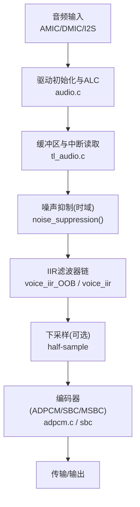
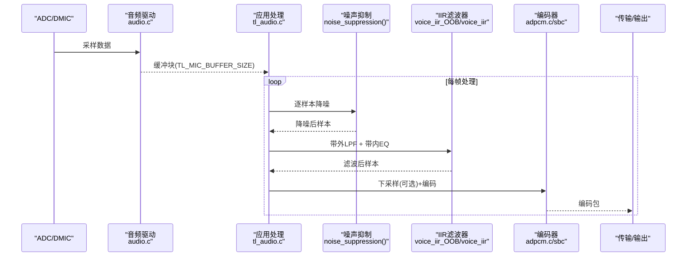
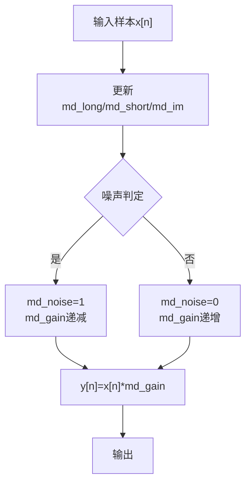
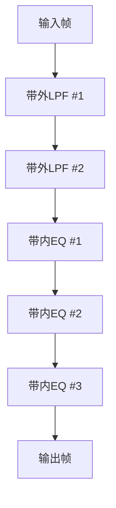
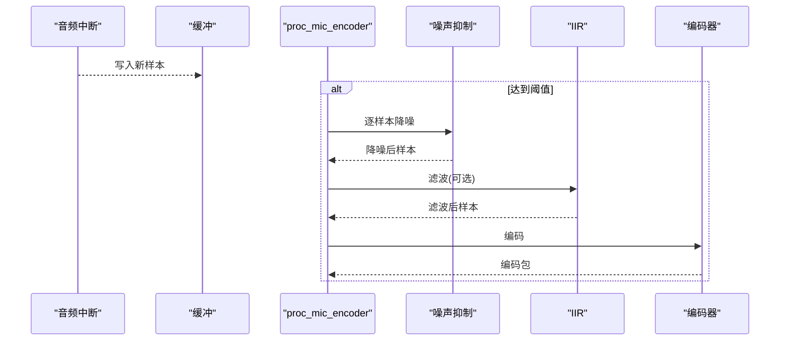
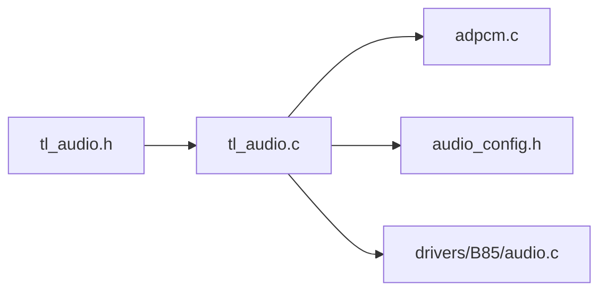

# 噪声抑制算法

<cite>
**本文引用的文件**
- [tl_audio.c](file://tc_ble_single_sdk/application/audio/tl_audio.c)
- [tl_audio.h](file://tc_ble_single_sdk/application/audio/tl_audio.h)
- [adpcm.c](file://tc_ble_single_sdk/application/audio/adpcm.c)
- [audio_config.h](file://tc_ble_single_sdk/application/audio/audio_config.h)
- [audio.c](file://tc_ble_single_sdk/drivers/B85/audio.c)
</cite>

## 目录
1. [简介](#简介)
2. [项目结构](#项目结构)
3. [核心组件](#核心组件)
4. [架构总览](#架构总览)
5. [详细组件分析](#详细组件分析)
6. [依赖关系分析](#依赖关系分析)
7. [性能考虑](#性能考虑)
8. [故障排查指南](#故障排查指南)
9. [结论](#结论)
10. [附录](#附录)

## 简介
本技术文档围绕音频采集链路中的噪声抑制模块，系统梳理了当前代码库中已实现的降噪能力与信号处理流程。重点包括：
- 时域自适应增益控制（基于短时/长时能量估计的噪声门限与增益平滑）
- IIR滤波器链（带内均衡与带外低通）在语音增强中的作用
- 实时处理流水线（采样→降噪→滤波→下采样→编码）
- 参数配置、阈值设置与不同场景下的调优建议
- 效果评估方法与调试要点

说明：当前仓库未包含LMS/NLMS自适应滤波器、FFT频谱分析与谱减法的具体实现；文档将明确标注哪些能力已在代码中存在，哪些为扩展方向。

## 项目结构
与噪声抑制直接相关的代码主要位于应用层音频模块与驱动层音频初始化部分：
- 应用层：tl_audio.c/.h 提供噪声抑制函数、IIR滤波器实现与主处理流程；adpcm.c 负责ADPCM编解码；audio_config.h 定义帧长、缓冲大小等关键参数。
- 驱动层：drivers/B85/audio.c 完成ADC/DMIC/ALC/HF/LF等底层音频路径初始化与配置。

图表来源
- [audio.c:92-237](file://tc_ble_single_sdk/drivers/B85/audio.c#L92-L237)
- [tl_audio.c:338-418](file://tc_ble_single_sdk/application/audio/tl_audio.c#L338-L418)
- [tl_audio.h:73-104](file://tc_ble_single_sdk/application/audio/tl_audio.h#L73-L104)
- [adpcm.c:53-126](file://tc_ble_single_sdk/application/audio/adpcm.c#L53-L126)

章节来源
- [tl_audio.c:338-418](file://tc_ble_single_sdk/application/audio/tl_audio.c#L338-L418)
- [tl_audio.h:73-104](file://tc_ble_single_sdk/application/audio/tl_audio.h#L73-L104)
- [audio_config.h:28-74](file://tc_ble_single_sdk/application/audio/audio_config.h#L28-L74)
- [audio.c:92-237](file://tc_ble_single_sdk/drivers/B85/audio.c#L92-L237)

## 核心组件
- 噪声抑制（时域）：通过短时/长时能量跟踪与状态机判断“有语/静音”，动态调整增益，抑制背景噪声。
- IIR滤波器链：带外低通（LPF）与多段带内均衡，提升语音清晰度并抑制高频噪声。
- 下采样：从32k到16k的半采样抽取，降低后续处理复杂度。
- 编码：ADPCM/SBC/MSBC，按协议打包发送。

章节来源
- [tl_audio.h:73-104](file://tc_ble_single_sdk/application/audio/tl_audio.h#L73-L104)
- [tl_audio.c:86-178](file://tc_ble_single_sdk/application/audio/tl_audio.c#L86-L178)
- [tl_audio.c:338-418](file://tc_ble_single_sdk/application/audio/tl_audio.c#L338-L418)
- [adpcm.c:53-126](file://tc_ble_single_sdk/application/audio/adpcm.c#L53-L126)

## 架构总览
下图展示了从麦克风采集到最终编码输出的完整数据流，以及噪声抑制与IIR滤波器的插入位置。

图表来源
- [tl_audio.c:338-418](file://tc_ble_single_sdk/application/audio/tl_audio.c#L338-L418)
- [tl_audio.h:73-104](file://tc_ble_single_sdk/application/audio/tl_audio.h#L73-L104)
- [tl_audio.c:86-178](file://tc_ble_single_sdk/application/audio/tl_audio.c#L86-L178)
- [adpcm.c:53-126](file://tc_ble_single_sdk/application/audio/adpcm.c#L53-L126)

## 详细组件分析

### 噪声抑制（时域自适应增益）
- 原理概述：对每个样本计算短时与长时平均能量，结合瞬时能量变化，判定是否处于噪声主导区间。若判定为噪声，则逐步降低增益；若判定为语音，则恢复增益，从而实现平滑的噪声抑制。
- 关键变量：
  - md_long/md_short/md_im：长时、短时、瞬时能量跟踪
  - md_noise：噪声状态标志
  - md_gain：当前增益系数（归一化到256）
  - md_th：噪声检测阈值
- 更新策略：
  - 能量跟踪采用指数加权移动平均，时间常数由移位操作近似实现
  - 状态切换具有迟滞特性，避免频繁抖动
  - 增益以步进方式增减，保证过渡平滑
- 适用性：适合稳态或缓变噪声环境（如风扇、空调），对突发冲击噪声有一定鲁棒性

图表来源
- [tl_audio.h:73-104](file://tc_ble_single_sdk/application/audio/tl_audio.h#L73-L104)

章节来源
- [tl_audio.h:73-104](file://tc_ble_single_sdk/application/audio/tl_audio.h#L73-L104)

### IIR滤波器链（带外低通与带内均衡）
- 带外低通（OOB LPF）：用于抑制高频噪声与混叠，使用两段低通滤波器级联，内部采用定点运算与饱和保护。
- 带内均衡（Inner EQ）：三段IIR滤波器组合，针对语音频段进行增益整形，提升可懂度。
- 实现要点：
  - 定点数运算，注意位移与舍入位宽
  - 状态变量维护（历史样本/中间变量）
  - 溢出保护与限幅，防止量化失真

图表来源
- [tl_audio.c:86-178](file://tc_ble_single_sdk/application/audio/tl_audio.c#L86-L178)

章节来源
- [tl_audio.c:86-178](file://tc_ble_single_sdk/application/audio/tl_audio.c#L86-L178)

### 实时处理流水线（proc_mic_encoder）
- 触发条件：当缓冲中有足够样本（TL_MIC_BUFFER_SIZE/2）时启动处理
- 步骤：
  1) 调用噪声抑制对有效样本逐点处理
  2) 可选：带外LPF与带内EQ
  3) 可选：32k→16k半采样抽取
  4) 编码（ADPCM/SBC/MSBC）
- 缓冲管理：双缓冲/环形指针，避免丢帧与溢出

图表来源
- [tl_audio.c:338-418](file://tc_ble_single_sdk/application/audio/tl_audio.c#L338-L418)
- [tl_audio.c:444-525](file://tc_ble_single_sdk/application/audio/tl_audio.c#L444-L525)
- [tl_audio.c:552-633](file://tc_ble_single_sdk/application/audio/tl_audio.c#L552-L633)
- [tl_audio.c:652-733](file://tc_ble_single_sdk/application/audio/tl_audio.c#L652-L733)

章节来源
- [tl_audio.c:338-418](file://tc_ble_single_sdk/application/audio/tl_audio.c#L338-L418)
- [tl_audio.c:444-525](file://tc_ble_single_sdk/application/audio/tl_audio.c#L444-L525)
- [tl_audio.c:552-633](file://tc_ble_single_sdk/application/audio/tl_audio.c#L552-L633)
- [tl_audio.c:652-733](file://tc_ble_single_sdk/application/audio/tl_audio.c#L652-L733)

### 编码与帧格式（ADPCM/SBC/MSBC）
- ADPCM：按协议将PCM帧拆分为固定长度数据包，含预测器状态与步长索引
- SBC/MSBC：根据配置选择不同帧长与码率，适配不同主机需求
- 关键点：帧边界对齐、头部信息（序列号/版本）、溢出保护

章节来源
- [adpcm.c:53-126](file://tc_ble_single_sdk/application/audio/adpcm.c#L53-L126)
- [adpcm.c:137-208](file://tc_ble_single_sdk/application/audio/adpcm.c#L137-L208)
- [adpcm.c:217-280](file://tc_ble_single_sdk/application/audio/adpcm.c#L217-L280)
- [audio_config.h:28-74](file://tc_ble_single_sdk/application/audio/audio_config.h#L28-L74)

## 依赖关系分析
- 模块耦合：
  - tl_audio.c 依赖 tl_audio.h 提供的噪声抑制与IIR接口
  - 驱动层 audio.c 提供稳定的采样时钟与ALC/HF/LF配置
  - adpcm.c 与 audio_config.h 共同决定帧结构与缓冲大小
- 外部依赖：
  - BLE/GATT/HID 协议栈（不在本文件范围内）
  - 平台寄存器与外设（ADC/DMIC/DFIFO）

图表来源
- [tl_audio.h:73-104](file://tc_ble_single_sdk/application/audio/tl_audio.h#L73-L104)
- [tl_audio.c:338-418](file://tc_ble_single_sdk/application/audio/tl_audio.c#L338-L418)
- [adpcm.c:53-126](file://tc_ble_single_sdk/application/audio/adpcm.c#L53-L126)
- [audio_config.h:28-74](file://tc_ble_single_sdk/application/audio/audio_config.h#L28-L74)
- [audio.c:92-237](file://tc_ble_single_sdk/drivers/B85/audio.c#L92-L237)

章节来源
- [tl_audio.c:338-418](file://tc_ble_single_sdk/application/audio/tl_audio.c#L338-L418)
- [tl_audio.h:73-104](file://tc_ble_single_sdk/application/audio/tl_audio.h#L73-L104)
- [adpcm.c:53-126](file://tc_ble_single_sdk/application/audio/adpcm.c#L53-L126)
- [audio_config.h:28-74](file://tc_ble_single_sdk/application/audio/audio_config.h#L28-L74)
- [audio.c:92-237](file://tc_ble_single_sdk/drivers/B85/audio.c#L92-L237)

## 性能考虑
- 定点运算与移位：IIR与噪声抑制均采用定点实现，注意位宽与舍入误差累积
- 延迟与吞吐：半采样抽取降低后续计算量；缓冲大小需匹配传输周期，避免欠载/溢出
- 功耗：关闭不必要的滤波器阶段可降低功耗
- 稳定性：饱和保护与限幅确保无发散；增益步进避免突变

[本节为通用指导，不直接分析具体文件]

## 故障排查指南
- 现象：声音发闷或音量过低
  - 检查IIR滤波器系数与移位位宽是否合理
  - 确认噪声抑制阈值与增益范围是否过保守
- 现象：爆音/削波
  - 检查IIR输出限幅与编码器输入范围
  - 检查PGA/ALC增益设置是否过大
- 现象：卡顿/丢帧
  - 检查缓冲大小与处理耗时，必要时增大缓冲或降低处理复杂度
  - 核对各模式下的TL_MIC_BUFFER_SIZE与TL_MIC_ADPCM_UNIT_SIZE配置

章节来源
- [tl_audio.c:86-178](file://tc_ble_single_sdk/application/audio/tl_audio.c#L86-L178)
- [tl_audio.c:338-418](file://tc_ble_single_sdk/application/audio/tl_audio.c#L338-L418)
- [audio.c:175-216](file://tc_ble_single_sdk/drivers/B85/audio.c#L175-L216)

## 结论
当前SDK实现了轻量高效的时域噪声抑制与IIR语音增强链路，适用于低功耗MCU平台的实时语音采集。其优势在于实现简洁、资源占用低、易于集成。对于更复杂的噪声场景（如强非平稳噪声、混响环境），可在现有基础上引入频域方法（如FFT+谱减）或自适应滤波（LMS/NLMS）作为扩展方向。

[本节为总结性内容，不直接分析具体文件]

## 附录

### 参数调优指南（基于现有实现）
- 噪声抑制阈值与增益
  - md_th：提高可抑制更多噪声，但可能误判弱语音；降低可提高语音保留，但噪声抑制减弱
  - md_gain初始值与步进：影响收敛速度与平滑度
- IIR滤波器
  - 带外LPF：适当降低高频噪声，但过度会损失语音细节
  - 带内EQ：三段均衡可根据麦克风流形与环境噪声定制
- 下采样
  - 仅在需要时启用，兼顾音质与算力
- 编码
  - 选择合适的帧长与码率，平衡带宽与音质

章节来源
- [tl_audio.h:73-104](file://tc_ble_single_sdk/application/audio/tl_audio.h#L73-L104)
- [tl_audio.c:86-178](file://tc_ble_single_sdk/application/audio/tl_audio.c#L86-L178)
- [audio_config.h:28-74](file://tc_ble_single_sdk/application/audio/audio_config.h#L28-L74)

### 不同场景的配置建议（经验性）
- 办公室（稳态噪声为主）
  - 适度提高md_th，增强噪声抑制；开启带外LPF抑制高频；EQ侧重中频提升
- 会议室（多人说话、混响）
  - 降低md_th以避免误切语音；EQ提升清晰度；谨慎下采样
- 户外（风噪、瞬态噪声）
  - 加强带外LPF；适当增加噪声抑制强度；关注突发噪声的平滑过渡

[本节为经验性建议，不直接分析具体文件]

### 效果评估与调试工具
- 主观听感：在不同环境下录制对比（开/关降噪、不同参数）
- 客观指标：SNR、PESQ、STOI（需离线分析）
- 调试手段：
  - 通过USB/串口抓取原始与处理后PCM片段
  - 观察md_noise、md_gain变化曲线，验证状态切换逻辑
  - 使用示波器/频谱仪观察IIR前后频谱变化

[本节为通用指导，不直接分析具体文件]

### 关于LMS/NLMS与频谱分析的说明
- 当前代码未包含LMS/NLMS自适应滤波器与FFT/谱减法实现
- 如需引入：
  - LMS/NLMS：可在噪声抑制前加入自适应噪声抵消通道，估计并减去背景噪声
  - 频谱分析：在频域估计噪声谱，构造增益掩蔽函数，再反变换回时域
- 实施建议：
  - 先在小块上验证算法稳定性，再嵌入实时流水线
  - 注意定点化与溢出保护，保持低延迟

[本节为扩展方向说明，不直接分析具体文件]