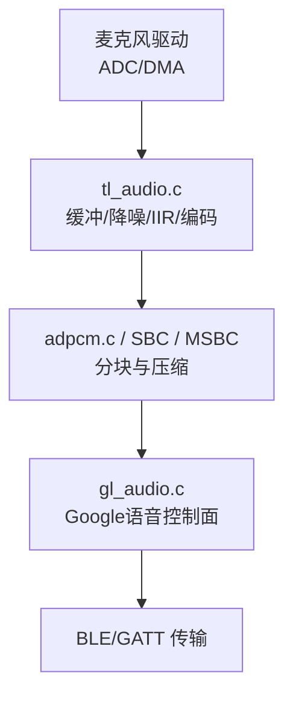
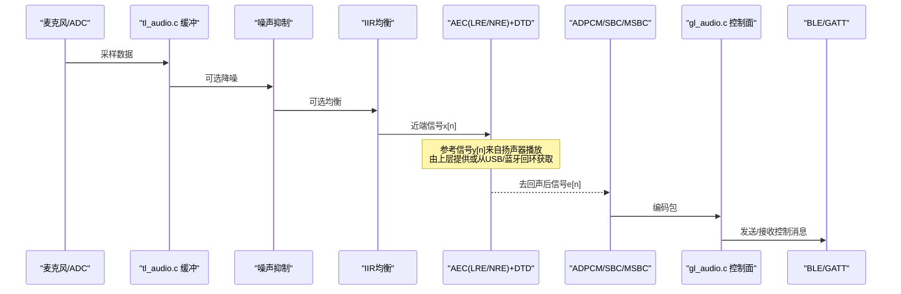
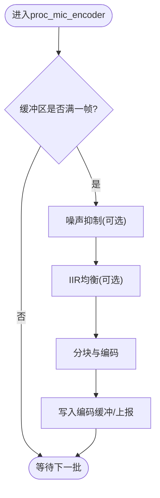
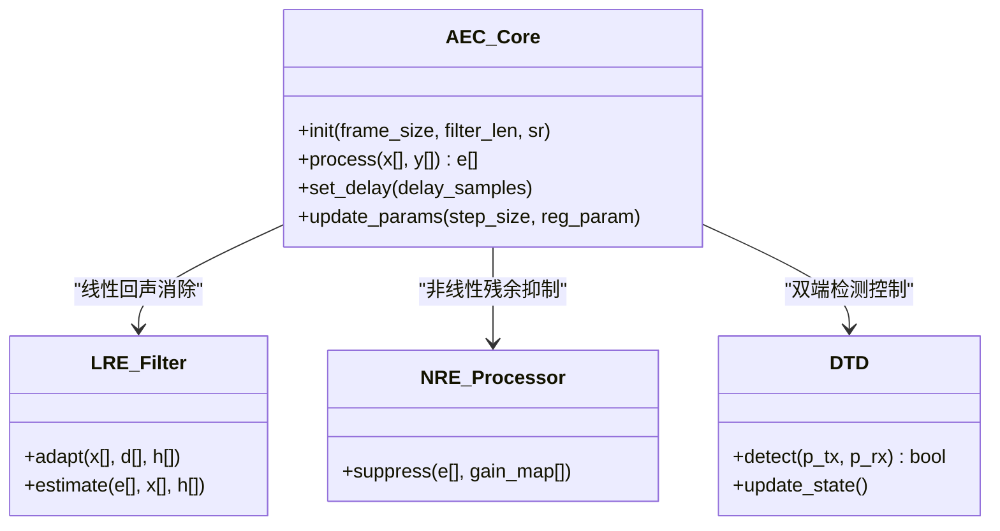
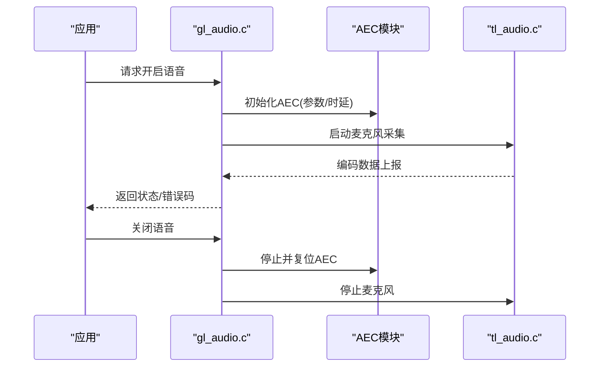
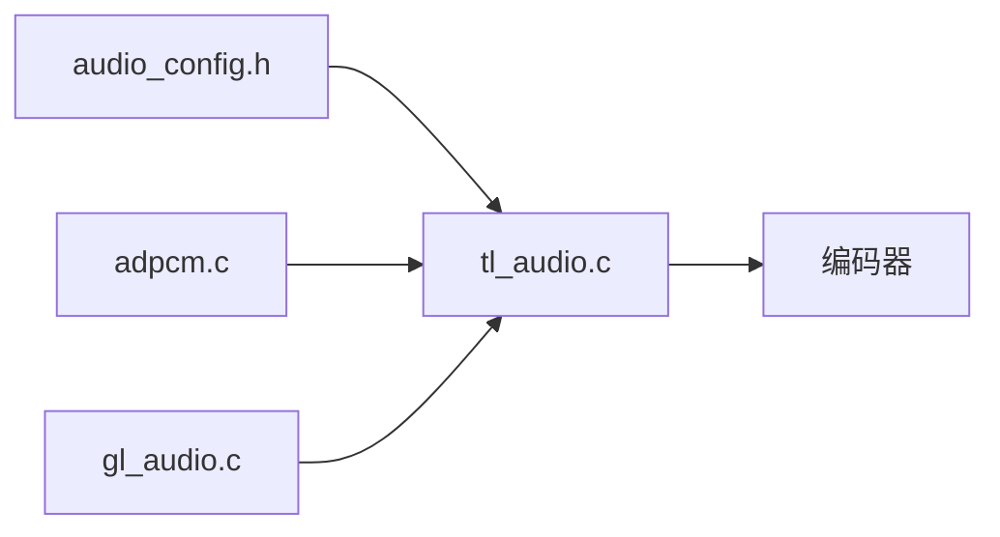

# 回声消除机制

<cite>
**本文引用的文件**
- [tl_audio.c](file://tc_ble_single_sdk/application/audio/tl_audio.c)
- [tl_audio.h](file://tc_ble_single_sdk/application/audio/tl_audio.h)
- [audio_config.h](file://tc_ble_single_sdk/application/audio/audio_config.h)
- [adpcm.c](file://tc_ble_single_sdk/application/audio/adpcm.c)
- [gl_audio.c](file://tc_ble_single_sdk/application/audio/gl_audio.c)
- [gl_audio.h](file://tc_ble_single_sdk/application/audio/gl_audio.h)
</cite>

## 目录
1. [简介](#简介)
2. [项目结构](#项目结构)
3. [核心组件](#核心组件)
4. [架构总览](#架构总览)
5. [详细组件分析](#详细组件分析)
6. [依赖关系分析](#依赖关系分析)
7. [性能考量](#性能考量)
8. [故障排查指南](#故障排查指南)
9. [结论](#结论)
10. [附录](#附录)

## 简介
本技术文档围绕该SDK中的音频采集与处理链路，系统梳理回声消除（AEC）相关能力与可集成点。当前代码库实现了：
- 麦克风采样缓冲、可选噪声抑制、IIR均衡滤波、ADPCM/SBC/MSBC编码与打包
- 基于Google语音协议的控制面（开启/关闭/能力协商/超时管理）
- 未直接实现线性回声消除（LRE）与非线性回声消除（NRE）的自适应滤波器、回声路径建模与时延估计模块；但提供了接入这些算法所需的信号通路、参数配置位与扩展点

因此，本文在“现有实现”的基础上，给出“如何在该SDK中集成LRE/NRE与双端检测（DTD）”的完整方案，包括初始化、收敛速度优化、稳定性控制、不同声学环境下的参数配置建议、测试方法与常见问题定位。

## 项目结构
与回声消除相关的代码主要位于应用层音频模块：
- 音频采集与预处理：tl_audio.c/.h
- 音频格式与帧长配置：audio_config.h
- 编解码与分块：adpcm.c（以及SBC/MSBC调用）
- Google语音控制面：gl_audio.c/.h

**图示来源**
- [tl_audio.c:323-418](file://tc_ble_single_sdk/application/audio/tl_audio.c#L323-L418)
- [adpcm.c:217-256](file://tc_ble_single_sdk/application/audio/adpcm.c#L217-L256)
- [gl_audio.c:54-180](file://tc_ble_single_sdk/application/audio/gl_audio.c#L54-L180)

**章节来源**
- [tl_audio.c:323-418](file://tc_ble_single_sdk/application/audio/tl_audio.c#L323-L418)
- [audio_config.h:28-74](file://tc_ble_single_sdk/application/audio/audio_config.h#L28-L74)
- [gl_audio.c:54-180](file://tc_ble_single_sdk/application/audio/gl_audio.c#L54-L180)

## 核心组件
- 麦克风缓冲与定时采集：按TL_MIC_BUFFER_SIZE与TL_MIC_ADPCM_UNIT_SIZE组织数据块，周期性读取并处理
- 可选噪声抑制：noise_suppression()，通过短时/长时能量统计与增益控制降低背景噪声
- IIR均衡滤波：voice_iir_OOB()/voice_iir()，支持带外低通与带内EQ，系数可从Flash加载
- 编码与打包：mic_to_adpcm_split()或SBC/MSBC编码器，输出固定长度包
- Google语音控制：gl_audio.c负责能力协商、开启/关闭、超时与按键事件

上述组件构成“上行音频流”的基础。回声消除应插入到“编码前”的信号链中，以原始或预处理的PCM为输入，以去回声后的PCM为输出。

**章节来源**
- [tl_audio.c:85-178](file://tc_ble_single_sdk/application/audio/tl_audio.c#L85-L178)
- [tl_audio.c:323-418](file://tc_ble_single_sdk/application/audio/tl_audio.c#L323-L418)
- [tl_audio.h:66-104](file://tc_ble_single_sdk/application/audio/tl_audio.h#L66-L104)
- [adpcm.c:217-256](file://tc_ble_single_sdk/application/audio/adpcm.c#L217-L256)
- [gl_audio.c:54-180](file://tc_ble_single_sdk/application/audio/gl_audio.c#L54-L180)

## 架构总览
下图展示在当前SDK中集成LRE/NRE与DTD的推荐位置与数据流：

**图示来源**
- [tl_audio.c:323-418](file://tc_ble_single_sdk/application/audio/tl_audio.c#L323-L418)
- [gl_audio.c:54-180](file://tc_ble_single_sdk/application/audio/gl_audio.c#L54-L180)

## 详细组件分析

### 麦克风采集与预处理链路
- 缓冲与周期处理：proc_mic_encoder()根据写指针差值判断是否达到一帧，批量处理TL_MIC_ADPCM_UNIT_SIZE个样本
- 噪声抑制：noise_suppression()维护短/长时能量与状态机，动态调整增益
- IIR均衡：voice_iir_OOB()用于带外低通，voice_iir()用于带内EQ；系数可通过filter_setting()从Flash加载并启用相应步骤
- 编码：mic_to_adpcm_split()将PCM切分为ADPCM包；SBC/MSBC模式调用对应编码器

**图示来源**
- [tl_audio.c:323-418](file://tc_ble_single_sdk/application/audio/tl_audio.c#L323-L418)
- [tl_audio.c:85-178](file://tc_ble_single_sdk/application/audio/tl_audio.c#L85-L178)
- [tl_audio.c:226-318](file://tc_ble_single_sdk/application/audio/tl_audio.c#L226-L318)

**章节来源**
- [tl_audio.c:323-418](file://tc_ble_single_sdk/application/audio/tl_audio.c#L323-L418)
- [tl_audio.c:85-178](file://tc_ble_single_sdk/application/audio/tl_audio.c#L85-L178)
- [tl_audio.c:226-318](file://tc_ble_single_sdk/application/audio/tl_audio.c#L226-L318)
- [tl_audio.h:66-104](file://tc_ble_single_sdk/application/audio/tl_audio.h#L66-L104)

### 回声消除器（LRE/NRE+DTD）集成方案
由于当前代码未包含AEC核心，建议在以下位置插入：
- 输入：IIR均衡后的PCM（或降噪后），作为近端信号x[n]
- 参考信号：y[n]来自扬声器播放路径（需在上层获取或从USB/蓝牙回环提取）
- 输出：去回声后信号e[n]，送入编码器

#### 自适应滤波器结构与回声路径建模
- LRE：采用FIR自适应滤波器（如NLMS/RLS）对回声路径进行建模，估计h[n]，输出估计回声ê[n]=x[n]*h[n]，误差e[n]=d[n]-ê[n]
- NRE：在LRE之后加入非线性处理器（如谱减法、半波整流+平滑、频域相乘等）抑制残余非线性失真
- 时延估计：使用广义互相关（GCC-PHAT）或子带互相关估计主时延τ0，并在LRE前后加延迟补偿

**图示来源**
- [tl_audio.c:323-418](file://tc_ble_single_sdk/application/audio/tl_audio.c#L323-L418)
- [gl_audio.c:54-180](file://tc_ble_single_sdk/application/audio/gl_audio.c#L54-L180)

#### 双端检测（DTD）机制
- 目的：区分远端语音（P-Talk）与近端语音（U-Talk），避免在双向通话中误抑制
- 方法：基于能量比、谱差异、相关性等特征计算P_Tx与P_Rx，结合状态机切换工作模式（适应/冻结/快速更新）
- 集成点：在AEC内部或外部模块，依据DTD结果控制LRE步长与NRE强度

#### 初始化、收敛速度与稳定性控制
- 初始化：设置滤波器长度、采样率、初始步长、正则化参数、时延估计窗口
- 收敛速度：初期较大步长加速收敛，随后自适应衰减；可引入归一化步长保证稳定
- 稳定性：限制权重更新幅度、引入泄漏项、在双讲时冻结或降速更新
- 时延估计：定期重估并平滑，防止跳变

**章节来源**
- [tl_audio.c:323-418](file://tc_ble_single_sdk/application/audio/tl_audio.c#L323-L418)
- [gl_audio.c:54-180](file://tc_ble_single_sdk/application/audio/gl_audio.c#L54-L180)

### Google语音控制面与AEC联动
- 能力协商：gl_audio.c响应CAP命令，声明支持的编码与帧长
- 开启/关闭：OPEN/CLOSE控制麦克风流，AEC应在MIC开启时初始化，关闭时复位
- 超时处理：超时自动关闭，AEC需释放资源并重置状态

**图示来源**
- [gl_audio.c:54-180](file://tc_ble_single_sdk/application/audio/gl_audio.c#L54-L180)
- [gl_audio.c:213-355](file://tc_ble_single_sdk/application/audio/gl_audio.c#L213-L355)

**章节来源**
- [gl_audio.c:54-180](file://tc_ble_single_sdk/application/audio/gl_audio.c#L54-L180)
- [gl_audio.c:213-355](file://tc_ble_single_sdk/application/audio/gl_audio.c#L213-L355)

## 依赖关系分析
- tl_audio.c依赖audio_config.h定义的帧长与缓冲大小，决定AEC的帧尺寸与延迟预算
- adpcm.c提供分块与预测器状态，AEC需与之对齐帧边界
- gl_audio.c提供控制面，AEC的生命周期与其一致

**图示来源**
- [audio_config.h:28-74](file://tc_ble_single_sdk/application/audio/audio_config.h#L28-L74)
- [tl_audio.c:323-418](file://tc_ble_single_sdk/application/audio/tl_audio.c#L323-L418)
- [adpcm.c:217-256](file://tc_ble_single_sdk/application/audio/adpcm.c#L217-L256)
- [gl_audio.c:54-180](file://tc_ble_single_sdk/application/audio/gl_audio.c#L54-L180)

**章节来源**
- [audio_config.h:28-74](file://tc_ble_single_sdk/application/audio/audio_config.h#L28-L74)
- [tl_audio.c:323-418](file://tc_ble_single_sdk/application/audio/tl_audio.c#L323-L418)
- [adpcm.c:217-256](file://tc_ble_single_sdk/application/audio/adpcm.c#L217-L256)
- [gl_audio.c:54-180](file://tc_ble_single_sdk/application/audio/gl_audio.c#L54-L180)

## 性能考量
- 延迟预算：AEC处理延迟+编码延迟需满足端到端RTT要求；建议单帧≤10ms
- 复杂度：FIR滤波器长度与步长影响CPU占用；可在低功耗模式下缩短滤波器或降低更新频率
- 内存：缓冲与滤波器状态需合理分配；注意DMA与CPU访问冲突
- 稳定性：在强混响与双讲场景下，需提高正则化与冻结策略阈值

[本节为通用指导，不直接分析具体文件]

## 故障排查指南
- 无回声消除效果
  - 检查参考信号y[n]是否正确注入AEC
  - 确认AEC初始化参数（采样率、帧长、滤波器长度）与tl_audio.c一致
  - 验证IIR均衡与噪声抑制未过度改变信号特性
- 语音被误抑制
  - 调整DTD阈值，避免在U-Talk时冻结过久
  - 降低NRE强度，减少近端语音损伤
- 不稳定/啸叫
  - 增大正则化参数，限制步长上限
  - 增加泄漏项，防止权重发散
- 时延估计漂移
  - 缩短重估窗口，增加平滑
  - 在双讲或突发噪声时冻结时延更新

**章节来源**
- [tl_audio.c:323-418](file://tc_ble_single_sdk/application/audio/tl_audio.c#L323-L418)
- [tl_audio.c:85-178](file://tc_ble_single_sdk/application/audio/tl_audio.c#L85-L178)
- [gl_audio.c:54-180](file://tc_ble_single_sdk/application/audio/gl_audio.c#L54-L180)

## 结论
该SDK已具备完整的麦克风采集、预处理与编码链路，并为集成LRE/NRE与DTD提供了清晰的扩展点。通过在IIR均衡后、编码前插入AEC模块，并结合Google语音控制面的生命周期管理，可实现稳定的回声消除。实际部署中需根据房间大小、麦克风布局与扬声器位置调优参数，并通过系统化测试验证性能。

[本节为总结性内容，不直接分析具体文件]

## 附录

### 回声消除参数配置指南（按声学环境）
- 小房间（<10㎡）
  - 滤波器长度：较短（如128-256抽）
  - 步长：中等偏大，快速收敛
  - 时延估计：窗口较小，更新频繁
- 中房间（10-30㎡）
  - 滤波器长度：中等（256-512抽）
  - 步长：自适应衰减，兼顾收敛与稳定
  - 时延估计：适度平滑，防跳变
- 大房间/强混响（>30㎡）
  - 滤波器长度：较长（512-1024抽）
  - 步长：较小，增强稳定性
  - 时延估计：更长窗口，更强平滑
- 麦克风布局
  - 单麦：重点优化DTD与NRE，避免近端损伤
  - 双麦/阵列：可利用空间滤波辅助AEC，提升鲁棒性
- 扬声器位置
  - 靠近麦克风：需更强非线性处理与更稳健的时延估计
  - 远离麦克风：可适当放宽滤波器长度与步长

[本节为通用指导，不直接分析具体文件]

### 性能测试方法
- 单端测试
  - 播放粉红噪声/白噪声，测量ERLE（回声损耗）与收敛时间
  - 在不同声压级下评估NR（噪声残留）与语音质量（PESQ/STOI）
- 双端测试
  - 模拟双向通话，验证DTD正确性与AEC在双讲时的稳定性
  - 测量端到端延迟与丢帧率
- 环境遍历
  - 不同房间体积、家具布置、温湿度条件
  - 不同麦克风增益与IIR均衡设置组合

[本节为通用指导，不直接分析具体文件]