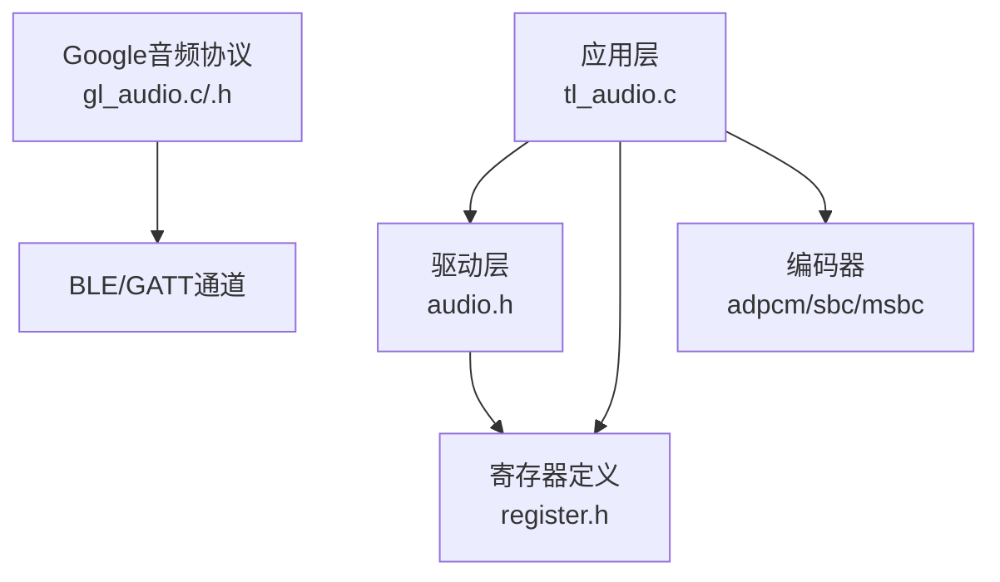
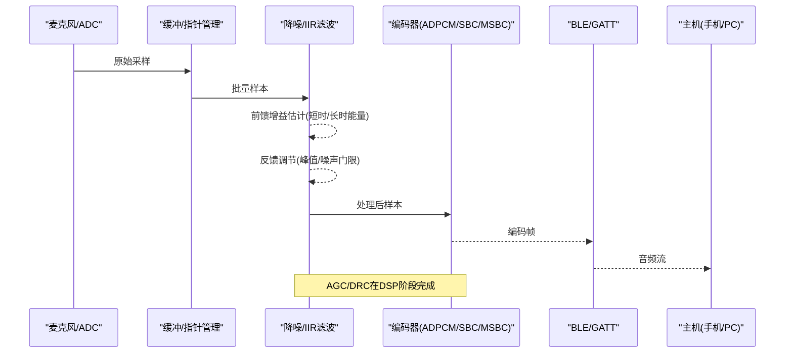
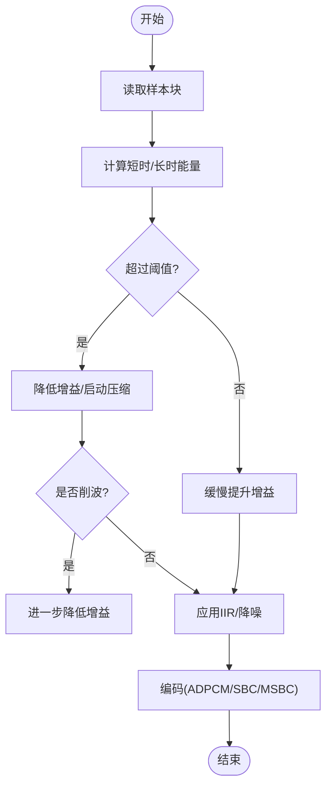
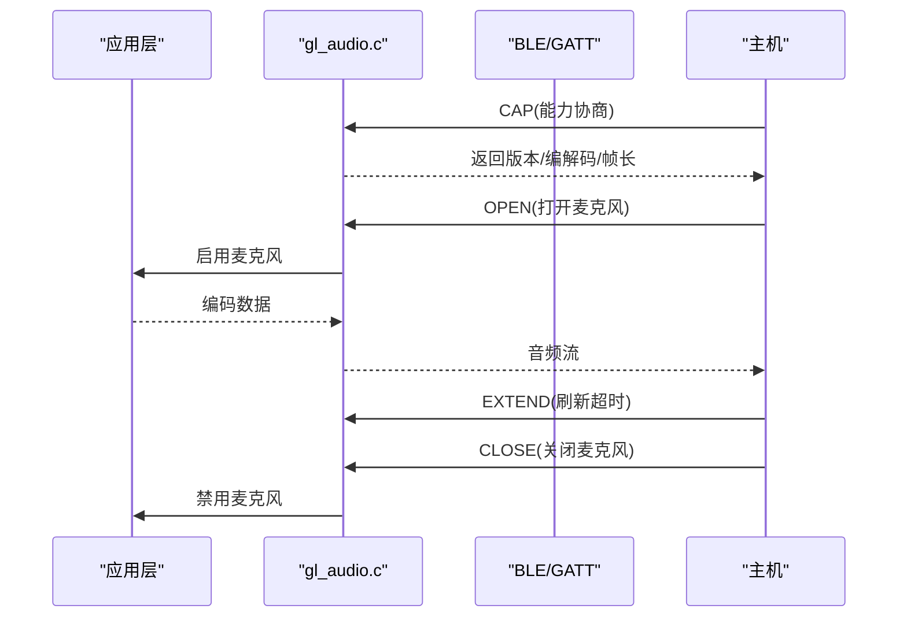
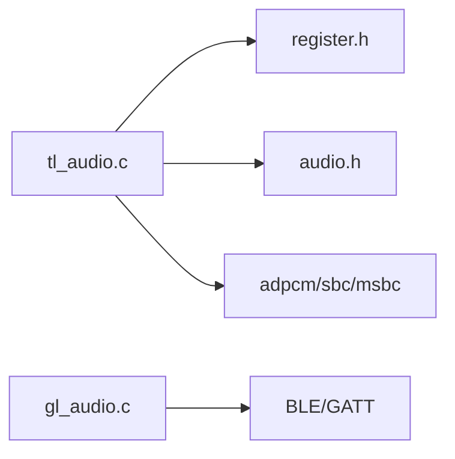

# 音量自适应控制

<cite>
**本文引用的文件**
- [tl_audio.h](file://tc_ble_single_sdk/application/audio/tl_audio.h)
- [tl_audio.c](file://tc_ble_single_sdk/application/audio/tl_audio.c)
- [audio_config.h](file://tc_ble_single_sdk/application/audio/audio_config.h)
- [audio_common.h](file://tc_ble_single_sdk/application/audio/audio_common.h)
- [gl_audio.h](file://tc_ble_single_sdk/application/audio/gl_audio.h)
- [gl_audio.c](file://tc_ble_single_sdk/application/audio/gl_audio.c)
- [register.h](file://tc_ble_single_sdk/drivers/B85/register.h)
- [audio.h](file://tc_ble_single_sdk/drivers/B85/audio.h)
</cite>

## 目录
1. [简介](#简介)
2. [项目结构](#项目结构)
3. [核心组件](#核心组件)
4. [架构总览](#架构总览)
5. [详细组件分析](#详细组件分析)
6. [依赖关系分析](#依赖关系分析)
7. [性能考虑](#性能考虑)
8. [故障排查指南](#故障排查指南)
9. [结论](#结论)
10. [附录](#附录)

## 简介
本技术文档围绕“音量自适应控制系统”展开，聚焦于自动增益控制（AGC）与动态范围压缩（DRC）在音频采集链路中的实现与调优。结合代码库中的硬件寄存器、数字滤波、噪声抑制与编码流程，系统通过前馈控制（基于输入信号统计的增益估计）与反馈控制（基于输出峰值/噪声检测的闭环调节）相结合，维持语音信号的动态范围在最佳区间，避免削波失真并提升可懂度。

本仓库提供了：
- 麦克风采样与缓冲管理
- 可选的数字降噪与IIR均衡滤波
- 多种编码路径（ADPCM/SBC/MSBC）
- AGC/DRC相关寄存器配置能力（B85平台）
- Google GATT音频协议交互（用于通话/会议场景的流控）

## 项目结构
与音量自适应控制相关的核心目录与文件：
- 应用层音频处理：application/audio/*（tl_audio.*、gl_audio.*、audio_config.h、audio_common.h）
- 驱动层音频接口与寄存器：drivers/B85/*（audio.h、register.h）
- 平台寄存器定义：drivers/B85/register.h（ALC/PGA等寄存器位域）

图表来源
- [tl_audio.c:179-318](file://tc_ble_single_sdk/application/audio/tl_audio.c#L179-L318)
- [audio.h:131-168](file://tc_ble_single_sdk/drivers/B85/audio.h#L131-L168)
- [register.h:1087-1133](file://tc_ble_single_sdk/drivers/B85/register.h#L1087-L1133)
- [gl_audio.c:213-354](file://tc_ble_single_sdk/application/audio/gl_audio.c#L213-L354)

章节来源
- [tl_audio.c:179-318](file://tc_ble_single_sdk/application/audio/tl_audio.c#L179-L318)
- [audio_config.h:28-122](file://tc_ble_single_sdk/application/audio/audio_config.h#L28-L122)
- [audio_common.h:27-79](file://tc_ble_single_sdk/application/audio/audio_common.h#L27-L79)

## 核心组件
- 音量设置与增益控制
  - 提供统一的音量设置入口，支持不同MCU核心的寄存器写入，包含数字模式最小音量、模拟PGA固定增益等。
- IIR滤波器与降噪
  - 可选IIR均衡（内带/外带）与低通滤波；可选数字降噪模块，按短/长时统计自适应调整增益。
- 编码流水线
  - ADPCM/SBC/MSBC多路径，统一从麦克风缓冲读取数据，经降噪/滤波后进入编码器。
- Google音频协议交互
  - 处理MIC_OPEN/CLOSE/CAP/EXTEND等命令，控制麦克风开关、超时与流控，适配通话/会议场景。
- 硬件AGC/PGA寄存器
  - 提供ALC阈值、步进、目标值、噪声门限、衰减时间等可调参数，支持模拟/数字两种模式。

章节来源
- [tl_audio.h:66-113](file://tc_ble_single_sdk/application/audio/tl_audio.h#L66-L113)
- [tl_audio.c:179-318](file://tc_ble_single_sdk/application/audio/tl_audio.c#L179-L318)
- [tl_audio.c:338-418](file://tc_ble_single_sdk/application/audio/tl_audio.c#L338-L418)
- [gl_audio.c:213-354](file://tc_ble_single_sdk/application/audio/gl_audio.c#L213-L354)
- [register.h:1087-1133](file://tc_ble_single_sdk/drivers/B85/register.h#L1087-L1133)

## 架构总览
下图展示从麦克风到编码输出的完整链路，以及AGC/DRC的嵌入点。

图表来源
- [tl_audio.c:338-418](file://tc_ble_single_sdk/application/audio/tl_audio.c#L338-L418)
- [tl_audio.c:444-525](file://tc_ble_single_sdk/application/audio/tl_audio.c#L444-L525)
- [tl_audio.c:552-633](file://tc_ble_single_sdk/application/audio/tl_audio.c#L552-L633)
- [gl_audio.c:213-354](file://tc_ble_single_sdk/application/audio/gl_audio.c#L213-L354)

## 详细组件分析

### 自动增益控制（AGC）与动态范围压缩（DRC）
- 前馈控制（Feedforward）
  - 基于短时/长时能量估计，判断当前信号强度，估算所需增益，避免突发大信号导致削波。
  - 代码中体现为对输入样本进行幅度统计（如绝对值累加、指数平滑），并据此调整内部增益因子。
- 反馈控制（Feedback）
  - 监测输出峰值或噪声底噪，触发阈值比较，动态降低增益或启动压缩，防止过载。
  - 寄存器层面提供ALC阈值、步进、目标值、噪声门限、衰减时间等，形成闭环调节。
- 关键实现点
  - 数字音量设置：根据MCU核心写入相应寄存器，支持手动/自动模式切换。
  - 模拟PGA固定增益：在非DMIC模式下，可通过固定增益寄存器设定初始放大倍数。
  - 滤波器与降噪：IIR均衡与低通滤波改善频响，降噪模块在静音段降低增益，在语音段恢复增益。

图表来源
- [tl_audio.c:66-104](file://tc_ble_single_sdk/application/audio/tl_audio.c#L66-L104)
- [tl_audio.c:179-318](file://tc_ble_single_sdk/application/audio/tl_audio.c#L179-L318)
- [register.h:1087-1133](file://tc_ble_single_sdk/drivers/B85/register.h#L1087-L1133)

章节来源
- [tl_audio.c:66-104](file://tc_ble_single_sdk/application/audio/tl_audio.c#L66-L104)
- [tl_audio.c:179-318](file://tc_ble_single_sdk/application/audio/tl_audio.c#L179-L318)
- [register.h:1087-1133](file://tc_ble_single_sdk/drivers/B85/register.h#L1087-L1133)

### 音量检测算法
- 能量估计
  - 使用短时与长时滑动平均，分别捕捉瞬态变化与稳态趋势，提高鲁棒性。
- 噪声门限
  - 当检测到持续低于噪声门限时，逐步降低增益，减少背景噪声放大。
- 峰值检测
  - 监控输出峰值，若接近满量程则快速降低增益，避免削波。

章节来源
- [tl_audio.c:66-104](file://tc_ble_single_sdk/application/audio/tl_audio.c#L66-L104)
- [register.h:1087-1133](file://tc_ble_single_sdk/drivers/B85/register.h#L1087-L1133)

### 增益调整策略与响应时间控制
- 调整步长与方向
  - 上升步长较小，下降步长较大，确保语音出现时快速提升，同时避免过冲。
- 时间常数
  - 通过寄存器设置衰减时间与噪声门限时间，平衡响应速度与稳定性。
- 模式选择
  - 数字模式与模拟模式可独立配置，适应不同硬件路径与功耗需求。

章节来源
- [register.h:1087-1133](file://tc_ble_single_sdk/drivers/B85/register.h#L1087-L1133)
- [tl_audio.c:179-318](file://tc_ble_single_sdk/application/audio/tl_audio.c#L179-L318)

### 应用场景参数配置
- 通话模式
  - 强调语音清晰度与抗噪，建议启用降噪模块，适度提高低电平增益，限制最大增益以防啸叫。
- 媒体播放模式
  - 注重动态范围与保真，可降低压缩比，保留更多细节，避免过度增益。
- 会议模式
  - 多说话人场景需快速响应与稳定增益，建议缩短上升时间，合理设置噪声门限，避免多人同时说话时的增益波动。

章节来源
- [tl_audio.c:66-104](file://tc_ble_single_sdk/application/audio/tl_audio.c#L66-L104)
- [register.h:1087-1133](file://tc_ble_single_sdk/drivers/B85/register.h#L1087-L1133)

### Google音频协议与流控（通话/会议）
- 命令处理
  - MIC_OPEN/MIC_CLOSE/CAP/EXTEND等命令控制麦克风开关、能力协商与超时刷新。
- 模型选择
  - 支持HTT/PTT/On-Request三种交互模型，适配不同设备与使用场景。
- 超时保护
  - 长时间无活动自动关闭麦克风，节省功耗并避免误开启。

图表来源
- [gl_audio.c:213-354](file://tc_ble_single_sdk/application/audio/gl_audio.c#L213-L354)
- [gl_audio.h:75-143](file://tc_ble_single_sdk/application/audio/gl_audio.h#L75-L143)

章节来源
- [gl_audio.c:213-354](file://tc_ble_single_sdk/application/audio/gl_audio.c#L213-L354)
- [gl_audio.h:75-143](file://tc_ble_single_sdk/application/audio/gl_audio.h#L75-L143)

### 量化评估指标与调试方法
- 指标
  - 信噪比（SNR）：衡量语音与背景噪声的比例。
  - 总谐波失真（THD）：评估非线性失真程度。
  - 动态范围：最大不失真信号与噪声底之间的范围。
  - 延迟：端到端处理延迟，影响实时性。
- 调试
  - 使用示波器/频谱仪观察输入输出波形与频谱。
  - 通过寄存器读取当前增益、峰值计数、噪声门限状态。
  - 调整IIR系数与降噪参数，对比主观听感与客观指标。

[本节为通用指导，不直接分析具体文件]

## 依赖关系分析
- 应用层依赖驱动层提供的音频初始化、缓冲访问与寄存器操作。
- 寄存器定义集中管理ALC/PGA等关键参数，便于跨平台复用。
- Google协议模块与应用层耦合，负责会话管理与流控。

图表来源
- [tl_audio.c:179-318](file://tc_ble_single_sdk/application/audio/tl_audio.c#L179-L318)
- [register.h:1087-1133](file://tc_ble_single_sdk/drivers/B85/register.h#L1087-L1133)
- [audio.h:131-168](file://tc_ble_single_sdk/drivers/B85/audio.h#L131-L168)
- [gl_audio.c:213-354](file://tc_ble_single_sdk/application/audio/gl_audio.c#L213-L354)

章节来源
- [tl_audio.c:179-318](file://tc_ble_single_sdk/application/audio/tl_audio.c#L179-L318)
- [register.h:1087-1133](file://tc_ble_single_sdk/drivers/B85/register.h#L1087-L1133)
- [audio.h:131-168](file://tc_ble_single_sdk/drivers/B85/audio.h#L131-L168)
- [gl_audio.c:213-354](file://tc_ble_single_sdk/application/audio/gl_audio.c#L213-L354)

## 性能考虑
- 计算复杂度
  - IIR滤波与降噪为逐样本运算，需保证每帧处理时间满足实时要求。
- 内存占用
  - 缓冲区大小与包数量影响延迟与丢包风险，需根据带宽与处理能力权衡。
- 功耗优化
  - 在无语音时降低增益并关闭不必要的处理模块，延长电池寿命。
- 稳定性
  - 合理设置AGC阈值与步进，避免增益振荡与瞬态失真。

[本节为通用指导，不直接分析具体文件]

## 故障排查指南
- 常见问题
  - 声音过小：检查数字音量设置与PGA固定增益，确认AGC阈值与步进。
  - 声音过大/削波：提高压缩比，降低最大增益，检查峰值检测逻辑。
  - 噪声过大：启用降噪模块，调整噪声门限与衰减时间。
  - 延迟过高：减小缓冲区大小，优化滤波与编码路径。
- 调试步骤
  - 读取寄存器状态，确认AGC工作模式与当前增益。
  - 逐步关闭降噪与滤波，定位问题模块。
  - 使用外部工具测量输入输出，验证参数效果。

章节来源
- [tl_audio.c:179-318](file://tc_ble_single_sdk/application/audio/tl_audio.c#L179-L318)
- [register.h:1087-1133](file://tc_ble_single_sdk/drivers/B85/register.h#L1087-L1133)

## 结论
该音量自适应控制系统通过前馈与反馈相结合的AGC策略，配合IIR滤波与降噪模块，有效维持语音信号的动态范围，避免削波失真，并适应通话、媒体播放与会议等多种场景。借助寄存器级AGC/PGA配置与Google音频协议流控，系统在实时性与稳定性方面具备良好表现。实际应用中需根据环境噪声、设备特性与用户体验目标，精细调优各参数以获得最佳效果。

[本节为总结性内容，不直接分析具体文件]

## 附录
- 关键函数与路径
  - 音量设置：[Audio_VolumeSet:179-196](file://tc_ble_single_sdk/application/audio/tl_audio.c#L179-L196)
  - 滤波器设置：[filter_setting:226-318](file://tc_ble_single_sdk/application/audio/tl_audio.c#L226-L318)
  - 降噪函数：[noise_suppression:73-104](file://tc_ble_single_sdk/application/audio/tl_audio.h#L73-L104)
  - 编码流程（ADPCM）：[proc_mic_encoder:338-418](file://tc_ble_single_sdk/application/audio/tl_audio.c#L338-L418)
  - 编码流程（SBC）：[proc_mic_encoder:444-525](file://tc_ble_single_sdk/application/audio/tl_audio.c#L444-L525)
  - 编码流程（MSBC）：[proc_mic_encoder:552-633](file://tc_ble_single_sdk/application/audio/tl_audio.c#L552-L633)
  - Google协议回调：[app_auido_google_callback:213-354](file://tc_ble_single_sdk/application/audio/gl_audio.c#L213-L354)
- 寄存器参考
  - ALC/PGA寄存器定义：[register.h:1087-1133](file://tc_ble_single_sdk/drivers/B85/register.h#L1087-L1133)

[本节为索引性内容，不直接分析具体文件]