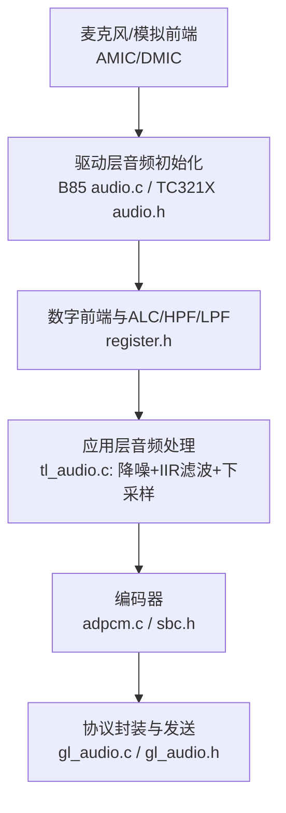
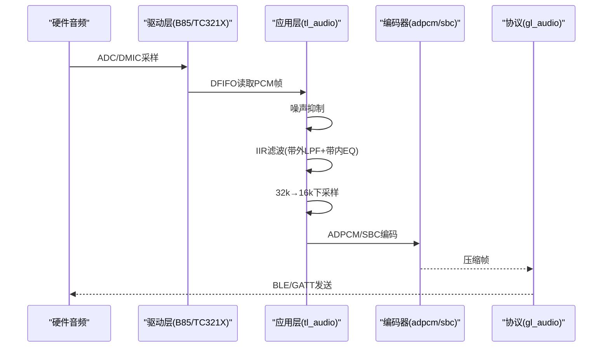
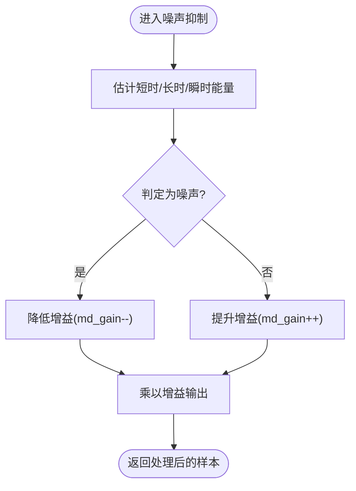
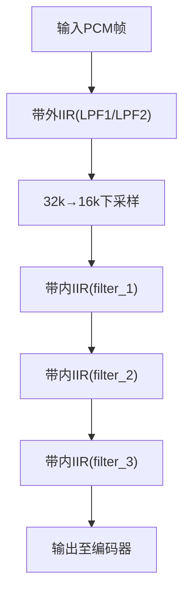
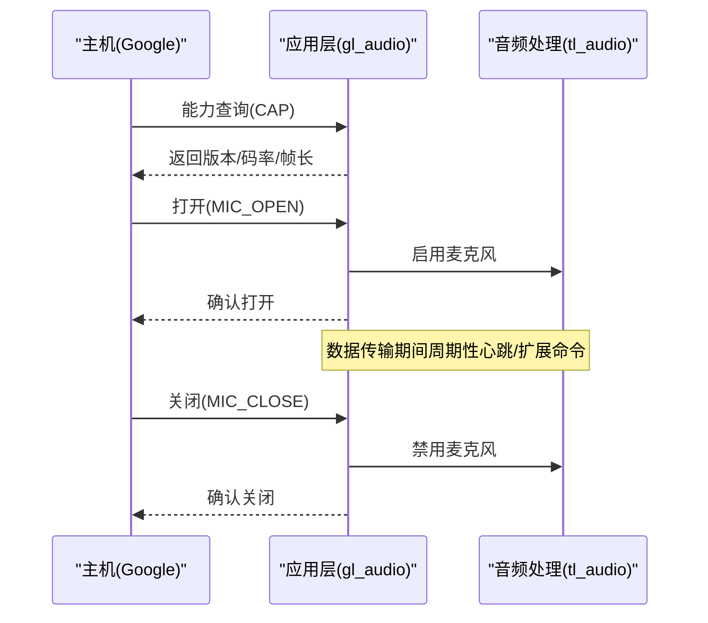
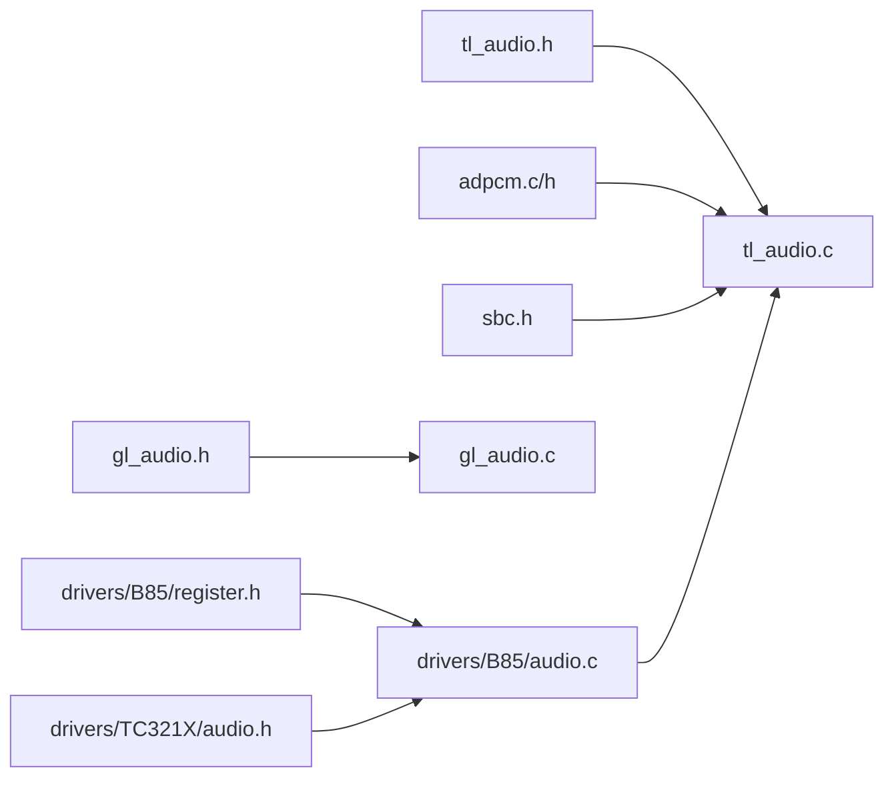

# 音频质量控制

<cite>
**本文引用的文件**
- [tl_audio.c](file://tc_ble_single_sdk/application/audio/tl_audio.c)
- [tl_audio.h](file://tc_ble_single_sdk/application/audio/tl_audio.h)
- [audio_config.h](file://tc_ble_single_sdk/application/audio/audio_config.h)
- [gl_audio.c](file://tc_ble_single_sdk/application/audio/gl_audio.c)
- [gl_audio.h](file://tc_ble_single_sdk/application/audio/gl_audio.h)
- [adpcm.c](file://tc_ble_single_sdk/application/audio/adpcm.c)
- [adpcm.h](file://tc_ble_single_sdk/application/audio/adpcm.h)
- [sbc.h](file://tc_ble_single_sdk/application/audio/sbc.h)
- [audio.c](file://tc_ble_single_sdk/drivers/B85/audio.c)
- [audio.h](file://tc_ble_single_sdk/drivers/B85/audio.h)
- [register.h](file://tc_ble_single_sdk/drivers/B85/register.h)
- [audio.h (TC321X)](file://tc_ble_single_sdk/drivers/TC321X/audio.h)
</cite>

## 目录
1. [简介](#简介)
2. [项目结构](#项目结构)
3. [核心组件](#核心组件)
4. [架构总览](#架构总览)
5. [详细组件分析](#详细组件分析)
6. [依赖关系分析](#依赖关系分析)
7. [性能考虑](#性能考虑)
8. [故障排查指南](#故障排查指南)
9. [结论](#结论)
10. [附录](#附录)

## 简介
本技术文档面向“音频质量控制子系统”，聚焦于噪声抑制、IIR滤波（含带外与带内均衡）、采样率转换、音量与增益控制、以及编码链路（ADPCM/SBC）等关键环节。文档基于仓库中的应用层音频处理与驱动层音频模块，梳理数据流与控制流，给出可操作的配置要点与调优建议。同时提供质量评估方法与调试工具使用指引，帮助在不同环境下实现稳定、高质的语音采集与传输。

## 项目结构
- 应用层音频：位于 application/audio，负责音频采集后处理（降噪、滤波、重采样）、编码（ADPCM/SBC）、以及与上层协议（如Google GATT）的交互控制。
- 驱动层音频：位于 drivers/B85 或 drivers/TC321X，负责ADC/DMIC/I2S输入、PGA/ALC、DFIFO、时钟与输出路径（SDM/I2S/USB）等底层能力。
- 配置文件：application/audio/audio_config.h 集中定义不同音频模式下的帧长、缓冲大小、包长等关键参数。

图表来源
- [audio.c:92-237](file://tc_ble_single_sdk/drivers/B85/audio.c#L92-L237)
- [tl_audio.c:346-418](file://tc_ble_single_sdk/application/audio/tl_audio.c#L346-L418)
- [gl_audio.c:213-354](file://tc_ble_single_sdk/application/audio/gl_audio.c#L213-L354)

章节来源
- [audio_config.h:28-123](file://tc_ble_single_sdk/application/audio/audio_config.h#L28-L123)
- [tl_audio.c:323-418](file://tc_ble_single_sdk/application/audio/tl_audio.c#L323-L418)
- [gl_audio.c:24-354](file://tc_ble_single_sdk/application/audio/gl_audio.c#L24-L354)

## 核心组件
- 噪声抑制：在每帧采样进入编码前进行幅度自适应衰减，抑制稳态噪声并避免削波。
- IIR滤波与均衡：包含带外低通（LPF）与带内三段EQ，支持从Flash加载系数与移位量，灵活适配不同声学环境。
- 采样率转换：将32kHz采样降至16kHz，降低带宽与计算开销。
- 音量与增益控制：通过寄存器设置数字音量、PGA预/后级增益，支持手动与自动模式。
- 编码链路：ADPCM与SBC两种编码路径，按模式选择；SBC用于更高质量场景。
- 协议控制：Google GATT模式下的开/关麦克风、能力协商、超时保护等。

章节来源
- [tl_audio.h:66-113](file://tc_ble_single_sdk/application/audio/tl_audio.h#L66-L113)
- [tl_audio.c:86-178](file://tc_ble_single_sdk/application/audio/tl_audio.c#L86-L178)
- [tl_audio.c:226-318](file://tc_ble_single_sdk/application/audio/tl_audio.c#L226-L318)
- [adpcm.c:217-256](file://tc_ble_single_sdk/application/audio/adpcm.c#L217-L256)
- [sbc.h:44-55](file://tc_ble_single_sdk/application/audio/sbc.h#L44-L55)
- [gl_audio.c:213-354](file://tc_ble_single_sdk/application/audio/gl_audio.c#L213-L354)

## 架构总览
下图展示从采集到编码再到协议封装的完整流程，突出质量控制关键点（降噪、滤波、下采样、编码）。

图表来源
- [tl_audio.c:346-418](file://tc_ble_single_sdk/application/audio/tl_audio.c#L346-L418)
- [tl_audio.c:86-178](file://tc_ble_single_sdk/application/audio/tl_audio.c#L86-L178)
- [adpcm.c:217-256](file://tc_ble_single_sdk/application/audio/adpcm.c#L217-L256)
- [gl_audio.c:213-354](file://tc_ble_single_sdk/application/audio/gl_audio.c#L213-L354)

## 详细组件分析

### 噪声抑制算法与配置
- 原理概述
  - 采用短时/长时能量估计与瞬时能量比较，判断当前是否处于噪声段。
  - 在噪声段逐步降低增益，在语音段恢复增益，实现平滑的自适应衰减。
  - 阈值与时间常数由静态变量与位移运算实现，适合嵌入式实时处理。
- 关键位置
  - 函数接口与状态变量声明：[tl_audio.h:66-105](file://tc_ble_single_sdk/application/audio/tl_audio.h#L66-L105)
  - 各模式下调用点：[tl_audio.c:346-352](file://tc_ble_single_sdk/application/audio/tl_audio.c#L346-L352)、[tl_audio.c:563-568](file://tc_ble_single_sdk/application/audio/tl_audio.c#L563-L568)、[tl_audio.c:661-666](file://tc_ble_single_sdk/application/audio/tl_audio.c#L661-L666)、[tl_audio.c:764-769](file://tc_ble_single_sdk/application/audio/tl_audio.c#L764-L769)
- 配置要点
  - 启用开关：TL_NOISE_SUPPRESSION_ENABLE（默认关闭，需按需开启）
  - 阈值与时间常数：可通过调整内部静态阈值与位移比例优化响应速度与稳定性
  - 适用场景：稳态噪声（风扇、空调）抑制效果较好；突发噪声需谨慎调参

图表来源
- [tl_audio.h:73-104](file://tc_ble_single_sdk/application/audio/tl_audio.h#L73-L104)

章节来源
- [tl_audio.h:66-105](file://tc_ble_single_sdk/application/audio/tl_audio.h#L66-L105)
- [tl_audio.c:346-352](file://tc_ble_single_sdk/application/audio/tl_audio.c#L346-L352)
- [tl_audio.c:563-568](file://tc_ble_single_sdk/application/audio/tl_audio.c#L563-L568)
- [tl_audio.c:661-666](file://tc_ble_single_sdk/application/audio/tl_audio.c#L661-L666)
- [tl_audio.c:764-769](file://tc_ble_single_sdk/application/audio/tl_audio.c#L764-L769)

### IIR滤波与频谱分析（带外LPF与带内EQ）
- 原理概述
  - 带外处理：两段低通滤波器（LPF），用于抑制高频噪声与混叠。
  - 带内处理：三段IIR均衡器，增强语音频段、抑制干扰频段。
  - 系数与移位量可从Flash加载，便于产线校准与环境适配。
- 关键位置
  - 带外IIR实现：[tl_audio.c:86-126](file://tc_ble_single_sdk/application/audio/tl_audio.c#L86-L126)
  - 带内IIR实现：[tl_audio.c:138-178](file://tc_ble_single_sdk/application/audio/tl_audio.c#L138-L178)
  - Flash加载与生效标志：[tl_audio.c:226-318](file://tc_ble_single_sdk/application/audio/tl_audio.c#L226-L318)
  - 调用顺序（可选）：带外LPF → 32k→16k下采样 → 带内EQ
- 配置要点
  - 开关：IIR_FILTER_ENABLE
  - 系数数组：filter_1/2/3、LPF_FILTER_1/2
  - 移位量：filter1_shift/2/3、lpf_filter1_shift/2
  - 动态切换：filter_step_enable位控制各阶段是否执行

图表来源
- [tl_audio.c:86-178](file://tc_ble_single_sdk/application/audio/tl_audio.c#L86-L178)
- [tl_audio.c:226-318](file://tc_ble_single_sdk/application/audio/tl_audio.c#L226-L318)

章节来源
- [tl_audio.c:86-178](file://tc_ble_single_sdk/application/audio/tl_audio.c#L86-L178)
- [tl_audio.c:226-318](file://tc_ble_single_sdk/application/audio/tl_audio.c#L226-L318)

### 采样率转换（32k→16k）
- 实现方式
  - 简单抽取：每隔一个采样取一个点，实现降采样。
- 关键位置
  - 抽取函数：[tl_audio.c:129-135](file://tc_ble_single_sdk/application/audio/tl_audio.c#L129-L135)
  - 调用时机：在带外LPF之后、带内EQ之前（可选路径）
- 注意事项
  - 若未启用带外LPF，直接抽取可能引入混叠；建议先做低通再抽取。
  - 根据实际带宽需求决定是否启用该步骤。

章节来源
- [tl_audio.c:129-135](file://tc_ble_single_sdk/application/audio/tl_audio.c#L129-L135)
- [tl_audio.c:354-367](file://tc_ble_single_sdk/application/audio/tl_audio.c#L354-L367)

### 音量自适应控制、动态范围压缩与自动增益控制(AGC)
- 数字音量与PGA
  - 数字音量设置：[tl_audio.c:180-196](file://tc_ble_single_sdk/application/audio/tl_audio.c#L180-L196)
  - PGA固定增益与前后级设置：[audio.c:166-173](file://tc_ble_single_sdk/drivers/B85/audio.c#L166-L173)、[audio.c:358-360](file://tc_ble_single_sdk/drivers/B85/audio.c#L358-L360)
  - 寄存器位域定义（ALC/PGA）：[register.h:1087-1148](file://tc_ble_single_sdk/drivers/B85/register.h#L1087-L1148)
- 自动增益控制(ALC)
  - 数字模式ALC开关与最小音量设置：[audio.c:203-216](file://tc_ble_single_sdk/drivers/B85/audio.c#L203-L216)
  - 相关寄存器：reg_aud_alc_cfg、reg_aud_alc_vol_l_chn/r_chn、reg_alc_*系列
- 说明
  - 代码中主要体现数字音量与PGA固定增益；ALC以数字模式为主，自动调节使能位与阈值可在寄存器中配置。
  - 动态范围压缩（DRC）未在代码中直接实现，可通过ALC与EQ组合近似达成目标。

章节来源
- [tl_audio.c:180-196](file://tc_ble_single_sdk/application/audio/tl_audio.c#L180-L196)
- [audio.c:166-173](file://tc_ble_single_sdk/drivers/B85/audio.c#L166-L173)
- [audio.c:203-216](file://tc_ble_single_sdk/drivers/B85/audio.c#L203-L216)
- [register.h:1087-1148](file://tc_ble_single_sdk/drivers/B85/register.h#L1087-L1148)

### 回声消除机制（线性与非线性处理）
- 现状说明
  - 在当前仓库中未发现显式的回声消除（AEC）算法实现。
  - 可通过以下手段缓解回声影响：
    - 合理设置输入增益与ALC，避免过饱和导致非线性失真。
    - 使用带外LPF与带内EQ抑制扬声器频带内的反馈成分。
    - 在系统层面控制播放与采集的时序，减少串扰。
- 建议
  - 如需完整AEC，建议在应用层集成外部AEC库，并在proc_mic_encoder流水线中插入AEC模块。

章节来源
- [tl_audio.c:354-367](file://tc_ble_single_sdk/application/audio/tl_audio.c#L354-L367)
- [tl_audio.c:226-318](file://tc_ble_single_sdk/application/audio/tl_audio.c#L226-L318)

### 编码链路（ADPCM/SBC）
- ADPCM
  - 分块与预测编码：[adpcm.c:217-256](file://tc_ble_single_sdk/application/audio/adpcm.c#L217-L256)
  - 接口声明：[adpcm.h:27-45](file://tc_ble_single_sdk/application/audio/adpcm.h#L27-L45)
  - 调用位置：各RCU模式下proc_mic_encoder中调用mic_to_adpcm_split
- SBC/MSBC
  - 编码器接口：[sbc.h:44-55](file://tc_ble_single_sdk/application/audio/sbc.h#L44-L55)
  - 调用位置：SBC/MSBC模式下proc_mic_encoder中调用sbc_enc
- 配置要点
  - 根据TL_AUDIO_MODE选择对应路径与帧长、缓冲大小（见audio_config.h）

章节来源
- [adpcm.c:217-256](file://tc_ble_single_sdk/application/audio/adpcm.c#L217-L256)
- [adpcm.h:27-45](file://tc_ble_single_sdk/application/audio/adpcm.h#L27-L45)
- [sbc.h:44-55](file://tc_ble_single_sdk/application/audio/sbc.h#L44-L55)
- [tl_audio.c:439-525](file://tc_ble_single_sdk/application/audio/tl_audio.c#L439-L525)
- [tl_audio.c:546-633](file://tc_ble_single_sdk/application/audio/tl_audio.c#L546-L633)

### Google GATT音频控制流程
- 能力协商、打开/关闭麦克风、超时保护
- 关键位置
  - 回调处理与命令解析：[gl_audio.c:213-354](file://tc_ble_single_sdk/application/audio/gl_audio.c#L213-L354)
  - 按键触发与通知上报：[gl_audio.c:60-181](file://tc_ble_single_sdk/application/audio/gl_audio.c#L60-L181)
  - 常量与枚举定义：[gl_audio.h:38-143](file://tc_ble_single_sdk/application/audio/gl_audio.h#L38-L143)

图表来源
- [gl_audio.c:213-354](file://tc_ble_single_sdk/application/audio/gl_audio.c#L213-L354)
- [gl_audio.c:60-181](file://tc_ble_single_sdk/application/audio/gl_audio.c#L60-L181)

章节来源
- [gl_audio.c:60-181](file://tc_ble_single_sdk/application/audio/gl_audio.c#L60-L181)
- [gl_audio.c:213-354](file://tc_ble_single_sdk/application/audio/gl_audio.c#L213-L354)
- [gl_audio.h:38-143](file://tc_ble_single_sdk/application/audio/gl_audio.h#L38-L143)

## 依赖关系分析
- 应用层依赖
  - tl_audio.c 依赖 tl_audio.h（噪声抑制、IIR、音量设置）
  - 编码依赖 adpcm.c/adpcm.h 或 sbc.h
  - 协议控制依赖 gl_audio.c/gl_audio.h
- 驱动层依赖
  - audio.c 配置ADC/DMIC/I2S、ALC、PGA、DFIFO与时钟
  - register.h 提供ALC/PGA等寄存器位域定义
  - TC321X audio.h 提供数字增益设置接口

图表来源
- [tl_audio.c:323-418](file://tc_ble_single_sdk/application/audio/tl_audio.c#L323-L418)
- [adpcm.c:217-256](file://tc_ble_single_sdk/application/audio/adpcm.c#L217-L256)
- [sbc.h:44-55](file://tc_ble_single_sdk/application/audio/sbc.h#L44-L55)
- [gl_audio.c:213-354](file://tc_ble_single_sdk/application/audio/gl_audio.c#L213-L354)
- [audio.c:92-237](file://tc_ble_single_sdk/drivers/B85/audio.c#L92-L237)
- [register.h:1087-1148](file://tc_ble_single_sdk/drivers/B85/register.h#L1087-L1148)
- [audio.h (TC321X):384-415](file://tc_ble_single_sdk/drivers/TC321X/audio.h#L384-L415)

章节来源
- [tl_audio.c:323-418](file://tc_ble_single_sdk/application/audio/tl_audio.c#L323-L418)
- [audio.c:92-237](file://tc_ble_single_sdk/drivers/B85/audio.c#L92-L237)
- [register.h:1087-1148](file://tc_ble_single_sdk/drivers/B85/register.h#L1087-L1148)

## 性能考虑
- 计算复杂度
  - 噪声抑制：每样本O(1)，极低开销。
  - IIR滤波：每样本与系数长度线性相关，三段EQ叠加，注意CPU占用。
  - 下采样：O(N/2)，开销较小。
  - 编码：ADPCM/SBC复杂度适中，SBC略高但音质更好。
- 内存与缓存
  - 缓冲大小由audio_config.h决定，需确保不溢出且满足延迟要求。
- 功耗与实时性
  - 合理关闭未使用的滤波阶段（filter_step_enable位控制）。
  - 在低负载场景可关闭IIR或降噪以降低功耗。

章节来源
- [tl_audio.c:86-178](file://tc_ble_single_sdk/application/audio/tl_audio.c#L86-L178)
- [tl_audio.c:226-318](file://tc_ble_single_sdk/application/audio/tl_audio.c#L226-L318)
- [audio_config.h:28-123](file://tc_ble_single_sdk/application/audio/audio_config.h#L28-L123)

## 故障排查指南
- 无声音或声音过小
  - 检查数字音量与PGA设置：[tl_audio.c:180-196](file://tc_ble_single_sdk/application/audio/tl_audio.c#L180-L196)、[audio.c:166-173](file://tc_ble_single_sdk/drivers/B85/audio.c#L166-L173)
  - 确认ALC是否被误设为自动模式导致音量波动：[register.h:1087-1148](file://tc_ble_single_sdk/drivers/B85/register.h#L1087-L1148)
- 噪声大或爆音
  - 启用并调优噪声抑制：[tl_audio.h:66-105](file://tc_ble_single_sdk/application/audio/tl_audio.h#L66-L105)
  - 增加带外LPF强度或调整EQ：[tl_audio.c:86-126](file://tc_ble_single_sdk/application/audio/tl_audio.c#L86-L126)
- 编码丢帧或卡顿
  - 检查缓冲大小与读取指针管理：[tl_audio.c:420-436](file://tc_ble_single_sdk/application/audio/tl_audio.c#L420-L436)
  - 确认SBC/ADPCM帧长与缓冲区匹配：[audio_config.h:28-123](file://tc_ble_single_sdk/application/audio/audio_config.h#L28-L123)
- Google GATT异常
  - 查看超时处理与错误码：[gl_audio.c:185-211](file://tc_ble_single_sdk/application/audio/gl_audio.c#L185-L211)、[gl_audio.c:213-354](file://tc_ble_single_sdk/application/audio/gl_audio.c#L213-L354)

章节来源
- [tl_audio.c:180-196](file://tc_ble_single_sdk/application/audio/tl_audio.c#L180-L196)
- [tl_audio.c:420-436](file://tc_ble_single_sdk/application/audio/tl_audio.c#L420-L436)
- [audio.c:166-173](file://tc_ble_single_sdk/drivers/B85/audio.c#L166-L173)
- [register.h:1087-1148](file://tc_ble_single_sdk/drivers/B85/register.h#L1087-L1148)
- [gl_audio.c:185-211](file://tc_ble_single_sdk/application/audio/gl_audio.c#L185-L211)
- [gl_audio.c:213-354](file://tc_ble_single_sdk/application/audio/gl_audio.c#L213-L354)

## 结论
本子系统在应用层实现了实用的噪声抑制与IIR滤波，结合驱动层的ALC/PGA控制，能够在多数场景中提供稳定的语音采集质量。对于更高要求的场景，建议：
- 启用并精细调优IIR滤波与噪声抑制参数。
- 在需要时引入AEC与DRC算法。
- 根据环境与协议选择合适的编码（ADPCM/SBC）与帧长。
- 利用Flash加载的系数与音量/增益配置，实现产线校准与环境自适应。

## 附录
- 质量评估指标与方法（建议）
  - SNR（信噪比）：在无语音段测量噪声功率，有语音段测量信号功率，计算比值。
  - THD（总谐波失真）：输入单频正弦，测量基波与各次谐波功率之和。
  - 主观听感：多环境盲测，关注清晰度、自然度、噪声与回声感知。
- 测试方法
  - 使用标准声源与静音室采集参考信号。
  - 通过USB/蓝牙回环或录音设备记录输出，离线分析SNR/THD。
  - 在不同距离、背景噪声等级下重复测试，统计结果。
- 优化策略与最佳实践
  - 先调硬件增益（PGA/ALC），再调软件（降噪/滤波/编码）。
  - 针对强噪声环境提高LPF截止频率与EQ抑制力度。
  - 对突发噪声敏感场景，适当降低噪声抑制速度，避免语音突变。
  - 产线统一写入IIR系数与音量/增益，保证一致性。