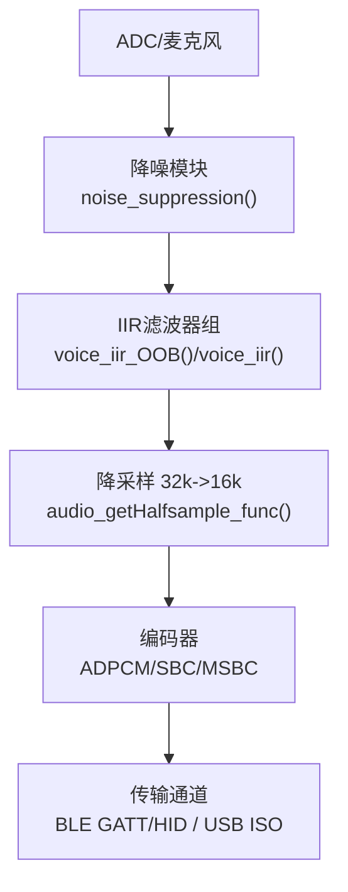
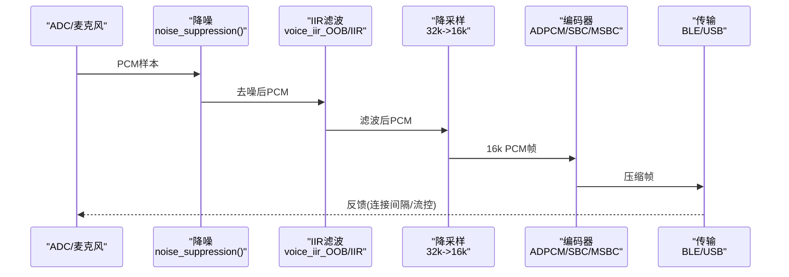
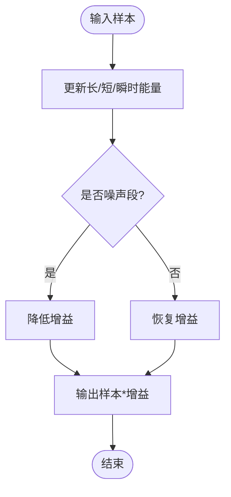
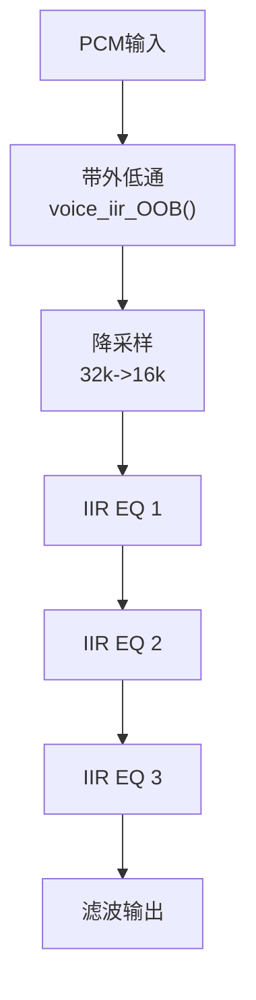
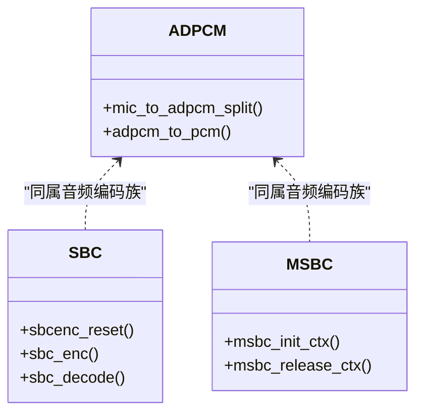
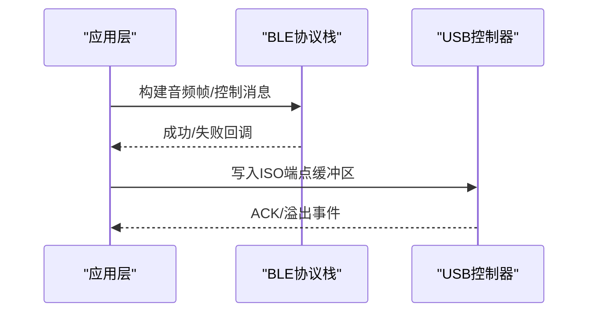
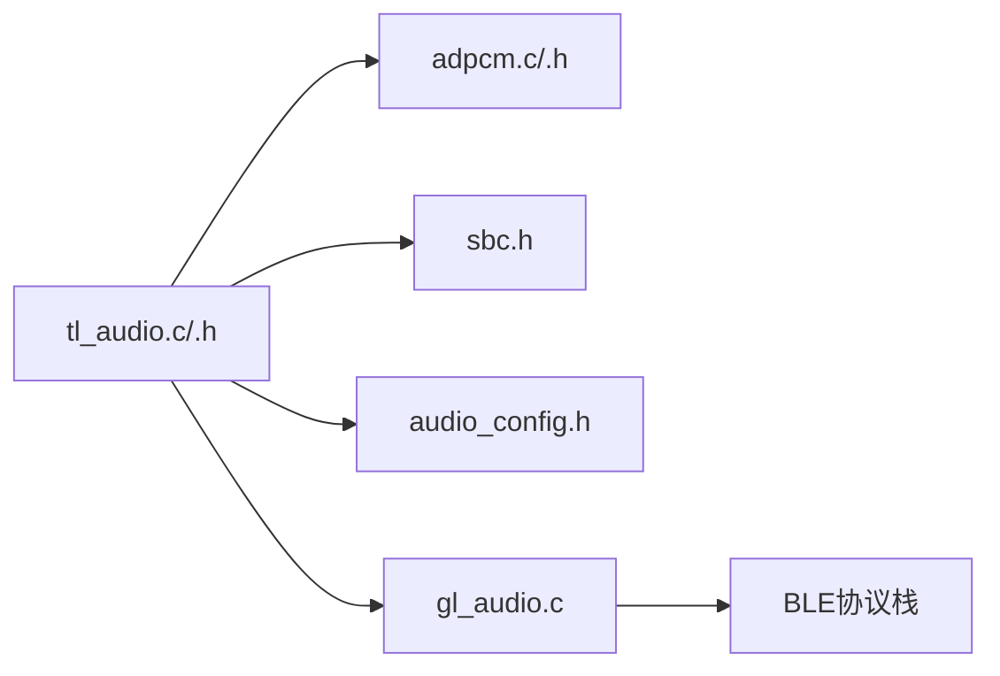

# 音频质量评估

<cite>
**本文引用的文件**
- [tl_audio.h](file://tc_ble_single_sdk/application/audio/tl_audio.h)
- [tl_audio.c](file://tc_ble_single_sdk/application/audio/tl_audio.c)
- [adpcm.h](file://tc_ble_single_sdk/application/audio/adpcm.h)
- [adpcm.c](file://tc_ble_single_sdk/application/audio/adpcm.c)
- [sbc.h](file://tc_ble_single_sdk/application/audio/sbc.h)
- [audio_config.h](file://tc_ble_single_sdk/application/audio/audio_config.h)
- [gl_audio.c](file://tc_ble_single_sdk/application/audio/gl_audio.c)
- [SDK_Wiki.md](file://doc/SDK_Wiki.md)
- [audio.c](file://tc_ble_single_sdk/drivers/B87/audio.c)
</cite>

## 目录
1. [简介](#简介)
2. [项目结构](#项目结构)
3. [核心组件](#核心组件)
4. [架构总览](#架构总览)
5. [详细组件分析](#详细组件分析)
6. [依赖关系分析](#依赖关系分析)
7. [性能考量](#性能考量)
8. [故障排查指南](#故障排查指南)
9. [结论](#结论)
10. [附录](#附录)

## 简介
本技术文档面向“音频质量评估系统”，围绕信噪比（SNR）、总谐波失真（THD）与频率响应测量的实现思路，结合工程中的音频采集、降噪、滤波、编解码与传输链路，给出可落地的指标计算方法、实时质量监控机制、阈值设定与异常检测策略。同时覆盖不同传输模式（BLE、2.4G、USB）下的差异化优化建议，并提供测试平台搭建与自动化脚本使用指引。

## 项目结构
本项目在应用层提供音频采集与处理管线（ADC采样→可选降噪→IIR滤波→降采样→编码），并通过不同协议栈（BLE GATT/HID、USB ISO）将音频数据发送出去；驱动层提供音频相关寄存器与增益配置能力。关键目录与职责：
- application/audio：音频处理与协议适配（tl_audio.*、adpcm.*、sbc.h、gl_audio.c）
- drivers：芯片级音频与外设驱动（如B87 audio.c中PGA/ADC增益配置）
- stack：BLE协议栈接口（用于GATT通知等）
- doc：SDK使用说明（含BLE/USB上报策略）

图表来源
- [tl_audio.c:338-418](file://tc_ble_single_sdk/application/audio/tl_audio.c#L338-L418)
- [tl_audio.c:444-525](file://tc_ble_single_sdk/application/audio/tl_audio.c#L444-L525)
- [tl_audio.c:552-633](file://tc_ble_single_sdk/application/audio/tl_audio.c#L552-L633)
- [tl_audio.c:652-733](file://tc_ble_single_sdk/application/audio/tl_audio.c#L652-L733)
- [adpcm.c:53-126](file://tc_ble_single_sdk/application/audio/adpcm.c#L53-L126)
- [adpcm.c:137-208](file://tc_ble_single_sdk/application/audio/adpcm.c#L137-L208)
- [adpcm.c:217-280](file://tc_ble_single_sdk/application/audio/adpcm.c#L217-L280)
- [adpcm.c:289-361](file://tc_ble_single_sdk/application/audio/adpcm.c#L289-L361)
- [adpcm.c:372-440](file://tc_ble_single_sdk/application/audio/adpcm.c#L372-L440)
- [adpcm.c:447-513](file://tc_ble_single_sdk/application/audio/adpcm.c#L447-L513)
- [sbc.h:44-48](file://tc_ble_single_sdk/application/audio/sbc.h#L44-L48)
- [audio_config.h:32-74](file://tc_ble_single_sdk/application/audio/audio_config.h#L32-L74)
- [audio_config.h:76-119](file://tc_ble_single_sdk/application/audio/audio_config.h#L76-L119)

章节来源
- [tl_audio.h:32-129](file://tc_ble_single_sdk/application/audio/tl_audio.h#L32-L129)
- [tl_audio.c:338-823](file://tc_ble_single_sdk/application/audio/tl_audio.c#L338-L823)
- [adpcm.h:27-46](file://tc_ble_single_sdk/application/audio/adpcm.h#L27-L46)
- [adpcm.c:53-513](file://tc_ble_single_sdk/application/audio/adpcm.c#L53-L513)
- [sbc.h:44-48](file://tc_ble_single_sdk/application/audio/sbc.h#L44-L48)
- [audio_config.h:32-119](file://tc_ble_single_sdk/application/audio/audio_config.h#L32-L119)
- [SDK_Wiki.md:153-172](file://doc/SDK_Wiki.md#L153-L172)

## 核心组件
- 噪声抑制：基于短时/长时能量估计的动态增益控制，抑制稳态噪声并保留语音瞬态。
- IIR滤波：带外低通与带内多段EQ，提升语音清晰度与频响平坦度。
- 降采样：32kHz到16kHz半采样抽取，降低带宽与码率。
- 编解码：ADPCM（主流）、SBC/MSBC（HID场景）。
- 传输：BLE GATT Notify/HID Report、USB ISO端点。

章节来源
- [tl_audio.h:66-104](file://tc_ble_single_sdk/application/audio/tl_audio.h#L66-L104)
- [tl_audio.c:86-178](file://tc_ble_single_sdk/application/audio/tl_audio.c#L86-L178)
- [tl_audio.c:338-823](file://tc_ble_single_sdk/application/audio/tl_audio.c#L338-L823)
- [adpcm.c:53-513](file://tc_ble_single_sdk/application/audio/adpcm.c#L53-L513)
- [sbc.h:44-48](file://tc_ble_single_sdk/application/audio/sbc.h#L44-L48)
- [audio_config.h:32-119](file://tc_ble_single_sdk/application/audio/audio_config.h#L32-L119)

## 架构总览
下图展示从采集到传输的端到端流程，以及各阶段对质量指标的影响点。

图表来源
- [tl_audio.c:338-823](file://tc_ble_single_sdk/application/audio/tl_audio.c#L338-L823)
- [adpcm.c:53-513](file://tc_ble_single_sdk/application/audio/adpcm.c#L53-L513)
- [sbc.h:44-48](file://tc_ble_single_sdk/application/audio/sbc.h#L44-L48)
- [SDK_Wiki.md:153-172](file://doc/SDK_Wiki.md#L153-L172)

## 详细组件分析

### 噪声抑制与动态增益
- 原理：维护长/短/瞬时能量统计，判断是否处于噪声段，动态衰减增益以抑制噪声，语音段恢复增益。
- 关键点：阈值、时间常数、增益步进影响SNR与听感；过强抑制会引入音乐噪声或削波风险。
- 质量关联：直接影响SNR与主观清晰度；需避免过度压制导致THD上升。

图表来源
- [tl_audio.h:66-104](file://tc_ble_single_sdk/application/audio/tl_audio.h#L66-L104)
- [tl_audio.c:338-418](file://tc_ble_single_sdk/application/audio/tl_audio.c#L338-L418)

章节来源
- [tl_audio.h:66-104](file://tc_ble_single_sdk/application/audio/tl_audio.h#L66-L104)
- [tl_audio.c:338-418](file://tc_ble_single_sdk/application/audio/tl_audio.c#L338-L418)

### IIR滤波与频响整形
- 带外低通：抑制高频噪声与混叠，改善SNR。
- 带内EQ：三段IIR均衡，补偿麦克风频响与声学腔体特性，使频响更平坦。
- 质量关联：合理EQ可提升语音可懂度与主观评分；不当参数会导致相位失真与THD增加。

图表来源
- [tl_audio.c:86-178](file://tc_ble_single_sdk/application/audio/tl_audio.c#L86-L178)
- [tl_audio.c:338-823](file://tc_ble_single_sdk/application/audio/tl_audio.c#L338-L823)

章节来源
- [tl_audio.c:86-178](file://tc_ble_single_sdk/application/audio/tl_audio.c#L86-L178)
- [tl_audio.c:338-823](file://tc_ble_single_sdk/application/audio/tl_audio.c#L338-L823)

### 编解码器（ADPCM/SBC/MSBC）
- ADPCM：16kHz/16bit PCM压缩为较低比特率，适合BLE HID/GATT；支持Google Assistant协议帧格式。
- SBC/MSBC：蓝牙A2DP/HQ语音常用编码，适用于HID或特定协议场景。
- 质量关联：编码失真与丢包/抖动共同决定最终听感；需结合缓冲与流控减少卡顿与爆音。

图表来源
- [adpcm.h:27-46](file://tc_ble_single_sdk/application/audio/adpcm.h#L27-L46)
- [adpcm.c:53-513](file://tc_ble_single_sdk/application/audio/adpcm.c#L53-L513)
- [sbc.h:44-48](file://tc_ble_single_sdk/application/audio/sbc.h#L44-L48)

章节来源
- [adpcm.h:27-46](file://tc_ble_single_sdk/application/audio/adpcm.h#L27-L46)
- [adpcm.c:53-513](file://tc_ble_single_sdk/application/audio/adpcm.c#L53-L513)
- [sbc.h:44-48](file://tc_ble_single_sdk/application/audio/sbc.h#L44-L48)

### 传输与流控（BLE/USB）
- BLE：通过GATT Notify或HID Report上报音频帧；根据连接间隔动态调整UI/上报节奏，必要时交换MTU以提升载荷。
- USB：ISO端点周期性发包；关闭语音时提高报告率，开启语音时适当降低报告率以保音频稳定。
- 质量关联：连接不稳定或丢包会引入抖动与丢帧，影响PSQM/POLQA得分；需配合重传/丢帧丢弃策略与缓冲管理。

图表来源
- [gl_audio.c:60-181](file://tc_ble_single_sdk/application/audio/gl_audio.c#L60-L181)
- [gl_audio.c:213-355](file://tc_ble_single_sdk/application/audio/gl_audio.c#L213-L355)
- [SDK_Wiki.md:153-172](file://doc/SDK_Wiki.md#L153-L172)

章节来源
- [gl_audio.c:60-181](file://tc_ble_single_sdk/application/audio/gl_audio.c#L60-L181)
- [gl_audio.c:213-355](file://tc_ble_single_sdk/application/audio/gl_audio.c#L213-L355)
- [SDK_Wiki.md:153-172](file://doc/SDK_Wiki.md#L153-L172)

### 硬件增益与SNR优化
- 通过调节PGA/ADC增益与数字增益，平衡底噪与过载，获得最佳SNR。
- 代码注释指出特定配置可在电流微增前提下提升SNR。

章节来源
- [audio.c:247](file://tc_ble_single_sdk/drivers/B87/audio.c#L247)

## 依赖关系分析
- tl_audio.* 依赖 adpcm.*、sbc.h 完成编码；依赖 audio_config.h 选择模式与帧大小。
- gl_audio.c 依赖 BLE 协议栈进行控制面交互与数据面上报。
- SDK_Wiki.md 描述BLE/USB任务函数与上报策略，指导上层集成。

图表来源
- [tl_audio.c:338-823](file://tc_ble_single_sdk/application/audio/tl_audio.c#L338-L823)
- [adpcm.c:53-513](file://tc_ble_single_sdk/application/audio/adpcm.c#L53-L513)
- [sbc.h:44-48](file://tc_ble_single_sdk/application/audio/sbc.h#L44-L48)
- [audio_config.h:32-119](file://tc_ble_single_sdk/application/audio/audio_config.h#L32-L119)
- [gl_audio.c:60-181](file://tc_ble_single_sdk/application/audio/gl_audio.c#L60-L181)

章节来源
- [tl_audio.c:338-823](file://tc_ble_single_sdk/application/audio/tl_audio.c#L338-L823)
- [adpcm.c:53-513](file://tc_ble_single_sdk/application/audio/adpcm.c#L53-L513)
- [sbc.h:44-48](file://tc_ble_single_sdk/application/audio/sbc.h#L44-L48)
- [audio_config.h:32-119](file://tc_ble_single_sdk/application/audio/audio_config.h#L32-L119)
- [gl_audio.c:60-181](file://tc_ble_single_sdk/application/audio/gl_audio.c#L60-L181)

## 性能考量
- 降噪与IIR：在RCU侧以RAM Code优化执行路径，注意循环展开与移位缩放，避免溢出与截断。
- 编解码：ADPCM/SBC计算量适中，注意帧对齐与缓存边界；MSBC需上下文初始化/释放。
- 传输：BLE连接间隔与MTU影响吞吐；USB ISO需保证周期性与缓冲不溢出。
- 功耗：在高负载下权衡CPU占用与RF发射功率，避免热节流影响音质。

[本节为通用性能讨论，无需具体文件引用]

## 故障排查指南
- 爆音/卡顿：检查缓冲指针读写越界、丢帧计数与复位逻辑；确认USB/BLE端点ACK与超时处理。
- 底噪过大：调整PGA/ADC增益与数字增益；检查降噪阈值与增益步进是否过激。
- 频响异常：核对IIR系数与移位位宽；验证带外低通与带内EQ顺序与参数。
- 协议兼容：确认Google/HTT/PTT模型标志位与帧长度匹配；必要时交换MTU。

章节来源
- [tl_audio.c:338-823](file://tc_ble_single_sdk/application/audio/tl_audio.c#L338-L823)
- [gl_audio.c:60-181](file://tc_ble_single_sdk/application/audio/gl_audio.c#L60-L181)
- [audio.c:247](file://tc_ble_single_sdk/drivers/B87/audio.c#L247)

## 结论
本SDK提供了完整的音频采集、降噪、滤波、编解码与传输链路，具备在不同模式下优化音频质量的工程基础。结合合理的硬件增益设置、IIR参数调优与传输流控，可实现稳定的SNR与良好的主观听感。对于客观评价（PSQM/POLQA），建议在接收端回放原始/重建PCM后进行离线评测，并结合在线指标（丢包率、抖动、延迟）形成闭环质量监控。

[本节为总结性内容，无需具体文件引用]

## 附录

### 质量指标定义与计算方法（实践指南）
- SNR（信噪比）
  - 方法：在安静段估计噪声功率谱，再在全段计算信号+噪声与纯噪声的比值；或使用参考纯净信号与重建信号的误差估算。
  - 工程要点：利用降噪与IIR后的PCM作为待测信号；确保测量时段避开启停瞬态。
- THD（总谐波失真）
  - 方法：对单频正弦激励信号做FFT，计算基波与各次谐波能量之和相对基波的比值。
  - 工程要点：激励信号幅度需避免削波；关注编码与滤波带来的非线性失真。
- 频率响应
  - 方法：扫频或多音激励，测量各频点幅相响应；对比目标曲线评估平坦度。
  - 工程要点：考虑麦克风与声腔共振峰；用IIR EQ进行补偿。
- PSQM/POLQA
  - 方法：在接收端重建PCM后，与参考信号进行MOS-LQO或POLQA算法打分；适用于语音质量主观映射。
  - 工程要点：需保证两端采样率、编码一致；对丢包/抖动进行同步与插值处理后再评测。

[本节为方法论说明，无需具体文件引用]

### 实时质量监控机制、阈值与异常检测
- 指标采集：每N帧统计SNR估计、峰值/均值、丢包率、抖动、延迟。
- 阈值设定：依据产品规格设定SNR下限、THD上限、丢包率上限；超限触发告警。
- 异常检测：滑动窗口方差检测突发噪声；连续丢包/高抖动判定链路劣化；自动降级码率或切换传输模式。
- 自适应策略：根据连接质量动态调整降噪强度、EQ权重与编码参数。

[本节为通用策略说明，无需具体文件引用]

### 不同传输模式的优化策略
- BLE
  - 使用GATT Notify或HID Report；开启MTU交换；根据连接间隔动态调整上报节奏；必要时启用DLE提升可靠性。
  - 参考：任务函数与上报接口见SDK Wiki。
- 2.4G
  - 若采用私有协议，优先保障低延迟与抗干扰；合理跳频与功率控制；对丢包采用前向纠错或重复。
- USB
  - ISO端点周期发包；关闭语音时提高鼠标报告率，开启语音时降低报告率以保音频稳定。
  - 参考：USB任务函数与报告率策略见SDK Wiki。

章节来源
- [SDK_Wiki.md:153-172](file://doc/SDK_Wiki.md#L153-L172)

### 测试平台搭建与自动化脚本使用
- 硬件平台
  - 主机：PC或Android/iOS设备，安装音频分析与评测软件（如MATLAB/Python SciPy、专业音频分析仪）。
  - 被测设备：Telink三模音频鼠标SDK固件。
  - 信号源：函数发生器或软件合成单频/扫频信号，经DAC输出至麦克风或线路输入。
- 软件环境
  - Python/NumPy/SciPy：用于FFT、SNR/THD计算与频响分析。
  - 日志抓取：串口/USB抓包工具记录BLE/USB数据。
- 自动化脚本
  - 步骤：启动被测设备→注入激励信号→采集PCM→计算指标→记录结果→生成报告。
  - 关键命令：调用adpcm_to_pcm/sbc_decode重建PCM；按帧对齐参考信号；滑动窗口统计指标。
  - 阈值判定：超过阈值即标记失败并触发重试或降级。

[本节为操作指南，无需具体文件引用]