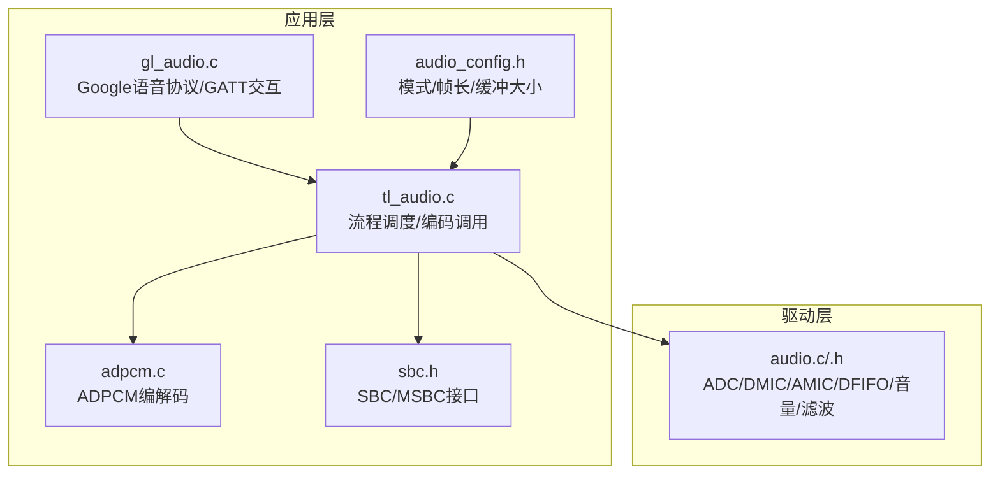
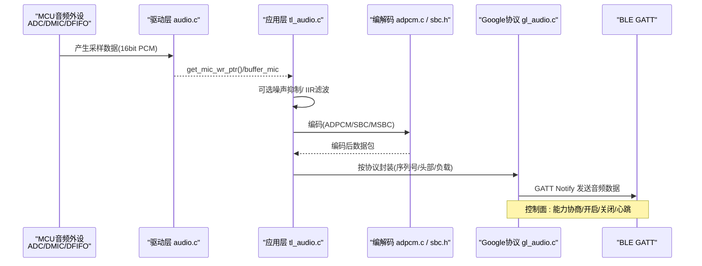
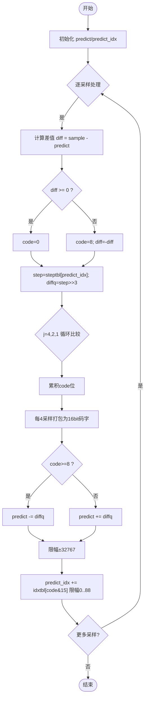
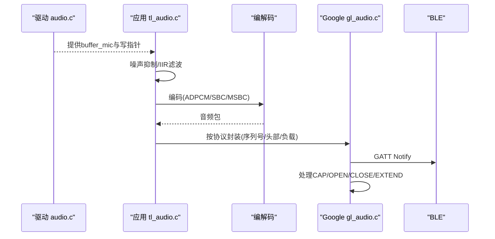
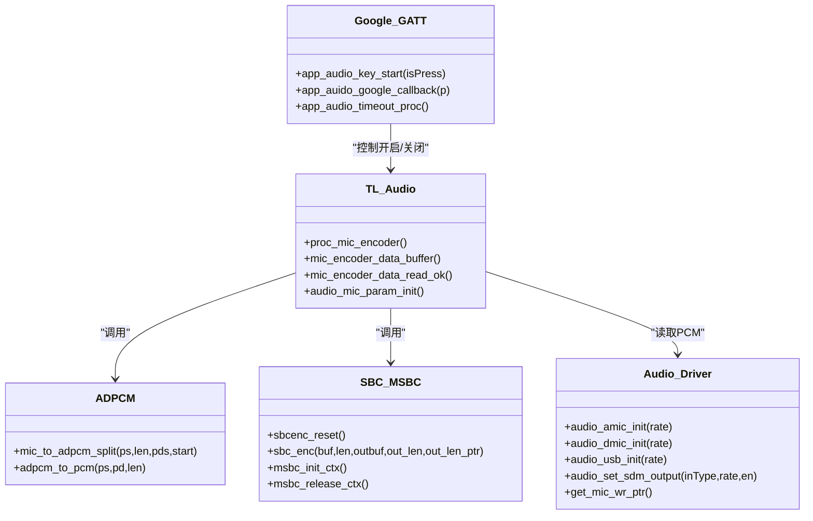
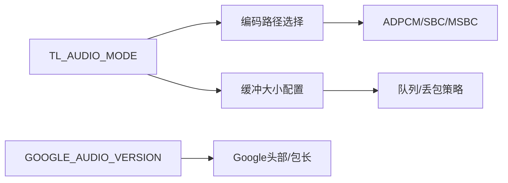

# 音频处理系统

<cite>
**本文引用的文件**
- [adpcm.c](file://tc_ble_single_sdk/application/audio/adpcm.c)
- [adpcm.h](file://tc_ble_single_sdk/application/audio/adpcm.h)
- [tl_audio.c](file://tc_ble_single_sdk/application/audio/tl_audio.c)
- [tl_audio.h](file://tc_ble_single_sdk/application/audio/tl_audio.h)
- [audio_config.h](file://tc_ble_single_sdk/application/audio/audio_config.h)
- [gl_audio.c](file://tc_ble_single_sdk/application/audio/gl_audio.c)
- [gl_audio.h](file://tc_ble_single_sdk/application/audio/gl_audio.h)
- [sbc.h](file://tc_ble_single_sdk/application/audio/sbc.h)
- [audio.c](file://tc_ble_single_sdk/drivers/B85/audio.c)
- [audio.h](file://tc_ble_single_sdk/drivers/B85/audio.h)
</cite>

## 目录
1. [简介](#简介)
2. [项目结构](#项目结构)
3. [核心组件](#核心组件)
4. [架构总览](#架构总览)
5. [详细组件分析](#详细组件分析)
6. [依赖关系分析](#依赖关系分析)
7. [性能与功耗考量](#性能与功耗考量)
8. [故障排查指南](#故障排查指南)
9. [结论](#结论)
10. [附录：配置与测试建议](#附录配置与测试建议)

## 简介
本技术文档面向基于 Telink B85/B87/TC321X 平台的音频鼠标/语音采集方案，系统性阐述 ADPCM 编解码算法实现、音频采集到传输的完整数据流、音频质量控制（噪声抑制、音量控制、延迟优化）、音频格式与采样率配置、缓冲区管理、自适应码率策略与电量管理思路，以及质量测试方法与性能调优建议。内容严格依据仓库中的源码与头文件进行归纳与可视化说明。

## 项目结构
该 SDK 将音频相关代码分为应用层与驱动层：
- 应用层（application/audio）：封装 ADPCM/SBC/MSBC 编解码、音频流程调度、Google 语音协议交互、缓冲与包组装等。
- 驱动层（drivers/B85）：提供 ADC/DMIC/AMIC/I2S/SDM 初始化、时钟与分频、DFIFO 配置、音量/滤波硬件控制等。

图表来源
- [tl_audio.c:323-751](file://tc_ble_single_sdk/application/audio/tl_audio.c#L323-L751)
- [adpcm.c:29-521](file://tc_ble_single_sdk/application/audio/adpcm.c#L29-L521)
- [gl_audio.c:30-356](file://tc_ble_single_sdk/application/audio/gl_audio.c#L30-L356)
- [audio_config.h:28-123](file://tc_ble_single_sdk/application/audio/audio_config.h#L28-L123)
- [sbc.h:24-55](file://tc_ble_single_sdk/application/audio/sbc.h#L24-L55)
- [audio.c:92-323](file://tc_ble_single_sdk/drivers/B85/audio.c#L92-L323)

章节来源
- [tl_audio.c:323-751](file://tc_ble_single_sdk/application/audio/tl_audio.c#L323-L751)
- [audio_config.h:28-123](file://tc_ble_single_sdk/application/audio/audio_config.h#L28-L123)

## 核心组件
- ADPCM 编解码器：提供 mic_to_adpcm_split 与 adpcm_to_pcm，支持多种 Google/Telink/HID 协议变体，内置预测器与步长表，实现高效压缩/还原。
- 音频流程调度：根据 TL_AUDIO_MODE 选择不同编码路径（ADPCM/SBC/MSBC），统一入口 proc_mic_encoder，负责从 DFIFO 取数、可选降噪与 IIR 滤波、调用编码器、写入包缓冲。
- 音频配置：集中定义各模式的包长、每包采样数、缓冲大小、是否启用 Google 版本等。
- Google 语音协议：处理 GATT 控制通道消息（能力协商、开启/关闭、扩展心跳），维护状态机与超时。
- 驱动层音频：完成 AMIC/DMIC/USB/I2S 输入路径初始化、时钟/分频、ALC/HPF/LPF、PGA 增益、DFIFO 模式与中断指针读取。

章节来源
- [adpcm.h:27-44](file://tc_ble_single_sdk/application/audio/adpcm.h#L27-L44)
- [tl_audio.c:323-751](file://tc_ble_single_sdk/application/audio/tl_audio.c#L323-L751)
- [audio_config.h:28-123](file://tc_ble_single_sdk/application/audio/audio_config.h#L28-L123)
- [gl_audio.c:30-356](file://tc_ble_single_sdk/application/audio/gl_audio.c#L30-L356)
- [audio.c:92-323](file://tc_ble_single_sdk/drivers/B85/audio.c#L92-L323)

## 架构总览
下图展示从麦克风采集到 BLE 传输的端到端数据流，包括可选的噪声抑制、IIR 滤波、ADPCM/SBC/MSBC 编码、GATT 控制与数据通知。

图表来源
- [tl_audio.c:323-751](file://tc_ble_single_sdk/application/audio/tl_audio.c#L323-L751)
- [adpcm.c:29-521](file://tc_ble_single_sdk/application/audio/adpcm.c#L29-L521)
- [sbc.h:44-55](file://tc_ble_single_sdk/application/audio/sbc.h#L44-L55)
- [gl_audio.c:54-356](file://tc_ble_single_sdk/application/audio/gl_audio.c#L54-L356)

## 详细组件分析

### ADPCM 编解码算法与参数
- 算法要点
  - 使用线性预测与差分量化，维护 predict 与 predict_idx，通过步长表 steptbl 和索引表 idxtbl 迭代更新。
  - 每 4 个采样打包为一个 16bit 码字，支持字节序调整以兼容 Android/Google 平台。
  - 提供多实现分支：Telink GATT、Google V0.4/V1.0、HID Service Channel。
- 关键函数
  - mic_to_adpcm_split：将 PCM 采样流转换为 ADPCM 码流，并写入包缓冲；start 标志用于写入预测初始值与长度字段。
  - adpcm_to_pcm：对接收到的 ADPCM 数据进行解码恢复为 PCM。
- 复杂度
  - 时间复杂度 O(N)，空间复杂度 O(1) 额外（除输出缓冲）。
- 错误与边界
  - 预测值限幅至 ±32767，predict_idx 限制在 0~88，避免溢出与越界。

图表来源
- [adpcm.c:53-126](file://tc_ble_single_sdk/application/audio/adpcm.c#L53-L126)
- [adpcm.c:137-208](file://tc_ble_single_sdk/application/audio/adpcm.c#L137-L208)
- [adpcm.c:217-280](file://tc_ble_single_sdk/application/audio/adpcm.c#L217-L280)
- [adpcm.c:289-361](file://tc_ble_single_sdk/application/audio/adpcm.c#L289-L361)
- [adpcm.c:372-440](file://tc_ble_single_sdk/application/audio/adpcm.c#L372-L440)
- [adpcm.c:447-513](file://tc_ble_single_sdk/application/audio/adpcm.c#L447-L513)

章节来源
- [adpcm.c:29-521](file://tc_ble_single_sdk/application/audio/adpcm.c#L29-L521)
- [adpcm.h:27-44](file://tc_ble_single_sdk/application/audio/adpcm.h#L27-L44)

### 音频采集、处理与传输数据流
- 采集
  - 驱动层根据模式初始化 AMIC/DMIC/USB/I2S，设置采样时钟、分频、ALC/HPF/LPF、PGA 增益，并通过 DFIFO 提供 PCM 数据。
  - 应用层通过 get_mic_wr_ptr 获取写指针，周期性读取 buffer_mic 中的数据块。
- 处理
  - 可选噪声抑制：基于短时/长时能量估计的动态增益控制。
  - 可选 IIR 滤波：内带 EQ 与外带 LPF，支持系数从 Flash 加载与移位缩放。
- 编码
  - 根据 TL_AUDIO_MODE 选择 ADPCM/SBC/MSBC 编码路径，输出固定长度的音频包。
- 传输
  - Google 语音协议：通过 GATT 控制通道协商能力、开启/关闭、心跳扩展；数据通过 Notify 发送。
  - HID 服务：部分模式通过 HID 通道传输。

图表来源
- [tl_audio.c:323-751](file://tc_ble_single_sdk/application/audio/tl_audio.c#L323-L751)
- [gl_audio.c:54-356](file://tc_ble_single_sdk/application/audio/gl_audio.c#L54-L356)
- [audio.c:92-323](file://tc_ble_single_sdk/drivers/B85/audio.c#L92-L323)

章节来源
- [tl_audio.c:323-751](file://tc_ble_single_sdk/application/audio/tl_audio.c#L323-L751)
- [gl_audio.c:54-356](file://tc_ble_single_sdk/application/audio/gl_audio.c#L54-L356)
- [audio.c:92-323](file://tc_ble_single_sdk/drivers/B85/audio.c#L92-L323)

### 音频质量控制机制
- 噪声抑制
  - 基于短时/长时能量与瞬时幅度估计，动态调整增益 md_gain，抑制低能量段噪声。
  - 开关由 TL_NOISE_SUPPRESSION_ENABLE 控制。
- 音量控制
  - 数字音量：通过 reg_aud_alc_vol_l_chn 设置最小音量与自动调节开关。
  - PGA 增益：通过 reg_pga_fix_value 或 analog 寄存器设置前级/后级增益。
  - 可加载 Flash 中预设的滤波器与音量/PGA 配置。
- 延迟优化
  - 合理设置 TL_MIC_BUFFER_SIZE 与 TL_MIC_PACKET_BUFFER_NUM，平衡吞吐与延迟。
  - 使用半采样抽取（32k→16k）降低后续处理量。
  - 编码单元大小 TL_MIC_ADPCM_UNIT_SIZE 与包长 ADPCM_PACKET_LEN 匹配，减少碎片化。

章节来源
- [tl_audio.h:66-104](file://tc_ble_single_sdk/application/audio/tl_audio.h#L66-L104)
- [tl_audio.c:180-318](file://tc_ble_single_sdk/application/audio/tl_audio.c#L180-L318)
- [tl_audio.c:323-751](file://tc_ble_single_sdk/application/audio/tl_audio.c#L323-L751)
- [audio.c:175-216](file://tc_ble_single_sdk/drivers/B85/audio.c#L175-L216)

### 音频格式支持、采样率配置与缓冲区管理
- 音频格式
  - ADPCM：Telink GATT、Google V0.4/V1.0、HID Service Channel。
  - SBC/MSBC：通过 sbc_enc/msbc_init_ctx 等接口支持。
- 采样率
  - 驱动层支持 8k/16k/32k/48k，通过 DMIC_CIC_Rate/AMIC_CIC_Rate 与 DFIFO 分频配置。
  - 应用层根据模式选择 16k 为主（Google/HTT/PTT）。
- 缓冲区
  - buffer_mic：DMA/DFIFO 输出的 PCM 环形缓冲。
  - buffer_mic_enc：编码后的音频包缓冲，采用写读指针管理。
  - 包缓冲数量 TL_MIC_PACKET_BUFFER_NUM 决定最大排队包数，防止溢出。

章节来源
- [audio_config.h:28-123](file://tc_ble_single_sdk/application/audio/audio_config.h#L28-L123)
- [tl_audio.c:323-751](file://tc_ble_single_sdk/application/audio/tl_audio.c#L323-L751)
- [audio.c:39-59](file://tc_ble_single_sdk/drivers/B85/audio.c#L39-L59)

### 自适应码率控制策略与电量管理
- 自适应码率
  - 当前实现以固定包长与采样率为主，未包含运行时动态码率切换逻辑。
  - 可通过切换 TL_AUDIO_MODE（如 ADPCM vs SBC/MSBC）与修改 TL_MIC_ADPCM_UNIT_SIZE/ADPCM_PACKET_LEN 实现“准自适应”。
- 电量管理
  - 驱动层提供 audio_stop 关闭 ADC/时钟，可在空闲时调用以降低功耗。
  - 控制面超时：Google 协议支持超时关闭音频，避免长时间占用射频与 CPU。
  - 建议在无通话场景关闭音频模块，或在连接断开时停止音频。

章节来源
- [gl_audio.c:185-211](file://tc_ble_single_sdk/application/audio/gl_audio.c#L185-L211)
- [audio.c:80-84](file://tc_ble_single_sdk/drivers/B85/audio.c#L80-L84)

### 类图：关键数据结构与关系

图表来源
- [tl_audio.c:323-751](file://tc_ble_single_sdk/application/audio/tl_audio.c#L323-L751)
- [adpcm.c:29-521](file://tc_ble_single_sdk/application/audio/adpcm.c#L29-L521)
- [sbc.h:44-55](file://tc_ble_single_sdk/application/audio/sbc.h#L44-L55)
- [gl_audio.c:54-356](file://tc_ble_single_sdk/application/audio/gl_audio.c#L54-L356)
- [audio.c:92-323](file://tc_ble_single_sdk/drivers/B85/audio.c#L92-L323)

## 依赖关系分析
- 编译期依赖
  - TL_AUDIO_MODE 决定启用哪些音频路径与缓冲大小。
  - GOOGLE_AUDIO_VERSION 影响 Google 协议头部与包长。
- 运行期依赖
  - 驱动层 DFIFO 指针与中断配合应用层读取。
  - Google 协议控制面与数据面解耦，但共享状态机标志。

图表来源
- [audio_config.h:28-123](file://tc_ble_single_sdk/application/audio/audio_config.h#L28-L123)
- [tl_audio.c:323-751](file://tc_ble_single_sdk/application/audio/tl_audio.c#L323-L751)

章节来源
- [audio_config.h:28-123](file://tc_ble_single_sdk/application/audio/audio_config.h#L28-L123)
- [tl_audio.c:323-751](file://tc_ble_single_sdk/application/audio/tl_audio.c#L323-L751)

## 性能与功耗考量
- 性能
  - 优先使用 ADPCM 以获得更低 CPU 占用与更小包长；SBC/MSBC 适合更高音质需求但更大开销。
  - 合理设置 TL_MIC_BUFFER_SIZE 与 TL_MIC_PACKET_BUFFER_NUM，避免溢出与高延迟。
  - 使用 IIR 滤波时注意系数移位与定点精度，避免溢出与失真。
- 功耗
  - 在无音频任务时调用 audio_stop 关闭 ADC/时钟。
  - 利用 Google 协议超时机制，及时关闭音频链路。
  - 降低采样率或关闭不必要的滤波/降噪可降低功耗。

[本节为通用指导，不直接分析具体文件]

## 故障排查指南
- 无声音/无声
  - 检查驱动初始化是否正确（AMIC/DMIC/USB 路径、时钟、分频、ALC/HPF/LPF）。
  - 确认 buffer_mic 有数据（get_mic_wr_ptr 变化），且编码路径被正确选择。
- 爆音/失真
  - 检查 PGA 增益与数字音量设置是否过大。
  - 检查 IIR 滤波系数与移位是否合适，避免饱和。
- 卡顿/丢包
  - 增大 TL_MIC_PACKET_BUFFER_NUM 或减小 TL_MIC_ADPCM_UNIT_SIZE。
  - 检查 BLE GATT Notify 返回状态，必要时重发或降码率。
- 协议不一致
  - 核对 GOOGLE_AUDIO_VERSION 与对端期望版本，确保头部/包长一致。

章节来源
- [tl_audio.c:323-751](file://tc_ble_single_sdk/application/audio/tl_audio.c#L323-L751)
- [gl_audio.c:185-211](file://tc_ble_single_sdk/application/audio/gl_audio.c#L185-L211)
- [audio.c:175-216](file://tc_ble_single_sdk/drivers/B85/audio.c#L175-L216)

## 结论
该音频处理系统以模块化方式实现了 ADPCM/SBC/MSBC 编解码、灵活的音频采集路径与 Google 语音协议适配。通过噪声抑制、IIR 滤波与音量控制保障音质，借助合理的缓冲与包长配置平衡延迟与吞吐。在低功耗场景中，可通过驱动层关闭与协议超时机制有效节能。实际部署中需结合硬件 PCB 与目标平台选择合适的模式与参数。

[本节为总结性内容，不直接分析具体文件]

## 附录：配置与测试建议
- 配置要点
  - 在 audio_config.h 中根据 TL_AUDIO_MODE 设置 ADPCM_PACKET_LEN、TL_MIC_ADPCM_UNIT_SIZE、TL_MIC_BUFFER_SIZE。
  - 在 tl_audio.h 中启用/禁用 TL_NOISE_SUPPRESSION_ENABLE 与 IIR_FILTER_ENABLE。
  - 在 gl_audio.h 中设置 GOOGLE_AUDIO_VERSION 与超时时间。
- 测试方法
  - 单音/白噪声注入：验证频响与失真。
  - 信噪比测量：对比开启/关闭噪声抑制前后 SNR。
  - 延迟测量：从触发到首包到达的时间，评估缓冲与编码链路的延迟。
  - 稳定性测试：长时间运行观察丢包、溢出与内存泄漏。
- 调优建议
  - 在弱信号环境适当提高 PGA 增益与数字音量。
  - 在高噪声环境增强噪声抑制强度与 IIR 滤波。
  - 在带宽受限场景降低采样率或切换到更紧凑的编码格式。

[本节为通用指导，不直接分析具体文件]