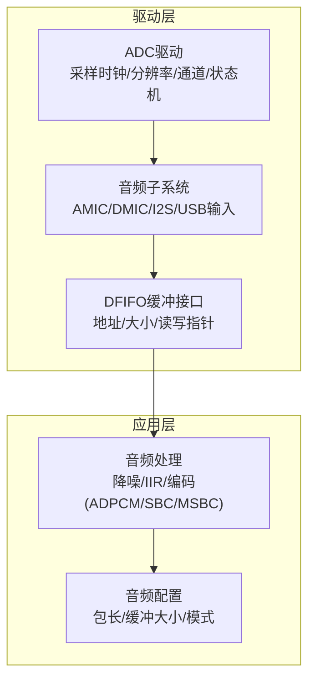
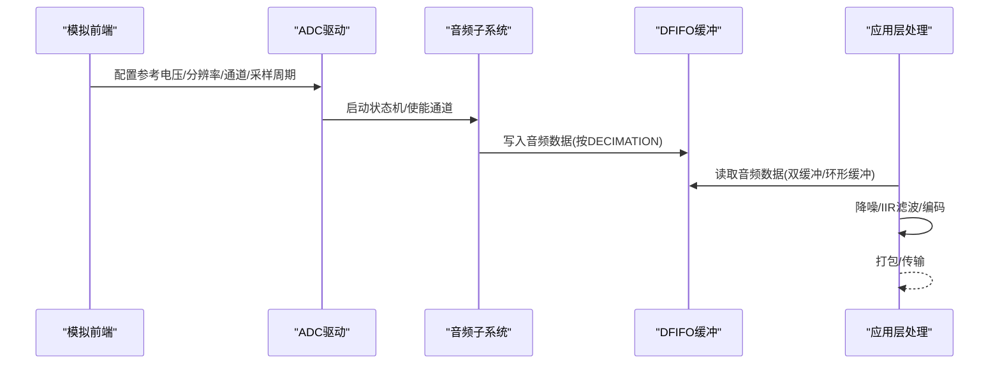
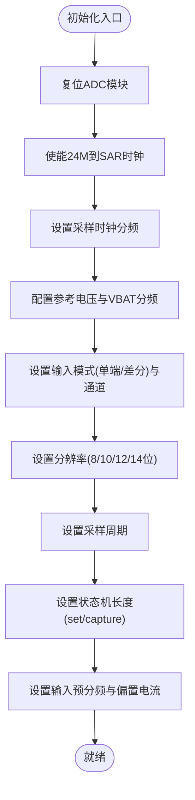
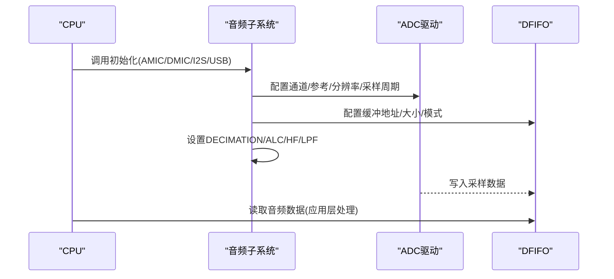
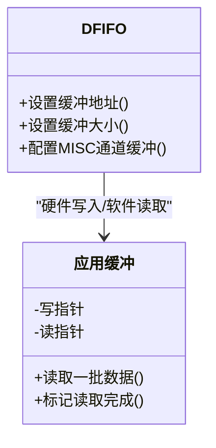
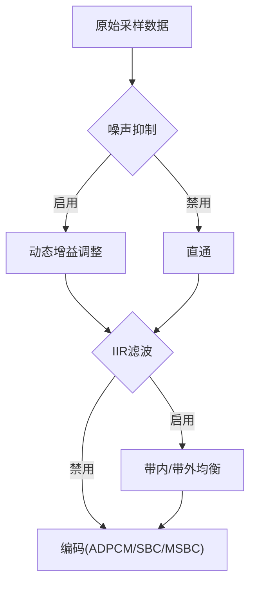
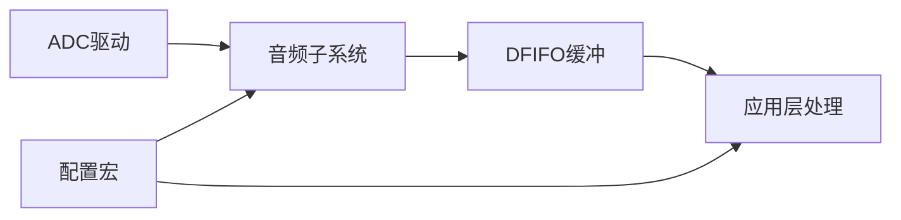

# 音频采集模块

<cite>
**本文引用的文件**
- [tc_ble_single_sdk/drivers/B85/adc.h](file://tc_ble_single_sdk/drivers/B85/adc.h)
- [tc_ble_single_sdk/drivers/B85/adc.c](file://tc_ble_single_sdk/drivers/B85/adc.c)
- [tc_ble_single_sdk/drivers/B85/audio.h](file://tc_ble_single_sdk/drivers/B85/audio.h)
- [tc_ble_single_sdk/drivers/B85/audio.c](file://tc_ble_single_sdk/drivers/B85/audio.c)
- [tc_ble_single_sdk/drivers/B85/dfifo.h](file://tc_ble_single_sdk/drivers/B85/dfifo.h)
- [tc_ble_single_sdk/application/audio/tl_audio.h](file://tc_ble_single_sdk/application/audio/tl_audio.h)
- [tc_ble_single_sdk/application/audio/tl_audio.c](file://tc_ble_single_sdk/application/audio/tl_audio.c)
- [tc_ble_single_sdk/application/audio/audio_config.h](file://tc_ble_single_sdk/application/audio/audio_config.h)
</cite>

## 目录
1. [简介](#简介)
2. [项目结构](#项目结构)
3. [核心组件](#核心组件)
4. [架构总览](#架构总览)
5. [详细组件分析](#详细组件分析)
6. [依赖关系分析](#依赖关系分析)
7. [性能考虑](#性能考虑)
8. [故障排查指南](#故障排查指南)
9. [结论](#结论)
10. [附录](#附录)

## 简介
本技术文档围绕音频采集模块，系统阐述ADC驱动的初始化与采样参数配置、音频数据采集流程（含采样率、增益控制、噪声抑制）、音频缓冲区管理策略（双缓冲机制与数据同步），以及音频质量优化（自动增益控制AGC与环境噪声消除）和性能调优建议与常见问题解决方案。内容基于SDK中B85平台的音频驱动与应用层实现进行归纳与可视化说明，便于开发者快速理解并高效集成。

## 项目结构
音频采集相关代码主要分布在以下层次：
- 驱动层：ADC驱动、音频子系统（AMIC/DMIC/I2S/USB输入路径）、DFIFO缓冲接口
- 应用层：音频编码与处理（ADPCM/SBC/MSBC）、噪声抑制、IIR滤波、音量与PGA控制
- 配置层：音频模式、包长、缓冲区大小等编译期宏定义

图表来源
- [tc_ble_single_sdk/drivers/B85/adc.h:31-209](file://tc_ble_single_sdk/drivers/B85/adc.h#L31-L209)
- [tc_ble_single_sdk/drivers/B85/audio.h:33-73](file://tc_ble_single_sdk/drivers/B85/audio.h#L33-L73)
- [tc_ble_single_sdk/drivers/B85/dfifo.h:30-112](file://tc_ble_single_sdk/drivers/B85/dfifo.h#L30-L112)
- [tc_ble_single_sdk/application/audio/tl_audio.h:32-63](file://tc_ble_single_sdk/application/audio/tl_audio.h#L32-L63)
- [tc_ble_single_sdk/application/audio/audio_config.h:28-74](file://tc_ble_single_sdk/application/audio/audio_config.h#L28-L74)

章节来源
- [tc_ble_single_sdk/drivers/B85/adc.h:31-209](file://tc_ble_single_sdk/drivers/B85/adc.h#L31-L209)
- [tc_ble_single_sdk/drivers/B85/audio.h:33-73](file://tc_ble_single_sdk/drivers/B85/audio.h#L33-L73)
- [tc_ble_single_sdk/drivers/B85/dfifo.h:30-112](file://tc_ble_single_sdk/drivers/B85/dfifo.h#L30-L112)
- [tc_ble_single_sdk/application/audio/tl_audio.h:32-63](file://tc_ble_single_sdk/application/audio/tl_audio.h#L32-L63)
- [tc_ble_single_sdk/application/audio/audio_config.h:28-74](file://tc_ble_single_sdk/application/audio/audio_config.h#L28-L74)

## 核心组件
- ADC驱动：提供采样时钟、参考电压、分辨率、输入通道、采样周期、状态机长度、预分频、偏置电流调节等能力，支持多采样率（23K/96K/192K）。
- 音频子系统：封装AMIC/DMIC/I2S/USB输入路径的初始化、时钟配置、DECIMATION比率、ALC/HF/LPF设置、输出模式选择。
- DFIFO缓冲：提供音频数据缓冲的地址与大小配置、MISC通道缓冲配置、读写指针管理。
- 应用层音频处理：包含可选的噪声抑制、IIR滤波、音量与PGA增益控制、编码器（ADPCM/SBC/MSBC）与缓冲管理。

章节来源
- [tc_ble_single_sdk/drivers/B85/adc.c:293-324](file://tc_ble_single_sdk/drivers/B85/adc.c#L293-L324)
- [tc_ble_single_sdk/drivers/B85/audio.c:92-237](file://tc_ble_single_sdk/drivers/B85/audio.c#L92-L237)
- [tc_ble_single_sdk/drivers/B85/dfifo.h:30-112](file://tc_ble_single_sdk/drivers/B85/dfifo.h#L30-L112)
- [tc_ble_single_sdk/application/audio/tl_audio.c:323-418](file://tc_ble_single_sdk/application/audio/tl_audio.c#L323-L418)

## 架构总览
音频采集的数据流从模拟前端到数字处理与编码的大致路径如下：
- 模拟信号经ADC采样，配置参考电压、分辨率、差分/单端模式、采样周期与状态机长度，形成原始采样数据。
- 音频子系统根据输入类型（AMIC/DMIC/I2S/USB）配置时钟、DECIMATION比率、ALC/HF/LPF，将数据送入DFIFO。
- 应用层从DFIFO读取数据，执行可选的噪声抑制与IIR滤波，再进行编码（ADPCM/SBC/MSBC），并通过上层协议发送。

图表来源
- [tc_ble_single_sdk/drivers/B85/adc.c:293-324](file://tc_ble_single_sdk/drivers/B85/adc.c#L293-L324)
- [tc_ble_single_sdk/drivers/B85/audio.c:92-237](file://tc_ble_single_sdk/drivers/B85/audio.c#L92-L237)
- [tc_ble_single_sdk/drivers/B85/dfifo.h:30-112](file://tc_ble_single_sdk/drivers/B85/dfifo.h#L30-L112)
- [tc_ble_single_sdk/application/audio/tl_audio.c:323-418](file://tc_ble_single_sdk/application/audio/tl_audio.c#L323-L418)

## 详细组件分析

### ADC驱动初始化与采样参数
- 采样时钟与参考电压：通过设置24M至SAR的时钟使能、采样时钟分频、各通道参考电压（0.6V/0.9V/1.2V/VBAT/N）及VBAT分频器。
- 分辨率与输入模式：支持8/10/12/14位分辨率；可选择单端或差分输入模式；可配置正负输入通道。
- 采样周期与状态机：为不同采样率配置“set”与“capture”状态长度，从而决定实际采样率（23K/96K/192K）。
- 预分频与偏置电流：支持输入预分频（如1/8）以适配信号幅度范围；可调增益级偏置电流以优化动态范围与功耗。
- 校准与转换：内置校准系数与偏移量，可将ADC码值转换为实际电压（mV）。

图表来源
- [tc_ble_single_sdk/drivers/B85/adc.c:293-324](file://tc_ble_single_sdk/drivers/B85/adc.c#L293-L324)
- [tc_ble_single_sdk/drivers/B85/adc.h:235-267](file://tc_ble_single_sdk/drivers/B85/adc.h#L235-L267)
- [tc_ble_single_sdk/drivers/B85/adc.h:289-362](file://tc_ble_single_sdk/drivers/B85/adc.h#L289-L362)
- [tc_ble_single_sdk/drivers/B85/adc.h:538-638](file://tc_ble_single_sdk/drivers/B85/adc.h#L538-L638)
- [tc_ble_single_sdk/drivers/B85/adc.h:649-795](file://tc_ble_single_sdk/drivers/B85/adc.h#L649-L795)

章节来源
- [tc_ble_single_sdk/drivers/B85/adc.c:293-324](file://tc_ble_single_sdk/drivers/B85/adc.c#L293-L324)
- [tc_ble_single_sdk/drivers/B85/adc.h:235-267](file://tc_ble_single_sdk/drivers/B85/adc.h#L235-L267)
- [tc_ble_single_sdk/drivers/B85/adc.h:289-362](file://tc_ble_single_sdk/drivers/B85/adc.h#L289-L362)
- [tc_ble_single_sdk/drivers/B85/adc.h:538-638](file://tc_ble_single_sdk/drivers/B85/adc.h#L538-L638)
- [tc_ble_single_sdk/drivers/B85/adc.h:649-795](file://tc_ble_single_sdk/drivers/B85/adc.h#L649-L795)

### 音频数据采集流程（AMIC/DMIC/I2S/USB）
- AMIC路径：配置ADC差分输入、参考电压、分辨率、采样周期；设置ALC/HF/LPF与DECIMATION比率；开启DFIFO输入。
- DMIC路径：配置DMIC时钟、DECIMATION比率、ALC/HF/LPF；启用DFIFO输入。
- I2S路径：配置I2S时钟与引脚、DECIMATION比率、ALC/HF/LPF；启用I2S录音与播放路径。
- USB路径：配置USB输入、DECIMATION比率、ALC/HF/LPF；启用ISO播放器。

图表来源
- [tc_ble_single_sdk/drivers/B85/audio.c:92-237](file://tc_ble_single_sdk/drivers/B85/audio.c#L92-L237)
- [tc_ble_single_sdk/drivers/B85/audio.c:288-323](file://tc_ble_single_sdk/drivers/B85/audio.c#L288-L323)
- [tc_ble_single_sdk/drivers/B85/audio.c:332-364](file://tc_ble_single_sdk/drivers/B85/audio.c#L332-L364)
- [tc_ble_single_sdk/drivers/B85/audio.c:596-640](file://tc_ble_single_sdk/drivers/B85/audio.c#L596-L640)
- [tc_ble_single_sdk/drivers/B85/dfifo.h:30-112](file://tc_ble_single_sdk/drivers/B85/dfifo.h#L30-L112)

章节来源
- [tc_ble_single_sdk/drivers/B85/audio.c:92-237](file://tc_ble_single_sdk/drivers/B85/audio.c#L92-L237)
- [tc_ble_single_sdk/drivers/B85/audio.c:288-323](file://tc_ble_single_sdk/drivers/B85/audio.c#L288-L323)
- [tc_ble_single_sdk/drivers/B85/audio.c:332-364](file://tc_ble_single_sdk/drivers/B85/audio.c#L332-L364)
- [tc_ble_single_sdk/drivers/B85/audio.c:596-640](file://tc_ble_single_sdk/drivers/B85/audio.c#L596-L640)
- [tc_ble_single_sdk/drivers/B85/dfifo.h:30-112](file://tc_ble_single_sdk/drivers/B85/dfifo.h#L30-L112)

### 音频缓冲区管理与双缓冲机制
- DFIFO缓冲：通过设置缓冲地址与大小，硬件自动维护读写指针；支持MISC通道缓冲配置。
- 双缓冲/环形缓冲：应用层使用环形缓冲管理音频数据包（写指针/读指针），避免数据竞争；在编码器前进行批量读取与处理。
- 数据同步：依据写指针与读指针差值判断是否达到处理阈值，触发一次编码处理；读完后推进读指针，释放空间供下一次写入。

图表来源
- [tc_ble_single_sdk/drivers/B85/dfifo.h:30-112](file://tc_ble_single_sdk/drivers/B85/dfifo.h#L30-L112)
- [tc_ble_single_sdk/application/audio/tl_audio.c:323-418](file://tc_ble_single_sdk/application/audio/tl_audio.c#L323-L418)

章节来源
- [tc_ble_single_sdk/drivers/B85/dfifo.h:30-112](file://tc_ble_single_sdk/drivers/B85/dfifo.h#L30-L112)
- [tc_ble_single_sdk/application/audio/tl_audio.c:323-418](file://tc_ble_single_sdk/application/audio/tl_audio.c#L323-L418)

### 噪声抑制与自动增益控制（AGC）
- 噪声抑制：可选的噪声抑制算法，基于短时/长时能量估计与门限判断，动态调整增益，降低背景噪声影响。
- AGC：通过ALC寄存器与PGA增益设置，实现数字/模拟增益调节；支持手动模式与自动调节开关。
- IIR滤波：可选的带内/带外均衡滤波，提升语音清晰度与信噪比。

图表来源
- [tc_ble_single_sdk/application/audio/tl_audio.h:66-105](file://tc_ble_single_sdk/application/audio/tl_audio.h#L66-L105)
- [tc_ble_single_sdk/application/audio/tl_audio.c:180-196](file://tc_ble_single_sdk/application/audio/tl_audio.c#L180-L196)
- [tc_ble_single_sdk/application/audio/tl_audio.c:226-318](file://tc_ble_single_sdk/application/audio/tl_audio.c#L226-L318)

章节来源
- [tc_ble_single_sdk/application/audio/tl_audio.h:66-105](file://tc_ble_single_sdk/application/audio/tl_audio.h#L66-L105)
- [tc_ble_single_sdk/application/audio/tl_audio.c:180-196](file://tc_ble_single_sdk/application/audio/tl_audio.c#L180-L196)
- [tc_ble_single_sdk/application/audio/tl_audio.c:226-318](file://tc_ble_single_sdk/application/audio/tl_audio.c#L226-L318)

### 采样率配置与DECIMATION
- 采样率：通过ADC状态机长度与采样周期组合实现23K/96K/192K等采样率。
- DECIMATION：音频子系统根据目标采样率（8K/16K/32K）配置DECIMATION比率，将高频采样数据降采样至目标速率。

章节来源
- [tc_ble_single_sdk/drivers/B85/adc.c:312-323](file://tc_ble_single_sdk/drivers/B85/adc.c#L312-L323)
- [tc_ble_single_sdk/drivers/B85/audio.c:175-201](file://tc_ble_single_sdk/drivers/B85/audio.c#L175-L201)
- [tc_ble_single_sdk/drivers/B85/audio.c:288-323](file://tc_ble_single_sdk/drivers/B85/audio.c#L288-L323)

### 增益控制与PGA设置
- PGA增益：可通过固定增益模式或自动模式设置前后级增益，适配不同输入电平。
- 音量控制：支持数字音量与PGA后级增益调节，结合ALC实现整体增益控制。

章节来源
- [tc_ble_single_sdk/drivers/B85/audio.c:166-173](file://tc_ble_single_sdk/drivers/B85/audio.c#L166-L173)
- [tc_ble_single_sdk/application/audio/tl_audio.c:180-196](file://tc_ble_single_sdk/application/audio/tl_audio.c#L180-L196)
- [tc_ble_single_sdk/application/audio/tl_audio.c:294-316](file://tc_ble_single_sdk/application/audio/tl_audio.c#L294-L316)

## 依赖关系分析
- ADC驱动依赖模拟寄存器与时钟配置，提供底层采样能力。
- 音频子系统依赖ADC驱动与DFIFO，负责路径切换、时钟与滤波配置。
- 应用层依赖音频子系统提供的数据源，进行降噪、滤波与编码。
- 配置层通过宏定义统一控制缓冲区大小、包长与模式，影响整体内存与带宽占用。

图表来源
- [tc_ble_single_sdk/drivers/B85/adc.c:293-324](file://tc_ble_single_sdk/drivers/B85/adc.c#L293-L324)
- [tc_ble_single_sdk/drivers/B85/audio.c:92-237](file://tc_ble_single_sdk/drivers/B85/audio.c#L92-L237)
- [tc_ble_single_sdk/drivers/B85/dfifo.h:30-112](file://tc_ble_single_sdk/drivers/B85/dfifo.h#L30-L112)
- [tc_ble_single_sdk/application/audio/audio_config.h:28-74](file://tc_ble_single_sdk/application/audio/audio_config.h#L28-L74)

章节来源
- [tc_ble_single_sdk/drivers/B85/adc.c:293-324](file://tc_ble_single_sdk/drivers/B85/adc.c#L293-L324)
- [tc_ble_single_sdk/drivers/B85/audio.c:92-237](file://tc_ble_single_sdk/drivers/B85/audio.c#L92-L237)
- [tc_ble_single_sdk/drivers/B85/dfifo.h:30-112](file://tc_ble_single_sdk/drivers/B85/dfifo.h#L30-L112)
- [tc_ble_single_sdk/application/audio/audio_config.h:28-74](file://tc_ble_single_sdk/application/audio/audio_config.h#L28-L74)

## 性能考虑
- 采样率与DECIMATION匹配：确保ADC状态机长度与DECIMATION比率匹配目标采样率，避免欠采样或过采样导致的失真或带宽浪费。
- 缓冲大小与处理周期：合理设置TL_MIC_BUFFER_SIZE与TL_MIC_PACKET_BUFFER_NUM，保证连续采集与处理的吞吐需求，避免溢出或延迟。
- 噪声抑制与IIR滤波开销：在低功耗场景下可关闭非必要算法；在高音质场景下启用以提升信噪比与清晰度。
- 增益与动态范围：根据输入信号幅度调整PGA与ALC，避免削波或过低电平导致SNR下降。
- 双缓冲/环形缓冲：采用写指针/读指针分离，减少锁竞争；批量处理降低中断频率与CPU占用。

[本节为通用性能指导，不直接分析具体文件]

## 故障排查指南
- 无音频数据：检查ADC与音频子系统初始化顺序、时钟使能、通道使能与DFIFO缓冲配置是否正确。
- 数据丢失或卡顿：确认缓冲大小与处理周期匹配，避免读指针滞后导致溢出；检查DECIMATION比率与采样率配置。
- 噪声过大：启用噪声抑制与IIR滤波；调整PGA增益与ALC；检查输入通道与参考电压设置。
- 音量异常：核对数字音量与PGA后级增益设置；确认ALC自动调节开关状态。
- 编码失败：检查编码器输入数据长度与包长配置；确认缓冲指针推进逻辑正确。

章节来源
- [tc_ble_single_sdk/drivers/B85/adc.c:293-324](file://tc_ble_single_sdk/drivers/B85/adc.c#L293-L324)
- [tc_ble_single_sdk/drivers/B85/audio.c:92-237](file://tc_ble_single_sdk/drivers/B85/audio.c#L92-L237)
- [tc_ble_single_sdk/application/audio/tl_audio.c:323-418](file://tc_ble_single_sdk/application/audio/tl_audio.c#L323-L418)

## 结论
该音频采集模块通过ADC驱动与音频子系统的协同工作，实现了灵活的采样率、增益控制与噪声抑制能力；结合DFIFO缓冲与应用层的环形缓冲管理，保证了稳定高效的音频数据采集与处理。通过合理的配置与调优，可在不同应用场景下取得良好的音质与性能表现。

[本节为总结性内容，不直接分析具体文件]

## 附录
- 关键宏与配置项：
  - 采样率选择：ADC_SAMPLE_RATE_SELECT（23K/96K/192K）
  - 缓冲区大小：TL_MIC_BUFFER_SIZE、TL_MIC_PACKET_BUFFER_NUM
  - 包长：ADPCM_PACKET_LEN、MIC_SHORT_DEC_SIZE
  - 功能开关：TL_NOISE_SUPPRESSION_ENABLE、IIR_FILTER_ENABLE

章节来源
- [tc_ble_single_sdk/drivers/B85/adc.h:31-40](file://tc_ble_single_sdk/drivers/B85/adc.h#L31-L40)
- [tc_ble_single_sdk/application/audio/tl_audio.h:32-63](file://tc_ble_single_sdk/application/audio/tl_audio.h#L32-L63)
- [tc_ble_single_sdk/application/audio/audio_config.h:28-74](file://tc_ble_single_sdk/application/audio/audio_config.h#L28-L74)